# TARMOQ AUDIT HISOBOTI

Sana: <time>

Tizim: LLDP Network Scanner v2.0

## 1. Umumiy Ma'lumot

| Parametr | Qiymat |
|---|---|
| Skanerlash vaqti | <time> |
| Topilgan qurilmalar (SNMP) | 75 |
| Noyob MAC manzillar | 4566 |

## 2. Tarmoq Sog'ligi

**70/100** — Good

| Anomaliya turi | Soni |
|---|---|
| shadow_it | 33 |
| stp | 1 |

## 3. Topologiya Sxemasi

```mermaid
graph TD
  Huawe["Huawe"]
  172_20_230_40["172.20.230.40"]
  172_20_230_44["172.20.230.44"]
  HUAWEI["HUAWEI"]
  HPbr172_20_254_247["HP<br>172.20.254.247"]
  A_Mobilbr172_20_230_50["A Mobil<br>172.20.230.50"]
  D_1br172_20_230_3["D - 1<br>172.20.230.3"]
  A_220br172_20_230_49["A 220<br>172.20.230.49"]
  HPEbr172_20_230_36["HPE<br>172.20.230.36"]
  F_9br172_20_240_12["F-9<br>172.20.240.12"]
  br172_20_230_81["<br>172.20.230.81"]
  HPEbr172_20_254_10["HPE<br>172.20.254.10"]
  HPEbr172_20_230_2["HPE<br>172.20.230.2"]
  B_3182br172_20_230_11["B-318/2<br>172.20.230.11"]
  HPEbr172_20_254_199["HPE<br>172.20.254.199"]
  A_3_Etajbr172_20_230_46["A 3 Etaj<br>172.20.230.46"]
  HPEbr172_20_230_82["HPE<br>172.20.230.82"]
  HPEbr172_20_230_43["HPE<br>172.20.230.43"]
  HPEbr172_20_253_11["HPE<br>172.20.253.11"]
  HPEbr172_20_253_10["HPE<br>172.20.253.10"]
  br172_20_230_76["<br>172.20.230.76"]
  HPEbr172_20_254_202["HPE<br>172.20.254.202"]
  HPEbr172_20_230_240["HPE<br>172.20.230.240"]
  HPEbr172_20_230_7["HPE<br>172.20.230.7"]
  B_3181br172_20_230_13["B-318/1<br>172.20.230.13"]
  HPEbr172_20_230_241["HPE<br>172.20.230.241"]
  HPEbr172_20_230_6["HPE<br>172.20.230.6"]
  TTJ_34br172_20_230_23["TTJ-3&4<br>172.20.230.23"]
  B_423br172_20_230_15["B-423<br>172.20.230.15"]
  MEDIA_MARKAZbr172_20_230_37["MEDIA MARKAZ<br>172.20.230.37"]
  HPEbr172_20_230_39["HPE<br>172.20.230.39"]
  A_332br172_20_230_8["A-332<br>172.20.230.8"]
  br172_20_254_203["<br>172.20.254.203"]
  C_424abr172_20_230_4["C 424/a<br>172.20.230.4"]
  HPEbr172_20_230_35["HPE<br>172.20.230.35"]
  HPEbr172_20_230_14["HPE<br>172.20.230.14"]
  F_2br172_20_240_14["F-2<br>172.20.240.14"]
  A_RRT_Kalidorbr172_20_230_42["A RRT Kalidor<br>172.20.230.42"]
  HPEbr172_20_230_41["HPE<br>172.20.230.41"]
  D_1_2br172_20_230_48["D 1-2<br>172.20.230.48"]
  B_3183br172_20_230_1["B-318/3<br>172.20.230.1"]
  HPEbr172_20_230_5["HPE<br>172.20.230.5"]
  HPEbr172_20_230_9["HPE<br>172.20.230.9"]
  HPbr172_20_254_204["HP<br>172.20.254.204"]
  br172_20_230_253br172_20_7_227["<br>172.20.230.253<br>172.20.7.227"]
  HPbr172_20_254_223["HP<br>172.20.254.223"]
  Jamicbr172_20_254_226["Jamic<br>172.20.254.226"]
  E_209_2br172_20_230_34["E-209.2<br>172.20.230.34"]
  E205_48br172_20_230_31["E205-48<br>172.20.230.31"]
  E109br172_20_230_22["E109<br>172.20.230.22"]
  SNR_S2985G_48Tbr172_20_230_26["SNR-S2985G-48T<br>172.20.230.26"]
  SNR_S2985G_48Tbr172_20_230_28["SNR-S2985G-48T<br>172.20.230.28"]
  E102br172_20_230_27["E102<br>172.20.230.27"]
  SNR_S2985G_24TCbr172_20_230_25["SNR-S2985G-24TC<br>172.20.230.25"]
  E202_24br172_20_230_29["E202-24<br>172.20.230.29"]
  E_209br172_20_230_33["E-209<br>172.20.230.33"]
  SNR_S2985G_24TCbr172_20_230_83["SNR-S2985G-24TC<br>172.20.230.83"]
  E109_2br172_20_230_24["E109-2<br>172.20.230.24"]
  E205_24br172_20_230_32["E205-24<br>172.20.230.32"]
  F_31br172_20_240_10["F-3(1)<br>172.20.240.10"]
  F_42_28Pbr172_20_240_2["F-4(2)_28P<br>172.20.240.2"]
  F_32br172_20_240_11["F-3(2)<br>172.20.240.11"]
  F_72br172_20_240_7["F-7(2)<br>172.20.240.7"]
  F_71br172_20_240_6["F-7(1)<br>172.20.240.6"]
  F_61br172_20_240_8["F-6(1)<br>172.20.240.8"]
  F_1br172_20_240_13["F-1<br>172.20.240.13"]
  F_62br172_20_240_9["F-6(2)<br>172.20.240.9"]
  F_8br172_20_240_4["F-8<br>172.20.240.4"]
  F_5br172_20_240_5["F-5<br>172.20.240.5"]
  F_4_48Pbr172_20_240_1["F-4_48P<br>172.20.240.1"]
  F_4_glavniybr172_20_240_3["F-4-glavniy<br>172.20.240.3"]
  SNR_S2995G_24FXbr172_20_230_254["SNR-S2995G-24FX<br>172.20.230.254"]
  br172_20_230_77["<br>172.20.230.77"]
  br172_20_230_47["<br>172.20.230.47"]
  A_padval_SNRbr172_20_230_51["A_padval_SNR<br>172.20.230.51"]
  HUB_Unmanagedbr7_devices(("[HUB] Unmanaged<br>7 devices"))
  HUB_Unmanagedbr2_devices(("[HUB] Unmanaged<br>2 devices"))
  HUB_Unmanagedbr7_devices_2(("[HUB] Unmanaged<br>7 devices"))
  HUB_Unmanagedbr3_devices(("[HUB] Unmanaged<br>3 devices"))
  HUB_Unmanagedbr2_devices_2(("[HUB] Unmanaged<br>2 devices"))
  HUB_Unmanagedbr2_devices_3(("[HUB] Unmanaged<br>2 devices"))
  HUB_Unmanagedbr2_devices_4(("[HUB] Unmanaged<br>2 devices"))
  HUB_Unmanagedbr5_devices(("[HUB] Unmanaged<br>5 devices"))
  HUB_Unmanagedbr8_devices(("[HUB] Unmanaged<br>8 devices"))
  HUB_Unmanagedbr2_devices_5(("[HUB] Unmanaged<br>2 devices"))
  HUB_Unmanagedbr2_devices_6(("[HUB] Unmanaged<br>2 devices"))
  HUB_Unmanagedbr6_devices(("[HUB] Unmanaged<br>6 devices"))
  HUB_Unmanagedbr8_devices_2(("[HUB] Unmanaged<br>8 devices"))
  HUB_Unmanagedbr8_devices_3(("[HUB] Unmanaged<br>8 devices"))
  HUB_Unmanagedbr6_devices_2(("[HUB] Unmanaged<br>6 devices"))
  HUB_Unmanagedbr2_devices_7(("[HUB] Unmanaged<br>2 devices"))
  HUB_Unmanagedbr3_devices_2(("[HUB] Unmanaged<br>3 devices"))
  HUB_Unmanagedbr8_devices_4(("[HUB] Unmanaged<br>8 devices"))
  HUB_Unmanagedbr6_devices_3(("[HUB] Unmanaged<br>6 devices"))
  HUB_Unmanagedbr5_devices_2(("[HUB] Unmanaged<br>5 devices"))
  HUB_Unmanagedbr2_devices_8(("[HUB] Unmanaged<br>2 devices"))
  HUB_Unmanagedbr3_devices_3(("[HUB] Unmanaged<br>3 devices"))
  HUB_Unmanagedbr4_devices(("[HUB] Unmanaged<br>4 devices"))
  HUB_Unmanagedbr6_devices_4(("[HUB] Unmanaged<br>6 devices"))
  HUB_Unmanagedbr7_devices_3(("[HUB] Unmanaged<br>7 devices"))
  HUB_Unmanagedbr5_devices_3(("[HUB] Unmanaged<br>5 devices"))
  HUB_Unmanagedbr9_devices(("[HUB] Unmanaged<br>9 devices"))
  HUB_Unmanagedbr8_devices_5(("[HUB] Unmanaged<br>8 devices"))
  HUB_Unmanagedbr7_devices_4(("[HUB] Unmanaged<br>7 devices"))
  HUB_Unmanagedbr4_devices_2(("[HUB] Unmanaged<br>4 devices"))
  HUB_Unmanagedbr6_devices_5(("[HUB] Unmanaged<br>6 devices"))
  HUB_Unmanagedbr6_devices_6(("[HUB] Unmanaged<br>6 devices"))
  HUB_Unmanagedbr3_devices_4(("[HUB] Unmanaged<br>3 devices"))
  D_1br172_20_230_3-- "TGE1/0/52 [T] 1G ↔ TGE1/0/49" -->HPEbr172_20_253_10
  D_1br172_20_230_3-- "TGE1/0/51 [T] 1G ↔ TGE1/0/52" -->D_1_2br172_20_230_48
  F_9br172_20_240_12-- "GE1/0/48 ↔ Hub" -->HUB_Unmanagedbr7_devices
  HPEbr172_20_254_10-- "GE1/0/48 [T] 1G ↔ GE1/0/47" -->HPEbr172_20_254_202
  HPEbr172_20_254_10-- "GE1/0/3 ↔ Hub" -->HUB_Unmanagedbr2_devices
  HPEbr172_20_230_2-- "TGE1/0/51 [T] 1G ↔ Eth1/0/49" -->E205_48br172_20_230_31
  HPEbr172_20_230_2-- "TGE1/0/52 [T] 1G ↔ Eth1/0/52" -->E109br172_20_230_22
  HPEbr172_20_230_2-- "TGE1/0/50 [T] 1G ↔ 28" -->SNR_S2985G_24TCbr172_20_230_25
  HPEbr172_20_230_2-- "GE1/0/21 [T] 100M ↔ 2" -->SNR_S2985G_24TCbr172_20_230_83
  HPEbr172_20_230_2-- "TGE1/0/49 [T] 1G ↔ Eth1/0/11" -->SNR_S2995G_24FXbr172_20_230_254
  B_3182br172_20_230_11-- "GE1/0/48 [T] 1G ↔ B-318/2" -->B_3181br172_20_230_13
  B_3182br172_20_230_11-- "GE1/0/11 ↔ Hub" -->HUB_Unmanagedbr7_devices_2
  HPEbr172_20_254_199-- "TGE1/0/52 [T] 4G ↔ TGE1/0/50" -->HPEbr172_20_254_202
  A_3_Etajbr172_20_230_46-- "GE1/0/48 [T] 1G ↔ GE1/0/45" -->HPEbr172_20_253_10
  A_3_Etajbr172_20_230_46-- "GE1/0/47 [T] 1G ↔ Eth1/0/25" -->br172_20_230_47
  HPEbr172_20_253_11-- "TGE1/0/49 [T] 10G ↔ TGE1/0/49" -->br172_20_254_203
  HPEbr172_20_253_11-- "TGE1/0/51 [T] 1G ↔ GE1/0/28" -->HPbr172_20_254_204
  HPEbr172_20_253_11-- "GE1/0/25 [T] 1G ↔ GE1/0/28" -->HPbr172_20_254_223
  HPEbr172_20_253_11-- "GE1/0/26 [T] 1G ↔ gi1/0/4" -->Jamicbr172_20_254_226
  HPEbr172_20_253_11-- "GE1/0/27 ↔ Hub" -->HUB_Unmanagedbr3_devices
  HPEbr172_20_253_10-- "GE1/0/47 [T] 1G ↔ GE1/0/47" -->HPEbr172_20_253_11
  br172_20_230_76-- "GE1/0/48 [MAC-REF] ↔ " -->br172_20_230_77
  br172_20_230_76-- "GE1/0/28 ↔ Hub" -->HUB_Unmanagedbr2_devices_2
  br172_20_230_76-- "GE1/0/4 ↔ Hub" -->HUB_Unmanagedbr2_devices_3
  HPEbr172_20_254_202-- "TGE1/0/49 [T] 10G ↔ TGE1/0/50" -->br172_20_254_203
  HPEbr172_20_254_202-- "GE1/0/18 ↔ Hub" -->HUB_Unmanagedbr2_devices_4
  HPEbr172_20_230_240-- "TGE1/0/52 [T] 4G ↔ Eth1/0/27" -->SNR_S2995G_24FXbr172_20_230_254
  HPEbr172_20_230_7-- "GE1/0/8 [T] 1G ↔ GE1/0/48" -->A_220br172_20_230_49
  HPEbr172_20_230_7-- "GE1/0/48 [T] 1G ↔ GE1/0/26" -->HPEbr172_20_253_10
  HPEbr172_20_230_7-- "GE1/0/19 [T] 1G ↔ GE1/0/47" -->A_RRT_Kalidorbr172_20_230_42
  HPEbr172_20_230_7-- "GE1/0/37 ↔ Hub" -->HUB_Unmanagedbr5_devices
  B_3181br172_20_230_13-- "TGE1/0/49 [T] 1G ↔ B-318/1" -->HPEbr172_20_253_10
  B_3181br172_20_230_13-- "GE1/0/46 [T] 1G ↔ B318" -->B_423br172_20_230_15
  B_3181br172_20_230_13-- "GE1/0/43 [T] 1G ↔ B-318/1" -->HPEbr172_20_230_39
  B_3181br172_20_230_13-- "GE1/0/45 [T] 1G ↔ GE1/0/48" -->HPEbr172_20_230_14
  HPEbr172_20_230_241-- "TGE1/0/49 [T] 10G ↔ Eth1/0/26" -->SNR_S2995G_24FXbr172_20_230_254
  TTJ_34br172_20_230_23-- "TGE1/0/49 [T] 1G ↔ Eth1/0/23" -->F_4_glavniybr172_20_240_3
  TTJ_34br172_20_230_23-- "GE1/0/1 ↔ Hub" -->HUB_Unmanagedbr8_devices
  B_423br172_20_230_15-- "GE1/0/17 ↔ Hub" -->HUB_Unmanagedbr2_devices_5
  MEDIA_MARKAZbr172_20_230_37-- "TGE1/0/49 [T] 1G ↔ Eth1/0/22" -->SNR_S2995G_24FXbr172_20_230_254
  A_332br172_20_230_8-- "GE1/0/26 [T] 1G ↔ GE1/0/20" -->A_Mobilbr172_20_230_50
  A_332br172_20_230_8-- "GE1/0/45 [T] 1G ↔ GE1/0/48" -->br172_20_230_81
  A_332br172_20_230_8-- "TGE1/0/49 [T] 1G ↔ TGE1/0/52" -->HPEbr172_20_253_10
  A_332br172_20_230_8-- "GE1/0/48 [T] 1G ↔ GE1/0/48" -->HPEbr172_20_230_9
  C_424abr172_20_230_4-- "TGE1/0/49 [T] 1G ↔ TGE1/0/52" -->HPEbr172_20_253_11
  C_424abr172_20_230_4-- "GE1/0/46 [T] 1G ↔ GE1/0/45" -->HPEbr172_20_230_41
  HPEbr172_20_230_35-- "GE1/0/47 [T] 1G ↔ GE1/0/48" -->HPEbr172_20_230_36
  HPEbr172_20_230_35-- "GE1/0/48 [T] 1G ↔ GE1/0/47" -->HPEbr172_20_230_41
  HPEbr172_20_230_35-- "GE1/0/39 ↔ Hub" -->HUB_Unmanagedbr2_devices_6
  HPEbr172_20_230_41-- "GE1/0/43 [T] 1G ↔ GE1/0/48" -->HPEbr172_20_230_82
  D_1_2br172_20_230_48-- "GE1/0/2 ↔ Hub" -->HUB_Unmanagedbr6_devices
  B_3183br172_20_230_1-- "GE1/0/47 [T] 1G ↔ B-318/3" -->B_3181br172_20_230_13
  B_3183br172_20_230_1-- "GE1/0/40 ↔ Hub" -->HUB_Unmanagedbr8_devices_2
  HPEbr172_20_230_5-- "GE1/0/47 [T] 1G ↔ GE1/0/48" -->HPEbr172_20_230_43
  HPEbr172_20_230_5-- "TGE1/0/49 [T] 1G ↔ TGE1/0/51" -->HPEbr172_20_253_10
  HPEbr172_20_230_5-- "GE1/0/48 [T] 1G ↔ GE1/0/48" -->HPEbr172_20_230_6
  HPEbr172_20_230_5-- "GE1/0/1 ↔ Hub" -->HUB_Unmanagedbr8_devices_3
  HPEbr172_20_230_5-- "GE1/0/7 ↔ Hub" -->HUB_Unmanagedbr6_devices_2
  HPEbr172_20_230_9-- "GE1/0/3 ↔ Hub" -->HUB_Unmanagedbr2_devices_7
  HPEbr172_20_230_9-- "GE1/0/47 ↔ Hub" -->HUB_Unmanagedbr3_devices_2
  HPbr172_20_254_204-- "GE1/0/13 ↔ Hub" -->HUB_Unmanagedbr8_devices_4
  br172_20_230_253br172_20_7_227-- "Port28 ↔ TGE1/0/51" -->HPEbr172_20_254_202
  E205_48br172_20_230_31-- "Eth1/0/48 [T] 1G ↔ 24" -->E205_24br172_20_230_32
  E109br172_20_230_22-- "Eth1/0/51 [T] 1G ↔ 28" -->E109_2br172_20_230_24
  E109br172_20_230_22-- "Eth1/0/2 ↔ Hub" -->HUB_Unmanagedbr6_devices_3
  E109br172_20_230_22-- "Eth1/0/48 ↔ Hub" -->HUB_Unmanagedbr5_devices_2
  E102br172_20_230_27-- "Eth1/0/24 1G ↔ Eth1/0/1" -->SNR_S2985G_48Tbr172_20_230_28
  E102br172_20_230_27-- "Eth1/0/28 1G ↔ Eth1/0/16" -->SNR_S2995G_24FXbr172_20_230_254
  SNR_S2985G_24TCbr172_20_230_25-- "Eth1/0/24 1G ↔ Eth1/0/48" -->SNR_S2985G_48Tbr172_20_230_26
  E202_24br172_20_230_29-- "Eth1/0/28 1G ↔ Eth1/0/13" -->SNR_S2995G_24FXbr172_20_230_254
  E_209br172_20_230_33-- "Eth1/0/1 [T] 1G ↔ Eth1/0/1" -->E_209_2br172_20_230_34
  E_209br172_20_230_33-- "Eth1/0/28 [T] 1G ↔ Eth1/0/14" -->SNR_S2995G_24FXbr172_20_230_254
  E_209br172_20_230_33-- "Eth1/0/2 ↔ Hub" -->HUB_Unmanagedbr2_devices_8
  E_209br172_20_230_33-- "Eth1/0/27 ↔ Hub" -->HUB_Unmanagedbr3_devices_3
  E109_2br172_20_230_24-- "Eth1/0/18 ↔ Hub" -->HUB_Unmanagedbr4_devices
  E205_24br172_20_230_32-- "Eth1/0/17 ↔ Hub" -->HUB_Unmanagedbr6_devices_4
  F_31br172_20_240_10-- "Eth1/0/23 1G ↔ Eth1/0/24" -->F_32br172_20_240_11
  F_31br172_20_240_10-- "Eth1/0/24 ↔ Hub" -->HUB_Unmanagedbr7_devices_3
  F_71br172_20_240_6-- "Eth1/0/23 1G ↔ Eth1/0/24" -->F_72br172_20_240_7
  F_71br172_20_240_6-- "Eth1/0/24 ↔ Hub" -->HUB_Unmanagedbr5_devices_3
  F_61br172_20_240_8-- "Eth1/0/23 1G ↔ Eth1/0/24" -->F_62br172_20_240_9
  F_61br172_20_240_8-- "Eth1/0/24 ↔ Hub" -->HUB_Unmanagedbr9_devices
  F_1br172_20_240_13-- "Eth1/0/1 ↔ Hub" -->HUB_Unmanagedbr8_devices_5
  F_1br172_20_240_13-- "Eth1/0/20 ↔ Hub" -->HUB_Unmanagedbr7_devices_4
  F_8br172_20_240_4-- "Eth1/0/48 ↔ Hub" -->HUB_Unmanagedbr4_devices_2
  F_5br172_20_240_5-- "Eth1/0/48 ↔ Hub" -->HUB_Unmanagedbr6_devices_5
  F_4_48Pbr172_20_240_1-- "Eth1/0/47 [T] 1G ↔ Eth1/0/24" -->F_42_28Pbr172_20_240_2
  F_4_48Pbr172_20_240_1-- "Eth1/0/52 [T] 1G ↔ Eth1/0/16" -->F_4_glavniybr172_20_240_3
  F_4_48Pbr172_20_240_1-- "Eth1/0/48 ↔ Hub" -->HUB_Unmanagedbr6_devices_6
  F_4_glavniybr172_20_240_3-- "Eth1/0/24 [T] 1G ↔ TGE1/0/52" -->F_9br172_20_240_12
  F_4_glavniybr172_20_240_3-- "Eth1/0/10 [T] 1G ↔ TGE1/0/52" -->F_2br172_20_240_14
  F_4_glavniybr172_20_240_3-- "Eth1/0/12 [T] 1G ↔ Eth1/0/28" -->F_31br172_20_240_10
  F_4_glavniybr172_20_240_3-- "Eth1/0/20 [T] 1G ↔ Eth1/0/28" -->F_71br172_20_240_6
  F_4_glavniybr172_20_240_3-- "Eth1/0/18 [T] 1G ↔ Eth1/0/28" -->F_61br172_20_240_8
  F_4_glavniybr172_20_240_3-- "Eth1/0/8 [T] 1G ↔ Eth1/0/28" -->F_1br172_20_240_13
  F_4_glavniybr172_20_240_3-- "Eth1/0/22 [T] 1G ↔ Eth1/0/52" -->F_8br172_20_240_4
  F_4_glavniybr172_20_240_3-- "Eth1/0/14 [T] 1G ↔ Eth1/0/52" -->F_5br172_20_240_5
  SNR_S2995G_24FXbr172_20_230_254-- "Eth1/0/23 [MAC-REF] ↔ " -->Huawe
  SNR_S2995G_24FXbr172_20_230_254-- "Eth1/0/9 [T] 1G ↔ GE1/0/28" -->HPbr172_20_254_247
  SNR_S2995G_24FXbr172_20_230_254-- "Eth1/0/1 [T] 1G ↔ GE1/0/25" -->HPEbr172_20_254_202
  SNR_S2995G_24FXbr172_20_230_254-- "Eth1/0/25 [T] 1G ↔ Eth1/0/28" -->F_4_glavniybr172_20_240_3
  A_padval_SNRbr172_20_230_51-- "Eth1/0/28 1G ↔ Eth1/0/10" -->SNR_S2995G_24FXbr172_20_230_254
  A_padval_SNRbr172_20_230_51-- "Eth1/0/3 ↔ Hub" -->HUB_Unmanagedbr3_devices_4
  style Huawe fill:#4A90E2,stroke:#2A6FC2,color:#fff
  style 172_20_230_40 fill:#4A90E2,stroke:#2A6FC2,color:#fff
  style 172_20_230_44 fill:#4A90E2,stroke:#2A6FC2,color:#fff
  style HUAWEI fill:#4A90E2,stroke:#2A6FC2,color:#fff
  style HPbr172_20_254_247 fill:#4A90E2,stroke:#2A6FC2,color:#fff
  style A_Mobilbr172_20_230_50 fill:#4A90E2,stroke:#2A6FC2,color:#fff
  style D_1br172_20_230_3 fill:#4A90E2,stroke:#2A6FC2,color:#fff
  style A_220br172_20_230_49 fill:#4A90E2,stroke:#2A6FC2,color:#fff
  style HPEbr172_20_230_36 fill:#4A90E2,stroke:#2A6FC2,color:#fff
  style F_9br172_20_240_12 fill:#4A90E2,stroke:#2A6FC2,color:#fff
  style br172_20_230_81 fill:#4A90E2,stroke:#2A6FC2,color:#fff
  style HPEbr172_20_254_10 fill:#4A90E2,stroke:#2A6FC2,color:#fff
  style HPEbr172_20_230_2 fill:#4A90E2,stroke:#2A6FC2,color:#fff
  style B_3182br172_20_230_11 fill:#4A90E2,stroke:#2A6FC2,color:#fff
  style HPEbr172_20_254_199 fill:#4A90E2,stroke:#2A6FC2,color:#fff
  style A_3_Etajbr172_20_230_46 fill:#4A90E2,stroke:#2A6FC2,color:#fff
  style HPEbr172_20_230_82 fill:#4A90E2,stroke:#2A6FC2,color:#fff
  style HPEbr172_20_230_43 fill:#4A90E2,stroke:#2A6FC2,color:#fff
  style HPEbr172_20_253_11 fill:#4A90E2,stroke:#2A6FC2,color:#fff
  style HPEbr172_20_253_10 fill:#4A90E2,stroke:#2A6FC2,color:#fff
  style br172_20_230_76 fill:#4A90E2,stroke:#2A6FC2,color:#fff
  style HPEbr172_20_254_202 fill:#4A90E2,stroke:#2A6FC2,color:#fff
  style HPEbr172_20_230_240 fill:#4A90E2,stroke:#2A6FC2,color:#fff
  style HPEbr172_20_230_7 fill:#4A90E2,stroke:#2A6FC2,color:#fff
  style B_3181br172_20_230_13 fill:#4A90E2,stroke:#2A6FC2,color:#fff
  style HPEbr172_20_230_241 fill:#4A90E2,stroke:#2A6FC2,color:#fff
  style HPEbr172_20_230_6 fill:#4A90E2,stroke:#2A6FC2,color:#fff
  style TTJ_34br172_20_230_23 fill:#4A90E2,stroke:#2A6FC2,color:#fff
  style B_423br172_20_230_15 fill:#4A90E2,stroke:#2A6FC2,color:#fff
  style MEDIA_MARKAZbr172_20_230_37 fill:#4A90E2,stroke:#2A6FC2,color:#fff
  style HPEbr172_20_230_39 fill:#4A90E2,stroke:#2A6FC2,color:#fff
  style A_332br172_20_230_8 fill:#4A90E2,stroke:#2A6FC2,color:#fff
  style br172_20_254_203 fill:#4A90E2,stroke:#2A6FC2,color:#fff
  style C_424abr172_20_230_4 fill:#4A90E2,stroke:#2A6FC2,color:#fff
  style HPEbr172_20_230_35 fill:#4A90E2,stroke:#2A6FC2,color:#fff
  style HPEbr172_20_230_14 fill:#4A90E2,stroke:#2A6FC2,color:#fff
  style F_2br172_20_240_14 fill:#4A90E2,stroke:#2A6FC2,color:#fff
  style A_RRT_Kalidorbr172_20_230_42 fill:#4A90E2,stroke:#2A6FC2,color:#fff
  style HPEbr172_20_230_41 fill:#4A90E2,stroke:#2A6FC2,color:#fff
  style D_1_2br172_20_230_48 fill:#4A90E2,stroke:#2A6FC2,color:#fff
  style B_3183br172_20_230_1 fill:#4A90E2,stroke:#2A6FC2,color:#fff
  style HPEbr172_20_230_5 fill:#4A90E2,stroke:#2A6FC2,color:#fff
  style HPEbr172_20_230_9 fill:#4A90E2,stroke:#2A6FC2,color:#fff
  style HPbr172_20_254_204 fill:#4A90E2,stroke:#2A6FC2,color:#fff
  style br172_20_230_253br172_20_7_227 fill:#4A90E2,stroke:#2A6FC2,color:#fff
  style HPbr172_20_254_223 fill:#4A90E2,stroke:#2A6FC2,color:#fff
  style Jamicbr172_20_254_226 fill:#4A90E2,stroke:#2A6FC2,color:#fff
  style E_209_2br172_20_230_34 fill:#4A90E2,stroke:#2A6FC2,color:#fff
  style E205_48br172_20_230_31 fill:#4A90E2,stroke:#2A6FC2,color:#fff
  style E109br172_20_230_22 fill:#4A90E2,stroke:#2A6FC2,color:#fff
  style SNR_S2985G_48Tbr172_20_230_26 fill:#4A90E2,stroke:#2A6FC2,color:#fff
  style SNR_S2985G_48Tbr172_20_230_28 fill:#4A90E2,stroke:#2A6FC2,color:#fff
  style E102br172_20_230_27 fill:#4A90E2,stroke:#2A6FC2,color:#fff
  style SNR_S2985G_24TCbr172_20_230_25 fill:#4A90E2,stroke:#2A6FC2,color:#fff
  style E202_24br172_20_230_29 fill:#4A90E2,stroke:#2A6FC2,color:#fff
  style E_209br172_20_230_33 fill:#4A90E2,stroke:#2A6FC2,color:#fff
  style SNR_S2985G_24TCbr172_20_230_83 fill:#4A90E2,stroke:#2A6FC2,color:#fff
  style E109_2br172_20_230_24 fill:#4A90E2,stroke:#2A6FC2,color:#fff
  style E205_24br172_20_230_32 fill:#4A90E2,stroke:#2A6FC2,color:#fff
  style F_31br172_20_240_10 fill:#4A90E2,stroke:#2A6FC2,color:#fff
  style F_42_28Pbr172_20_240_2 fill:#4A90E2,stroke:#2A6FC2,color:#fff
  style F_32br172_20_240_11 fill:#4A90E2,stroke:#2A6FC2,color:#fff
  style F_72br172_20_240_7 fill:#4A90E2,stroke:#2A6FC2,color:#fff
  style F_71br172_20_240_6 fill:#4A90E2,stroke:#2A6FC2,color:#fff
  style F_61br172_20_240_8 fill:#4A90E2,stroke:#2A6FC2,color:#fff
  style F_1br172_20_240_13 fill:#4A90E2,stroke:#2A6FC2,color:#fff
  style F_62br172_20_240_9 fill:#4A90E2,stroke:#2A6FC2,color:#fff
  style F_8br172_20_240_4 fill:#4A90E2,stroke:#2A6FC2,color:#fff
  style F_5br172_20_240_5 fill:#4A90E2,stroke:#2A6FC2,color:#fff
  style F_4_48Pbr172_20_240_1 fill:#4A90E2,stroke:#2A6FC2,color:#fff
  style F_4_glavniybr172_20_240_3 fill:#4A90E2,stroke:#2A6FC2,color:#fff
  style SNR_S2995G_24FXbr172_20_230_254 fill:#4A90E2,stroke:#2A6FC2,color:#fff
  style br172_20_230_77 fill:#4A90E2,stroke:#2A6FC2,color:#fff
  style br172_20_230_47 fill:#4A90E2,stroke:#2A6FC2,color:#fff
  style A_padval_SNRbr172_20_230_51 fill:#4A90E2,stroke:#2A6FC2,color:#fff
  style HUB_Unmanagedbr7_devices fill:#FF9800,stroke:#E68A00,color:#fff
  style HUB_Unmanagedbr2_devices fill:#FF9800,stroke:#E68A00,color:#fff
  style HUB_Unmanagedbr7_devices_2 fill:#FF9800,stroke:#E68A00,color:#fff
  style HUB_Unmanagedbr3_devices fill:#FF9800,stroke:#E68A00,color:#fff
  style HUB_Unmanagedbr2_devices_2 fill:#FF9800,stroke:#E68A00,color:#fff
  style HUB_Unmanagedbr2_devices_3 fill:#FF9800,stroke:#E68A00,color:#fff
  style HUB_Unmanagedbr2_devices_4 fill:#FF9800,stroke:#E68A00,color:#fff
  style HUB_Unmanagedbr5_devices fill:#FF9800,stroke:#E68A00,color:#fff
  style HUB_Unmanagedbr8_devices fill:#FF9800,stroke:#E68A00,color:#fff
  style HUB_Unmanagedbr2_devices_5 fill:#FF9800,stroke:#E68A00,color:#fff
  style HUB_Unmanagedbr2_devices_6 fill:#FF9800,stroke:#E68A00,color:#fff
  style HUB_Unmanagedbr6_devices fill:#FF9800,stroke:#E68A00,color:#fff
  style HUB_Unmanagedbr8_devices_2 fill:#FF9800,stroke:#E68A00,color:#fff
  style HUB_Unmanagedbr8_devices_3 fill:#FF9800,stroke:#E68A00,color:#fff
  style HUB_Unmanagedbr6_devices_2 fill:#FF9800,stroke:#E68A00,color:#fff
  style HUB_Unmanagedbr2_devices_7 fill:#FF9800,stroke:#E68A00,color:#fff
  style HUB_Unmanagedbr3_devices_2 fill:#FF9800,stroke:#E68A00,color:#fff
  style HUB_Unmanagedbr8_devices_4 fill:#FF9800,stroke:#E68A00,color:#fff
  style HUB_Unmanagedbr6_devices_3 fill:#FF9800,stroke:#E68A00,color:#fff
  style HUB_Unmanagedbr5_devices_2 fill:#FF9800,stroke:#E68A00,color:#fff
  style HUB_Unmanagedbr2_devices_8 fill:#FF9800,stroke:#E68A00,color:#fff
  style HUB_Unmanagedbr3_devices_3 fill:#FF9800,stroke:#E68A00,color:#fff
  style HUB_Unmanagedbr4_devices fill:#FF9800,stroke:#E68A00,color:#fff
  style HUB_Unmanagedbr6_devices_4 fill:#FF9800,stroke:#E68A00,color:#fff
  style HUB_Unmanagedbr7_devices_3 fill:#FF9800,stroke:#E68A00,color:#fff
  style HUB_Unmanagedbr5_devices_3 fill:#FF9800,stroke:#E68A00,color:#fff
  style HUB_Unmanagedbr9_devices fill:#FF9800,stroke:#E68A00,color:#fff
  style HUB_Unmanagedbr8_devices_5 fill:#FF9800,stroke:#E68A00,color:#fff
  style HUB_Unmanagedbr7_devices_4 fill:#FF9800,stroke:#E68A00,color:#fff
  style HUB_Unmanagedbr4_devices_2 fill:#FF9800,stroke:#E68A00,color:#fff
  style HUB_Unmanagedbr6_devices_5 fill:#FF9800,stroke:#E68A00,color:#fff
  style HUB_Unmanagedbr6_devices_6 fill:#FF9800,stroke:#E68A00,color:#fff
  style HUB_Unmanagedbr3_devices_4 fill:#FF9800,stroke:#E68A00,color:#fff

```

**Izoh (rang kodlari):**

| Rang | Turi |
|---|---|
| 🔵 | Switch |
| 🟠 | Hub (Shadow IT) |

## 4. Qurilmalar Ro'yxati

### 4.1 Switchlar

| IP | Hostname | Vendor | Portlar | MAC lar |
|---|---|---|---|---|
| 172.20.230.1 | B-318/3 | HPE | 55 | 2239 |
| 172.20.230.11 | B-318/2 | HPE | 55 | 2956 |
| 172.20.230.13 | B-318/1 | HPE | 57 | 2148 |
| 172.20.230.14 | HPE | HPE | 55 | 2175 |
| 172.20.230.15 | B-423 | HPE | 55 | 2554 |
| 172.20.230.17 | Huawe |  | 10 | 0 |
| 172.20.230.2 | HPE | HPE | 57 | 2258 |
| 172.20.230.22 | E109 | SNR | 53 | 1548 |
| 172.20.230.23 | TTJ-3&4 | HPE | 55 | 777 |
| 172.20.230.24 | E109-2 | SNR | 29 | 692 |
| 172.20.230.240 | HPE | HPE | 57 | 2265 |
| 172.20.230.241 | HPE | HPE | 57 | 2077 |
| 172.20.230.25 | SNR-S2985G-24TC | SNR | 29 | 259 |
| 172.20.230.253 |  | Hewlett Packard Enterprise | 0 | 0 |
| 172.20.230.254 | SNR-S2995G-24FX | SNR | 29 | 2323 |
| 172.20.230.26 | SNR-S2985G-48T | SNR | 53 | 258 |
| 172.20.230.27 | E102 | SNR | 29 | 1119 |
| 172.20.230.28 | SNR-S2985G-48T | SNR | 53 | 264 |
| 172.20.230.29 | E202-24 | SNR | 29 | 1118 |
| 172.20.230.3 | D - 1 | HPE | 56 | 2164 |
| 172.20.230.31 | E205-48 | SNR | 53 | 1115 |
| 172.20.230.32 | E205-24 | SNR | 29 | 259 |
| 172.20.230.33 | E-209 | SNR | 29 | 1123 |
| 172.20.230.34 | E-209.2 | SNR | 53 | 265 |
| 172.20.230.35 | HPE | HPE | 55 | 2510 |
| 172.20.230.36 | HPE | HPE | 55 | 2121 |
| 172.20.230.37 | MEDIA MARKAZ | HPE | 55 | 2084 |
| 172.20.230.39 | HPE | HPE | 55 | 2433 |
| 172.20.230.4 | C 424/a | HPE | 56 | 2413 |
| 172.20.230.40 |  |  | 30 | 0 |
| 172.20.230.41 | HPE | HPE | 56 | 2210 |
| 172.20.230.42 | A RRT Kalidor | HPE | 56 | 2247 |
| 172.20.230.43 | HPE | HPE | 58 | 2200 |
| 172.20.230.44 |  |  | 30 | 0 |
| 172.20.230.46 | A 3 Etaj | HPE | 55 | 3525 |
| 172.20.230.47 |  | SNR | 29 | 129 |
| 172.20.230.48 | D 1-2 | HPE | 55 | 2117 |
| 172.20.230.49 | A 220 | HPE | 56 | 2756 |
| 172.20.230.5 | HPE | HPE | 56 | 2263 |
| 172.20.230.50 | A Mobil | HPE | 56 | 2815 |
| 172.20.230.51 | A_padval_SNR | SNR | 29 | 688 |
| 172.20.230.6 | HPE | HPE | 56 | 2225 |
| 172.20.230.7 | HPE | HPE | 58 | 2262 |
| 172.20.230.76 |  | HPE | 57 | 2152 |
| 172.20.230.77 |  | SNR | 29 | 469 |
| 172.20.230.8 | A-332 | HPE | 56 | 2244 |
| 172.20.230.81 |  | HPE | 56 | 2231 |
| 172.20.230.82 | HPE | HPE | 56 | 4242 |
| 172.20.230.83 | SNR-S2985G-24TC | SNR | 29 | 603 |
| 172.20.230.9 | HPE | HPE | 56 | 2057 |
| 172.20.240.1 | F-4_48P | SNR | 53 | 675 |
| 172.20.240.10 | F-3(1) | SNR | 29 | 668 |
| 172.20.240.11 | F-3(2) | SNR | 29 | 178 |
| 172.20.240.12 | F-9 | HPE | 56 | 776 |
| 172.20.240.13 | F-1 | SNR | 29 | 738 |
| 172.20.240.14 | F-2 | HPE | 56 | 806 |
| 172.20.240.2 | F-4(2)_28P | SNR | 29 | 173 |
| 172.20.240.3 | F-4-glavniy | SNR | 29 | 789 |
| 172.20.240.4 | F-8 | SNR | 53 | 672 |
| 172.20.240.5 | F-5 | SNR | 53 | 672 |
| 172.20.240.6 | F-7(1) | SNR | 29 | 665 |
| 172.20.240.7 | F-7(2) | SNR | 29 | 174 |
| 172.20.240.8 | F-6(1) | SNR | 29 | 671 |
| 172.20.240.9 | F-6(2) | SNR | 29 | 176 |
| 172.20.253.10 | HPE | HPE | 57 | 2393 |
| 172.20.253.11 | HPE | HPE | 57 | 2449 |
| 172.20.254.10 | HPE | HPE | 55 | 2112 |
| 172.20.254.199 | HPE | HPE | 55 | 2316 |
| 172.20.254.202 | HPE | HPE | 66 | 2560 |
| 172.20.254.203 |  | HPE | 55 | 2421 |
| 172.20.254.204 | HP | Hewlett Packard | 30 | 1459 |
| 172.20.254.223 | HP | Hewlett Packard | 30 | 0 |
| 172.20.254.226 | Jamic | Eltex | 0 | 0 |
| 172.20.254.247 | HP | Hewlett Packard | 30 | 0 |
| 172.20.254.249 | HUAWEI | Huawei | 33 | 1261 |

### 4.2 Endpoint qurilmalar (668 ta)

| # | ID / MAC | Ma'lumot | IP | Connected to |
|---|---|---|---|---|
| 1 | 00:0e:c8:9f:f5:c0 | [LLDP-EP] Zoran Corporation | 172.16.3.57 | B-318/3 (GE1/0/7 [V160] 1G) |
| 2 | 00:16:e0:5a:5c:e3 | [ENDPOINT] 3Com Ltd |  | D - 1 (GE1/0/11 [V164]) |
| 3 | 00:23:81:54:9b:e2 | [ENDPOINT] Lengda | 172.16.27.245 | - |
| 4 | 00:23:81:54:9b:e5 | [ENDPOINT] Lengda | 172.16.26.126 | - |
| 5 | 00:23:81:54:9c:03 | [ENDPOINT] Lengda | 172.16.24.16 | - |
| 6 | 00:23:81:55:bc:d0 | [LLDP-EP] Lengda | 172.16.7.23 | D 1-2 (GE1/0/1 [V164] 1G) |
| 7 | 00:23:81:55:bc:dc | [LLDP-EP] Lengda | 172.16.7.165 | D 1-2 (GE1/0/1 [V164] 1G) |
| 8 | 00:23:81:55:bc:ec | [LLDP-EP] Lengda | 172.16.5.215 | D 1-2 (GE1/0/1 [V164] 1G) |
| 9 | 00:3e:e1:cf:39:95 | [ENDPOINT] Apple, Inc. | 172.16.18.202 | MEDIA MARKAZ (GE1/0/17 [V1616]) |
| 10 | 00:4e:01:c0:a6:b7 | [LLDP-EP] Dell | 172.16.4.120 | D - 1 (GE1/0/34 [V164] 100M) |
| 11 | 00:cf:e0:5a:f1:f4 | [ENDPOINT] Intel | 172.16.18.155 | HPE (GE1/0/38 [V1616]) |
| 12 | 00:cf:e0:5b:06:d8 | [LLDP-EP] Intel | 172.16.4.102 | D - 1 (GE1/0/23 [V164] 100M) |
| 13 | 00:cf:e0:5b:06:e1 | [LLDP-EP] Intel | 172.16.7.107 | D - 1 (GE1/0/16 [V164] 1G) |
| 14 | 00:e0:0a:e5:73:10 | [LLDP-EP] DIBA, INC. | 172.16.10.14 | HPE (GE1/0/43 [V168] 100M) |
| 15 | 00:e0:0a:ef:03:53 | [LLDP-EP] DIBA, INC. | 172.16.4.187 | D - 1 (GE1/0/23 [V164] 100M) |
| 16 | 00:e0:1a:14:f5:96 | [LLDP-EP] COMTEC SYSTEMS. CO., LTD. | 172.16.33.200 | F-7(2) (Eth1/0/6 [V1632]) |
| 17 | 00:e0:1a:72:f1:45 | [LLDP-EP] COMTEC SYSTEMS. CO., LTD. | 172.16.0.231 | B-423 (GE1/0/43 [V160] 1G) |
| 18 | 00:e0:1a:ae:03:75 | [LLDP-EP] COMTEC SYSTEMS. CO., LTD. | 172.16.12.90 | E109 (Eth1/0/25 [V17] 100M) |
| 19 | 00:e0:1a:b3:03:a7 | [LLDP-EP] COMTEC SYSTEMS. CO., LTD. | 172.16.14.76 | E109 (Eth1/0/14 [V17] 100M) |
| 20 | 00:e0:1a:b4:93:0f | [LLDP-EP] COMTEC SYSTEMS. CO., LTD. | 172.17.2.53 | E-209.2 (Eth1/0/33 [V17] 100M) |
| 21 | 00:e0:1a:b4:93:12 | [LLDP-EP] COMTEC SYSTEMS. CO., LTD. | 172.16.15.138 | E-209.2 (Eth1/0/43 [V17] 100M) |
| 22 | 00:e0:1a:b4:93:25 | [LLDP-EP] COMTEC SYSTEMS. CO., LTD. | 172.16.13.132 | E109 (Eth1/0/27 [V17] 100M) |
| 23 | 00:e0:1a:b4:93:26 | [LLDP-EP] COMTEC SYSTEMS. CO., LTD. | 172.16.12.50 | E-209.2 (Eth1/0/3 [V17] 100M) |
| 24 | 00:e0:1a:b4:98:aa | [LLDP-EP] COMTEC SYSTEMS. CO., LTD. | 172.16.13.145 | E109 (Eth1/0/29 [V17] 100M) |
| 25 | 00:e0:1a:b5:f9:16 | [LLDP-EP] COMTEC SYSTEMS. CO., LTD. | 172.16.12.99 | E109 (Eth1/0/15 [V17] 100M) |
| 26 | 00:e0:1a:b7:95:ab | [LLDP-EP] COMTEC SYSTEMS. CO., LTD. | 172.16.15.24 | E-209.2 (Eth1/0/19 [V17] 100M) |
| 27 | 00:e0:1a:b7:9d:3c | [LLDP-EP] COMTEC SYSTEMS. CO., LTD. | 172.17.2.69 | E109 (Eth1/0/1 [V17] 100M) |
| 28 | 00:e0:1a:b7:9d:53 | [LLDP-EP] COMTEC SYSTEMS. CO., LTD. |  | E-209.2 (Eth1/0/2 [V17] 100M) |
| 29 | 00:e0:1b:68:00:f7 | [LLDP-EP] SPHERE COMMUNICATIONS, INC. | 172.16.4.216 | D 1-2 (GE1/0/42 [V164] 1G) |
| 30 | 00:e0:1b:9f:06:5f | [LLDP-EP] SPHERE COMMUNICATIONS, INC. | 172.17.2.76 | E109 (Eth1/0/19 [V17] 100M) |
| 31 | 00:e0:1b:9f:06:65 | [LLDP-EP] SPHERE COMMUNICATIONS, INC. | 172.17.2.49 | E-209.2 (Eth1/0/31 [V17] 100M) |
| 32 | 00:e0:1b:9f:06:b1 | [LLDP-EP] SPHERE COMMUNICATIONS, INC. | 172.16.14.93 | E-209.2 (Eth1/0/37 [V17] 100M) |
| 33 | 00:e0:1b:b2:10:38 | [LLDP-EP] SPHERE COMMUNICATIONS, INC. | 172.16.13.166 | E-209.2 (Eth1/0/11 [V17] 100M) |
| 34 | 00:e0:1b:b2:10:63 | [LLDP-EP] SPHERE COMMUNICATIONS, INC. | 172.16.13.48 | E109 (Eth1/0/6 [V17] 10M) |
| 35 | 00:e0:1b:b2:10:7a | [LLDP-EP] SPHERE COMMUNICATIONS, INC. | 172.17.2.56 | E109 (Eth1/0/35 [V17] 100M) |
| 36 | 00:e0:1b:b2:10:af | [LLDP-EP] SPHERE COMMUNICATIONS, INC. | 172.16.14.75 | E109 (Eth1/0/33 [V17] 100M) |
| 37 | 00:e0:1b:b9:a0:1c | [LLDP-EP] SPHERE COMMUNICATIONS, INC. | 172.16.12.102 | E-209.2 (Eth1/0/17 [V17] 100M) |
| 38 | 00:e0:1b:b9:a0:55 | [LLDP-EP] SPHERE COMMUNICATIONS, INC. | 172.16.12.233 | E-209.2 (Eth1/0/6 [V17] 100M) |
| 39 | 00:e0:1b:b9:a0:5e | [LLDP-EP] SPHERE COMMUNICATIONS, INC. | 172.16.14.241 | E-209.2 (Eth1/0/47 [V17] 10M) |
| 40 | 00:e0:1b:bc:50:bf | [LLDP-EP] SPHERE COMMUNICATIONS, INC. | 172.17.2.50 | E-209.2 (Eth1/0/39 [V17] 100M) |
| 41 | 00:e0:1b:c0:50:48 | [LLDP-EP] SPHERE COMMUNICATIONS, INC. | 172.16.14.8 | E-209.2 (Eth1/0/4 [V17] 100M) |
| 42 | 00:e0:1c:dc:02:15 | [LLDP-EP] CradlePoint, Inc | 172.17.2.60 | E109 (Eth1/0/47 [V17] 100M) |
| 43 | 00:e0:1c:dc:02:19 | [LLDP-EP] CradlePoint, Inc | 172.16.13.217 | E109 (Eth1/0/17 [V17] 100M) |
| 44 | 00:e0:1c:e1:00:ee | [LLDP-EP] CradlePoint, Inc | 172.16.14.217 | E-209.2 (Eth1/0/16 [V17]) |
| 45 | 00:e0:1c:e1:00:f2 | [LLDP-EP] CradlePoint, Inc | 172.16.14.132 | E109 (Eth1/0/31 [V17] 100M) |
| 46 | 00:e0:1c:e5:01:52 | [LLDP-EP] CradlePoint, Inc | 172.16.13.199 | E109 (Eth1/0/5 [V17] 100M) |
| 47 | 00:e0:1c:eb:02:8b | [LLDP-EP] CradlePoint, Inc | 172.16.15.115 | E-209.2 (Eth1/0/15 [V17] 100M) |
| 48 | 00:e0:1f:11:03:2c | [LLDP-EP] AVIDIA Systems, Inc. | 172.16.12.239 | E109-2 (Eth1/0/24 [V1612] 100M) |
| 49 | 00:e0:25:32:09:8a | [LLDP-EP] dit Co., Ltd. | 172.16.3.221 | B-318/1 (GE1/0/17 [V160] 100M) |
| 50 | 00:e0:25:32:09:92 | [LLDP-EP] dit Co., Ltd. | 172.16.3.101 | HP (GE1/0/4 [V160] 100M) |
| 51 | 00:e0:25:3d:ac:d2 | [LLDP-EP] dit Co., Ltd. | 172.16.8.29 | HPE (GE1/0/18 [V168] 100M) |
| 52 | 00:e0:25:da:80:dc | [LLDP-EP] dit Co., Ltd. | 172.16.3.29 |  (Eth1/0/14 [V160] 100M) |
| 53 | 00:e0:25:da:80:e5 | [LLDP-EP] dit Co., Ltd. | 172.16.0.128 |  (Eth1/0/13 [V160] 100M) |
| 54 | 00:e0:25:db:00:8a | [LLDP-EP] dit Co., Ltd. | 172.16.1.248 |  (Eth1/0/12 [V160] 100M) |
| 55 | 00:e0:25:e5:08:e9 | [LLDP-EP] dit Co., Ltd. | 172.16.1.158 |  (Eth1/0/3 [V160] 100M) |
| 56 | 00:e0:25:e5:09:09 | [LLDP-EP] dit Co., Ltd. | 172.16.1.95 |  (Eth1/0/4 [V160] 100M) |
| 57 | 00:e0:25:e5:09:11 | [ENDPOINT] dit Co., Ltd. | 172.16.1.3 |  (GE1/0/30 [V160]) |
| 58 | 00:e0:4c:36:37:57 | [LLDP-EP] Realtek | 172.16.12.30 | D - 1 (GE1/0/31 [V164] 1G) |
| 59 | 00:e0:4c:50:db:8f | [LLDP-EP] Realtek | 172.20.6.119 | A 3 Etaj (GE1/0/19 [V1624] 1G) |
| 60 | 00:e0:4c:50:dc:ba | [LLDP-EP] Realtek | 172.20.10.223 | HPE (GE1/0/39 [T] 1G) |
| 61 | 00:e0:4c:50:dc:d8 | [ENDPOINT] Realtek | 172.20.8.193 |  (Eth1/0/12) |
| 62 | 00:e0:4c:50:dd:4c | [LLDP-EP] Realtek | 172.16.23.150 | A Mobil (GE1/0/22 [V1620] 1G) |
| 63 | 00:e0:4c:50:dd:92 | [LLDP-EP] Realtek | 172.16.22.100 | A Mobil (GE1/0/40 [V1620] 100M) |
| 64 | 00:e0:4c:50:de:63 | [LLDP-EP] Realtek | 172.16.7.227 | D 1-2 (GE1/0/13 [V164] 1G) |
| 65 | 00:e0:4c:50:df:2d | [LLDP-EP] Realtek | 172.16.7.231 | D 1-2 (GE1/0/11 [V164] 1G) |
| 66 | 00:e0:4c:68:00:2a | [LLDP-EP] Realtek | 172.16.1.111 | B-423 (GE1/0/20 [V160] 100M) |
| 67 | 00:e0:4c:68:0e:fe | [LLDP-EP] Realtek | 172.16.24.69 | A RRT Kalidor (GE1/0/39 [V1624] 100M) |
| 68 | 00:e0:4c:70:1c:0c | [LLDP-EP] Realtek | 172.16.4.182 | D 1-2 (GE1/0/1 [V164] 1G) |
| 69 | 00:e0:4c:7c:87:66 | [LLDP-EP] Realtek | 172.16.19.230 | HPE (GE1/0/37 [V1616] 1G) |
| 70 | 00:e0:4c:7f:c5:c1 | [LLDP-EP] Realtek | 172.16.4.101 | D - 1 (GE1/0/23 [V164] 100M) |
| 71 | 00:e0:4c:83:e5:d2 | [LLDP-EP] Realtek |  | E-209.2 (Eth1/0/24 [V17] 100M) |
| 72 | 00:e0:4c:8d:86:63 | [LLDP-EP] Realtek | 172.16.10.215 | HPE (GE1/0/5 [V168] 100M) |
| 73 | 00:e0:4c:9b:01:60 | [LLDP-EP] Realtek | 172.16.8.126 | HPE (GE1/0/10 [V168] 100M) |
| 74 | 00:e0:4c:c2:ce:a7 | [ENDPOINT] Realtek | 172.16.3.173 | HP (GE1/0/8 [V160]) |
| 75 | 00:e0:4c:c2:ce:ab | [LLDP-EP] Realtek | 172.16.2.27 | HP (GE1/0/11 [V160] 100M) |
| 76 | 00:e0:4c:ea:32:a7 | [LLDP-EP] Realtek | 172.16.12.172 | E205-48 (Eth1/0/14 [V17]) |
| 77 | 00:e0:4c:f0:4f:b4 | [ENDPOINT] Realtek | 172.16.18.178 | - |
| 78 | 00:e0:4c:f0:c4:d9 | [LLDP-EP] Realtek | 172.16.13.236 | SNR-S2985G-48T (Eth1/0/6 [V17] 100M) |
| 79 | 00:e0:4c:f0:c5:0a | [LLDP-EP] Realtek | 172.17.3.207 | SNR-S2985G-48T (Eth1/0/24 [V17] 1G) |
| 80 | 00:e0:4c:f0:c5:c9 | [LLDP-EP] Realtek | 172.16.14.112 | E-209 (Eth1/0/6 [V1612] 100M) |
| 81 | 00:e0:4c:f0:c6:12 | [LLDP-EP] Realtek | 172.17.3.202 | SNR-S2985G-48T (Eth1/0/20 [V17] 1G) |
| 82 | 00:e0:4c:f0:c6:2f | [LLDP-EP] Realtek | 172.17.3.107 | E205-24 (Eth1/0/14 [V17] 100M) |
| 83 | 00:e0:4c:f0:c6:32 | [LLDP-EP] Realtek | 172.16.1.65 | HPE (GE1/0/1 [V160] 100M) |
| 84 | 00:e0:4c:f0:dc:71 | [LLDP-EP] Realtek | 172.16.9.177 | HPE (GE1/0/4 [V168] 100M) |
| 85 | 00:e0:4c:f0:dc:91 | [LLDP-EP] Realtek | 172.16.22.150 | HPE (GE1/0/5 [V1620] 100M) |
| 86 | 00:e0:4c:f0:dd:dd | [LLDP-EP] Realtek | 172.17.2.144 | SNR-S2985G-48T (Eth1/0/8 [V17] 1G) |
| 87 | 00:e0:4c:f0:de:11 | [LLDP-EP] Realtek | 172.17.3.215 | SNR-S2985G-48T (Eth1/0/16 [V17] 1G) |
| 88 | 00:e0:4c:f0:de:14 | [LLDP-EP] Realtek | 172.17.3.168 | E202-24 (Eth1/0/2 1G) |
| 89 | 00:e0:4c:f0:de:7c | [LLDP-EP] Realtek | 172.17.3.191 | SNR-S2985G-48T (Eth1/0/28 [V17] 1G) |
| 90 | 00:e0:4c:f0:de:7f | [LLDP-EP] Realtek | 172.17.3.87 | SNR-S2985G-24TC (Eth1/0/18 [V17] 1G) |
| 91 | 00:e0:4c:f0:de:ca | [LLDP-EP] Realtek | 172.17.3.170 | E202-24 (Eth1/0/2 1G) |
| 92 | 00:e0:4c:f0:df:c3 | [ENDPOINT] Realtek | 172.16.21.204 | - |
| 93 | 00:e0:4c:f0:df:c4 | [LLDP-EP] Realtek | 172.16.13.11 | SNR-S2985G-48T (Eth1/0/47 [V17] 10M) |
| 94 | 00:e0:4c:f0:df:f4 | [LLDP-EP] Realtek | 172.16.10.112 | HPE (GE1/0/31 [V168] 1G) |
| 95 | 00:e0:4c:f0:e0:0a | [LLDP-EP] Realtek | 172.17.3.219 | SNR-S2985G-48T (Eth1/0/14 [V17] 1G) |
| 96 | 00:e0:4c:f0:e0:1c | [LLDP-EP] Realtek | 172.16.11.38 | HPE (GE1/0/6 [V168] 100M) |
| 97 | 00:e0:4c:f0:e0:63 | [LLDP-EP] Realtek | 172.16.15.98 | E202-24 (Eth1/0/2 1G) |
| 98 | 00:e0:4c:f0:e0:94 | [LLDP-EP] Realtek | 172.17.3.250 | SNR-S2985G-48T (Eth1/0/14 [V17] 1G) |
| 99 | 00:e0:4c:f0:e0:b4 | [LLDP-EP] Realtek | 172.17.3.177 | E202-24 (Eth1/0/2 1G) |
| 100 | 00:e0:4c:f0:e0:b5 | [LLDP-EP] Realtek | 172.16.12.152 | HPE (GE1/0/18 [V1612] 100M) |
| 101 | 00:e0:4c:f0:e0:b7 | [LLDP-EP] Realtek | 172.17.3.237 | E102 (Eth1/0/1 [V17] 100M) |
| 102 | 00:e0:4c:f0:e0:b8 | [LLDP-EP] Realtek | 172.16.12.125 | E202-24 (Eth1/0/2 1G) |
| 103 | 00:e0:4c:f0:e0:c7 | [LLDP-EP] Realtek | 172.17.3.145 | E202-24 (Eth1/0/2 1G) |
| 104 | 00:e0:4c:f0:e0:dd | [LLDP-EP] Realtek | 172.16.19.1 | HPE (GE1/0/38 [V1616] 100M) |
| 105 | 00:e0:4c:f0:e0:ed | [LLDP-EP] Realtek | 172.16.13.177 | SNR-S2985G-24TC (Eth1/0/3 [V1612] 100M) |
| 106 | 00:e0:4c:f0:e0:f0 | [LLDP-EP] Realtek | 172.16.13.55 | E202-24 (Eth1/0/2 1G) |
| 107 | 00:e0:4c:f0:e0:f2 | [LLDP-EP] Realtek | 172.17.2.191 | SNR-S2985G-48T (Eth1/0/42 [V17] 1G) |
| 108 | 00:e0:4c:f0:e0:f4 | [LLDP-EP] Realtek | 172.16.13.250 | HPE (GE1/0/18 [V1612] 100M) |
| 109 | 00:e0:4c:f0:e0:fa | [LLDP-EP] Realtek | 172.16.15.231 | E102 (Eth1/0/7 [V17] 1G) |
| 110 | 00:e0:4c:f0:e0:fb | [LLDP-EP] Realtek | 172.16.12.241 | SNR-S2985G-48T (Eth1/0/28 [V17] 1G) |
| 111 | 00:e0:4c:f0:e0:fe | [LLDP-EP] Realtek | 172.17.3.147 | E202-24 (Eth1/0/20 [V17] 1G) |
| 112 | 00:e0:4c:f0:e1:02 | [LLDP-EP] Realtek | 172.17.3.240 | SNR-S2985G-48T (Eth1/0/13 [V17] 10M) |
| 113 | 00:e0:4c:f0:e1:20 | [LLDP-EP] Realtek | 172.16.12.141 | E202-24 (Eth1/0/2 1G) |
| 114 | 00:e0:4c:f0:e1:25 | [LLDP-EP] Realtek | 172.16.19.24 | C 424/a (GE1/0/45 [V1616] 1G) |
| 115 | 00:e0:4c:f0:e1:2b | [LLDP-EP] Realtek | 172.17.3.171 | E202-24 (Eth1/0/11 [V17] 1G) |
| 116 | 00:e0:4c:f0:e1:2d | [LLDP-EP] Realtek | 172.16.12.126 | E202-24 (Eth1/0/2 1G) |
| 117 | 00:e0:4c:f0:e1:2f | [LLDP-EP] Realtek | 172.17.3.149 | E202-24 (Eth1/0/2 1G) |
| 118 | 00:e0:4c:f0:e1:30 | [LLDP-EP] Realtek | 172.17.3.140 | E202-24 (Eth1/0/2 1G) |
| 119 | 00:e0:4c:f0:e1:32 | [LLDP-EP] Realtek | 172.17.2.173 | SNR-S2985G-48T (Eth1/0/27 [V17] 1G) |
| 120 | 00:e0:4c:f0:e1:33 | [LLDP-EP] Realtek | 172.17.3.238 | E102 (Eth1/0/6 [V17] 1G) |
| 121 | 00:e0:4c:f0:e1:34 | [LLDP-EP] Realtek | 172.17.3.249 | SNR-S2985G-48T (Eth1/0/20 [V17] 100M) |
| 122 | 00:e0:4c:f0:e1:52 | [LLDP-EP] Realtek | 172.16.2.101 | B-318/1 (GE1/0/35 [V160] 100M) |
| 123 | 00:e0:4c:f0:e1:55 | [LLDP-EP] Realtek | 172.17.3.174 | E202-24 (Eth1/0/16 [V17] 1G) |
| 124 | 00:e0:4c:f0:e1:5a | [LLDP-EP] Realtek | 172.17.3.172 | E202-24 (Eth1/0/2 1G) |
| 125 | 00:e0:4c:f0:e1:61 | [LLDP-EP] Realtek | 172.17.3.143 | E202-24 (Eth1/0/2 1G) |
| 126 | 00:e0:4c:f0:e1:7c | [LLDP-EP] Realtek | 172.17.3.153 | E202-24 (Eth1/0/2 1G) |
| 127 | 00:e0:4c:f0:e1:7f | [LLDP-EP] Realtek | 172.16.15.214 | E202-24 (Eth1/0/5 [V17] 1G) |
| 128 | 00:e0:4c:f0:e1:91 | [LLDP-EP] Realtek | 172.16.15.187 | HPE (GE1/0/18 [V1612] 100M) |
| 129 | 00:e0:4c:f0:e1:ae | [LLDP-EP] Realtek | 172.17.3.225 | SNR-S2985G-48T (Eth1/0/38 [V17] 1G) |
| 130 | 00:e0:4c:f0:e1:c0 | [LLDP-EP] Realtek | 172.17.3.142 | E202-24 (Eth1/0/7 [V17] 1G) |
| 131 | 00:e0:4c:f0:e1:dd | [LLDP-EP] Realtek | 172.17.3.214 | SNR-S2985G-48T (Eth1/0/30 [V17] 1G) |
| 132 | 00:e0:4c:f0:e2:12 | [LLDP-EP] Realtek | 172.16.13.209 | E-209 (Eth1/0/6 [V1612] 100M) |
| 133 | 00:e0:4c:f0:e2:3d | [LLDP-EP] Realtek | 172.17.3.186 | SNR-S2985G-48T (Eth1/0/34 [V17] 1G) |
| 134 | 00:e0:4c:f0:e2:3e | [LLDP-EP] Realtek | 172.17.3.166 | E202-24 (Eth1/0/21 [V17] 1G) |
| 135 | 00:e0:4c:f0:e2:4a | [LLDP-EP] Realtek | 172.17.3.169 | E202-24 (Eth1/0/10 [V17] 1G) |
| 136 | 00:e0:4c:f1:2c:53 | [LLDP-EP] Realtek | 172.16.15.188 | E-209.2 (Eth1/0/28 [V17] 10M) |
| 137 | 00:e0:4c:f1:30:9d | [LLDP-EP] Realtek | 172.16.11.22 | HPE (GE1/0/33 [V168] 1G) |
| 138 | 00:e0:4c:f1:32:69 | [LLDP-EP] Realtek | 172.17.3.154 | E202-24 (Eth1/0/23 [V17] 1G) |
| 139 | 00:e0:4c:f1:33:cf | [LLDP-EP] Realtek | 172.17.3.110 | E205-48 (Eth1/0/8 [V17] 100M) |
| 140 | 00:e0:4c:f1:33:d1 | [LLDP-EP] Realtek | 172.16.12.206 | SNR-S2985G-48T (Eth1/0/12 [V17] 1G) |
| 141 | 00:e0:4c:f1:6c:72 | [LLDP-EP] Realtek | 172.17.3.75 | SNR-S2985G-48T (Eth1/0/5 [V17] 10M) |
| 142 | 00:e0:4c:f1:6c:7a | [LLDP-EP] Realtek | 172.16.20.182 | A-332 (GE1/0/21 [V1620] 100M) |
| 143 | 00:e0:4c:f1:6c:ee | [LLDP-EP] Realtek | 172.16.15.75 | E205-48 (Eth1/0/12 [V17]) |
| 144 | 00:e0:4c:f1:6e:b7 | [LLDP-EP] Realtek | 172.16.14.17 | HPE (GE1/0/16 [V1612] 100M) |
| 145 | 00:e0:4c:f1:70:63 | [LLDP-EP] Realtek | 172.16.12.226 | E205-24 (Eth1/0/8 [V17] 1G) |
| 146 | 00:e0:4c:f1:70:66 | [LLDP-EP] Realtek | 172.17.3.204 | SNR-S2985G-48T (Eth1/0/38 [V17] 1G) |
| 147 | 00:e0:4c:f1:70:76 | [LLDP-EP] Realtek | 172.16.15.91 | E205-24 (Eth1/0/11 [V17] 100M) |
| 148 | 00:e0:4c:f1:70:77 | [LLDP-EP] Realtek | 172.16.14.189 | E205-24 (Eth1/0/15 [V17] 100M) |
| 149 | 00:e0:4c:f1:70:80 | [LLDP-EP] Realtek | 172.16.19.121 | C 424/a (GE1/0/45 [V1616] 1G) |
| 150 | 00:e0:4c:f1:70:8d | [ENDPOINT] Realtek | 172.16.13.6 | - |
| 151 | 00:e0:4c:f1:71:0e | [LLDP-EP] Realtek | 172.16.8.232 | HPE (GE1/0/25 [V168] 1G) |
| 152 | 00:e0:4c:f1:71:6f | [LLDP-EP] Realtek | 172.17.3.212 | SNR-S2985G-24TC (Eth1/0/9 [V17]) |
| 153 | 00:e0:4c:f1:71:72 | [LLDP-EP] Realtek | 172.17.3.180 | SNR-S2985G-48T (Eth1/0/9 [V17] 10M) |
| 154 | 00:e0:4c:f1:71:7e | [LLDP-EP] Realtek | 172.17.3.208 | SNR-S2985G-24TC (Eth1/0/13 [V17] 10M) |
| 155 | 00:e0:4c:f1:71:7f | [LLDP-EP] Realtek | 172.16.8.157 | HPE (GE1/0/11 [V168] 100M) |
| 156 | 00:e0:4c:f1:71:81 | [LLDP-EP] Realtek | 172.17.3.190 | SNR-S2985G-48T (Eth1/0/21 [V17] 10M) |
| 157 | 00:e0:4c:f1:72:0d | [LLDP-EP] Realtek | 172.16.8.49 | HPE (GE1/0/44 [V168] 1G) |
| 158 | 00:e0:4c:f1:72:11 | [LLDP-EP] Realtek | 172.16.14.187 | E-209 (Eth1/0/5 [V17] 10M) |
| 159 | 00:e0:4c:f1:72:15 | [LLDP-EP] Realtek | 172.17.3.217 | SNR-S2985G-48T (Eth1/0/10 [V17] 100M) |
| 160 | 00:e0:4c:f1:72:26 | [LLDP-EP] Realtek | 172.17.3.158 | E202-24 (Eth1/0/2 1G) |
| 161 | 00:e0:4c:f1:72:2b | [LLDP-EP] Realtek | 172.16.13.116 | E205-24 (Eth1/0/2 [V17] 1G) |
| 162 | 00:e0:4c:f1:72:30 | [LLDP-EP] Realtek | 172.16.14.242 | E205-48 (Eth1/0/20 [V17] 1G) |
| 163 | 00:e0:4c:f1:72:83 | [LLDP-EP] Realtek | 172.16.15.173 | E205-48 (Eth1/0/22 [V17] 1G) |
| 164 | 00:e0:4c:f1:72:86 | [LLDP-EP] Realtek | 172.16.13.154 | E202-24 (Eth1/0/24 [V17] 1G) |
| 165 | 00:e0:70:aa:a9:1e | [ENDPOINT] DH TECHNOLOGY | 172.16.15.74 | - |
| 166 | 00:e0:70:c1:93:aa | [LLDP-EP] DH TECHNOLOGY | 172.16.32.24 | F-2 (GE1/0/21 [V1632] 1G) |
| 167 | 00:e0:70:c1:94:05 | [LLDP-EP] DH TECHNOLOGY | 172.20.19.72 | HPE (GE1/0/39 [T] 1G) |
| 168 | 00:e2:69:4c:a5:da | [LLDP-EP] | 172.16.4.83 | D - 1 (GE1/0/1 [V164] 1G) |
| 169 | 00:e2:69:4c:a7:3d | [LLDP-EP] |  | D - 1 (GE1/0/1 [V164] 1G) |
| 170 | 00:e2:69:4c:a7:4b | [LLDP-EP] | 172.16.2.169 | B-318/2 (GE1/0/44 [V160] 100M) |
| 171 | 00:e2:69:4c:a7:97 | [LLDP-EP] | 172.16.0.233 | HPE (GE1/0/6 [V160] 1G) |
| 172 | 00:e2:69:4c:a8:08 | [LLDP-EP] | 172.16.6.8 | D - 1 (GE1/0/1 [V164] 1G) |
| 173 | 00:e2:69:4c:a8:4e | [LLDP-EP] | 172.16.33.144 | F-2 (GE1/0/42 [V1632] 100M) |
| 174 | 00:e2:69:53:75:db | [LLDP-EP] | 172.16.4.100 | D 1-2 (GE1/0/18 [V164] 100M) |
| 175 | 00:e2:69:53:7b:36 | [ENDPOINT] | 172.16.22.195 | - |
| 176 | 00:e2:69:53:7b:3e | [LLDP-EP] | 172.16.1.220 | B-318/2 (GE1/0/27 [V160] 1G) |
| 177 | 00:e2:69:53:7b:d1 | [LLDP-EP] | 172.16.32.194 | TTJ-3&4 (GE1/0/8 [V1632] 1G) |
| 178 | 00:e2:69:53:7c:3b | [LLDP-EP] | 172.16.4.46 | D 1-2 (GE1/0/17 [V164] 1G) |
| 179 | 00:e2:69:53:7c:54 | [LLDP-EP] | 172.16.1.68 | B-318/3 (GE1/0/4 [V160] 100M) |
| 180 | 00:e2:69:53:7d:eb | [LLDP-EP] | 172.20.20.220 |  (Eth1/0/24 100M) |
| 181 | 00:e2:69:53:7e:55 | [LLDP-EP] | 172.16.4.61 | D - 1 (GE1/0/23 [V164] 100M) |
| 182 | 00:e2:69:53:ec:10 | [LLDP-EP] | 172.16.1.231 | B-318/3 (GE1/0/39 [V160] 1G) |
| 183 | 00:e2:69:53:ed:71 | [LLDP-EP] | 172.16.24.220 | A 3 Etaj (GE1/0/1 [V1624] 100M) |
| 184 | 00:e2:69:53:ed:92 | [LLDP-EP] | 172.16.6.145 | D - 1 (GE1/0/32 [V164] 100M) |
| 185 | 00:e2:69:53:ef:84 | [LLDP-EP] | 172.16.6.212 | D - 1 (GE1/0/32 [V164] 100M) |
| 186 | 00:e2:69:53:ef:8f | [LLDP-EP] | 172.16.4.114 | D 1-2 (GE1/0/18 [V164] 100M) |
| 187 | 00:e2:69:53:f2:b2 | [LLDP-EP] | 172.16.18.153 | HPE (GE1/0/17 [V1616] 100M) |
| 188 | 00:e2:69:55:11:52 | [LLDP-EP] | 172.16.4.123 | D - 1 (GE1/0/32 [V164] 100M) |
| 189 | 04:2d:34:23:d4:d2 | [LLDP-EP] | 172.16.11.159 | HPE (GE1/0/43 [V168] 100M) |
| 190 | 04:42:1a:08:52:a9 | [LLDP-EP] ASUSTek COMPUTER INC. | 172.16.2.80 | HP (GE1/0/23 [V160] 1G) |
| 191 | 04:7c:16:a3:75:2e | [LLDP-EP] Micro-Star INTL CO., LTD. | 172.16.33.46 | F-1 (Eth1/0/3 [V1632] 100M) |
| 192 | 04:7c:16:bf:d5:19 | [LLDP-EP] Micro-Star INTL CO., LTD. | 172.16.19.171 | MEDIA MARKAZ (GE1/0/6 [V1616] 1G) |
| 193 | 04:7c:16:bf:d6:80 | [LLDP-EP] Micro-Star INTL CO., LTD. | 172.16.19.103 | MEDIA MARKAZ (GE1/0/8 [V1616] 1G) |
| 194 | 08:10:7b:9a:cd:61 | [ENDPOINT] |  | F-3(2) (Eth1/0/1 [V1632]) |
| 195 | 08:35:71:ec:46:12 | [ENDPOINT] CASwell INC. | 195.158.2.202 |  (GE1/0/7 [V26]) |
| 196 | 08:8f:c3:b4:d0:4d | [LLDP-EP] COMPAL INFORMATION (KUNSHAN) CO., LTD. | 172.16.19.181 | C 424/a (GE1/0/16 [V1616] 1G) |
| 197 | 08:8f:c3:b9:87:52 | [LLDP-EP] COMPAL INFORMATION (KUNSHAN) CO., LTD. | 172.16.34.210 | F-3(1) (Eth1/0/10 [V1632] 100M) |
| 198 | 08:92:04:99:a9:3c | [ENDPOINT] Dell Inc. | 172.20.15.78 | HPE (GE1/0/46 [T]) |
| 199 | 08:92:04:99:a9:42 | [ENDPOINT] Dell Inc. | 172.20.0.3 | HPE (GE1/0/35 [T]) |
| 200 | 08:f1:ea:8d:26:4e | [ENDPOINT] Hewlett Packard Enterprise | 172.20.9.149 | - |
| 201 | 08:f1:ea:94:03:9c | [ENDPOINT] Hewlett Packard Enterprise | 172.20.13.139 | HPE (GE1/0/2) |
| 202 | 08:f1:ea:94:03:9e | [ENDPOINT] Hewlett Packard Enterprise | 172.20.7.146 | HPE (GE1/0/16) |
| 203 | 0c:00:56:0f:00:00 | [LLDP-EP] | 172.16.20.48 | HPE (GE1/0/7 [V1620] 100M) |
| 204 | 0c:27:79:f7:24:36 | [LLDP-EP] New H3C Technologies Co., Ltd |  | F-3(2) (Eth1/0/22 [V1632] 1G) |
| 205 | 10:4a:7d:30:fa:7a | [ENDPOINT] Intel Corporate |  | - |
| 206 | 10:68:38:0a:07:79 | [ENDPOINT] AzureWave Technology Inc. | 172.15.60.186 | - |
| 207 | 10:78:d2:83:34:2d | [ENDPOINT] Elitegroup Computer Systems Co.,Ltd. | 172.16.2.116 | B-318/1 (GE1/0/36 [V160]) |
| 208 | 10:7c:61:c0:9e:aa | [LLDP-EP] ASUSTek COMPUTER INC. | 172.16.1.152 | B-318/3 (GE1/0/11 [V160] 1G) |
| 209 | 10:b6:76:87:96:cf | [LLDP-EP] HP Inc. | 172.16.26.77 | A 220 (GE1/0/41 [V1624] 100M) |
| 210 | 10:b6:76:8b:2f:dd | [ENDPOINT] HP Inc. | 172.16.12.138 | - |
| 211 | 10:bb:f3:63:f6:38 | [LLDP-EP] HUNAN FN-LINK TECHNOLOGY LIMITED | 172.16.6.84 | D 1-2 (GE1/0/1 [V164] 1G) |
| 212 | 10:fe:ed:5a:19:5e | [ENDPOINT] TP-Link |  | - |
| 213 | 10:fe:ed:5a:19:5f | [ENDPOINT] TP-Link | 172.16.27.34 | - |
| 214 | 10:fe:ed:cc:17:43 | [ENDPOINT] TP-Link | 172.16.16.18 | HPE (GE1/0/20 [V1616]) |
| 215 | 14:5a:fc:3e:b9:33 | [ENDPOINT] Liteon Technology Corporation | 172.16.22.168 | HPE (GE1/0/22 [V1620]) |
| 216 | 14:85:7f:cc:b7:6c | [ENDPOINT] Intel | 172.16.9.63 | - |
| 217 | 14:b3:1f:0e:b4:f9 | [ENDPOINT] Dell Inc. |  | HPE (GE1/0/48 [V1500]) |
| 218 | 18:60:24:8f:c3:93 | [LLDP-EP] Hewlett Packard | 172.16.32.19 | F-5 (Eth1/0/2 [V1632] 1G) |
| 219 | 18:a6:f7:c9:dc:d1 | [ENDPOINT] TP-LINK TECHNOLOGIES CO.,LTD. | 172.16.35.138 | F-7(1) (Eth1/0/4 [V1632]) |
| 220 | 18:a9:05:3d:38:18 | [ENDPOINT] HP | 172.20.9.187 | HPE (GE1/0/14) |
| 221 | 18:a9:05:3d:e8:92 | [ENDPOINT] HP |  | HPE (GE1/0/34 [V1501]) |
| 222 | 18:a9:05:3d:e8:93 | [ENDPOINT] HP | 172.15.1.254 | HPE (GE1/0/30 [V1500]) |
| 223 | 18:c0:4d:5e:e0:95 | [LLDP-EP] Gigabyte | 172.16.4.112 | D - 1 (GE1/0/23 [V164] 100M) |
| 224 | 18:c0:4d:5e:e5:ea | [LLDP-EP] Gigabyte | 172.16.27.4 | A RRT Kalidor (GE1/0/11 [V1624] 1G) |
| 225 | 1c:1b:0d:fa:bc:69 | [LLDP-EP] Gigabyte | 172.16.3.19 | B-318/3 (GE1/0/7 [V160] 1G) |
| 226 | 1c:1b:0d:fb:8f:32 | [LLDP-EP] Gigabyte | 172.16.2.48 | B-318/3 (GE1/0/3 [V160] 100M) |
| 227 | 1c:3b:f3:da:20:81 | [ENDPOINT] TP-LINK TECHNOLOGIES CO.,LTD. | 172.16.0.247 | HPE (GE1/0/38 [V160]) |
| 228 | 20:0b:74:98:cc:4c | [ENDPOINT] AzureWave Technology Inc. | 172.15.73.53 | - |
| 229 | 28:87:ba:d5:25:91 | [ENDPOINT] TP-Link Systems Inc | 172.16.25.157 | A_padval_SNR (Eth1/0/11 [V1624]) |
| 230 | 28:c5:c8:5f:53:a4 | [ENDPOINT] HP Inc. | 172.16.13.163 | - |
| 231 | 28:c5:c8:5f:54:fe | [LLDP-EP] HP Inc. | 172.16.4.94 | D 1-2 (GE1/0/1 [V164] 1G) |
| 232 | 2c:58:b9:ea:6f:80 | [LLDP-EP] HP Inc. | 172.16.17.94 | HPE (GE1/0/31 [V1616] 100M) |
| 233 | 2c:f0:5d:d0:91:91 | [LLDP-EP] Micro-Star INTL CO., LTD. | 172.16.0.89 | B-318/2 (GE1/0/15 [V160] 1G) |
| 234 | 2c:f0:5d:d0:91:ae | [LLDP-EP] Micro-Star INTL CO., LTD. | 172.16.4.103 | D 1-2 (GE1/0/18 [V164] 100M) |
| 235 | 2c:f0:5d:d0:92:9a | [LLDP-EP] Micro-Star INTL CO., LTD. | 172.16.0.250 | B-318/1 (GE1/0/37 [V160] 100M) |
| 236 | 2c:f0:5d:d0:92:a4 | [LLDP-EP] Micro-Star INTL CO., LTD. | 172.16.26.105 | A RRT Kalidor (GE1/0/19 [V1624] 1G) |
| 237 | 2c:f0:5d:d0:92:a5 | [LLDP-EP] Micro-Star INTL CO., LTD. | 172.16.4.135 | D 1-2 (GE1/0/18 [V164] 100M) |
| 238 | 30:13:8b:af:84:6b | [ENDPOINT] HP Inc. | 172.16.22.84 | - |
| 239 | 30:24:a9:7b:60:d7 | [LLDP-EP] HP Inc. | 172.16.4.192 | D 1-2 (GE1/0/7 [V164] 1G) |
| 240 | 30:d0:42:f9:ed:9d | [LLDP-EP] Dell Inc. | 172.16.20.23 | HPE (GE1/0/27 [V1620] 1G) |
| 241 | 30:d0:42:f9:ee:20 | [LLDP-EP] Dell Inc. | 172.16.16.163 | HPE (GE1/0/12 [V1616] 100M) |
| 242 | 30:d0:42:fe:25:c4 | [LLDP-EP] Dell Inc. | 172.16.8.161 | HPE (GE1/0/16 [V168] 100M) |
| 243 | 30:d0:42:fe:26:72 | [LLDP-EP] Dell Inc. | 172.20.12.246 | HPE (GE1/0/44 100M) |
| 244 | 30:d0:42:fe:39:d4 | [LLDP-EP] Dell Inc. | 172.16.19.243 | C 424/a (GE1/0/38 [V1616] 100M) |
| 245 | 30:de:4b:43:19:a1 | [ENDPOINT] TP-Link Systems Inc | 172.16.6.24 | D - 1 (GE1/0/7 [V164]) |
| 246 | 34:5a:60:1a:f8:22 | [LLDP-EP] Micro-Star INTL CO., LTD. | 172.16.33.53 | F-3(2) (Eth1/0/3 [V1632] 1G) |
| 247 | 34:5a:60:7d:0c:1e | [LLDP-EP] Micro-Star INTL CO., LTD. | 172.16.16.16 | C 424/a (GE1/0/45 [V1616] 1G) |
| 248 | 34:5a:60:82:20:fd | [LLDP-EP] Micro-Star INTL CO., LTD. | 172.16.35.144 | TTJ-3&4 (GE1/0/8 [V1632] 1G) |
| 249 | 34:60:f9:5c:28:9b | [ENDPOINT] TP-Link Systems Inc | 172.16.3.136 | HPE (GE1/0/33 [V160]) |
| 250 | 3c:2c:30:e1:12:11 | [LLDP-EP] Dell Inc. | 172.16.3.160 | B-318/2 (GE1/0/12 [V160] 100M) |
| 251 | 3c:df:bd:d9:47:47 | [ENDPOINT] HUAWEI TECHNOLOGIES CO.,LTD | 172.16.27.49 | A 3 Etaj (GE1/0/39 [V1624]) |
| 252 | 40:5b:7f:9a:3b:7e | [ENDPOINT] Broadcom Limited | 172.20.17.97 | HPE (GE1/0/21 [T]) |
| 253 | 40:5b:7f:9a:3b:7f | [ENDPOINT] Broadcom Limited | 172.20.12.3 | HPE (GE1/0/22 [T]) |
| 254 | 40:5b:7f:9a:3b:80 | [ENDPOINT] Broadcom Limited | 172.20.16.50 | HPE (GE1/0/23 [T]) |
| 255 | 40:5b:7f:9a:3b:81 | [ENDPOINT] Broadcom Limited | 172.20.12.17 | HPE (GE1/0/24 [T]) |
| 256 | 40:5b:7f:9a:62:90 | [ENDPOINT] Broadcom Limited | 172.20.12.63 | HPE (GE1/0/20 [T]) |
| 257 | 40:5b:7f:9a:77:60 | [ENDPOINT] Broadcom Limited | 172.20.20.245 | HPE (GE1/0/13 [T]) |
| 258 | 40:5b:7f:9a:77:61 | [ENDPOINT] Broadcom Limited | 172.20.20.74 | HPE (GE1/0/14 [T]) |
| 259 | 40:5b:7f:9a:77:62 | [ENDPOINT] Broadcom Limited | 172.20.11.128 | HPE (GE1/0/15 [T]) |
| 260 | 40:5b:7f:9a:77:63 | [ENDPOINT] Broadcom Limited | 172.20.19.39 | HPE (GE1/0/16 [T]) |
| 261 | 40:c2:ba:4d:fc:3d | [LLDP-EP] COMPAL INFORMATION (KUNSHAN) CO., LTD. |  | F-8 (Eth1/0/2 [V1632]) |
| 262 | 40:c2:ba:ba:b4:07 | [LLDP-EP] COMPAL INFORMATION (KUNSHAN) CO., LTD. | 172.16.0.36 | HPE (GE1/0/5 [V160] 100M) |
| 263 | 40:c2:ba:fe:ca:e5 | [LLDP-EP] COMPAL INFORMATION (KUNSHAN) CO., LTD. | 172.16.25.183 | A 220 (GE1/0/43 [V1624] 100M) |
| 264 | 40:c2:ba:fe:cb:f2 | [LLDP-EP] COMPAL INFORMATION (KUNSHAN) CO., LTD. | 172.16.35.65 | F-8 (Eth1/0/11 [V1632]) |
| 265 | 40:ed:00:2f:ed:14 | [ENDPOINT] TP-Link Systems Inc | 172.16.4.154 | D - 1 (GE1/0/24 [V164]) |
| 266 | 44:31:92:b4:d1:1b | [ENDPOINT] Hewlett Packard |  | - |
| 267 | 48:df:37:bc:da:8e | [HYPERVISOR] HPE ProLiant Server | 172.20.0.43 | HPE (GE1/0/30 [T]) |
| 268 | 48:df:37:bc:db:fa | [HYPERVISOR] HPE ProLiant Server | 172.20.0.41 | HPE (GE1/0/28 [T]) |
| 269 | 48:df:37:bc:df:9a | [HYPERVISOR] HPE ProLiant Server | 172.20.0.47 | HPE (GE1/0/18 [T]) |
| 270 | 48:df:37:bc:e2:5a | [HYPERVISOR] HPE ProLiant Server | 172.20.0.40 | HPE (GE1/0/31 [T]) |
| 271 | 48:df:37:bc:e5:e6 | [HYPERVISOR] HPE ProLiant Server | 172.20.0.44 | HPE (GE1/0/26 [T]) |
| 272 | 48:df:37:bc:fe:2a | [HYPERVISOR] HPE ProLiant Server | 172.20.0.42 | HPE (GE1/0/32 [T]) |
| 273 | 48:df:37:bd:02:0e | [HYPERVISOR] HPE ProLiant Server | 172.20.0.46 | HPE (GE1/0/22 [T]) |
| 274 | 48:df:37:bd:02:ca | [HYPERVISOR] HPE ProLiant Server | 172.20.0.45 | HPE (GE1/0/24 [T]) |
| 275 | 48:f3:17:07:55:e9 | [LLDP-EP] | 172.16.5.141 | D - 1 (GE1/0/33 [V164] 100M) |
| 276 | 48:f3:17:07:56:42 | [LLDP-EP] | 172.20.19.219 |  (Eth1/0/9 1G) |
| 277 | 48:f3:17:07:56:63 | [LLDP-EP] | 172.16.1.253 | B-318/3 (GE1/0/4 [V160] 100M) |
| 278 | 48:f3:17:07:56:c8 | [LLDP-EP] | 172.16.23.163 | A-332 (GE1/0/21 [V1620] 100M) |
| 279 | 48:f3:17:07:57:11 | [LLDP-EP] | 172.16.35.220 | F-9 (GE1/0/6 [V1632] 1G) |
| 280 | 48:f3:17:07:57:2d | [LLDP-EP] | 172.16.34.134 | F-8 (Eth1/0/23 [V1632] 1G) |
| 281 | 48:f3:17:07:57:58 | [LLDP-EP] | 172.16.33.50 | F-7(1) (Eth1/0/20 [V1632] 100M) |
| 282 | 48:f3:17:07:57:6a | [LLDP-EP] | 172.16.26.208 | A RRT Kalidor (GE1/0/15 [V1624] 1G) |
| 283 | 48:f3:17:07:58:09 | [LLDP-EP] | 172.16.5.19 | D 1-2 (GE1/0/17 [V164] 1G) |
| 284 | 48:f3:17:07:58:7d | [LLDP-EP] | 172.16.35.62 | F-2 (GE1/0/3 [V1632] 100M) |
| 285 | 48:f3:17:07:58:7f | [LLDP-EP] | 172.16.3.161 | B-318/3 (GE1/0/41 [V160] 1G) |
| 286 | 48:f3:17:07:58:80 | [LLDP-EP] | 172.16.32.23 | F-2 (GE1/0/16 [V1632] 1G) |
| 287 | 48:f3:17:07:58:86 | [LLDP-EP] | 172.16.7.157 | D 1-2 (GE1/0/17 [V164] 1G) |
| 288 | 48:f3:17:07:58:9d | [LLDP-EP] | 172.16.7.60 | D - 1 (GE1/0/45 [V164] 100M) |
| 289 | 48:f3:17:07:58:ea | [LLDP-EP] | 172.16.10.15 | HPE (GE1/0/13 [V168] 1G) |
| 290 | 48:f3:17:07:59:18 | [LLDP-EP] | 172.16.34.87 | F-6(2) (Eth1/0/3 [V1632] 100M) |
| 291 | 48:f3:17:07:5b:50 | [LLDP-EP] | 172.16.4.190 | D - 1 (GE1/0/13 [V164] 100M) |
| 292 | 48:f3:17:07:5c:5c | [LLDP-EP] | 172.16.33.206 | F-8 (Eth1/0/30 [V1632] 100M) |
| 293 | 48:f3:17:07:5c:c9 | [ENDPOINT] | 172.16.34.212 | F-8 (Eth1/0/45 [V1632]) |
| 294 | 48:f3:17:07:5c:d8 | [LLDP-EP] | 172.16.35.224 | F-9 (GE1/0/13 [V1632] 100M) |
| 295 | 48:f3:17:07:60:0d | [LLDP-EP] | 172.16.6.253 | D 1-2 (GE1/0/17 [V164] 1G) |
| 296 | 48:f3:17:07:60:1b | [LLDP-EP] | 172.16.5.21 | D 1-2 (GE1/0/17 [V164] 1G) |
| 297 | 48:f3:17:07:60:93 | [LLDP-EP] | 172.16.19.240 | HPE (GE1/0/28 [V1616] 1G) |
| 298 | 48:f3:17:07:60:a6 | [LLDP-EP] | 172.16.19.234 | HPE (GE1/0/33 [T] 1G) |
| 299 | 48:f3:17:07:60:fd | [LLDP-EP] | 172.16.6.1 | D - 1 (GE1/0/32 [V164] 100M) |
| 300 | 48:f3:17:07:61:20 | [LLDP-EP] | 172.16.35.94 | F-2 (GE1/0/34 [V1632] 1G) |
| 301 | 48:f3:17:07:80:5a | [LLDP-EP] | 172.16.35.171 | F-2 (GE1/0/19 [V1632] 1G) |
| 302 | 4c:4b:f9:52:60:ea | [LLDP-EP] | 172.16.2.193 |  (Eth1/0/19 [V160] 100M) |
| 303 | 4c:4b:f9:53:d8:63 | [LLDP-EP] | 172.16.6.213 | D 1-2 (GE1/0/1 [V164] 1G) |
| 304 | 4c:4b:f9:54:00:95 | [LLDP-EP] | 172.16.4.13 | D - 1 (GE1/0/34 [V164] 100M) |
| 305 | 4c:ae:a3:27:70:ea | [LLDP-EP] HPE |  | HPE (GE1/0/17 [V160] 1G) |
| 306 | 4c:ae:a3:27:72:ca | [LLDP-EP] HPE |  | B-423 (GE1/0/2 [V160] 1G) |
| 307 | 4c:ae:a3:27:83:4a | [LLDP-EP] HPE |  | SNR-S2995G-24FX (Eth1/0/2 [V40] 1G) |
| 308 | 4c:ae:a3:8e:05:89 | [LLDP-EP] HPE |  | SNR-S2995G-24FX (Eth1/0/28 [T] 4G) |
| 309 | 50:2a:8b:35:d9:20 | [ENDPOINT] Telekom Research and Development Sdn Bhd | 172.16.24.54 | - |
| 310 | 50:7c:6f:62:e2:4c | [ENDPOINT] Intel Corporate | 172.20.0.50 | HPE (GE1/0/32) |
| 311 | 50:8d:5c:ab:45:bc | [LLDP-EP] | 172.16.17.22 | HPE (GE1/0/6 [V1616] 1G) |
| 312 | 50:8d:5c:ab:50:c1 | [LLDP-EP] | 172.16.16.47 | HPE (GE1/0/6 [V1616] 1G) |
| 313 | 50:91:e3:96:80:6f | [ENDPOINT] TP-Link Systems Inc | 172.17.3.46 | - |
| 314 | 54:af:97:82:f4:c0 | [ENDPOINT] TP-Link | 172.15.12.238 | - |
| 315 | 54:af:97:82:f4:c2 | [ENDPOINT] TP-Link | 172.15.13.6 | - |
| 316 | 54:af:97:82:f4:c3 | [ENDPOINT] TP-Link | 172.15.12.252 | - |
| 317 | 54:af:97:82:f4:c4 | [ENDPOINT] TP-Link | 172.15.13.11 | - |
| 318 | 54:af:97:82:f4:c5 | [ENDPOINT] TP-Link | 172.15.12.251 | - |
| 319 | 54:af:97:82:f4:c6 | [ENDPOINT] TP-Link | 172.15.12.236 | - |
| 320 | 54:af:97:82:f4:c7 | [ENDPOINT] TP-Link | 172.15.12.237 | - |
| 321 | 54:af:97:82:f4:e7 | [ENDPOINT] TP-Link | 172.15.12.246 | - |
| 322 | 54:b2:03:71:2a:46 | [ENDPOINT] PEGATRON CORPORATION | 172.16.24.162 | - |
| 323 | 56:00:df:0d:56:04 | [LLDP-EP] | 172.16.34.109 | F-2 (GE1/0/41 [V1632] 100M) |
| 324 | 58:11:22:3b:73:0e | [LLDP-EP] ASUSTek COMPUTER INC. | 172.16.35.196 | F-7(1) (Eth1/0/13 [V1632] 100M) |
| 325 | 58:11:22:d5:6a:c6 | [LLDP-EP] ASUSTek COMPUTER INC. | 172.16.6.18 | D - 1 (GE1/0/16 [V164] 1G) |
| 326 | 58:8f:cf:4f:18:89 | [ENDPOINT] Hangzhou Ezviz Software Co.,Ltd. | 172.16.32.33 | F-5 (Eth1/0/19 [V1632]) |
| 327 | 58:94:80:00:be:61 | [LLDP-EP] PiXiETECH |  | HPE (GE1/0/36 [V1992] 1G) |
| 328 | 5c:28:86:1c:c3:b0 | [ENDPOINT] Inventec(Chongqing) Corporation | 172.16.34.141 | F-3(1) (Eth1/0/9 [V1632]) |
| 329 | 5c:60:ba:5e:f9:06 | [LLDP-EP] HP Inc. | 172.16.0.10 | HPE (GE1/0/14 [V160] 1G) |
| 330 | 5c:60:ba:5e:f9:7b | [LLDP-EP] HP Inc. | 172.16.18.250 | C 424/a (GE1/0/7 [V1616] 100M) |
| 331 | 5c:60:ba:5e:fa:76 | [LLDP-EP] HP Inc. | 172.16.2.241 | B-318/1 (GE1/0/10 [V160] 100M) |
| 332 | 5c:60:ba:65:fd:9f | [LLDP-EP] HP Inc. | 172.16.3.56 | HPE (GE1/0/10 [V160] 1G) |
| 333 | 5c:60:ba:65:fe:5f | [LLDP-EP] HP Inc. | 172.16.19.216 | HPE (GE1/0/37 [V1616] 1G) |
| 334 | 5c:60:ba:d8:c2:cf | [LLDP-EP] HP Inc. | 172.16.33.184 | F-4_48P (Eth1/0/46 [V1632] 100M) |
| 335 | 5c:62:8b:b8:ad:03 | [ENDPOINT] TP-Link Systems Inc | 172.16.24.234 | A 3 Etaj (GE1/0/16 [V1624]) |
| 336 | 5c:62:8b:b8:ae:e2 | [ENDPOINT] TP-Link Systems Inc | 172.16.23.96 | A Mobil (GE1/0/41 [V1620]) |
| 337 | 5c:62:8b:b8:b0:12 | [ENDPOINT] TP-Link Systems Inc | 172.16.1.150 | B-318/3 (GE1/0/43 [V160]) |
| 338 | 5c:62:8b:b8:b0:61 | [ENDPOINT] TP-Link Systems Inc | 172.16.23.98 | A Mobil (GE1/0/44 [V1620]) |
| 339 | 5c:62:8b:b8:b3:0d | [ENDPOINT] TP-Link Systems Inc | 172.16.1.170 | B-318/1 (GE1/0/19 [V160]) |
| 340 | 5c:62:8b:b8:b3:11 | [ENDPOINT] TP-Link Systems Inc | 172.16.0.121 | - |
| 341 | 5c:ba:2c:55:aa:3c | [LLDP-EP] HPE | 172.20.22.103 | HPE (GE1/0/12 [T] 1G) |
| 342 | 5c:ed:8c:61:43:c2 | [HYPERVISOR] HPE ProLiant Server | 172.20.14.121 | HPE (GE1/0/6 1G) |
| 343 | 5c:ed:8c:ef:92:e0 | [HYPERVISOR] HPE ProLiant Server | 172.20.7.104 | HPE (GE1/0/21 [T]) |
| 344 | 5c:ed:8c:ef:92:e2 | [HYPERVISOR] HPE ProLiant Server | 172.20.7.106 | HPE (GE1/0/26 [T]) |
| 345 | 60:83:e7:84:ea:81 | [ENDPOINT] TP-Link Systems Inc | 172.16.14.154 | SNR-S2985G-24TC (Eth1/0/9 [V1612]) |
| 346 | 60:83:e7:d8:cc:c1 | [ENDPOINT] TP-Link Systems Inc |  | F-1 (Eth1/0/4 [V1632]) |
| 347 | 60:83:e7:d9:0e:62 | [ENDPOINT] TP-Link Systems Inc | 172.16.34.44 | F-2 (GE1/0/6 [V1632]) |
| 348 | 60:be:b4:05:7d:fd | [LLDP-EP] S-Bluetech co., limited | 172.16.2.105 |  (Eth1/0/21 [V160] 1G) |
| 349 | 60:cf:84:71:40:b1 | [LLDP-EP] ASUSTek COMPUTER INC. |  | D - 1 (GE1/0/1 [V164] 1G) |
| 350 | 60:cf:84:75:b8:fe | [LLDP-EP] ASUSTek COMPUTER INC. | 172.16.2.67 | HP (GE1/0/20 [V160] 1G) |
| 351 | 60:cf:84:75:bc:0a | [LLDP-EP] ASUSTek COMPUTER INC. | 172.20.12.6 | HPE (GE1/0/3 [T] 1G) |
| 352 | 60:cf:84:75:bc:37 | [LLDP-EP] ASUSTek COMPUTER INC. | 172.16.1.101 | HP (GE1/0/7 [V160] 1G) |
| 353 | 64:c9:01:f3:4d:f5 | [ENDPOINT] Inventec | 172.16.19.198 | HPE (GE1/0/15 [V1616]) |
| 354 | 64:c9:01:f4:49:3a | [LLDP-EP] Inventec | 172.16.18.96 | HPE (GE1/0/2 [V1616] 1G) |
| 355 | 64:c9:01:f4:59:47 | [LLDP-EP] Inventec | 172.16.27.189 | A 220 (GE1/0/6 [V1624] 1G) |
| 356 | 64:c9:01:f4:d5:65 | [LLDP-EP] Inventec | 172.16.17.196 | C 424/a (GE1/0/45 [V1616] 1G) |
| 357 | 64:c9:01:f5:32:8a | [ENDPOINT] Inventec | 172.16.11.138 | HPE (GE1/0/37 [V168]) |
| 358 | 64:c9:01:f5:51:0a | [LLDP-EP] Inventec | 172.16.16.15 | HPE (GE1/0/4 [V1616] 1G) |
| 359 | 64:c9:01:f5:81:b0 | [LLDP-EP] Inventec | 172.16.27.91 | A 220 (GE1/0/11 [V1624] 100M) |
| 360 | 64:c9:01:f5:81:bf | [LLDP-EP] Inventec | 172.16.27.145 | A 220 (GE1/0/22 [V1624] 100M) |
| 361 | 64:c9:01:f5:81:de | [LLDP-EP] Inventec | 172.16.27.235 | A 220 (GE1/0/31 [V1624] 1G) |
| 362 | 64:c9:01:f5:81:e8 | [LLDP-EP] Inventec | 172.16.27.128 | A 220 (GE1/0/1 [V1624] 1G) |
| 363 | 64:c9:01:f5:91:02 | [LLDP-EP] Inventec | 172.16.27.203 | A 220 (GE1/0/33 [V1624] 1G) |
| 364 | 64:c9:01:f5:91:4d | [LLDP-EP] Inventec | 172.16.27.59 | A 220 (GE1/0/29 [V1624] 100M) |
| 365 | 64:c9:01:f5:91:55 | [LLDP-EP] Inventec | 172.16.25.97 | A 220 (GE1/0/20 [V1624] 100M) |
| 366 | 64:c9:01:f5:91:63 | [LLDP-EP] Inventec | 172.16.27.243 | A 220 (TGE1/0/49 [V1624] 1G) |
| 367 | 64:c9:01:f5:91:68 | [LLDP-EP] Inventec | 172.16.27.234 | A 220 (GE1/0/27 [V1624] 1G) |
| 368 | 64:c9:01:f5:91:6b | [LLDP-EP] Inventec | 172.16.25.23 | A 220 (GE1/0/28 [V1624] 1G) |
| 369 | 64:c9:01:f5:91:76 | [ENDPOINT] Inventec | 172.16.26.82 | - |
| 370 | 64:c9:01:f5:91:88 | [LLDP-EP] Inventec | 172.16.27.151 | A 220 (GE1/0/42 [V1624] 1G) |
| 371 | 64:c9:01:f5:91:b8 | [LLDP-EP] Inventec | 172.16.27.171 | A 220 (GE1/0/3 [V1624] 1G) |
| 372 | 64:c9:01:f5:91:d0 | [LLDP-EP] Inventec | 172.17.3.3 | A 220 (GE1/0/8 [V1624] 100M) |
| 373 | 64:c9:01:f5:91:e4 | [LLDP-EP] Inventec | 172.16.27.252 | A 220 (GE1/0/12 [V1624] 100M) |
| 374 | 64:c9:01:f5:91:e5 | [LLDP-EP] Inventec | 172.17.2.224 | A 220 (GE1/0/19 [V1624] 1G) |
| 375 | 64:c9:01:f5:91:fb | [LLDP-EP] Inventec | 172.16.27.127 | A 220 (GE1/0/35 [V1624] 1G) |
| 376 | 64:c9:01:f5:a1:50 | [LLDP-EP] Inventec | 172.16.26.200 | A 220 (GE1/0/17 [V1624] 100M) |
| 377 | 64:c9:01:f5:a3:2b | [LLDP-EP] Inventec | 172.16.32.180 | F-9 (GE1/0/9 [V1632] 100M) |
| 378 | 64:c9:01:f5:b1:f2 | [LLDP-EP] Inventec | 172.16.27.147 | A 220 (TGE1/0/51 [V1624] 1G) |
| 379 | 64:c9:01:f5:d1:03 | [LLDP-EP] Inventec | 172.16.27.116 | A 220 (GE1/0/5 [V1624] 1G) |
| 380 | 64:c9:01:f5:d1:39 | [LLDP-EP] Inventec | 172.16.24.227 | A 220 (TGE1/0/52 [V1624] 1G) |
| 381 | 64:c9:01:f5:d1:4c | [LLDP-EP] Inventec | 172.16.26.19 | A 220 (GE1/0/36 [V1624] 1G) |
| 382 | 64:c9:01:f5:d1:4d | [LLDP-EP] Inventec | 172.16.27.10 | A 220 (GE1/0/40 [V1624] 1G) |
| 383 | 64:c9:01:f5:d1:b1 | [LLDP-EP] Inventec | 172.17.2.242 | A 220 (GE1/0/24 [V1624] 1G) |
| 384 | 64:c9:01:f5:d1:d3 | [LLDP-EP] Inventec | 172.17.3.5 | A 220 (GE1/0/2 [V1624] 100M) |
| 385 | 64:c9:01:f5:d1:ee | [LLDP-EP] Inventec | 172.16.27.160 | A 220 (GE1/0/44 [V1624] 1G) |
| 386 | 64:c9:01:f5:d1:f2 | [LLDP-EP] Inventec | 172.16.27.217 | A 220 (GE1/0/37 [V1624] 1G) |
| 387 | 64:c9:01:f5:d1:f5 | [LLDP-EP] Inventec | 172.17.2.250 | A 220 (GE1/0/39 [V1624] 1G) |
| 388 | 64:c9:01:f5:d1:f7 | [LLDP-EP] Inventec | 172.16.27.241 | A 220 (GE1/0/34 [V1624] 1G) |
| 389 | 64:c9:01:f5:e1:1f | [LLDP-EP] Inventec | 172.17.2.245 | A 220 (GE1/0/32 [V1624] 1G) |
| 390 | 64:c9:01:f5:e1:23 | [LLDP-EP] Inventec | 172.16.27.237 | A 220 (GE1/0/18 [V1624] 100M) |
| 391 | 64:c9:01:f5:e1:34 | [LLDP-EP] Inventec | 172.17.2.238 | A 220 (GE1/0/25 [V1624] 1G) |
| 392 | 64:c9:01:f5:e1:37 | [LLDP-EP] Inventec | 172.16.27.218 | A 220 (TGE1/0/50 [V1624] 1G) |
| 393 | 64:c9:01:f5:e1:90 | [LLDP-EP] Inventec | 172.16.27.244 | A 220 (GE1/0/38 [V1624] 1G) |
| 394 | 64:e5:99:cf:5f:69 | [ENDPOINT] EFM Networks | 172.16.23.242 | A Mobil (GE1/0/42 [V1620]) |
| 395 | 64:ee:b7:a7:d1:70 | [ENDPOINT] Netis Technology Co., Ltd. |  | - |
| 396 | 68:cc:ae:96:e5:e8 | [LLDP-EP] Fortinet, Inc. |  |  (TGE1/0/52 [T] 10G) |
| 397 | 6c:19:8f:cf:c8:c3 | [ENDPOINT] D-Link International | 172.16.1.183 | - |
| 398 | 6c:9c:ed:bd:81:18 | [ENDPOINT] Cisco Systems, Inc |  | - |
| 399 | 6c:9c:ed:bd:81:40 | [ENDPOINT] Cisco Systems, Inc | 172.16.24.55 | - |
| 400 | 6c:b3:11:5e:c8:64 | [LLDP-EP] Lianrui |  | HPE (TGE1/0/52 [T] 10G) |
| 401 | 70:19:88:74:93:de | [LLDP-EP] Nanjing Qinheng Microelectronics Co., Ltd. | 172.16.35.223 | F-4_48P (Eth1/0/39 [V1632] 100M) |
| 402 | 70:4d:7b:3f:57:41 | [LLDP-EP] ASUSTek COMPUTER INC. |  | F-9 (GE1/0/9 [V1632] 100M) |
| 403 | 70:68:71:f2:5d:86 | [ENDPOINT] FN-LINK TECHNOLOGY Ltd. | 172.16.13.46 | - |
| 404 | 72:a7:41:9a:65:6e | [LLDP-EP] |  | A Mobil (TGE1/0/52 [V1500] 1G) |
| 405 | 74:56:3c:b7:a5:55 | [LLDP-EP] GIGA-BYTE TECHNOLOGY CO.,LTD. | 172.16.34.101 | F-4_48P (Eth1/0/11 [V1632] 1G) |
| 406 | 74:56:3c:bb:d0:16 | [LLDP-EP] GIGA-BYTE TECHNOLOGY CO.,LTD. | 172.16.33.227 | F-4_48P (Eth1/0/26 [V1632] 1G) |
| 407 | 74:d4:dd:1b:a9:8f | [LLDP-EP] Quanta Computer Inc. | 172.16.32.161 | F-6(1) (Eth1/0/11 [V1632] 1G) |
| 408 | 78:8c:b5:d8:5f:d0 | [ENDPOINT] TP-Link Systems Inc | 172.16.16.30 | C 424/a (GE1/0/18 [V1616]) |
| 409 | 7c:a6:2a:6e:87:ba | [ENDPOINT] Hewlett Packard Enterprise | 172.20.220.2 | HPE (GE1/0/2) |
| 410 | 7c:a6:2a:6e:97:66 | [ENDPOINT] Hewlett Packard Enterprise | 172.20.220.3 | HPE (GE1/0/1) |
| 411 | 7c:a6:2a:6e:97:8a | [ENDPOINT] Hewlett Packard Enterprise | 172.20.220.1 | HPE (GE1/0/3) |
| 412 | 80:a5:89:fd:ea:b5 | [ENDPOINT] AzureWave Technology Inc. | 172.15.62.149 | - |
| 413 | 80:e8:2c:f5:98:43 | [LLDP-EP] Hewlett Packard | 172.16.34.126 | F-6(2) (Eth1/0/3 [V1632] 100M) |
| 414 | 80:e8:2c:f5:99:dc | [LLDP-EP] Hewlett Packard | 172.16.19.148 | C 424/a (GE1/0/17 [V1616] 100M) |
| 415 | 80:e8:2c:f5:9b:a9 | [LLDP-EP] Hewlett Packard | 172.16.16.44 | HPE (GE1/0/22 [V1616] 1G) |
| 416 | 80:e8:2c:f5:9c:dd | [LLDP-EP] Hewlett Packard | 172.16.35.42 | F-7(1) (Eth1/0/20 [V1632] 100M) |
| 417 | 80:e8:2c:f5:9d:1d | [LLDP-EP] Hewlett Packard | 172.16.32.47 | F-7(1) (Eth1/0/20 [V1632] 100M) |
| 418 | 80:e8:2c:f5:9d:44 | [LLDP-EP] Hewlett Packard | 172.16.27.148 | HPE (GE1/0/6 [V1624] 100M) |
| 419 | 84:16:f9:de:05:a5 | [ENDPOINT] TP-LINK TECHNOLOGIES CO.,LTD. | 172.16.4.208 | D - 1 (GE1/0/9 [V164]) |
| 420 | 84:39:8f:4c:69:bd | [LLDP-EP] Fortinet |  | D - 1 (GE1/0/12 [V164] 1G) |
| 421 | 84:69:93:54:fd:43 | [LLDP-EP] HP | 172.16.6.46 | D - 1 (GE1/0/16 [V164] 1G) |
| 422 | 84:69:93:55:50:1a | [LLDP-EP] HP | 172.16.6.230 | D - 1 (GE1/0/35 [V164] 100M) |
| 423 | 88:88:88:88:87:88 | [LLDP-EP] | 172.16.24.207 | A 3 Etaj (GE1/0/18 [V1624] 100M) |
| 424 | 8c:90:2d:4f:5c:93 | [ENDPOINT] TP-Link Systems Inc. |  | - |
| 425 | 8c:ec:4b:dc:28:d9 | [LLDP-EP] Dell | 172.16.1.242 | B-318/2 (GE1/0/23 [V160] 1G) |
| 426 | 90:2e:16:9d:3d:37 | [ENDPOINT] LCFC | 172.16.0.57 | - |
| 427 | 90:2e:16:9d:3d:3c | [ENDPOINT] LCFC | 172.16.0.239 |  (GE1/0/40 [V160]) |
| 428 | 90:2e:16:9d:3d:5e | [ENDPOINT] LCFC | 172.16.1.217 |  (GE1/0/12 [V160]) |
| 429 | 90:2e:16:d4:3d:60 | [LLDP-EP] LCFC | 172.16.4.147 | D - 1 (GE1/0/31 [V164] 1G) |
| 430 | 90:5a:08:29:cd:15 | [ENDPOINT] Super Micro Computer, Inc. | 172.16.35.227 | HPE (GE1/0/11 [V1632]) |
| 431 | 90:5a:08:be:c5:4e | [LLDP-EP] Super Micro Computer, Inc. | 172.16.32.234 | HPE (GE1/0/12 [V1632] 1G) |
| 432 | 90:61:ae:e2:57:ac | [ENDPOINT] Intel Corporate | 172.15.20.246 | - |
| 433 | 90:8d:6e:5c:2e:d9 | [LLDP-EP] Dell Inc. | 172.16.8.17 | HPE (GE1/0/11 [V168] 100M) |
| 434 | 90:8d:6e:5c:2f:31 | [LLDP-EP] Dell Inc. | 172.16.13.216 | E-209 (Eth1/0/4 [V1612] 1G) |
| 435 | 90:8d:6e:5c:2f:c2 | [LLDP-EP] Dell Inc. | 172.16.20.16 | A-332 (GE1/0/18 [V1620] 1G) |
| 436 | 90:8d:6e:5c:30:eb | [LLDP-EP] Dell Inc. | 172.16.23.252 | A-332 (GE1/0/22 [V1620] 1G) |
| 437 | 90:8d:6e:5c:31:49 | [LLDP-EP] Dell Inc. | 172.16.18.97 | HPE (GE1/0/7 [V1616] 1G) |
| 438 | 90:8d:6e:5c:65:3a | [LLDP-EP] Dell Inc. | 172.16.9.250 | HPE (GE1/0/35 [V168] 100M) |
| 439 | 90:8d:6e:5c:67:2a | [LLDP-EP] Dell Inc. | 172.16.10.30 | HPE (GE1/0/15 [V168] 100M) |
| 440 | 90:9a:4a:24:f1:dd | [ENDPOINT] TP-LINK TECHNOLOGIES CO.,LTD. | 172.16.12.18 | - |
| 441 | 90:9a:4a:3c:6e:bf | [ENDPOINT] TP-LINK TECHNOLOGIES CO.,LTD. | 172.16.22.217 | A Mobil (GE1/0/18 [V1620]) |
| 442 | 94:c6:91:3b:29:a1 | [LLDP-EP] EliteGroup | 172.16.4.107 | D - 1 (GE1/0/23 [V164] 100M) |
| 443 | 94:c6:91:3f:f2:7b | [LLDP-EP] EliteGroup | 172.16.0.217 | A RRT Kalidor (GE1/0/20 [V1624] 1G) |
| 444 | 94:c6:91:3f:f3:4f | [ENDPOINT] EliteGroup | 172.16.0.4 | - |
| 445 | 94:c6:91:3f:f3:61 | [ENDPOINT] EliteGroup |  | - |
| 446 | 94:c6:91:3f:f4:41 | [ENDPOINT] EliteGroup |  | - |
| 447 | 94:c6:91:3f:f4:67 | [ENDPOINT] EliteGroup | 172.16.1.126 | - |
| 448 | 94:c6:91:3f:f4:73 | [LLDP-EP] EliteGroup | 172.20.7.83 | A-332 (GE1/0/33 [T] 1G) |
| 449 | 94:c6:91:3f:f4:c7 | [ENDPOINT] EliteGroup | 172.16.2.6 | HPE (GE1/0/20 [V160]) |
| 450 | 94:c6:91:3f:f8:3a | [LLDP-EP] EliteGroup | 172.20.14.127 | HPE (GE1/0/39 [T] 1G) |
| 451 | 94:c6:91:3f:f8:80 | [ENDPOINT] EliteGroup | 172.16.21.40 | A-332 (GE1/0/19 [V1620]) |
| 452 | 94:c6:91:3f:f8:ee | [LLDP-EP] EliteGroup | 10.20.5.230 | SNR-S2995G-24FX (Eth1/0/3 [T] 1G) |
| 453 | 94:c6:91:3f:f8:f8 | [ENDPOINT] EliteGroup | 172.16.20.120 | - |
| 454 | 94:c6:91:3f:f9:01 | [ENDPOINT] EliteGroup | 172.16.1.46 | - |
| 455 | 98:59:7a:a1:f7:d4 | [ENDPOINT] Intel Corporate | 172.15.57.26 | - |
| 456 | 98:da:c4:b6:62:bd | [ENDPOINT] TP-LINK TECHNOLOGIES CO.,LTD. | 172.16.15.21 | SNR-S2985G-24TC (Eth1/0/15 [V1612]) |
| 457 | 98:ee:cb:e0:88:fe | [LLDP-EP] Wistron | 172.16.35.152 | F-6(2) (Eth1/0/9 [V1632] 100M) |
| 458 | 98:ee:cb:e0:89:0c | [LLDP-EP] Wistron | 172.16.2.65 | B-318/2 (GE1/0/45 [V160] 100M) |
| 459 | 98:ee:cb:e0:89:4e | [LLDP-EP] Wistron | 172.16.9.236 | HPE (GE1/0/21 [V168] 1G) |
| 460 | 98:ee:cb:e0:89:70 | [LLDP-EP] Wistron | 172.16.4.99 | D 1-2 (GE1/0/48 [V164] 100M) |
| 461 | 98:ee:cb:e0:89:74 | [LLDP-EP] Wistron | 172.16.5.209 | D - 1 (GE1/0/33 [V164] 100M) |
| 462 | 98:ee:cb:e0:89:78 | [LLDP-EP] Wistron | 172.16.10.255 | HPE (GE1/0/10 [V168] 100M) |
| 463 | 98:ee:cb:e0:89:80 | [ENDPOINT] Wistron | 172.16.12.156 | - |
| 464 | 98:ee:cb:e0:89:81 | [LLDP-EP] Wistron | 172.16.4.155 | D 1-2 (GE1/0/42 [V164] 1G) |
| 465 | 98:ee:cb:e0:89:84 | [LLDP-EP] Wistron | 172.16.4.41 | D 1-2 (GE1/0/17 [V164] 1G) |
| 466 | 98:ee:cb:e0:89:89 | [LLDP-EP] Wistron | 172.16.10.3 | HPE (GE1/0/23 [V168] 100M) |
| 467 | 98:ee:cb:e0:89:c2 | [LLDP-EP] Wistron | 172.16.2.18 | B-318/2 (GE1/0/28 [V160] 100M) |
| 468 | 98:ee:cb:e0:89:c4 | [LLDP-EP] Wistron | 172.16.17.227 | HPE (GE1/0/37 [V1616] 1G) |
| 469 | 98:ee:cb:e0:89:c8 | [LLDP-EP] Wistron | 172.16.17.23 | C 424/a (GE1/0/9 [V1616] 1G) |
| 470 | 98:ee:cb:e0:89:d6 | [ENDPOINT] Wistron | 172.16.35.244 | F-8 (Eth1/0/5 [V1632]) |
| 471 | 98:ee:cb:e0:89:ea | [LLDP-EP] Wistron | 172.16.26.89 | A RRT Kalidor (GE1/0/37 [V1624] 1G) |
| 472 | 98:ee:cb:e0:89:f1 | [LLDP-EP] Wistron | 172.16.18.18 | HPE (GE1/0/17 [V1616] 100M) |
| 473 | 98:ee:cb:e0:89:f2 | [LLDP-EP] Wistron | 172.16.35.50 | F-6(2) (Eth1/0/5 [V1632] 100M) |
| 474 | 98:ee:cb:e0:89:fb | [LLDP-EP] Wistron | 172.16.4.175 | D 1-2 (GE1/0/42 [V164] 1G) |
| 475 | 98:ee:cb:e0:8a:73 | [LLDP-EP] Wistron | 172.16.32.22 | F-5 (Eth1/0/8 [V1632] 100M) |
| 476 | 98:ee:cb:e0:8a:74 | [LLDP-EP] Wistron | 172.16.34.26 | F-1 (Eth1/0/7 [V1632] 1G) |
| 477 | 98:ee:cb:e0:8a:97 | [LLDP-EP] Wistron | 172.16.4.140 | D 1-2 (GE1/0/40 [V164] 100M) |
| 478 | 98:ee:cb:e0:8a:aa | [LLDP-EP] Wistron | 172.16.17.173 | HPE (GE1/0/37 [V1616] 1G) |
| 479 | 98:ee:cb:e0:8a:e7 | [ENDPOINT] Wistron | 172.16.17.188 | HPE (GE1/0/45 [V1616]) |
| 480 | 98:ee:cb:e0:8b:15 | [LLDP-EP] Wistron | 172.16.9.254 | HPE (GE1/0/19 [V168] 100M) |
| 481 | 98:ee:cb:e0:8b:2d | [LLDP-EP] Wistron | 172.16.27.154 | A RRT Kalidor (GE1/0/33 [V1624] 100M) |
| 482 | 98:ee:cb:e0:8b:4e | [LLDP-EP] Wistron | 172.16.4.149 | D 1-2 (GE1/0/42 [V164] 1G) |
| 483 | 98:ee:cb:e0:8b:4f | [ENDPOINT] Wistron | 172.16.16.57 | C 424/a (GE1/0/15 [V1616]) |
| 484 | 98:ee:cb:e0:8b:5e | [LLDP-EP] Wistron | 172.16.34.39 | F-6(1) (Eth1/0/13 [V1632] 100M) |
| 485 | 98:ee:cb:e0:8b:67 | [LLDP-EP] Wistron | 172.16.4.150 | D 1-2 (GE1/0/42 [V164] 1G) |
| 486 | 98:ee:cb:e0:8b:a1 | [ENDPOINT] Wistron | 172.16.19.203 | C 424/a (GE1/0/5 [V1616]) |
| 487 | 98:ee:cb:e0:8b:ab | [LLDP-EP] Wistron | 172.16.34.47 | F-5 (Eth1/0/3 [V1632] 100M) |
| 488 | 98:ee:cb:e0:8b:d7 | [LLDP-EP] Wistron | 172.16.4.141 | D 1-2 (GE1/0/40 [V164] 100M) |
| 489 | 98:ee:cb:e0:8b:d9 | [LLDP-EP] Wistron | 172.16.8.40 | HPE (GE1/0/23 [V168] 100M) |
| 490 | 98:ee:cb:e0:8c:07 | [LLDP-EP] Wistron | 172.16.27.156 | A RRT Kalidor (GE1/0/37 [V1624] 1G) |
| 491 | 98:ee:cb:e0:8c:0d | [LLDP-EP] Wistron | 172.16.19.128 | HPE (GE1/0/31 [V1616] 1G) |
| 492 | 98:ee:cb:e0:98:1e | [LLDP-EP] Wistron | 172.16.12.48 | E109-2 (Eth1/0/16 [V1612] 100M) |
| 493 | 98:ee:cb:fd:e8:e8 | [ENDPOINT] Wistron | 172.16.0.192 | B-423 (GE1/0/42 [V160]) |
| 494 | 98:f2:b3:22:5c:18 | [ENDPOINT] Hewlett Packard Enterprise | 10.10.10.70 | HPE (GE1/0/5 [V10]) |
| 495 | 9c:53:22:51:bb:cf | [ENDPOINT] TP-Link Systems Inc | 172.16.0.204 | HP (GE1/0/6 [V160]) |
| 496 | 9c:97:1b:fc:f4:81 | [ENDPOINT] Intel Corporate | 172.15.17.87 | - |
| 497 | a0:36:bc:26:6e:e9 | [LLDP-EP] ASUSTek COMPUTER INC. | 172.16.15.29 | HPE (GE1/0/16 [V1612] 100M) |
| 498 | a4:cf:99:5d:8c:79 | [ENDPOINT] Apple, Inc. | 172.16.2.192 | - |
| 499 | a8:29:48:59:b3:c3 | [ENDPOINT] TP-Link Systems Inc. |  | - |
| 500 | a8:29:48:59:b4:17 | [ENDPOINT] TP-Link Systems Inc. |  | A_padval_SNR (Eth1/0/13 [V1624]) |
| 501 | a8:60:b6:2e:b5:64 | [LLDP-EP] Apple, Inc. | 172.16.32.21 | F-5 (Eth1/0/14 [V1632] 1G) |
| 502 | a8:6e:84:7c:45:88 | [ENDPOINT] TP-Link Systems Inc | 172.15.117.43 | TTJ-3&4 (GE1/0/3 [V1500]) |
| 503 | a8:6e:84:7c:45:b8 | [ENDPOINT] TP-Link Systems Inc | 172.15.116.188 | TTJ-3&4 (GE1/0/4 [V1500]) |
| 504 | a8:6e:84:b9:2b:39 | [ENDPOINT] TP-Link Systems Inc | 172.16.32.143 | F-3(2) (Eth1/0/13 [V1632]) |
| 505 | a8:6e:84:c7:d1:3d | [ENDPOINT] TP-Link Systems Inc | 172.16.21.123 | A-332 (GE1/0/7 [V1620]) |
| 506 | a8:a1:59:a0:c9:a3 | [ENDPOINT] ASRock Incorporation | 172.16.27.73 | - |
| 507 | aa:cc:de:aa:11:11 | [LLDP-EP] | 172.16.18.58 | C 424/a (GE1/0/37 [V1616] 100M) |
| 508 | ac:15:a2:b5:2b:8d | [ENDPOINT] TP-Link Systems Inc | 172.16.26.244 | A RRT Kalidor (GE1/0/10 [V1624]) |
| 509 | ac:84:c6:65:e8:fb | [ENDPOINT] TP-LINK TECHNOLOGIES CO.,LTD. | 172.16.34.186 | F-1 (Eth1/0/2 [V1632]) |
| 510 | ac:f4:66:2a:b1:2a | [LLDP-EP] HP Inc. | 172.16.5.28 | D - 1 (GE1/0/32 [V164] 100M) |
| 511 | ac:f4:66:50:f0:bb | [ENDPOINT] HP Inc. |  | - |
| 512 | ac:f4:66:bc:00:52 | [LLDP-EP] HP Inc. |  | A_padval_SNR (Eth1/0/25 [V1500] 100M) |
| 513 | ac:f4:66:bc:03:28 | [LLDP-EP] HP Inc. | 172.16.33.222 | F-3(2) (Eth1/0/6 [V1632] 100M) |
| 514 | b0:7b:25:10:32:3c | [LLDP-EP] Dell Inc. | 172.16.32.26 | F-6(2) (Eth1/0/3 [V1632] 100M) |
| 515 | b0:a7:b9:ee:8d:6e | [ENDPOINT] TP-Link Systems Inc | 172.16.14.170 | - |
| 516 | b0:be:76:3c:fb:e7 | [ENDPOINT] TP-LINK TECHNOLOGIES CO.,LTD. | 172.20.12.147 | HPE (GE1/0/37 [T]) |
| 517 | b4:7a:f1:4a:c1:98 | [HYPERVISOR] HPE ProLiant Server | 172.20.14.103 | HPE (GE1/0/29 1G) |
| 518 | b4:a9:fc:fc:7e:d3 | [LLDP-EP] Quanta |  | SNR-S2985G-24TC (Eth1/0/6 [V17]) |
| 519 | b4:b0:24:3c:20:1f | [ENDPOINT] TP-Link Systems Inc | 172.17.3.45 | E205-24 (Eth1/0/21 [V1612]) |
| 520 | b8:97:5a:5b:00:90 | [LLDP-EP] Biostar | 172.16.27.138 | A 3 Etaj (GE1/0/7 [V1624] 100M) |
| 521 | b8:97:5a:ff:2f:92 | [LLDP-EP] Biostar | 172.16.4.124 | D 1-2 (GE1/0/46 [V164] 100M) |
| 522 | b8:ec:a3:96:06:22 | [ENDPOINT] Zyxel Communications Corporation |  | F-4(2)_28P (Eth1/0/21 [V1632]) |
| 523 | bc:5f:f4:e8:c2:cd | [ENDPOINT] ASRock Incorporation | 172.16.19.183 | HPE (GE1/0/29 [V1616]) |
| 524 | bc:e9:2f:bb:d4:44 | [LLDP-EP] HP Inc. | 172.20.18.73 | B-423 (GE1/0/47 [T] 1G) |
| 525 | bc:ec:a0:32:19:6a | [LLDP-EP] Compal | 172.16.22.203 | A Mobil (GE1/0/32 [V1620] 100M) |
| 526 | bc:ec:a0:32:34:e0 | [LLDP-EP] Compal | 172.16.23.91 | A Mobil (GE1/0/39 [V1620] 1G) |
| 527 | bc:ec:a0:36:08:bb | [LLDP-EP] Compal | 172.16.1.61 | HPE (GE1/0/40 [V168] 100M) |
| 528 | bc:ec:a0:36:09:1f | [LLDP-EP] Compal | 169.254.87.175 | D 1-2 (GE1/0/17 [V164] 1G) |
| 529 | bc:ec:a0:36:09:8f | [LLDP-EP] Compal | 172.16.6.216 | D - 1 (GE1/0/35 [V164] 100M) |
| 530 | bc:ec:a0:36:09:b9 | [LLDP-EP] Compal | 172.16.4.202 | D 1-2 (GE1/0/42 [V164] 1G) |
| 531 | bc:ec:a0:36:09:ce | [LLDP-EP] Compal | 172.16.4.201 | D 1-2 (GE1/0/42 [V164] 1G) |
| 532 | bc:ec:a0:36:0a:10 | [LLDP-EP] Compal | 172.16.4.193 | D 1-2 (GE1/0/42 [V164] 1G) |
| 533 | bc:ec:a0:36:0a:73 | [LLDP-EP] Compal | 172.16.4.197 | D 1-2 (GE1/0/42 [V164] 1G) |
| 534 | bc:ec:a0:36:0a:7d | [LLDP-EP] Compal | 172.16.11.185 | HPE (GE1/0/24 [V168] 1G) |
| 535 | bc:ec:a0:36:0b:6c | [LLDP-EP] Compal | 172.16.4.198 | D 1-2 (GE1/0/42 [V164] 1G) |
| 536 | bc:fc:e7:67:02:64 | [LLDP-EP] ASUSTek COMPUTER INC. | 172.16.16.11 | MEDIA MARKAZ (GE1/0/24 [V1616] 1G) |
| 537 | bc:fc:e7:ec:15:d6 | [ENDPOINT] ASUSTek COMPUTER INC. | 172.16.22.26 | A Mobil (GE1/0/24 [V1620]) |
| 538 | c0:00:4f:44:42:ce | [LLDP-EP] | 172.16.2.221 | B-318/2 (GE1/0/26 [V160] 100M) |
| 539 | c0:18:03:5b:64:3d | [ENDPOINT] HP Inc. | 172.16.0.42 |  (GE1/0/16 [V160]) |
| 540 | c0:18:03:5b:65:42 | [ENDPOINT] HP Inc. | 172.16.0.47 | - |
| 541 | c0:18:03:88:6b:b2 | [ENDPOINT] HP Inc. | 172.16.1.114 | - |
| 542 | c0:18:03:88:71:f5 | [ENDPOINT] HP Inc. | 172.16.2.90 |  (GE1/0/36 [V160]) |
| 543 | c0:18:03:88:72:16 | [LLDP-EP] HP Inc. | 172.16.0.43 |  (Eth1/0/6 [V160] 100M) |
| 544 | c0:4a:00:e1:d9:49 | [ENDPOINT] TP-LINK TECHNOLOGIES CO.,LTD. | 172.16.0.163 | HP (GE1/0/10 [V160]) |
| 545 | c0:74:ad:90:01:7f | [ENDPOINT] Grandstream Networks, Inc. | 172.16.0.30 |  (GE1/0/34 [V160]) |
| 546 | c0:74:ad:90:01:8e | [ENDPOINT] Grandstream Networks, Inc. | 172.16.1.105 | - |
| 547 | c0:bf:be:d9:9b:d7 | [ENDPOINT] AzureWave Technology Inc. | 172.16.14.151 | - |
| 548 | c0:c9:e3:32:95:1d | [ENDPOINT] TP-LINK TECHNOLOGIES CO.,LTD. | 172.16.32.17 | F-8 (Eth1/0/13 [V1632]) |
| 549 | c4:34:6b:b8:41:94 | [ENDPOINT] Hewlett Packard | 10.10.10.68 | - |
| 550 | c4:6e:1f:5d:ea:7c | [ENDPOINT] TP-LINK TECHNOLOGIES CO.,LTD. |  | F-9 (GE1/0/24 [V1632]) |
| 551 | c8:41:8a:20:51:72 | [LLDP-EP] Samsung Electronics.,LTD | 172.16.25.131 | A_padval_SNR (Eth1/0/4 [V1624] 1G) |
| 552 | c8:41:8a:22:08:b3 | [LLDP-EP] Samsung Electronics.,LTD | 172.16.32.154 | A_padval_SNR (Eth1/0/1 [V1632] 1G) |
| 553 | c8:41:8a:22:0e:38 | [LLDP-EP] Samsung Electronics.,LTD | 172.20.8.206 | HPE (GE1/0/39 [T] 1G) |
| 554 | c8:54:4b:fe:74:d4 | [ENDPOINT] Zyxel Communications Corporation |  | F-5 (Eth1/0/24 [V1632]) |
| 555 | c8:7e:a1:ba:ec:91 | [ENDPOINT] TCL MOKA International Limited | 172.16.0.223 |  (GE1/0/27 [V160]) |
| 556 | c8:7e:a1:ba:ec:92 | [ENDPOINT] TCL MOKA International Limited | 172.16.1.143 |  (GE1/0/25 [V160]) |
| 557 | c8:7e:a1:ba:ec:ab | [ENDPOINT] TCL MOKA International Limited | 172.16.2.168 |  (GE1/0/19 [V160]) |
| 558 | c8:7e:a1:ba:ed:0d | [ENDPOINT] TCL MOKA International Limited | 172.16.2.56 |  (GE1/0/31 [V160]) |
| 559 | c8:d3:ff:bb:28:90 | [ENDPOINT] Hewlett Packard | 172.16.1.135 | - |
| 560 | c8:d9:d2:7f:8b:3b | [LLDP-EP] Hewlett Packard | 172.16.24.51 | A 3 Etaj (GE1/0/7 [V1624] 100M) |
| 561 | cc:2d:21:7f:64:39 | [ENDPOINT] Tenda Technology Co.,Ltd.Dongguan branch | 172.16.20.175 | A Mobil (GE1/0/19 [V1620]) |
| 562 | cc:2d:21:c1:46:29 | [ENDPOINT] Tenda Technology Co.,Ltd.Dongguan branch | 172.16.18.21 | MEDIA MARKAZ (GE1/0/47 [V1616]) |
| 563 | cc:3e:5f:18:83:cf | [LLDP-EP] Hewlett Packard |  | HPE (GE1/0/47 [V1624] 1G) |
| 564 | cc:3e:5f:d2:35:ac | [LLDP-EP] Hewlett Packard |  | D 1-2 (GE1/0/25 [V164] 100M) |
| 565 | d0:ad:08:f0:8a:88 | [LLDP-EP] HP Inc. | 172.16.6.70 | D 1-2 (GE1/0/1 [V164] 1G) |
| 566 | d4:61:37:03:81:dd | [LLDP-EP] | 172.16.4.255 | D 1-2 (GE1/0/1 [V164] 1G) |
| 567 | d4:61:37:03:81:e0 | [LLDP-EP] | 172.16.4.212 | D 1-2 (GE1/0/1 [V164] 1G) |
| 568 | d4:61:37:03:82:54 | [LLDP-EP] | 172.16.6.122 | D 1-2 (GE1/0/1 [V164] 1G) |
| 569 | d4:61:37:03:82:6c | [LLDP-EP] | 172.16.6.78 | D 1-2 (GE1/0/1 [V164] 1G) |
| 570 | d4:61:37:03:82:6d | [LLDP-EP] | 172.16.5.193 | D 1-2 (GE1/0/1 [V164] 1G) |
| 571 | d4:9e:3b:42:84:e2 | [ENDPOINT] Guangzhou Shiyuan Electronic Technology Company Limited | 172.15.188.92 | - |
| 572 | d4:f5:ef:4d:b5:cf | [ENDPOINT] Hewlett Packard Enterprise | 10.10.10.69 | HPE (GE1/0/4 [V10]) |
| 573 | d8:43:ae:b6:79:46 | [LLDP-EP] Micro-Star INTL CO., LTD. | 172.16.35.114 | F-9 (GE1/0/5 [V1632] 1G) |
| 574 | d8:47:32:70:a9:31 | [ENDPOINT] TP-LINK TECHNOLOGIES CO.,LTD. | 172.16.23.174 | A-332 (GE1/0/13 [V1620]) |
| 575 | d8:47:32:cb:92:af | [ENDPOINT] TP-LINK TECHNOLOGIES CO.,LTD. | 172.16.27.152 | A 3 Etaj (GE1/0/12 [V1624]) |
| 576 | d8:47:32:e9:b4:63 | [ENDPOINT] TP-LINK TECHNOLOGIES CO.,LTD. | 172.16.33.94 | F-5 (Eth1/0/11 [V1632]) |
| 577 | d8:47:32:e9:c0:d9 | [ENDPOINT] TP-LINK TECHNOLOGIES CO.,LTD. | 172.16.0.21 | B-423 (GE1/0/11 [V160]) |
| 578 | d8:5e:d3:78:9c:78 | [LLDP-EP] GIGA-BYTE TECHNOLOGY CO.,LTD. | 172.15.27.150 | MEDIA MARKAZ (GE1/0/18 [V1500] 1G) |
| 579 | d8:bb:c1:d4:98:b6 | [ENDPOINT] Micro-Star INTL CO., LTD. | 172.16.33.75 | F-2 (GE1/0/11 [V1632]) |
| 580 | d8:bb:c1:df:5b:04 | [LLDP-EP] Micro-Star INTL CO., LTD. | 172.16.16.12 | MEDIA MARKAZ (GE1/0/22 [V1616] 1G) |
| 581 | d8:e2:df:f8:8a:91 | [LLDP-EP] Microsoft Corporation | 172.16.0.34 | B-318/1 (GE1/0/39 [V160] 100M) |
| 582 | e0:07:1b:f2:e6:e8 | [ENDPOINT] Hewlett Packard Enterprise | 10.10.10.37 | HPE (GE1/0/6 [V10]) |
| 583 | e0:73:e7:c3:cd:44 | [LLDP-EP] HP Inc. | 172.16.6.75 | D 1-2 (GE1/0/1 [V164] 1G) |
| 584 | e0:73:e7:c3:ce:13 | [LLDP-EP] HP Inc. | 172.16.5.10 | D 1-2 (GE1/0/1 [V164] 1G) |
| 585 | e0:73:e7:c3:ce:8c | [LLDP-EP] HP Inc. | 172.16.6.119 | D 1-2 (GE1/0/1 [V164] 1G) |
| 586 | e0:d5:5e:6e:83:0e | [LLDP-EP] Gigabyte | 172.16.11.40 | HPE (GE1/0/12 [V168] 1G) |
| 587 | e0:d5:5e:f6:f1:bd | [LLDP-EP] Gigabyte | 172.16.4.161 | D - 1 (GE1/0/16 [V164] 1G) |
| 588 | e0:d9:e3:d4:b4:c0 | [LLDP-EP] Eltex |  | A-332 (GE1/0/47 [V1620] 1G) |
| 589 | e0:d9:e3:f1:05:40 | [LLDP-EP] Eltex | 172.16.1.115 | HPE (GE1/0/8 [V160] 100M) |
| 590 | e4:54:e8:d0:2a:55 | [LLDP-EP] Dell Inc. | 172.16.11.27 | HPE (GE1/0/25 [V168] 1G) |
| 591 | e4:5a:d4:44:1d:c0 | [ENDPOINT] Eltex Enterprise Ltd. | 172.16.14.252 | - |
| 592 | e4:5a:d4:44:1d:da | [ENDPOINT] Eltex Enterprise Ltd. |  | - |
| 593 | e4:5a:d4:6b:3a:00 | [ENDPOINT] Eltex Enterprise Ltd. | 172.17.3.47 | - |
| 594 | e4:5a:d4:6b:3a:1b | [ENDPOINT] Eltex Enterprise Ltd. |  | - |
| 595 | e4:a8:df:87:0d:94 | [ENDPOINT] Compal | 172.16.1.138 |  (GE1/0/9 [V160]) |
| 596 | e4:a8:df:87:18:27 | [ENDPOINT] Compal | 172.16.2.130 |  (GE1/0/3 [V160]) |
| 597 | e4:a8:df:89:1d:4f | [LLDP-EP] Compal | 172.16.34.242 | F-2 (GE1/0/47 [V1632] 100M) |
| 598 | e4:a8:df:89:1e:12 | [ENDPOINT] Compal | 172.16.34.73 | F-2 (GE1/0/5 [V1632]) |
| 599 | e4:a8:df:89:b4:33 | [LLDP-EP] Compal | 172.16.8.61 | HPE (GE1/0/30 [V168] 1G) |
| 600 | e4:a8:df:89:b5:81 | [ENDPOINT] Compal | 172.16.0.202 |  (GE1/0/13 [V160]) |
| 601 | e4:a8:df:89:b7:72 | [LLDP-EP] Compal | 172.16.8.24 | HPE (GE1/0/43 [V168] 1G) |
| 602 | e4:a8:df:9d:ed:04 | [LLDP-EP] Compal |  | HPE (GE1/0/43 [V168] 100M) |
| 603 | e4:a8:df:9f:44:26 | [LLDP-EP] Compal |  | A 3 Etaj (GE1/0/8 [V1624] 10M) |
| 604 | e4:a8:df:a2:4e:e6 | [LLDP-EP] Compal | 172.16.9.172 | HPE (GE1/0/32 [V168] 1G) |
| 605 | e4:a8:df:a2:4f:04 | [LLDP-EP] Compal | 172.16.11.60 | HPE (GE1/0/46 [V168] 100M) |
| 606 | e4:a8:df:a2:4f:20 | [LLDP-EP] Compal | 172.16.10.92 | HPE (GE1/0/32 [V168] 1G) |
| 607 | e4:a8:df:a2:4f:67 | [LLDP-EP] Compal | 172.16.9.76 | HPE (GE1/0/42 [V168] 100M) |
| 608 | e4:c3:2a:db:89:31 | [ENDPOINT] TP-LINK TECHNOLOGIES CO.,LTD. | 172.16.2.246 | - |
| 609 | e8:48:b8:f7:43:f1 | [ENDPOINT] TP-Link Systems Inc | 172.16.2.219 | B-423 (GE1/0/19 [V160]) |
| 610 | e8:65:d4:9e:a7:d8 | [ENDPOINT] Tenda Technology Co.,Ltd.Dongguan branch | 172.16.33.160 | F-4_48P (Eth1/0/16 [V1632]) |
| 611 | e8:94:f6:ca:86:dd | [ENDPOINT] TP-LINK TECHNOLOGIES CO.,LTD. | 172.20.19.132 | SNR-S2985G-24TC (Eth1/0/1) |
| 612 | e8:c6:e6:74:87:eb | [ENDPOINT] CHANGHONG (HONGKONG) TRADING LIMITED | 172.16.2.129 |  (GE1/0/17 [V160]) |
| 613 | e8:de:27:db:9b:f3 | [ENDPOINT] TP-LINK TECHNOLOGIES CO.,LTD. | 172.16.0.88 | HPE (GE1/0/24 [V160]) |
| 614 | ea:38:83:16:b0:cc | [LLDP-EP] |  | HPE (GE1/0/47 [V1500] 1G) |
| 615 | ec:74:d7:64:cb:9f | [ENDPOINT] Grandstream Networks Inc | 172.16.2.189 | - |
| 616 | ec:74:d7:64:cb:a3 | [LLDP-EP] Grandstream Networks Inc | 172.16.1.28 |  (Eth1/0/20 [V160] 100M) |
| 617 | ec:74:d7:64:cb:a5 | [LLDP-EP] Grandstream Networks Inc | 172.16.1.25 |  (Eth1/0/9 [V160] 100M) |
| 618 | ec:74:d7:64:cb:a6 | [LLDP-EP] Grandstream Networks Inc | 172.16.1.18 |  (Eth1/0/11 [V160] 100M) |
| 619 | ec:74:d7:64:cb:a7 | [LLDP-EP] Grandstream Networks Inc | 172.16.3.4 |  (Eth1/0/14 [V160] 100M) |
| 620 | ec:74:d7:64:cb:a8 | [LLDP-EP] Grandstream Networks Inc | 172.16.1.191 |  (Eth1/0/5 [V160] 100M) |
| 621 | ec:74:d7:64:cb:ab | [LLDP-EP] Grandstream Networks Inc | 172.16.3.208 |  (Eth1/0/13 [V160] 100M) |
| 622 | ec:74:d7:64:cb:ac | [LLDP-EP] Grandstream Networks Inc | 172.16.1.15 |  (Eth1/0/15 [V160] 100M) |
| 623 | ec:74:d7:64:cb:ad | [LLDP-EP] Grandstream Networks Inc | 172.16.1.45 |  (Eth1/0/1 [V160] 100M) |
| 624 | ec:74:d7:64:cb:ae | [LLDP-EP] Grandstream Networks Inc | 172.16.1.19 |  (Eth1/0/3 [V160] 100M) |
| 625 | ec:74:d7:64:cb:b1 | [LLDP-EP] Grandstream Networks Inc | 172.16.0.37 |  (Eth1/0/4 [V160] 100M) |
| 626 | ec:74:d7:64:cb:b2 | [LLDP-EP] Grandstream Networks Inc | 172.16.0.106 |  (Eth1/0/7 [V160] 100M) |
| 627 | ec:74:d7:64:cb:b8 | [LLDP-EP] Grandstream Networks Inc | 172.16.0.206 |  (Eth1/0/12 [V160] 100M) |
| 628 | ec:74:d7:64:ce:58 | [LLDP-EP] Grandstream Networks Inc | 172.16.1.0 |  (Eth1/0/6 [V160] 100M) |
| 629 | ec:74:d7:64:ce:5b | [LLDP-EP] Grandstream Networks Inc | 172.16.3.237 |  (Eth1/0/8 [V160] 100M) |
| 630 | f0:2f:74:1e:ac:2e | [LLDP-EP] ASUS | 172.16.18.110 | HPE (GE1/0/14 [V1616] 1G) |
| 631 | f0:2f:74:86:c8:f9 | [LLDP-EP] ASUS | 172.16.10.34 | HPE (GE1/0/5 [V168] 1G) |
| 632 | f0:d4:e2:e6:ee:99 | [ENDPOINT] Dell Inc. | 172.16.32.117 | HPE (GE1/0/31 [V1632]) |
| 633 | f4:4d:30:c7:f2:58 | [LLDP-EP] EliteGroup | 172.16.0.213 | B-318/3 (GE1/0/28 [V160] 1G) |
| 634 | f4:4d:30:c7:f2:6e | [LLDP-EP] EliteGroup | 172.16.2.239 | HPE (GE1/0/12 [V160] 1G) |
| 635 | f4:4d:30:c7:f4:26 | [LLDP-EP] EliteGroup | 172.16.34.236 | F-6(1) (Eth1/0/13 [V1632] 100M) |
| 636 | f4:4d:30:c7:f4:76 | [LLDP-EP] EliteGroup | 172.16.4.165 | D - 1 (GE1/0/16 [V164] 1G) |
| 637 | f4:4d:30:c7:f4:78 | [LLDP-EP] EliteGroup | 172.16.11.30 | HPE (GE1/0/41 [V168] 1G) |
| 638 | f4:4d:30:c7:f4:81 | [LLDP-EP] EliteGroup | 172.16.2.143 | B-318/1 (GE1/0/32 [V160] 1G) |
| 639 | f4:4d:30:c7:f4:ad | [LLDP-EP] EliteGroup | 172.16.8.37 | HPE (GE1/0/20 [V168] 1G) |
| 640 | f4:4d:30:c7:f4:bc | [LLDP-EP] EliteGroup | 172.16.16.21 | C 424/a (GE1/0/45 [V1616] 1G) |
| 641 | f4:4d:30:c7:f5:f6 | [LLDP-EP] EliteGroup | 172.16.24.68 | A RRT Kalidor (GE1/0/37 [V1624] 1G) |
| 642 | f4:4d:30:c7:f6:1f | [LLDP-EP] EliteGroup | 172.16.11.28 | HPE (GE1/0/36 [V168] 100M) |
| 643 | f4:4d:30:c7:f6:3a | [LLDP-EP] EliteGroup | 172.16.27.208 | A 3 Etaj (GE1/0/43 [V1624] 100M) |
| 644 | f4:4d:30:c7:f6:61 | [LLDP-EP] EliteGroup | 172.16.4.20 | D - 1 (GE1/0/16 [V164] 1G) |
| 645 | f4:4d:30:c7:f6:6d | [LLDP-EP] EliteGroup | 172.16.8.147 | HPE (GE1/0/39 [V168] 100M) |
| 646 | f4:4d:30:c7:f6:79 | [LLDP-EP] EliteGroup | 172.16.3.18 | HPE (GE1/0/18 [V160] 100M) |
| 647 | f4:4d:30:c7:f6:7e | [LLDP-EP] EliteGroup | 172.16.8.47 | HPE (GE1/0/42 [V168] 1G) |
| 648 | f4:4d:30:c7:f6:a0 | [LLDP-EP] EliteGroup | 169.254.170.19 | C 424/a (GE1/0/45 [V1616] 1G) |
| 649 | f4:4d:30:c7:f6:f7 | [LLDP-EP] EliteGroup | 172.16.16.223 | HPE (GE1/0/6 [V1616] 1G) |
| 650 | f4:4d:30:c7:f7:25 | [LLDP-EP] EliteGroup | 172.16.18.88 | HPE (GE1/0/32 [V1616] 1G) |
| 651 | f4:4d:30:c7:f7:9a | [LLDP-EP] EliteGroup | 172.16.0.54 | B-318/2 (GE1/0/35 [V160] 100M) |
| 652 | f4:4d:30:c7:f7:a8 | [LLDP-EP] EliteGroup | 172.16.8.53 | HPE (GE1/0/34 [V168] 1G) |
| 653 | f4:4d:30:c7:f7:ae | [LLDP-EP] EliteGroup | 172.16.16.158 | C 424/a (GE1/0/31 [V1616] 100M) |
| 654 | f4:4d:30:c7:f8:75 | [ENDPOINT] EliteGroup | 172.16.3.252 | HPE (GE1/0/11 [V160]) |
| 655 | f4:4d:30:c7:f8:81 | [LLDP-EP] EliteGroup | 172.16.4.92 | D 1-2 (GE1/0/18 [V164] 100M) |
| 656 | f4:4d:30:c7:f8:d7 | [LLDP-EP] EliteGroup | 172.16.3.174 | HP (GE1/0/9 [V160] 100M) |
| 657 | f4:4d:30:c7:f8:e1 | [LLDP-EP] EliteGroup | 172.16.18.163 | C 424/a (GE1/0/35 [V1616] 1G) |
| 658 | f4:4d:30:c7:f9:7f | [LLDP-EP] EliteGroup | 172.16.16.46 | C 424/a (GE1/0/45 [V1616] 1G) |
| 659 | f4:4d:30:c7:f9:ba | [LLDP-EP] EliteGroup | 172.16.7.115 | D - 1 (GE1/0/16 [V164] 1G) |
| 660 | f4:4d:30:c7:fb:9f | [LLDP-EP] EliteGroup | 172.16.18.218 | C 424/a (GE1/0/45 [V1616] 1G) |
| 661 | f4:4d:30:c7:fc:a3 | [LLDP-EP] EliteGroup | 172.16.10.121 | HPE (GE1/0/9 [V168] 1G) |
| 662 | f4:8e:38:aa:12:5d | [ENDPOINT] Dell Inc. | 172.16.22.194 | HPE (GE1/0/11 [V1620]) |
| 663 | f4:b5:20:0e:2a:21 | [LLDP-EP] Biostar Microtech international corp. | 172.16.1.229 | B-423 (GE1/0/26 [V160] 1G) |
| 664 | f4:b5:20:1e:88:f2 | [LLDP-EP] Biostar Microtech international corp. | 172.16.17.171 | HPE (GE1/0/6 [V1616] 1G) |
| 665 | f4:b5:20:1f:51:55 | [LLDP-EP] Biostar Microtech international corp. | 172.16.16.138 | HPE (GE1/0/6 [V1616] 1G) |
| 666 | f4:b5:20:1f:52:15 | [LLDP-EP] Biostar Microtech international corp. | 172.16.18.60 | HPE (GE1/0/6 [V1616] 1G) |
| 667 | f8:f0:82:d8:73:c6 | [ENDPOINT] SNR |  | D 1-2 (GE1/0/39 [V164]) |
| 668 | f8:f0:82:d8:78:90 | [ENDPOINT] SNR |  | D 1-2 (GE1/0/19 [V164]) |

### 4.3 Hypervisor serverlar (13 ta)

| # | ID / MAC | Ma'lumot | IP | Connected to |
|---|---|---|---|---|
| 1 | hyp-4c:ae:a3:27:7e:ca-ge1_0_4 | [HYPERVISOR] VMware ESXi |  | HPE (ge1/0/4) |
| 2 | hyp-4c:ae:a3:27:7e:ca-ge1_0_5 | [HYPERVISOR] VMware ESXi |  | HPE (ge1/0/5) |
| 3 | hyp-4c:ae:a3:27:86:4a-ge1_0_18 | [HYPERVISOR] VMware ESXi |  | HPE (ge1/0/18) |
| 4 | hyp-4c:ae:a3:27:86:4a-ge1_0_22 | [HYPERVISOR] VMware ESXi |  | HPE (ge1/0/22) |
| 5 | hyp-4c:ae:a3:27:86:4a-ge1_0_24 | [HYPERVISOR] VMware ESXi |  | HPE (ge1/0/24) |
| 6 | hyp-4c:ae:a3:27:86:4a-ge1_0_26 | [HYPERVISOR] VMware ESXi |  | HPE (ge1/0/26) |
| 7 | hyp-4c:ae:a3:27:86:4a-ge1_0_28 | [HYPERVISOR] VMware ESXi |  | HPE (ge1/0/28) |
| 8 | hyp-4c:ae:a3:27:86:4a-ge1_0_30 | [HYPERVISOR] VMware ESXi |  | HPE (ge1/0/30) |
| 9 | hyp-4c:ae:a3:27:86:4a-ge1_0_31 | [HYPERVISOR] VMware ESXi |  | HPE (ge1/0/31) |
| 10 | hyp-4c:ae:a3:27:86:4a-ge1_0_32 | [HYPERVISOR] VMware ESXi |  | HPE (ge1/0/32) |
| 11 | hyp-4c:ae:a3:8d:ee:c9-ge1_0_26 | [HYPERVISOR] VMware ESXi |  | HPE (ge1/0/26) |
| 12 | hyp-4c:ae:a3:8d:ee:c9-ge1_0_32 | [HYPERVISOR] VMware ESXi |  | HPE (ge1/0/32) |
| 13 | hyp-4c:ae:a3:8d:ee:c9-ge1_0_35 | [HYPERVISOR] VMware ESXi |  | HPE (ge1/0/35) |

### 4.4 Virtual mashinalar (65 ta)

| # | ID / MAC | Ma'lumot | IP | Connected to |
|---|---|---|---|---|
| 1 | 00:0c:29:09:f9:78 | [VM] 💻 VMware VM VMware | 172.20.7.72 | - |
| 2 | 00:0c:29:14:9c:ac | [VM] 🐧 Linux VMware | 172.20.16.109 | - |
| 3 | 00:0c:29:14:e3:ea | [VM] 🪟 Windows VMware | 10.10.10.30 | - |
| 4 | 00:0c:29:15:0f:e9 | [VM] 🐧 Linux VMware | 172.20.228.1 | - |
| 5 | 00:0c:29:1c:a1:db | [VM] 🐧 Linux VMware | 172.20.9.121 | - |
| 6 | 00:0c:29:20:d6:60 | [VM] 🐧 Linux VMware | 10.10.10.25 | - |
| 7 | 00:0c:29:22:d8:af | [VM] 🐧 Linux VMware | 172.20.0.5 | - |
| 8 | 00:0c:29:23:0e:de | [VM] 🐧 Linux VMware | 172.20.18.209 | - |
| 9 | 00:0c:29:23:87:e1 | [VM] 💻 VMware VM VMware | 172.20.10.192 | - |
| 10 | 00:0c:29:2c:88:4a | [VM] 🐧 Linux VMware | 172.20.1.253 | - |
| 11 | 00:0c:29:2d:de:3c | [VM] 🪟 Windows VMware | 172.20.7.22 | - |
| 12 | 00:0c:29:33:fe:3a | [VM] 🪟 Windows VMware | 172.20.7.58 | - |
| 13 | 00:0c:29:3b:79:08 | [VM] 💻 VMware VM VMware | 172.16.24.136 | - |
| 14 | 00:0c:29:3b:79:fe | [VM] 🐧 Linux VMware | 172.20.7.141 | - |
| 15 | 00:0c:29:3c:25:b4 | [VM] 🪟 Windows VMware | 172.20.9.126 | - |
| 16 | 00:0c:29:3f:4c:99 | [VM] 🐧 Linux VMware | 172.20.19.209 | - |
| 17 | 00:0c:29:49:d0:d5 | [VM] 💻 VMware VM VMware | 172.20.7.132 | - |
| 18 | 00:0c:29:49:d0:df | [VM] 💻 VMware VM VMware |  | - |
| 19 | 00:0c:29:49:d0:e9 | [VM] 🪟 Windows VMware | 172.16.0.126 | - |
| 20 | 00:0c:29:4c:eb:58 | [VM] 💻 VMware VM VMware | 10.10.10.23 | - |
| 21 | 00:0c:29:56:aa:ee | [VM] 💻 VMware VM VMware | 172.20.17.47 | - |
| 22 | 00:0c:29:58:6f:ca | [VM] 💻 VMware VM VMware | 10.10.10.24 | - |
| 23 | 00:0c:29:5d:69:52 | [VM] 🪟 Windows VMware | 172.20.10.162 | - |
| 24 | 00:0c:29:5e:f9:84 | [VM] 💻 VMware VM VMware | 172.20.6.211 | HPE (GE1/0/20 [T]) |
| 25 | 00:0c:29:6b:b3:36 | [VM] 🐧 Linux VMware | 172.20.225.45 | - |
| 26 | 00:0c:29:70:e0:98 | [VM] 🪟 Windows VMware | 172.20.14.78 | - |
| 27 | 00:0c:29:71:af:af | [VM] 🪟 Windows VMware | 195.158.2.214 | - |
| 28 | 00:0c:29:73:5e:0b | [VM] 💻 VMware VM VMware | 172.20.13.243 | - |
| 29 | 00:0c:29:73:5e:15 | [VM] 🪟 Windows VMware | 195.158.2.218 |  (GE1/0/15 [V26]) |
| 30 | 00:0c:29:73:ea:78 | [VM] 🪟 Windows VMware | 172.20.19.122 | - |
| 31 | 00:0c:29:77:83:52 | [VM] 💻 VMware VM VMware | 10.10.10.31 | - |
| 32 | 00:0c:29:77:83:66 | [VM] 💻 VMware VM VMware | 10.10.10.31 | - |
| 33 | 00:0c:29:78:77:83 | [VM] 💻 VMware VM VMware | 172.20.14.120 | - |
| 34 | 00:0c:29:7a:7e:54 | [VM] 💻 VMware VM VMware | 172.20.15.36 | - |
| 35 | 00:0c:29:7b:62:1a | [VM] 💻 VMware VM VMware | 172.20.16.67 | - |
| 36 | 00:0c:29:7f:19:4e | [VM] 💻 VMware VM VMware | 172.20.6.247 | - |
| 37 | 00:0c:29:85:4e:cd | [VM] 💻 VMware VM VMware | 172.20.20.100 | - |
| 38 | 00:0c:29:88:5a:31 | [VM] 💻 VMware VM VMware | 172.20.9.199 | - |
| 39 | 00:0c:29:89:bd:99 | [VM] 🪟 Windows VMware | 172.20.14.186 | - |
| 40 | 00:0c:29:8e:31:bb | [VM] 💻 VMware VM VMware | 172.20.1.219 | - |
| 41 | 00:0c:29:90:19:8e | [VM] 💻 VMware VM VMware | 172.20.11.187 | - |
| 42 | 00:0c:29:98:89:f0 | [VM] 🪟 Windows VMware | 172.20.20.218 | - |
| 43 | 00:0c:29:9c:42:67 | [VM] 💻 VMware VM VMware | 172.20.10.227 | - |
| 44 | 00:0c:29:b3:ef:b2 | [VM] 🪟 Windows VMware | 172.20.225.30 | - |
| 45 | 00:0c:29:b7:45:bb | [VM] 💻 VMware VM VMware | 10.10.10.4 | - |
| 46 | 00:0c:29:b7:45:c5 | [VM] 💻 VMware VM VMware | 195.158.2.211 |  (GE1/0/31 [V26]) |
| 47 | 00:0c:29:ba:72:9c | [VM] 🐧 Linux VMware | 172.20.226.17 | - |
| 48 | 00:0c:29:ba:72:a6 | [VM] 💻 VMware VM VMware |  | - |
| 49 | 00:0c:29:bb:01:42 | [VM] 🪟 Windows VMware | 172.20.11.130 | - |
| 50 | 00:0c:29:bd:ee:dd | [VM] 🐧 Linux VMware | 172.20.16.97 | - |
| 51 | 00:0c:29:bd:ee:e7 | [VM] 🪟 Windows VMware | 172.16.24.218 | - |
| 52 | 00:0c:29:bd:ee:f1 | [VM] 💻 VMware VM VMware |  | - |
| 53 | 00:0c:29:c6:ef:90 | [VM] 🐧 Linux VMware | 172.20.224.49 | - |
| 54 | 00:0c:29:c6:ef:9a | [VM] 🪟 Windows VMware | 195.158.2.222 | - |
| 55 | 00:0c:29:c7:2c:fd | [VM] 💻 VMware VM VMware | 172.20.15.179 | - |
| 56 | 00:0c:29:cd:df:f5 | [VM] 💻 VMware VM VMware | 172.20.7.71 | - |
| 57 | 00:0c:29:ce:9b:60 | [VM] 💻 VMware VM VMware | 172.20.88.16 | - |
| 58 | 00:0c:29:cf:f3:a3 | [VM] 🪟 Windows VMware | 172.20.1.106 | - |
| 59 | 00:0c:29:d2:c0:63 | [VM] 🪟 Windows VMware | 10.10.10.66 | - |
| 60 | 00:0c:29:d6:db:3f | [VM] 💻 VMware VM VMware | 172.20.14.159 | - |
| 61 | 00:0c:29:dc:da:c0 | [VM] 🪟 Windows VMware | 172.20.15.118 | - |
| 62 | 00:0c:29:dd:6d:6b | [VM] 🪟 Windows VMware | 172.20.224.18 | - |
| 63 | 00:0c:29:e9:fd:da | [VM] 🐧 Linux VMware | 172.20.88.17 | - |
| 64 | 00:0c:29:f6:81:2a | [VM] 🪟 Windows VMware | 10.10.10.22 | - |
| 65 | 00:0c:29:f6:ec:02 | [VM] 🪟 Windows VMware | 10.10.10.26 | - |

### 4.5 Hub / Unmanaged switch (33 ta)

| # | ID / MAC | Ma'lumot | IP | Connected to |
|---|---|---|---|---|
| 1 | hub-4c:ae:a3:27:76:8a-p48 | [HUB] Unmanaged |  | F-9 (GE1/0/48) |
| 2 | hub-4c:ae:a3:27:7e:ca-p3 | [HUB] Unmanaged |  | HPE (GE1/0/3) |
| 3 | hub-4c:ae:a3:27:85:ea-p11 | [HUB] Unmanaged |  | B-318/2 (GE1/0/11) |
| 4 | hub-4c:ae:a3:8d:d5:99-p27 | [HUB] Unmanaged |  | HPE (GE1/0/27) |
| 5 | hub-4c:ae:a3:8d:ec:c1-p28 | [HUB] Unmanaged |  |  (GE1/0/28) |
| 6 | hub-4c:ae:a3:8d:ec:c1-p4 | [HUB] Unmanaged |  |  (GE1/0/4) |
| 7 | hub-4c:ae:a3:8d:ee:c9-p18 | [HUB] Unmanaged |  | HPE (GE1/0/18) |
| 8 | hub-4c:ae:a3:8e:19:09-p37 | [HUB] Unmanaged |  | HPE (GE1/0/37) |
| 9 | hub-4c:ae:a3:a2:01:ac-p1 | [HUB] Unmanaged |  | TTJ-3&4 (GE1/0/1) |
| 10 | hub-4c:ae:a3:a2:03:2c-p17 | [HUB] Unmanaged |  | B-423 (GE1/0/17) |
| 11 | hub-4c:ae:a3:a2:0d:4c-p39 | [HUB] Unmanaged |  | HPE (GE1/0/39) |
| 12 | hub-4c:ae:a3:a2:15:ec-p2 | [HUB] Unmanaged |  | D 1-2 (GE1/0/2) |
| 13 | hub-4c:ae:a3:a2:18:2c-p40 | [HUB] Unmanaged |  | B-318/3 (GE1/0/40) |
| 14 | hub-4c:ae:a3:a2:18:ec-p1 | [HUB] Unmanaged |  | HPE (GE1/0/1) |
| 15 | hub-4c:ae:a3:a2:18:ec-p7 | [HUB] Unmanaged |  | HPE (GE1/0/7) |
| 16 | hub-4c:ae:a3:a2:19:ac-p3 | [HUB] Unmanaged |  | HPE (GE1/0/3) |
| 17 | hub-4c:ae:a3:a2:19:ac-p47 | [HUB] Unmanaged |  | HPE (GE1/0/47) |
| 18 | hub-78:48:59:72:ec:ee-p13 | [HUB] Unmanaged |  | HP (GE1/0/13) |
| 19 | hub-f8:f0:82:7a:d9:69-p2 | [HUB] Unmanaged |  | E109 (Eth1/0/2) |
| 20 | hub-f8:f0:82:7a:d9:69-p48 | [HUB] Unmanaged |  | E109 (Eth1/0/48) |
| 21 | hub-f8:f0:82:7c:2c:c7-p2 | [HUB] Unmanaged |  | E-209 (Eth1/0/2) |
| 22 | hub-f8:f0:82:7c:2c:c7-p27 | [HUB] Unmanaged |  | E-209 (Eth1/0/27) |
| 23 | hub-f8:f0:82:7c:2d:17-p18 | [HUB] Unmanaged |  | E109-2 (Eth1/0/18) |
| 24 | hub-f8:f0:82:7c:30:cf-p17 | [HUB] Unmanaged |  | E205-24 (Eth1/0/17) |
| 25 | hub-f8:f0:82:7c:f9:58-p24 | [HUB] Unmanaged |  | F-3(1) (Eth1/0/24) |
| 26 | hub-f8:f0:82:7c:fa:26-p24 | [HUB] Unmanaged |  | F-7(1) (Eth1/0/24) |
| 27 | hub-f8:f0:82:7c:fa:72-p24 | [HUB] Unmanaged |  | F-6(1) (Eth1/0/24) |
| 28 | hub-f8:f0:82:7c:fa:ca-p1 | [HUB] Unmanaged |  | F-1 (Eth1/0/1) |
| 29 | hub-f8:f0:82:7c:fa:ca-p20 | [HUB] Unmanaged |  | F-1 (Eth1/0/20) |
| 30 | hub-f8:f0:82:d0:22:ce-p48 | [HUB] Unmanaged |  | F-8 (Eth1/0/48) |
| 31 | hub-f8:f0:82:d0:23:0a-p48 | [HUB] Unmanaged |  | F-5 (Eth1/0/48) |
| 32 | hub-f8:f0:82:d0:23:92-p48 | [HUB] Unmanaged |  | F-4_48P (Eth1/0/48) |
| 33 | hub-f8:f0:82:d8:7e:81-p3 | [HUB] Unmanaged |  | A_padval_SNR (Eth1/0/3) |

### 4.7 Kameralar (56 ta)

| # | ID / MAC | Ma'lumot | IP | Connected to |
|---|---|---|---|---|
| 1 | 08:54:11:a4:cc:3b | [ENDPOINT] Hikvision | 10.20.10.56 | - |
| 2 | 24:32:ae:58:a5:25 | [ENDPOINT] Hangzhou Hikvision Digital Technology Co.,Ltd. | 172.16.8.183 | HPE (GE1/0/37 [V168]) |
| 3 | 44:a6:42:de:23:ce | [ENDPOINT] Hangzhou Hikvision Digital Technology Co.,Ltd. |  | TTJ-3&4 (GE1/0/2 [V3334]) |
| 4 | 50:e5:38:fd:9b:cf | [ENDPOINT] Hikvision | 10.20.10.220 | - |
| 5 | 50:e5:38:fd:9c:72 | [ENDPOINT] Hikvision | 10.20.10.219 | - |
| 6 | 50:e5:38:fd:9c:91 | [ENDPOINT] Hikvision | 10.20.10.176 | E102 (Eth1/0/22 [V3333]) |
| 7 | 5c:34:5b:8b:75:73 | [ENDPOINT] Hangzhou Hikvision Digital Technology Co.,Ltd. | 10.20.10.177 | E202-24 (Eth1/0/1 [V3333]) |
| 8 | 80:be:af:c8:a6:e2 | [ENDPOINT] Hikvision | 172.16.11.17 | HPE (GE1/0/39 [V168]) |
| 9 | bc:9b:5e:37:bf:12 | [ENDPOINT] Hikvision |  | - |
| 10 | bc:9b:5e:37:bf:14 | [ENDPOINT] Hikvision |  | - |
| 11 | bc:9b:5e:37:bf:15 | [ENDPOINT] Hikvision |  | - |
| 12 | bc:9b:5e:37:bf:17 | [ENDPOINT] Hikvision |  | - |
| 13 | bc:9b:5e:37:bf:18 | [ENDPOINT] Hikvision |  | - |
| 14 | bc:9b:5e:37:bf:19 | [ENDPOINT] Hikvision |  | - |
| 15 | bc:9b:5e:37:bf:20 | [ENDPOINT] Hikvision |  | - |
| 16 | bc:9b:5e:37:bf:21 | [ENDPOINT] Hikvision |  | - |
| 17 | bc:9b:5e:37:bf:22 | [ENDPOINT] Hikvision |  | - |
| 18 | bc:9b:5e:37:bf:24 | [ENDPOINT] Hikvision |  | - |
| 19 | bc:9b:5e:37:bf:26 | [ENDPOINT] Hikvision |  | - |
| 20 | bc:9b:5e:37:bf:28 | [ENDPOINT] Hikvision |  | - |
| 21 | bc:9b:5e:37:bf:2b | [ENDPOINT] Hikvision |  | - |
| 22 | bc:9b:5e:37:bf:2f | [ENDPOINT] Hikvision |  | - |
| 23 | bc:9b:5e:37:bf:30 | [ENDPOINT] Hikvision |  | - |
| 24 | bc:9b:5e:37:bf:33 | [ENDPOINT] Hikvision |  | - |
| 25 | bc:9b:5e:37:bf:35 | [ENDPOINT] Hikvision |  | - |
| 26 | bc:9b:5e:37:bf:38 | [ENDPOINT] Hikvision |  | - |
| 27 | bc:9b:5e:37:bf:39 | [ENDPOINT] Hikvision |  | - |
| 28 | bc:9b:5e:37:bf:3a | [ENDPOINT] Hikvision |  | - |
| 29 | bc:9b:5e:37:bf:3b | [ENDPOINT] Hikvision |  | - |
| 30 | bc:9b:5e:37:bf:41 | [ENDPOINT] Hikvision |  | - |
| 31 | bc:9b:5e:37:bf:43 | [ENDPOINT] Hikvision |  | - |
| 32 | bc:9b:5e:37:bf:44 | [ENDPOINT] Hikvision |  | - |
| 33 | bc:9b:5e:37:bf:45 | [ENDPOINT] Hikvision |  | - |
| 34 | bc:9b:5e:37:bf:46 | [ENDPOINT] Hikvision |  | - |
| 35 | bc:9b:5e:37:bf:49 | [ENDPOINT] Hikvision |  | - |
| 36 | bc:9b:5e:37:bf:4a | [ENDPOINT] Hikvision |  | - |
| 37 | bc:9b:5e:37:bf:4b | [ENDPOINT] Hikvision |  | - |
| 38 | bc:9b:5e:37:bf:4c | [ENDPOINT] Hikvision |  | - |
| 39 | bc:9b:5e:37:bf:4d | [ENDPOINT] Hikvision |  | - |
| 40 | bc:9b:5e:37:bf:4e | [ENDPOINT] Hikvision |  | - |
| 41 | bc:9b:5e:37:bf:50 | [ENDPOINT] Hikvision |  | - |
| 42 | bc:9b:5e:37:bf:53 | [ENDPOINT] Hikvision |  | - |
| 43 | bc:9b:5e:37:bf:54 | [ENDPOINT] Hikvision |  | - |
| 44 | bc:9b:5e:37:bf:55 | [ENDPOINT] Hikvision |  | - |
| 45 | bc:9b:5e:37:bf:56 | [ENDPOINT] Hikvision |  | - |
| 46 | bc:9b:5e:37:bf:57 | [ENDPOINT] Hikvision |  | - |
| 47 | bc:9b:5e:37:bf:58 | [ENDPOINT] Hikvision |  | - |
| 48 | bc:9b:5e:37:bf:59 | [ENDPOINT] Hikvision |  | - |
| 49 | bc:9b:5e:37:bf:5a | [ENDPOINT] Hikvision |  | - |
| 50 | bc:9b:5e:37:bf:5b | [ENDPOINT] Hikvision |  | - |
| 51 | bc:9b:5e:47:62:21 | [ENDPOINT] Hikvision | 10.20.10.180 | - |
| 52 | bc:9b:5e:47:62:24 | [ENDPOINT] Hikvision | 10.20.10.34 | - |
| 53 | bc:9b:5e:47:63:39 | [ENDPOINT] Hikvision | 10.20.10.37 | - |
| 54 | bc:9b:5e:47:66:9d | [ENDPOINT] Hikvision | 10.20.10.32 | - |
| 55 | e0:ba:ad:90:61:7c | [ENDPOINT] Hangzhou Hikvision Digital Technology Co.,Ltd. |  | - |
| 56 | e0:ba:ad:90:61:89 | [ENDPOINT] Hangzhou Hikvision Digital Technology Co.,Ltd. |  | - |

### 4.9 BMC/iLO (4 ta)

| # | ID / MAC | Ma'lumot | IP | Connected to |
|---|---|---|---|---|
| 1 | 34:5a:60:42:58:8a | [BMC] BMC Micro-Star INTL CO., LTD. | 172.16.1.153 |  (GE1/0/38 [V160]) |
| 2 | 48:df:37:bc:de:f2 | [BMC] Dell iDRAC Hewlett Packard Enterprise | 172.20.0.48 | HPE (GE1/0/20 [T]) |
| 3 | 5c:ed:8c:ba:a4:7c | [BMC] HPE iLO HPE | 172.20.6.139 | HPE (GE1/0/11) |
| 4 | 90:1b:0e:f8:44:46 | [BMC] Fujitsu iRMC | 172.16.25.231 | A 3 Etaj (GE1/0/7 [V1624] 100M) |

### 4.12 Wi-Fi / Random MAC (17 ta)

| # | ID / MAC | Ma'lumot | IP | Connected to |
|---|---|---|---|---|
| 1 | 02:9a:9f:a9:fb:22 | [WiFi] | 172.15.67.15 | - |
| 2 | 06:d9:e1:ee:79:e8 | [WiFi] |  | - |
| 3 | 12:35:58:34:4d:56 | [WiFi] |  | - |
| 4 | 36:09:c6:c1:05:3b | [WiFi] | 172.16.16.85 | - |
| 5 | 4e:6d:48:7b:43:dc | [WiFi] | 172.16.1.99 | - |
| 6 | 56:3a:98:b6:5c:1a | [WiFi] | 172.15.37.175 | - |
| 7 | 56:8b:ca:d3:33:cd | [WiFi] | 172.16.16.223 | HPE (GE1/0/47 [V1616]) |
| 8 | 5e:3d:f1:17:68:dc | [WiFi] | 172.15.38.48 | - |
| 9 | 5e:f5:88:d6:76:44 | [WiFi] | 172.15.56.160 | - |
| 10 | 66:7a:54:ef:f6:33 | [WiFi] | 172.16.36.21 | - |
| 11 | 6e:24:98:c2:d5:86 | [WiFi] |  | - |
| 12 | 7a:aa:d8:00:32:bf | [WiFi] | 172.16.19.170 | - |
| 13 | 9a:32:0b:da:48:97 | [WiFi] | 172.15.10.247 | - |
| 14 | 9e:71:54:b1:e9:35 | [WiFi] | 172.16.19.161 | HPE (GE1/0/10 [V1616]) |
| 15 | a2:69:6c:52:b7:a8 | [WiFi] | 172.15.197.241 | - |
| 16 | aa:a3:95:63:22:35 | [WiFi] |  | - |
| 17 | f2:32:85:d2:56:dd | [WiFi] | 172.16.11.206 | - |

### 4.13 Wi-Fi nuqtalari (Access Point) (98 ta)

| # | ID / MAC | Ma'lumot | IP | Connected to |
|---|---|---|---|---|
| 1 | 00:4e:35:cb:3c:1a | [LLDP-EP] HP Aruba | 172.16.17.214 | C 424/a (GE1/0/45 [V1616] 1G) |
| 2 | 00:4e:35:cb:43:a0 | [LLDP-EP] HP Aruba | 172.15.136.35 | HPE (GE1/0/19 [V1500] 1G) |
| 3 | 00:4e:35:cb:43:e8 | [LLDP-EP] HP Aruba | 172.16.37.128 | Jamic (Port23 [V1500]) |
| 4 | 00:4e:35:cb:44:a2 | [LLDP-EP] HP Aruba | 172.16.17.251 | C 424/a (GE1/0/45 [V1616] 1G) |
| 5 | 00:4e:35:cb:46:ae | [LLDP-EP] HP Aruba | 172.15.247.203 | A_padval_SNR (Eth1/0/25 [V1500] 100M) |
| 6 | 00:4e:35:cb:4a:d0 | [LLDP-EP] HP Aruba | 172.16.37.101 | Jamic (Port24 [V1500]) |
| 7 | 00:4e:35:cb:4b:88 | [LLDP-EP] HP Aruba | 172.16.0.19 | HP (GE1/0/14 [V160] 1G) |
| 8 | 00:4e:35:cb:4c:12 | [LLDP-EP] HP Aruba | 172.16.17.203 | C 424/a (GE1/0/45 [V1616] 1G) |
| 9 | 00:4e:35:cb:4f:9a | [ENDPOINT] HP Aruba | 172.16.0.199 | - |
| 10 | 70:a7:41:a8:8c:9b | [LLDP-EP] Ubiquiti | 172.15.223.56 | B-318/1 (GE1/0/44 [V1500] 1G) |
| 11 | 70:a7:41:a8:a2:ff | [LLDP-EP] Ubiquiti | 172.15.1.12 | A Mobil (TGE1/0/52 [V1500] 1G) |
| 12 | 70:a7:41:a8:a5:f3 | [LLDP-EP] Ubiquiti | 172.15.223.55 | B-318/1 (GE1/0/44 [V1500] 1G) |
| 13 | 70:a7:41:aa:11:6d | [LLDP-EP] Ubiquiti | 172.15.1.73 | HP (GE1/0/4 [V1500] 1G) |
| 14 | 70:a7:41:aa:22:4d | [LLDP-EP] Ubiquiti | 172.15.1.87 | HPE (GE1/0/48 [V1500] 1G) |
| 15 | 70:a7:41:aa:23:4d | [LLDP-EP] Ubiquiti | 172.15.10.116 | B-318/1 (GE1/0/44 [V1500] 1G) |
| 16 | 70:a7:41:aa:24:11 | [LLDP-EP] Ubiquiti | 172.15.1.67 | A_padval_SNR (Eth1/0/25 [V1500] 100M) |
| 17 | 70:a7:41:aa:3e:cd | [LLDP-EP] Ubiquiti | 172.15.10.103 | B-318/1 (GE1/0/44 [V1500] 1G) |
| 18 | 70:a7:41:aa:49:35 | [LLDP-EP] Ubiquiti | 172.15.10.113 | HPE (GE1/0/48 [V1500] 1G) |
| 19 | 70:a7:41:aa:5d:59 | [ENDPOINT] Ubiquiti | 172.15.10.14 | A-332 (GE1/0/46 [V1500]) |
| 20 | 74:ac:b9:96:47:ad | [LLDP-EP] Ubiquiti Inc | 172.15.19.72 | HPE (GE1/0/35 [V1500] 1G) |
| 21 | 74:ac:b9:96:47:f5 | [LLDP-EP] Ubiquiti Inc | 172.15.19.73 | HPE (GE1/0/34 [V1500] 1G) |
| 22 | 74:ac:b9:96:47:f8 | [LLDP-EP] Ubiquiti Inc | 172.16.13.253 | SNR-S2985G-24TC (Eth1/0/11 [V1612] 1G) |
| 23 | 74:ac:b9:96:48:08 | [LLDP-EP] Ubiquiti Inc | 172.15.19.78 | SNR-S2985G-24TC (Eth1/0/24 [V1500] 1G) |
| 24 | 74:ac:b9:96:48:1f | [LLDP-EP] Ubiquiti Inc | 172.15.19.74 | HPE (GE1/0/33 [V1500] 1G) |
| 25 | 74:ac:b9:96:48:32 | [LLDP-EP] Ubiquiti Inc | 172.16.12.134 | SNR-S2985G-24TC (Eth1/0/12 [V1612] 1G) |
| 26 | 78:45:58:73:0f:69 | [LLDP-EP] Ubiquiti | 172.15.121.114 | SNR-S2995G-24FX (Eth1/0/24 [T] 1G) |
| 27 | 78:45:58:73:0f:b0 | [LLDP-EP] Ubiquiti | 172.15.1.26 | HPE (GE1/0/48 [V1500] 1G) |
| 28 | 78:45:58:73:10:2b | [LLDP-EP] Ubiquiti | 172.15.13.81 | B-318/1 (GE1/0/44 [V1500] 1G) |
| 29 | 78:45:58:7c:85:65 | [ENDPOINT] Ubiquiti | 172.15.1.33 | - |
| 30 | 78:45:58:7c:85:bc | [ENDPOINT] Ubiquiti | 172.15.1.35 | - |
| 31 | 78:45:58:7c:85:c2 | [ENDPOINT] Ubiquiti | 172.15.12.243 | - |
| 32 | 78:45:58:7c:85:d5 | [ENDPOINT] Ubiquiti | 172.15.1.39 | - |
| 33 | 78:45:58:7c:85:f8 | [ENDPOINT] Ubiquiti | 172.15.12.244 | - |
| 34 | 78:45:58:7c:85:fe | [ENDPOINT] Ubiquiti | 172.15.13.17 | - |
| 35 | 78:45:58:7c:86:e2 | [ENDPOINT] Ubiquiti | 172.15.1.40 | - |
| 36 | 78:45:58:7c:87:49 | [ENDPOINT] Ubiquiti | 172.15.1.38 | - |
| 37 | 78:45:58:7c:87:4f | [ENDPOINT] Ubiquiti | 172.15.1.46 | - |
| 38 | 78:45:58:7c:87:8e | [ENDPOINT] Ubiquiti | 172.15.13.16 | - |
| 39 | 78:45:58:7c:87:94 | [ENDPOINT] Ubiquiti | 172.15.13.3 | - |
| 40 | 78:45:58:7c:87:a0 | [ENDPOINT] Ubiquiti | 172.15.13.20 | - |
| 41 | 78:45:58:7c:87:c8 | [ENDPOINT] Ubiquiti | 172.15.12.245 | - |
| 42 | 78:45:58:7c:88:2a | [ENDPOINT] Ubiquiti | 172.15.1.53 | - |
| 43 | 78:45:58:7c:88:3a | [ENDPOINT] Ubiquiti | 172.15.1.32 | - |
| 44 | 78:45:58:7c:88:41 | [ENDPOINT] Ubiquiti | 172.15.1.30 | - |
| 45 | 78:45:58:7c:88:47 | [ENDPOINT] Ubiquiti | 172.15.13.0 | - |
| 46 | 78:45:58:7c:88:48 | [ENDPOINT] Ubiquiti | 172.15.1.27 | - |
| 47 | 78:45:58:7c:88:4c | [ENDPOINT] Ubiquiti | 172.15.1.41 | - |
| 48 | 78:45:58:7c:88:64 | [ENDPOINT] Ubiquiti | 172.15.13.9 | - |
| 49 | 78:45:58:7c:88:a2 | [ENDPOINT] Ubiquiti | 172.15.1.51 | - |
| 50 | 78:45:58:7c:88:e4 | [ENDPOINT] Ubiquiti | 172.15.1.52 | - |
| 51 | 78:45:58:7c:88:ed | [ENDPOINT] Ubiquiti | 172.15.1.37 | - |
| 52 | 78:45:58:7c:89:47 | [ENDPOINT] Ubiquiti | 172.15.1.48 | - |
| 53 | 78:45:58:7c:89:73 | [ENDPOINT] Ubiquiti | 172.15.1.42 | - |
| 54 | 78:45:58:7c:89:75 | [ENDPOINT] Ubiquiti | 172.15.1.44 | - |
| 55 | 84:78:48:40:1b:c9 | [LLDP-EP] Ubiquiti Inc | 172.15.1.14 | A RRT Kalidor (GE1/0/31 [V1500] 1G) |
| 56 | 84:78:48:40:1c:11 | [LLDP-EP] Ubiquiti Inc | 172.15.1.28 | A Mobil (TGE1/0/52 [V1500] 1G) |
| 57 | 84:78:48:40:1c:80 | [LLDP-EP] Ubiquiti Inc | 172.15.1.15 | A Mobil (TGE1/0/52 [V1500] 1G) |
| 58 | 84:78:48:40:1d:0d | [LLDP-EP] Ubiquiti Inc | 172.15.101.0 | HPE (GE1/0/47 [V1500] 1G) |
| 59 | 9c:05:d6:31:4b:ad | [LLDP-EP] Ubiquiti | 172.15.1.79 | B-318/1 (GE1/0/44 [V1500] 1G) |
| 60 | 9c:05:d6:31:4f:e5 | [LLDP-EP] Ubiquiti | 172.15.1.17 | HPE (GE1/0/48 [V1500] 1G) |
| 61 | 9c:05:d6:31:57:a5 | [LLDP-EP] Ubiquiti | 172.15.1.77 | B-318/1 (GE1/0/44 [V1500] 1G) |
| 62 | 9c:05:d6:31:5d:4d | [LLDP-EP] Ubiquiti | 172.15.1.23 | A_padval_SNR (Eth1/0/25 [V1500] 100M) |
| 63 | 9c:05:d6:31:6b:ad | [LLDP-EP] Ubiquiti | 172.15.1.71 | SNR-S2995G-24FX (Eth1/0/24 [T] 1G) |
| 64 | 9c:05:d6:31:6b:f1 | [LLDP-EP] Ubiquiti | 172.15.1.76 | B-318/1 (GE1/0/44 [V1500] 1G) |
| 65 | 9c:05:d6:31:70:01 | [LLDP-EP] Ubiquiti | 172.15.1.24 | A_padval_SNR (Eth1/0/25 [V1500] 100M) |
| 66 | 9c:05:d6:31:86:29 | [LLDP-EP] Ubiquiti | 172.15.1.25 | A_padval_SNR (Eth1/0/25 [V1500] 100M) |
| 67 | 9c:05:d6:31:89:c9 | [LLDP-EP] Ubiquiti | 172.15.166.142 | C 424/a (GE1/0/47 [V1500] 1G) |
| 68 | 9c:05:d6:31:8d:59 | [LLDP-EP] Ubiquiti | 172.15.1.70 | SNR-S2995G-24FX (Eth1/0/24 [T] 1G) |
| 69 | 9c:05:d6:31:8d:61 | [LLDP-EP] Ubiquiti | 172.15.1.78 | HPE (GE1/0/47 [V1500] 1G) |
| 70 | 9c:05:d6:31:b0:e5 | [LLDP-EP] Ubiquiti | 172.15.1.22 | A_padval_SNR (Eth1/0/25 [V1500] 100M) |
| 71 | 9c:05:d6:31:c1:45 | [LLDP-EP] Ubiquiti | 172.15.1.20 | A_padval_SNR (Eth1/0/25 [V1500] 100M) |
| 72 | 9c:05:d6:31:f8:e5 | [LLDP-EP] Ubiquiti | 172.15.1.56 | HPE (GE1/0/47 [V1500] 1G) |
| 73 | 9c:05:d6:31:fb:55 | [LLDP-EP] Ubiquiti | 172.15.1.57 | HPE (GE1/0/47 [V1500] 1G) |
| 74 | 9c:05:d6:32:11:15 | [LLDP-EP] Ubiquiti | 172.15.1.80 | B-318/1 (GE1/0/44 [V1500] 1G) |
| 75 | 9c:05:d6:a8:c4:fd | [LLDP-EP] Ubiquiti | 172.15.1.75 | HPE (GE1/0/48 [V1500] 1G) |
| 76 | 9c:05:d6:a8:c6:35 | [LLDP-EP] Ubiquiti | 172.15.1.83 | HPE (GE1/0/48 [V1500] 1G) |
| 77 | ac:8b:a9:70:a3:6b | [LLDP-EP] Ubiquiti | 172.15.121.115 | SNR-S2995G-24FX (Eth1/0/24 [T] 1G) |
| 78 | ac:8b:a9:70:a9:66 | [LLDP-EP] Ubiquiti | 172.15.121.116 | SNR-S2995G-24FX (Eth1/0/24 [T] 1G) |
| 79 | e4:38:83:16:9a:03 | [LLDP-EP] Ubiquiti | 172.15.1.11 | A RRT Kalidor (GE1/0/31 [V1500] 1G) |
| 80 | e4:38:83:16:9e:7f | [LLDP-EP] Ubiquiti | 172.15.1.58 | HPE (GE1/0/2 [V1500] 1G) |
| 81 | e4:38:83:16:aa:5f | [LLDP-EP] Ubiquiti | 172.15.1.19 | A 3 Etaj (TGE1/0/50 [V1500] 1G) |
| 82 | e4:38:83:16:ac:87 | [LLDP-EP] Ubiquiti | 172.15.1.62 | HPE (GE1/0/2 [V1500] 1G) |
| 83 | e4:38:83:16:ad:93 | [LLDP-EP] Ubiquiti | 172.15.1.16 | HPE (GE1/0/48 [V1500] 1G) |
| 84 | e4:38:83:16:ae:07 | [LLDP-EP] Ubiquiti | 172.15.1.10 | A RRT Kalidor (GE1/0/31 [V1500] 1G) |
| 85 | e4:38:83:16:ae:87 | [LLDP-EP] Ubiquiti | 172.15.1.60 | HPE (GE1/0/47 [V1500] 1G) |
| 86 | e4:38:83:16:b3:77 | [LLDP-EP] Ubiquiti | 172.15.1.55 | C 424/a (GE1/0/48 [V1500] 1G) |
| 87 | e4:38:83:72:c2:3d | [LLDP-EP] Ubiquiti | 172.15.1.85 | HPE (GE1/0/47 [V1500] 1G) |
| 88 | e4:38:83:79:a0:a9 | [LLDP-EP] Ubiquiti | 172.15.1.89 | HPE (GE1/0/47 [V1500] 1G) |
| 89 | f4:e2:c6:e5:1b:cd | [LLDP-EP] Ubiquiti | 172.15.1.18 | A 3 Etaj (TGE1/0/49 [V1500] 1G) |
| 90 | f4:e2:c6:f1:a2:4b | [LLDP-EP] Ubiquiti | 172.15.1.65 | D 1-2 (TGE1/0/51 [V1500] 1G) |
| 91 | f4:e2:c6:f1:a2:f7 | [LLDP-EP] Ubiquiti | 172.15.1.63 | D 1-2 (TGE1/0/51 [V1500] 1G) |
| 92 | f4:e2:c6:f1:a5:17 | [LLDP-EP] Ubiquiti | 172.15.80.6 | D 1-2 (TGE1/0/51 [V1500] 1G) |
| 93 | f4:e2:c6:f1:a6:83 | [LLDP-EP] Ubiquiti | 172.15.1.66 | D 1-2 (TGE1/0/51 [V1500] 1G) |
| 94 | f4:e2:c6:f6:b1:a6 | [LLDP-EP] Ubiquiti | 172.15.1.54 | HPE (GE1/0/47 [V1500] 1G) |
| 95 | f4:e2:c6:f6:b6:f6 | [LLDP-EP] Ubiquiti | 172.15.1.84 | B-318/1 (GE1/0/44 [V1500] 1G) |
| 96 | f4:e2:c6:f7:08:d1 | [LLDP-EP] Ubiquiti | 172.15.1.81 | HPE (GE1/0/47 [V1500] 1G) |
| 97 | f4:e2:c6:f7:1f:c1 | [LLDP-EP] Ubiquiti | 172.15.1.68 | SNR-S2995G-24FX (Eth1/0/24 [T] 1G) |
| 98 | f4:e2:c6:f7:23:81 | [LLDP-EP] Ubiquiti | 172.15.1.69 | SNR-S2995G-24FX (Eth1/0/24 [T] 1G) |

## 5. VLAN Ro'yxati

| VLAN ID | Switchlar (access) | Access portlar | Trunk portlar |
|---|---|---|---|
| 1 | 172.20.230.253(26), 172.20.230.47(28), 172.20.230.77(4), 172.20.230.81(3), 172.20.254.203(1), A 3 Etaj(2), A Mobil(2), A RRT Kalidor(4), A-332(3), A_padval_SNR(2), B-318/1(3), B-318/2(3), B-318/3(3), B-423(3), C 424/a(3), D - 1(1), D 1-2(2), E-209(2), E-209.2(5), E102(6), E109(2), E109-2(1), E202-24(5), E205-24(6), E205-48(3), F-1(4), F-2(3), F-3(1)(5), F-3(2)(5), F-4(2)_28P(5), F-4_48P(3), F-5(3), F-6(1)(5), F-6(2)(6), F-7(1)(5), F-7(2)(5), F-8(4), F-9(3), HP(19), HP(3), HP(4), HPE(23), HPE(3), HPE(3), HPE(3), HPE(33), HPE(34), HPE(37), HPE(4), HPE(4), HPE(4), HPE(4), HPE(4), HPE(4), HPE(4), HPE(41), HPE(42), HPE(44), HUAWEI(21), Huawe(2), Jamic(23), MEDIA MARKAZ(4), SNR-S2985G-24TC(5), SNR-S2985G-24TC(6), SNR-S2985G-48T(3), SNR-S2985G-48T(5), TTJ-3&4(3) | 568 | 247 |
| 10 | HPE(6) | 6 | 1 |
| 11 | HPE(1) | 1 | 0 |
| 12 | HPE(1), HUAWEI(1) | 2 | 0 |
| 17 | E-209(12), E-209.2(47), E102(16), E109(46), E109-2(21), E202-24(22), E205-24(15), E205-48(42), HPE(1), SNR-S2985G-24TC(18), SNR-S2985G-48T(47), SNR-S2985G-48T(47) | 334 | 0 |
| 26 | 172.20.254.203(47), HPE(1) | 48 | 0 |
| 40 | SNR-S2995G-24FX(1) | 1 | 0 |
| 45 | HPE(1) | 1 | 0 |
| 160 | 172.20.230.76(46), 172.20.230.77(23), B-318/1(40), B-318/2(47), B-318/3(46), B-423(46), HP(22), HPE(2), HPE(46), HPE(47) | 365 | 0 |
| 164 | D - 1(48), D 1-2(47) | 95 | 0 |
| 168 | HPE(39), HPE(46), HPE(46) | 131 | 0 |
| 1216 | HPE(1) | 1 | 0 |
| 1414 | HPE(1) | 1 | 0 |
| 1500 | 172.20.230.40(24), 172.20.230.44(22), 172.20.230.76(1), 172.20.230.81(2), A 3 Etaj(2), A Mobil(2), A RRT Kalidor(1), A-332(1), A_padval_SNR(2), B-318/1(1), B-318/3(1), C 424/a(2), D 1-2(1), E109-2(3), F-1(1), F-2(1), F-3(1)(1), F-4_48P(2), F-5(1), F-6(1)(1), F-7(1)(1), F-8(1), F-9(1), HP(1), HP(4), HPE(1), HPE(1), HPE(1), HPE(1), HPE(1), HPE(2), HPE(2), HPE(2), HPE(5), Huawe(6), Jamic(2), MEDIA MARKAZ(2), SNR-S2985G-24TC(2), TTJ-3&4(43) | 151 | 0 |
| 1501 | HPE(3) | 3 | 0 |
| 1612 | E-209(11), E102(5), E109-2(3), E205-24(7), HP(1), HPE(31), SNR-S2985G-24TC(20), SNR-S2985G-24TC(5) | 83 | 0 |
| 1616 | C 424/a(45), HPE(1), HPE(44), HPE(45), HPE(46), HPE(46), MEDIA MARKAZ(43) | 270 | 0 |
| 1620 | 172.20.230.81(44), A Mobil(44), A-332(43), HPE(47) | 178 | 0 |
| 1624 | 172.20.230.44(1), A 220(51), A 3 Etaj(44), A RRT Kalidor(44), A_padval_SNR(23), HPE(2), HPE(2), HPE(44) | 211 | 0 |
| 1628 | 172.20.230.44(1) | 1 | 0 |
| 1632 | A_padval_SNR(1), F-1(22), F-2(47), F-3(1)(22), F-3(2)(23), F-4(2)_28P(23), F-4_48P(45), F-5(47), F-6(1)(22), F-6(2)(22), F-7(1)(22), F-7(2)(23), F-8(46), F-9(46), HPE(1), HPE(1), HPE(2), TTJ-3&4(3) | 418 | 0 |
| 1636 | HP(20), Jamic(16) | 36 | 0 |
| 1992 | E109(1), HPE(1) | 2 | 0 |
| 3333 | A RRT Kalidor(1), E-209(1), E102(1), E202-24(1), E205-48(3), HP(1), HP(2), HPE(1), HPE(1), HPE(2), HPE(2), HUAWEI(5), Huawe(2), Jamic(1) | 24 | 0 |
| 3334 | B-318/1(2), D 1-2(1), E109(1), F-1(1), HP(1), HP(2), HP(3), HPE(1), HPE(1), HPE(3), HUAWEI(1), Jamic(2), TTJ-3&4(2) | 21 | 0 |

## 6. Anomaliyalar

| Turi | Qurilma | Tavsif |
|---|---|---|
| shadow_it | 172.20.230.1 | Port 40 has 8 MAC addresses. Likely UNMANAGED SWITCH connected (Shadow IT). Remove or replace with managed switch. |
| shadow_it | 172.20.230.5 | Port 1 has 8 MAC addresses. Likely UNMANAGED SWITCH connected (Shadow IT). Remove or replace with managed switch. |
| shadow_it | 172.20.230.5 | Port 7 has 6 MAC addresses. Likely UNMANAGED SWITCH connected (Shadow IT). Remove or replace with managed switch. |
| shadow_it | 172.20.230.7 | Port 37 has 5 MAC addresses. Likely UNMANAGED SWITCH connected (Shadow IT). Remove or replace with managed switch. |
| shadow_it | 172.20.230.9 | Port 3 has 2 MAC addresses. Likely UNMANAGED SWITCH connected (Shadow IT). Remove or replace with managed switch. |
| shadow_it | 172.20.230.9 | Port 47 has 3 MAC addresses. Likely UNMANAGED SWITCH connected (Shadow IT). Remove or replace with managed switch. |
| shadow_it | 172.20.230.11 | Port 11 has 7 MAC addresses. Likely UNMANAGED SWITCH connected (Shadow IT). Remove or replace with managed switch. |
| shadow_it | 172.20.230.15 | Port 17 has 2 MAC addresses. Likely UNMANAGED SWITCH connected (Shadow IT). Remove or replace with managed switch. |
| shadow_it | 172.20.230.22 | Port 2 has 6 MAC addresses. Likely UNMANAGED SWITCH connected (Shadow IT). Remove or replace with managed switch. |
| shadow_it | 172.20.230.22 | Port 48 has 5 MAC addresses. Likely UNMANAGED SWITCH connected (Shadow IT). Remove or replace with managed switch. |
| shadow_it | 172.20.230.23 | Port 1 has 8 MAC addresses. Likely UNMANAGED SWITCH connected (Shadow IT). Remove or replace with managed switch. |
| shadow_it | 172.20.230.24 | Port 18 has 4 MAC addresses. Likely UNMANAGED SWITCH connected (Shadow IT). Remove or replace with managed switch. |
| shadow_it | 172.20.230.32 | Port 17 has 6 MAC addresses. Likely UNMANAGED SWITCH connected (Shadow IT). Remove or replace with managed switch. |
| shadow_it | 172.20.230.33 | Port 2 has 2 MAC addresses. Likely UNMANAGED SWITCH connected (Shadow IT). Remove or replace with managed switch. |
| shadow_it | 172.20.230.33 | Port 27 has 3 MAC addresses. Likely UNMANAGED SWITCH connected (Shadow IT). Remove or replace with managed switch. |
| shadow_it | 172.20.230.35 | Port 39 has 2 MAC addresses. Likely UNMANAGED SWITCH connected (Shadow IT). Remove or replace with managed switch. |
| shadow_it | 172.20.230.48 | Port 2 has 6 MAC addresses. Likely UNMANAGED SWITCH connected (Shadow IT). Remove or replace with managed switch. |
| shadow_it | 172.20.230.51 | Port 3 has 3 MAC addresses. Likely UNMANAGED SWITCH connected (Shadow IT). Remove or replace with managed switch. |
| shadow_it | 172.20.230.76 | Port 4 has 2 MAC addresses. Likely UNMANAGED SWITCH connected (Shadow IT). Remove or replace with managed switch. |
| shadow_it | 172.20.230.76 | Port 28 has 2 MAC addresses. Likely UNMANAGED SWITCH connected (Shadow IT). Remove or replace with managed switch. |
| shadow_it | 172.20.240.1 | Port 48 has 6 MAC addresses. Likely UNMANAGED SWITCH connected (Shadow IT). Remove or replace with managed switch. |
| shadow_it | 172.20.240.4 | Port 48 has 4 MAC addresses. Likely UNMANAGED SWITCH connected (Shadow IT). Remove or replace with managed switch. |
| shadow_it | 172.20.240.5 | Port 48 has 6 MAC addresses. Likely UNMANAGED SWITCH connected (Shadow IT). Remove or replace with managed switch. |
| shadow_it | 172.20.240.6 | Port 24 has 5 MAC addresses. Likely UNMANAGED SWITCH connected (Shadow IT). Remove or replace with managed switch. |
| shadow_it | 172.20.240.8 | Port 24 has 9 MAC addresses. Likely UNMANAGED SWITCH connected (Shadow IT). Remove or replace with managed switch. |
| shadow_it | 172.20.240.10 | Port 24 has 7 MAC addresses. Likely UNMANAGED SWITCH connected (Shadow IT). Remove or replace with managed switch. |
| shadow_it | 172.20.240.12 | Port 48 has 7 MAC addresses. Likely UNMANAGED SWITCH connected (Shadow IT). Remove or replace with managed switch. |
| shadow_it | 172.20.240.13 | Port 1 has 8 MAC addresses. Likely UNMANAGED SWITCH connected (Shadow IT). Remove or replace with managed switch. |
| shadow_it | 172.20.240.13 | Port 20 has 7 MAC addresses. Likely UNMANAGED SWITCH connected (Shadow IT). Remove or replace with managed switch. |
| shadow_it | 172.20.253.11 | Port 27 has 3 MAC addresses. Likely UNMANAGED SWITCH connected (Shadow IT). Remove or replace with managed switch. |
| shadow_it | 172.20.254.10 | Port 3 has 2 MAC addresses. Likely UNMANAGED SWITCH connected (Shadow IT). Remove or replace with managed switch. |
| shadow_it | 172.20.254.202 | Port 18 has 2 MAC addresses. Likely UNMANAGED SWITCH connected (Shadow IT). Remove or replace with managed switch. |
| shadow_it | 172.20.254.204 | Port 13 has 8 MAC addresses. Likely UNMANAGED SWITCH connected (Shadow IT). Remove or replace with managed switch. |
| stp | 00:16:e0:5a:5c:e0 | STP: 1 ta Root Bridge core switchda emas (PVST+ normal). Core switchda priority sozlang. |

## 7. Shadow IT Tarmoqlar (batafsil)

### Shadow IT #1: [HUB] Unmanaged
7 devices

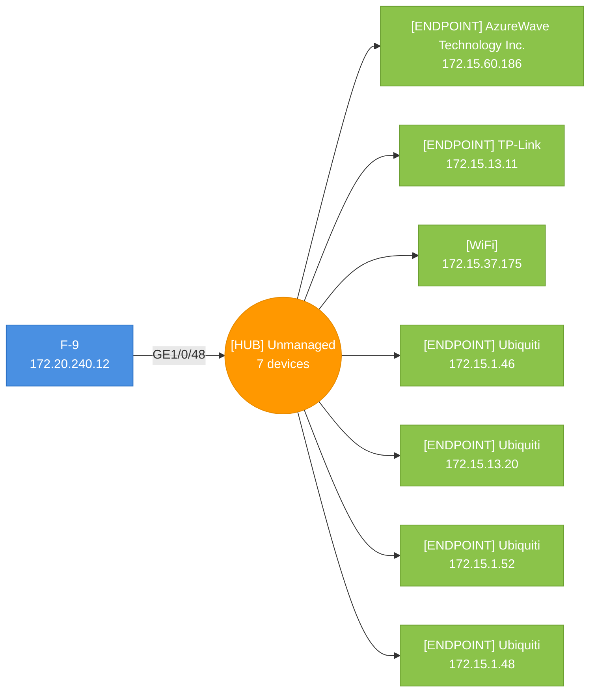
```mermaid
graph LR
  hub_4caea327768a_p48(("[HUB] Unmanaged<br>7 devices"))
  4caea327768a["F-9<br>172.20.240.12"]
  4caea327768a-- "GE1/0/48" -->hub_4caea327768a_p48
  style 4caea327768a fill:#4A90E2,stroke:#2A6FC2,color:#fff
  1068380a0779["[ENDPOINT] AzureWave Technology Inc.<br>172.15.60.186"]
  hub_4caea327768a_p48-->1068380a0779
  style 1068380a0779 fill:#8BC34A,stroke:#6B9F30,color:#fff
  54af9782f4c4["[ENDPOINT] TP-Link<br>172.15.13.11"]
  hub_4caea327768a_p48-->54af9782f4c4
  style 54af9782f4c4 fill:#8BC34A,stroke:#6B9F30,color:#fff
  563a98b65c1a["[WiFi]<br>172.15.37.175"]
  hub_4caea327768a_p48-->563a98b65c1a
  style 563a98b65c1a fill:#8BC34A,stroke:#6B9F30,color:#fff
  7845587c874f["[ENDPOINT] Ubiquiti<br>172.15.1.46"]
  hub_4caea327768a_p48-->7845587c874f
  style 7845587c874f fill:#8BC34A,stroke:#6B9F30,color:#fff
  7845587c87a0["[ENDPOINT] Ubiquiti<br>172.15.13.20"]
  hub_4caea327768a_p48-->7845587c87a0
  style 7845587c87a0 fill:#8BC34A,stroke:#6B9F30,color:#fff
  7845587c88e4["[ENDPOINT] Ubiquiti<br>172.15.1.52"]
  hub_4caea327768a_p48-->7845587c88e4
  style 7845587c88e4 fill:#8BC34A,stroke:#6B9F30,color:#fff
  7845587c8947["[ENDPOINT] Ubiquiti<br>172.15.1.48"]
  hub_4caea327768a_p48-->7845587c8947
  style 7845587c8947 fill:#8BC34A,stroke:#6B9F30,color:#fff
  style hub_4caea327768a_p48 fill:#FF9800,stroke:#E68A00,color:#fff
```

**Ulanganlar:** 7 ta qurilma

### Shadow IT #2: [HUB] Unmanaged
2 devices

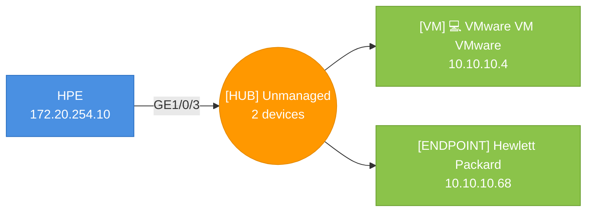
```mermaid
graph LR
  hub_4caea3277eca_p3(("[HUB] Unmanaged<br>2 devices"))
  4caea3277eca["HPE<br>172.20.254.10"]
  4caea3277eca-- "GE1/0/3" -->hub_4caea3277eca_p3
  style 4caea3277eca fill:#4A90E2,stroke:#2A6FC2,color:#fff
  000c29b745bb["[VM] 💻 VMware VM VMware<br>10.10.10.4"]
  hub_4caea3277eca_p3-->000c29b745bb
  style 000c29b745bb fill:#8BC34A,stroke:#6B9F30,color:#fff
  c4346bb84194["[ENDPOINT] Hewlett Packard<br>10.10.10.68"]
  hub_4caea3277eca_p3-->c4346bb84194
  style c4346bb84194 fill:#8BC34A,stroke:#6B9F30,color:#fff
  style hub_4caea3277eca_p3 fill:#FF9800,stroke:#E68A00,color:#fff
```

**Ulanganlar:** 2 ta qurilma

### Shadow IT #3: [HUB] Unmanaged
7 devices

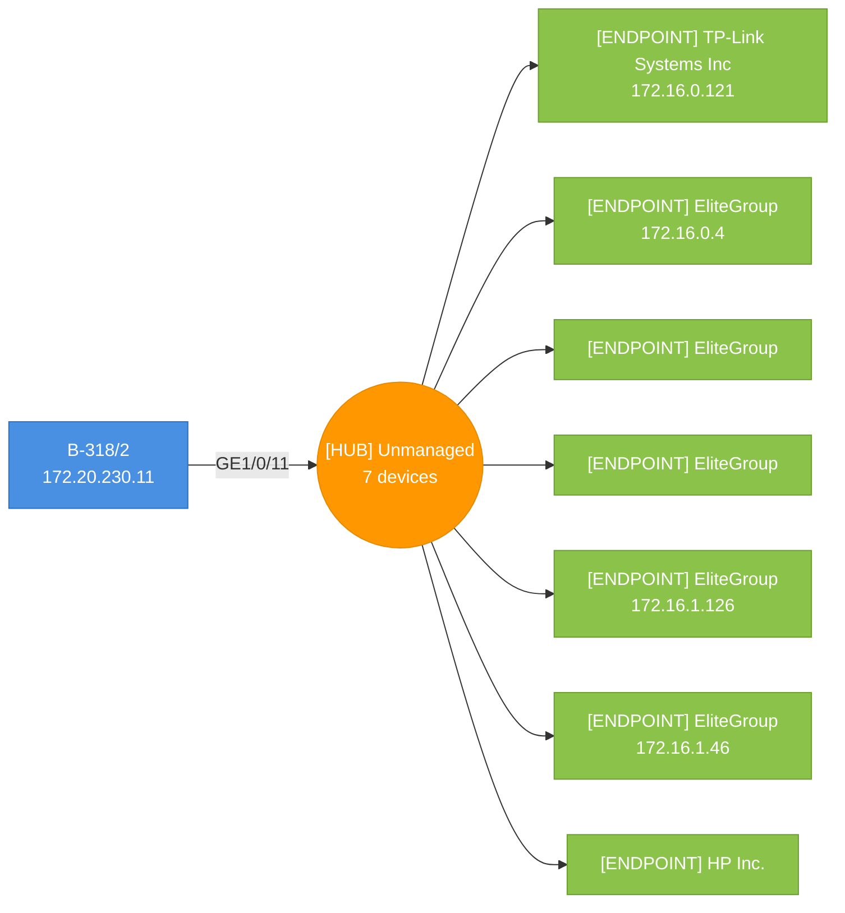
```mermaid
graph LR
  hub_4caea32785ea_p11(("[HUB] Unmanaged<br>7 devices"))
  4caea32785ea["B-318/2<br>172.20.230.11"]
  4caea32785ea-- "GE1/0/11" -->hub_4caea32785ea_p11
  style 4caea32785ea fill:#4A90E2,stroke:#2A6FC2,color:#fff
  5c628bb8b311["[ENDPOINT] TP-Link Systems Inc<br>172.16.0.121"]
  hub_4caea32785ea_p11-->5c628bb8b311
  style 5c628bb8b311 fill:#8BC34A,stroke:#6B9F30,color:#fff
  94c6913ff34f["[ENDPOINT] EliteGroup<br>172.16.0.4"]
  hub_4caea32785ea_p11-->94c6913ff34f
  style 94c6913ff34f fill:#8BC34A,stroke:#6B9F30,color:#fff
  94c6913ff361["[ENDPOINT] EliteGroup"]
  hub_4caea32785ea_p11-->94c6913ff361
  style 94c6913ff361 fill:#8BC34A,stroke:#6B9F30,color:#fff
  94c6913ff441["[ENDPOINT] EliteGroup"]
  hub_4caea32785ea_p11-->94c6913ff441
  style 94c6913ff441 fill:#8BC34A,stroke:#6B9F30,color:#fff
  94c6913ff467["[ENDPOINT] EliteGroup<br>172.16.1.126"]
  hub_4caea32785ea_p11-->94c6913ff467
  style 94c6913ff467 fill:#8BC34A,stroke:#6B9F30,color:#fff
  94c6913ff901["[ENDPOINT] EliteGroup<br>172.16.1.46"]
  hub_4caea32785ea_p11-->94c6913ff901
  style 94c6913ff901 fill:#8BC34A,stroke:#6B9F30,color:#fff
  acf46650f0bb["[ENDPOINT] HP Inc."]
  hub_4caea32785ea_p11-->acf46650f0bb
  style acf46650f0bb fill:#8BC34A,stroke:#6B9F30,color:#fff
  style hub_4caea32785ea_p11 fill:#FF9800,stroke:#E68A00,color:#fff
```

**Ulanganlar:** 7 ta qurilma

### Shadow IT #4: [HUB] Unmanaged
3 devices

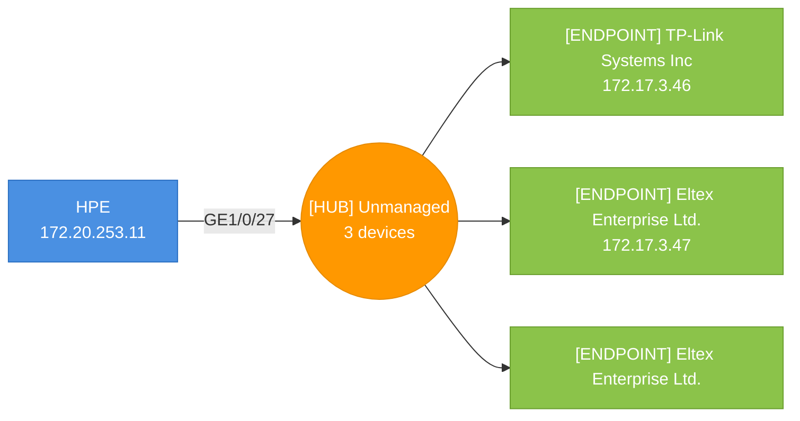
```mermaid
graph LR
  hub_4caea38dd599_p27(("[HUB] Unmanaged<br>3 devices"))
  4caea38dd599["HPE<br>172.20.253.11"]
  4caea38dd599-- "GE1/0/27" -->hub_4caea38dd599_p27
  style 4caea38dd599 fill:#4A90E2,stroke:#2A6FC2,color:#fff
  5091e396806f["[ENDPOINT] TP-Link Systems Inc<br>172.17.3.46"]
  hub_4caea38dd599_p27-->5091e396806f
  style 5091e396806f fill:#8BC34A,stroke:#6B9F30,color:#fff
  e45ad46b3a00["[ENDPOINT] Eltex Enterprise Ltd.<br>172.17.3.47"]
  hub_4caea38dd599_p27-->e45ad46b3a00
  style e45ad46b3a00 fill:#8BC34A,stroke:#6B9F30,color:#fff
  e45ad46b3a1b["[ENDPOINT] Eltex Enterprise Ltd."]
  hub_4caea38dd599_p27-->e45ad46b3a1b
  style e45ad46b3a1b fill:#8BC34A,stroke:#6B9F30,color:#fff
  style hub_4caea38dd599_p27 fill:#FF9800,stroke:#E68A00,color:#fff
```

**Ulanganlar:** 3 ta qurilma

### Shadow IT #5: [HUB] Unmanaged
2 devices

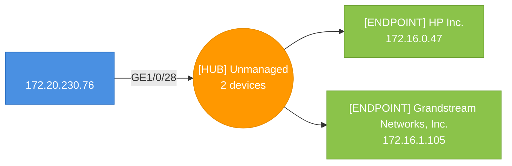
```mermaid
graph LR
  hub_4caea38decc1_p28(("[HUB] Unmanaged<br>2 devices"))
  4caea38decc1["<br>172.20.230.76"]
  4caea38decc1-- "GE1/0/28" -->hub_4caea38decc1_p28
  style 4caea38decc1 fill:#4A90E2,stroke:#2A6FC2,color:#fff
  c018035b6542["[ENDPOINT] HP Inc.<br>172.16.0.47"]
  hub_4caea38decc1_p28-->c018035b6542
  style c018035b6542 fill:#8BC34A,stroke:#6B9F30,color:#fff
  c074ad90018e["[ENDPOINT] Grandstream Networks, Inc.<br>172.16.1.105"]
  hub_4caea38decc1_p28-->c074ad90018e
  style c074ad90018e fill:#8BC34A,stroke:#6B9F30,color:#fff
  style hub_4caea38decc1_p28 fill:#FF9800,stroke:#E68A00,color:#fff
```

**Ulanganlar:** 2 ta qurilma

### Shadow IT #6: [HUB] Unmanaged
2 devices

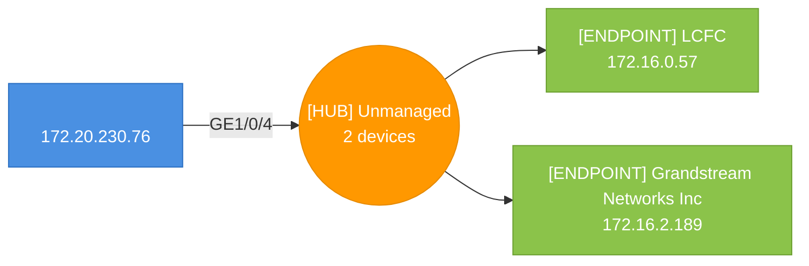
```mermaid
graph LR
  hub_4caea38decc1_p4(("[HUB] Unmanaged<br>2 devices"))
  4caea38decc1["<br>172.20.230.76"]
  4caea38decc1-- "GE1/0/4" -->hub_4caea38decc1_p4
  style 4caea38decc1 fill:#4A90E2,stroke:#2A6FC2,color:#fff
  902e169d3d37["[ENDPOINT] LCFC<br>172.16.0.57"]
  hub_4caea38decc1_p4-->902e169d3d37
  style 902e169d3d37 fill:#8BC34A,stroke:#6B9F30,color:#fff
  ec74d764cb9f["[ENDPOINT] Grandstream Networks Inc<br>172.16.2.189"]
  hub_4caea38decc1_p4-->ec74d764cb9f
  style ec74d764cb9f fill:#8BC34A,stroke:#6B9F30,color:#fff
  style hub_4caea38decc1_p4 fill:#FF9800,stroke:#E68A00,color:#fff
```

**Ulanganlar:** 2 ta qurilma

### Shadow IT #7: [HUB] Unmanaged
2 devices

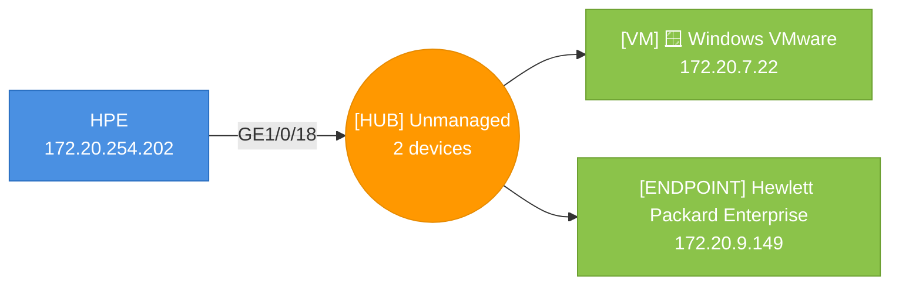
```mermaid
graph LR
  hub_4caea38deec9_p18(("[HUB] Unmanaged<br>2 devices"))
  4caea38deec9["HPE<br>172.20.254.202"]
  4caea38deec9-- "GE1/0/18" -->hub_4caea38deec9_p18
  style 4caea38deec9 fill:#4A90E2,stroke:#2A6FC2,color:#fff
  000c292dde3c["[VM] 🪟 Windows VMware<br>172.20.7.22"]
  hub_4caea38deec9_p18-->000c292dde3c
  style 000c292dde3c fill:#8BC34A,stroke:#6B9F30,color:#fff
  08f1ea8d264e["[ENDPOINT] Hewlett Packard Enterprise<br>172.20.9.149"]
  hub_4caea38deec9_p18-->08f1ea8d264e
  style 08f1ea8d264e fill:#8BC34A,stroke:#6B9F30,color:#fff
  style hub_4caea38deec9_p18 fill:#FF9800,stroke:#E68A00,color:#fff
```

**Ulanganlar:** 2 ta qurilma

### Shadow IT #8: [HUB] Unmanaged
5 devices

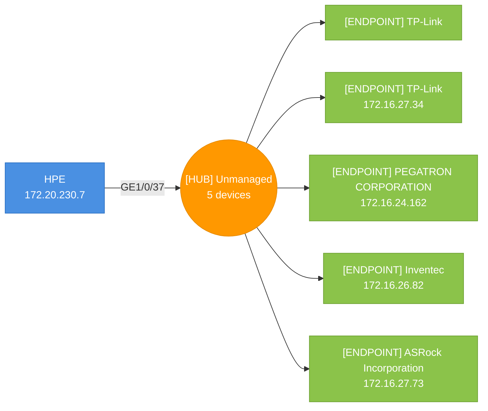
```mermaid
graph LR
  hub_4caea38e1909_p37(("[HUB] Unmanaged<br>5 devices"))
  4caea38e1909["HPE<br>172.20.230.7"]
  4caea38e1909-- "GE1/0/37" -->hub_4caea38e1909_p37
  style 4caea38e1909 fill:#4A90E2,stroke:#2A6FC2,color:#fff
  10feed5a195e["[ENDPOINT] TP-Link"]
  hub_4caea38e1909_p37-->10feed5a195e
  style 10feed5a195e fill:#8BC34A,stroke:#6B9F30,color:#fff
  10feed5a195f["[ENDPOINT] TP-Link<br>172.16.27.34"]
  hub_4caea38e1909_p37-->10feed5a195f
  style 10feed5a195f fill:#8BC34A,stroke:#6B9F30,color:#fff
  54b203712a46["[ENDPOINT] PEGATRON CORPORATION<br>172.16.24.162"]
  hub_4caea38e1909_p37-->54b203712a46
  style 54b203712a46 fill:#8BC34A,stroke:#6B9F30,color:#fff
  64c901f59176["[ENDPOINT] Inventec<br>172.16.26.82"]
  hub_4caea38e1909_p37-->64c901f59176
  style 64c901f59176 fill:#8BC34A,stroke:#6B9F30,color:#fff
  a8a159a0c9a3["[ENDPOINT] ASRock Incorporation<br>172.16.27.73"]
  hub_4caea38e1909_p37-->a8a159a0c9a3
  style a8a159a0c9a3 fill:#8BC34A,stroke:#6B9F30,color:#fff
  style hub_4caea38e1909_p37 fill:#FF9800,stroke:#E68A00,color:#fff
```

**Ulanganlar:** 5 ta qurilma

### Shadow IT #9: [HUB] Unmanaged
8 devices

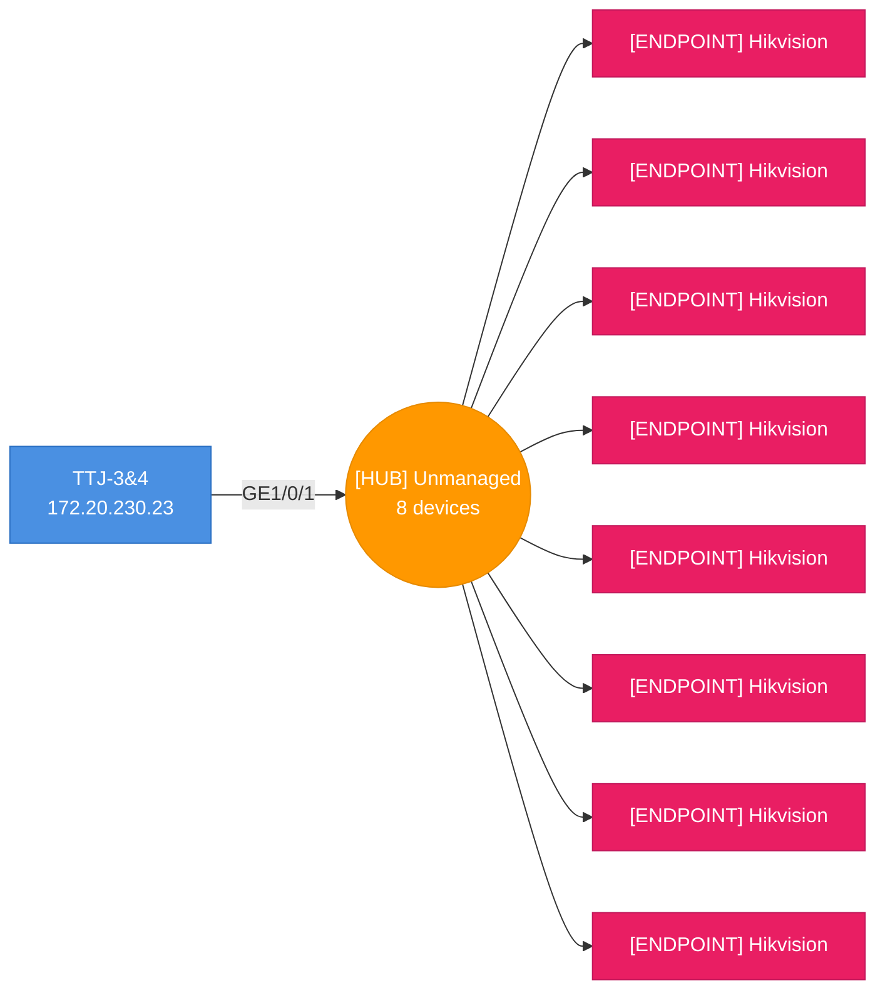
```mermaid
graph LR
  hub_4caea3a201ac_p1(("[HUB] Unmanaged<br>8 devices"))
  4caea3a201ac["TTJ-3&4<br>172.20.230.23"]
  4caea3a201ac-- "GE1/0/1" -->hub_4caea3a201ac_p1
  style 4caea3a201ac fill:#4A90E2,stroke:#2A6FC2,color:#fff
  bc9b5e37bf19["[ENDPOINT] Hikvision"]
  hub_4caea3a201ac_p1-->bc9b5e37bf19
  style bc9b5e37bf19 fill:#E91E63,stroke:#C2185B,color:#fff
  bc9b5e37bf20["[ENDPOINT] Hikvision"]
  hub_4caea3a201ac_p1-->bc9b5e37bf20
  style bc9b5e37bf20 fill:#E91E63,stroke:#C2185B,color:#fff
  bc9b5e37bf22["[ENDPOINT] Hikvision"]
  hub_4caea3a201ac_p1-->bc9b5e37bf22
  style bc9b5e37bf22 fill:#E91E63,stroke:#C2185B,color:#fff
  bc9b5e37bf33["[ENDPOINT] Hikvision"]
  hub_4caea3a201ac_p1-->bc9b5e37bf33
  style bc9b5e37bf33 fill:#E91E63,stroke:#C2185B,color:#fff
  bc9b5e37bf3a["[ENDPOINT] Hikvision"]
  hub_4caea3a201ac_p1-->bc9b5e37bf3a
  style bc9b5e37bf3a fill:#E91E63,stroke:#C2185B,color:#fff
  bc9b5e37bf3b["[ENDPOINT] Hikvision"]
  hub_4caea3a201ac_p1-->bc9b5e37bf3b
  style bc9b5e37bf3b fill:#E91E63,stroke:#C2185B,color:#fff
  bc9b5e37bf49["[ENDPOINT] Hikvision"]
  hub_4caea3a201ac_p1-->bc9b5e37bf49
  style bc9b5e37bf49 fill:#E91E63,stroke:#C2185B,color:#fff
  bc9b5e37bf4b["[ENDPOINT] Hikvision"]
  hub_4caea3a201ac_p1-->bc9b5e37bf4b
  style bc9b5e37bf4b fill:#E91E63,stroke:#C2185B,color:#fff
  style hub_4caea3a201ac_p1 fill:#FF9800,stroke:#E68A00,color:#fff
```

**Ulanganlar:** 8 ta qurilma

### Shadow IT #10: [HUB] Unmanaged
2 devices

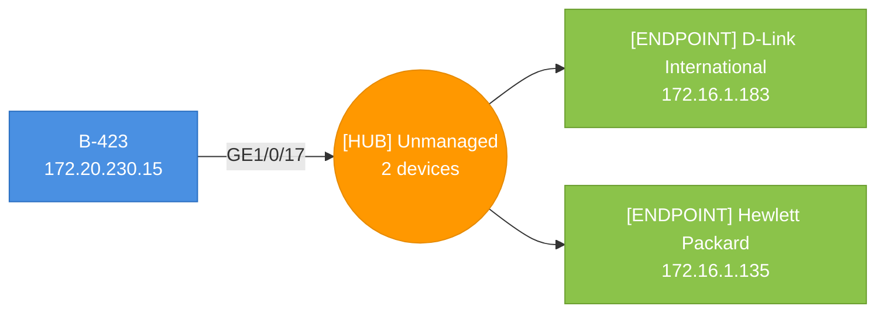
```mermaid
graph LR
  hub_4caea3a2032c_p17(("[HUB] Unmanaged<br>2 devices"))
  4caea3a2032c["B-423<br>172.20.230.15"]
  4caea3a2032c-- "GE1/0/17" -->hub_4caea3a2032c_p17
  style 4caea3a2032c fill:#4A90E2,stroke:#2A6FC2,color:#fff
  6c198fcfc8c3["[ENDPOINT] D-Link International<br>172.16.1.183"]
  hub_4caea3a2032c_p17-->6c198fcfc8c3
  style 6c198fcfc8c3 fill:#8BC34A,stroke:#6B9F30,color:#fff
  c8d3ffbb2890["[ENDPOINT] Hewlett Packard<br>172.16.1.135"]
  hub_4caea3a2032c_p17-->c8d3ffbb2890
  style c8d3ffbb2890 fill:#8BC34A,stroke:#6B9F30,color:#fff
  style hub_4caea3a2032c_p17 fill:#FF9800,stroke:#E68A00,color:#fff
```

**Ulanganlar:** 2 ta qurilma

### Shadow IT #11: [HUB] Unmanaged
2 devices

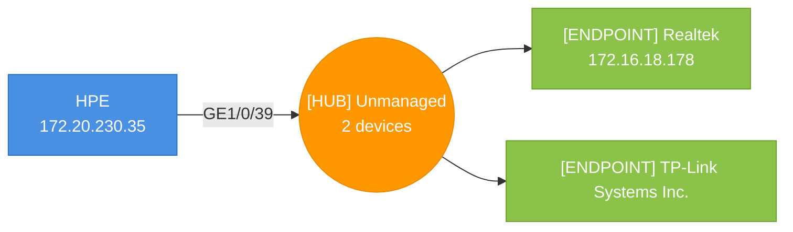
```mermaid
graph LR
  hub_4caea3a20d4c_p39(("[HUB] Unmanaged<br>2 devices"))
  4caea3a20d4c["HPE<br>172.20.230.35"]
  4caea3a20d4c-- "GE1/0/39" -->hub_4caea3a20d4c_p39
  style 4caea3a20d4c fill:#4A90E2,stroke:#2A6FC2,color:#fff
  00e04cf04fb4["[ENDPOINT] Realtek<br>172.16.18.178"]
  hub_4caea3a20d4c_p39-->00e04cf04fb4
  style 00e04cf04fb4 fill:#8BC34A,stroke:#6B9F30,color:#fff
  a8294859b3c3["[ENDPOINT] TP-Link Systems Inc."]
  hub_4caea3a20d4c_p39-->a8294859b3c3
  style a8294859b3c3 fill:#8BC34A,stroke:#6B9F30,color:#fff
  style hub_4caea3a20d4c_p39 fill:#FF9800,stroke:#E68A00,color:#fff
```

**Ulanganlar:** 2 ta qurilma

### Shadow IT #12: [HUB] Unmanaged
6 devices

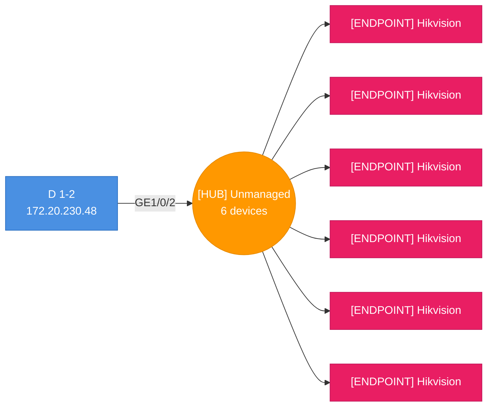
```mermaid
graph LR
  hub_4caea3a215ec_p2(("[HUB] Unmanaged<br>6 devices"))
  4caea3a215ec["D 1-2<br>172.20.230.48"]
  4caea3a215ec-- "GE1/0/2" -->hub_4caea3a215ec_p2
  style 4caea3a215ec fill:#4A90E2,stroke:#2A6FC2,color:#fff
  bc9b5e37bf15["[ENDPOINT] Hikvision"]
  hub_4caea3a215ec_p2-->bc9b5e37bf15
  style bc9b5e37bf15 fill:#E91E63,stroke:#C2185B,color:#fff
  bc9b5e37bf17["[ENDPOINT] Hikvision"]
  hub_4caea3a215ec_p2-->bc9b5e37bf17
  style bc9b5e37bf17 fill:#E91E63,stroke:#C2185B,color:#fff
  bc9b5e37bf28["[ENDPOINT] Hikvision"]
  hub_4caea3a215ec_p2-->bc9b5e37bf28
  style bc9b5e37bf28 fill:#E91E63,stroke:#C2185B,color:#fff
  bc9b5e37bf38["[ENDPOINT] Hikvision"]
  hub_4caea3a215ec_p2-->bc9b5e37bf38
  style bc9b5e37bf38 fill:#E91E63,stroke:#C2185B,color:#fff
  bc9b5e37bf39["[ENDPOINT] Hikvision"]
  hub_4caea3a215ec_p2-->bc9b5e37bf39
  style bc9b5e37bf39 fill:#E91E63,stroke:#C2185B,color:#fff
  bc9b5e37bf50["[ENDPOINT] Hikvision"]
  hub_4caea3a215ec_p2-->bc9b5e37bf50
  style bc9b5e37bf50 fill:#E91E63,stroke:#C2185B,color:#fff
  style hub_4caea3a215ec_p2 fill:#FF9800,stroke:#E68A00,color:#fff
```

**Ulanganlar:** 6 ta qurilma

### Shadow IT #13: [HUB] Unmanaged
8 devices

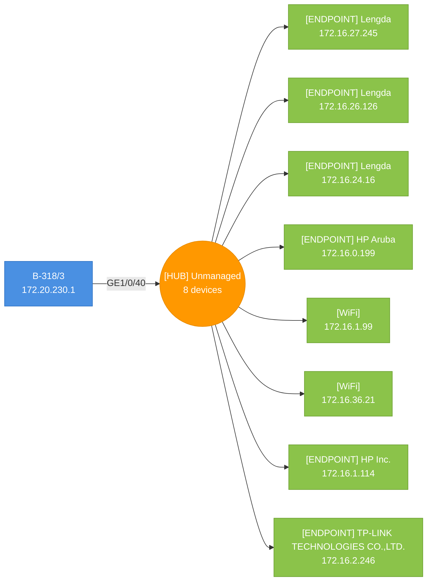
```mermaid
graph LR
  hub_4caea3a2182c_p40(("[HUB] Unmanaged<br>8 devices"))
  4caea3a2182c["B-318/3<br>172.20.230.1"]
  4caea3a2182c-- "GE1/0/40" -->hub_4caea3a2182c_p40
  style 4caea3a2182c fill:#4A90E2,stroke:#2A6FC2,color:#fff
  002381549be2["[ENDPOINT] Lengda<br>172.16.27.245"]
  hub_4caea3a2182c_p40-->002381549be2
  style 002381549be2 fill:#8BC34A,stroke:#6B9F30,color:#fff
  002381549be5["[ENDPOINT] Lengda<br>172.16.26.126"]
  hub_4caea3a2182c_p40-->002381549be5
  style 002381549be5 fill:#8BC34A,stroke:#6B9F30,color:#fff
  002381549c03["[ENDPOINT] Lengda<br>172.16.24.16"]
  hub_4caea3a2182c_p40-->002381549c03
  style 002381549c03 fill:#8BC34A,stroke:#6B9F30,color:#fff
  004e35cb4f9a["[ENDPOINT] HP Aruba<br>172.16.0.199"]
  hub_4caea3a2182c_p40-->004e35cb4f9a
  style 004e35cb4f9a fill:#8BC34A,stroke:#6B9F30,color:#fff
  4e6d487b43dc["[WiFi]<br>172.16.1.99"]
  hub_4caea3a2182c_p40-->4e6d487b43dc
  style 4e6d487b43dc fill:#8BC34A,stroke:#6B9F30,color:#fff
  667a54eff633["[WiFi]<br>172.16.36.21"]
  hub_4caea3a2182c_p40-->667a54eff633
  style 667a54eff633 fill:#8BC34A,stroke:#6B9F30,color:#fff
  c01803886bb2["[ENDPOINT] HP Inc.<br>172.16.1.114"]
  hub_4caea3a2182c_p40-->c01803886bb2
  style c01803886bb2 fill:#8BC34A,stroke:#6B9F30,color:#fff
  e4c32adb8931["[ENDPOINT] TP-LINK TECHNOLOGIES CO.,LTD.<br>172.16.2.246"]
  hub_4caea3a2182c_p40-->e4c32adb8931
  style e4c32adb8931 fill:#8BC34A,stroke:#6B9F30,color:#fff
  style hub_4caea3a2182c_p40 fill:#FF9800,stroke:#E68A00,color:#fff
```

**Ulanganlar:** 8 ta qurilma

### Shadow IT #14: [HUB] Unmanaged
8 devices

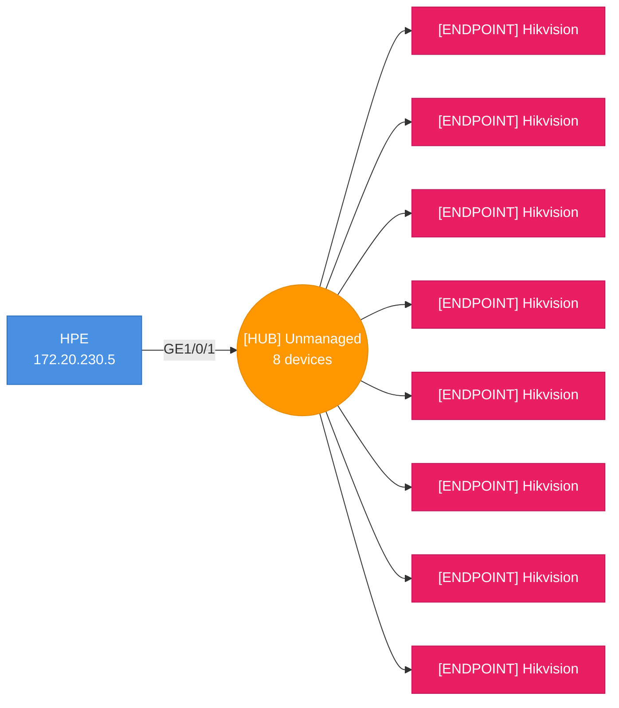
```mermaid
graph LR
  hub_4caea3a218ec_p1(("[HUB] Unmanaged<br>8 devices"))
  4caea3a218ec["HPE<br>172.20.230.5"]
  4caea3a218ec-- "GE1/0/1" -->hub_4caea3a218ec_p1
  style 4caea3a218ec fill:#4A90E2,stroke:#2A6FC2,color:#fff
  bc9b5e37bf45["[ENDPOINT] Hikvision"]
  hub_4caea3a218ec_p1-->bc9b5e37bf45
  style bc9b5e37bf45 fill:#E91E63,stroke:#C2185B,color:#fff
  bc9b5e37bf46["[ENDPOINT] Hikvision"]
  hub_4caea3a218ec_p1-->bc9b5e37bf46
  style bc9b5e37bf46 fill:#E91E63,stroke:#C2185B,color:#fff
  bc9b5e37bf4c["[ENDPOINT] Hikvision"]
  hub_4caea3a218ec_p1-->bc9b5e37bf4c
  style bc9b5e37bf4c fill:#E91E63,stroke:#C2185B,color:#fff
  bc9b5e37bf4d["[ENDPOINT] Hikvision"]
  hub_4caea3a218ec_p1-->bc9b5e37bf4d
  style bc9b5e37bf4d fill:#E91E63,stroke:#C2185B,color:#fff
  bc9b5e37bf4e["[ENDPOINT] Hikvision"]
  hub_4caea3a218ec_p1-->bc9b5e37bf4e
  style bc9b5e37bf4e fill:#E91E63,stroke:#C2185B,color:#fff
  bc9b5e37bf54["[ENDPOINT] Hikvision"]
  hub_4caea3a218ec_p1-->bc9b5e37bf54
  style bc9b5e37bf54 fill:#E91E63,stroke:#C2185B,color:#fff
  bc9b5e37bf55["[ENDPOINT] Hikvision"]
  hub_4caea3a218ec_p1-->bc9b5e37bf55
  style bc9b5e37bf55 fill:#E91E63,stroke:#C2185B,color:#fff
  bc9b5e37bf5a["[ENDPOINT] Hikvision"]
  hub_4caea3a218ec_p1-->bc9b5e37bf5a
  style bc9b5e37bf5a fill:#E91E63,stroke:#C2185B,color:#fff
  style hub_4caea3a218ec_p1 fill:#FF9800,stroke:#E68A00,color:#fff
```

**Ulanganlar:** 8 ta qurilma

### Shadow IT #15: [HUB] Unmanaged
6 devices

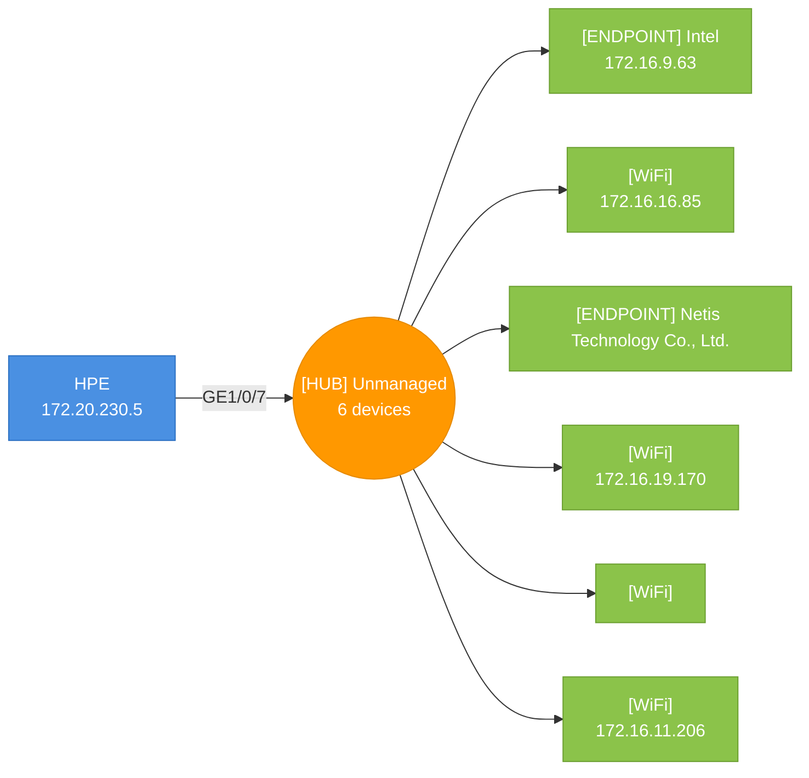
```mermaid
graph LR
  hub_4caea3a218ec_p7(("[HUB] Unmanaged<br>6 devices"))
  4caea3a218ec["HPE<br>172.20.230.5"]
  4caea3a218ec-- "GE1/0/7" -->hub_4caea3a218ec_p7
  style 4caea3a218ec fill:#4A90E2,stroke:#2A6FC2,color:#fff
  14857fccb76c["[ENDPOINT] Intel<br>172.16.9.63"]
  hub_4caea3a218ec_p7-->14857fccb76c
  style 14857fccb76c fill:#8BC34A,stroke:#6B9F30,color:#fff
  3609c6c1053b["[WiFi]<br>172.16.16.85"]
  hub_4caea3a218ec_p7-->3609c6c1053b
  style 3609c6c1053b fill:#8BC34A,stroke:#6B9F30,color:#fff
  64eeb7a7d170["[ENDPOINT] Netis Technology Co., Ltd."]
  hub_4caea3a218ec_p7-->64eeb7a7d170
  style 64eeb7a7d170 fill:#8BC34A,stroke:#6B9F30,color:#fff
  7aaad80032bf["[WiFi]<br>172.16.19.170"]
  hub_4caea3a218ec_p7-->7aaad80032bf
  style 7aaad80032bf fill:#8BC34A,stroke:#6B9F30,color:#fff
  aaa395632235["[WiFi]"]
  hub_4caea3a218ec_p7-->aaa395632235
  style aaa395632235 fill:#8BC34A,stroke:#6B9F30,color:#fff
  f23285d256dd["[WiFi]<br>172.16.11.206"]
  hub_4caea3a218ec_p7-->f23285d256dd
  style f23285d256dd fill:#8BC34A,stroke:#6B9F30,color:#fff
  style hub_4caea3a218ec_p7 fill:#FF9800,stroke:#E68A00,color:#fff
```

**Ulanganlar:** 6 ta qurilma

### Shadow IT #16: [HUB] Unmanaged
2 devices

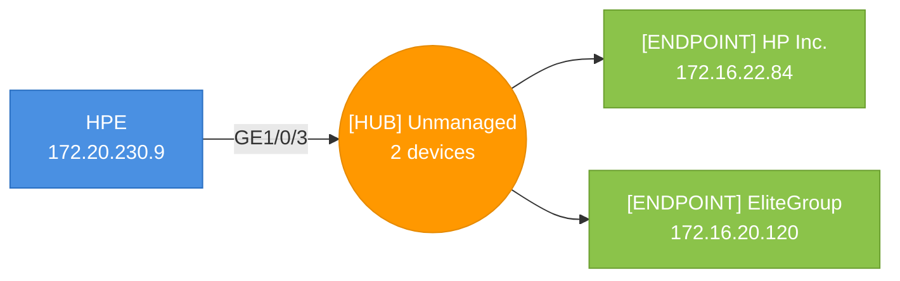
```mermaid
graph LR
  hub_4caea3a219ac_p3(("[HUB] Unmanaged<br>2 devices"))
  4caea3a219ac["HPE<br>172.20.230.9"]
  4caea3a219ac-- "GE1/0/3" -->hub_4caea3a219ac_p3
  style 4caea3a219ac fill:#4A90E2,stroke:#2A6FC2,color:#fff
  30138baf846b["[ENDPOINT] HP Inc.<br>172.16.22.84"]
  hub_4caea3a219ac_p3-->30138baf846b
  style 30138baf846b fill:#8BC34A,stroke:#6B9F30,color:#fff
  94c6913ff8f8["[ENDPOINT] EliteGroup<br>172.16.20.120"]
  hub_4caea3a219ac_p3-->94c6913ff8f8
  style 94c6913ff8f8 fill:#8BC34A,stroke:#6B9F30,color:#fff
  style hub_4caea3a219ac_p3 fill:#FF9800,stroke:#E68A00,color:#fff
```

**Ulanganlar:** 2 ta qurilma

### Shadow IT #17: [HUB] Unmanaged
3 devices

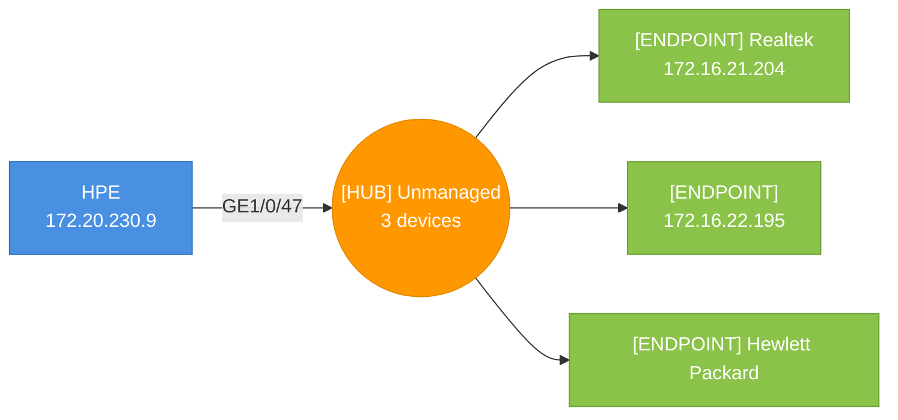
```mermaid
graph LR
  hub_4caea3a219ac_p47(("[HUB] Unmanaged<br>3 devices"))
  4caea3a219ac["HPE<br>172.20.230.9"]
  4caea3a219ac-- "GE1/0/47" -->hub_4caea3a219ac_p47
  style 4caea3a219ac fill:#4A90E2,stroke:#2A6FC2,color:#fff
  00e04cf0dfc3["[ENDPOINT] Realtek<br>172.16.21.204"]
  hub_4caea3a219ac_p47-->00e04cf0dfc3
  style 00e04cf0dfc3 fill:#8BC34A,stroke:#6B9F30,color:#fff
  00e269537b36["[ENDPOINT]<br>172.16.22.195"]
  hub_4caea3a219ac_p47-->00e269537b36
  style 00e269537b36 fill:#8BC34A,stroke:#6B9F30,color:#fff
  443192b4d11b["[ENDPOINT] Hewlett Packard"]
  hub_4caea3a219ac_p47-->443192b4d11b
  style 443192b4d11b fill:#8BC34A,stroke:#6B9F30,color:#fff
  style hub_4caea3a219ac_p47 fill:#FF9800,stroke:#E68A00,color:#fff
```

**Ulanganlar:** 3 ta qurilma

### Shadow IT #18: [HUB] Unmanaged
8 devices

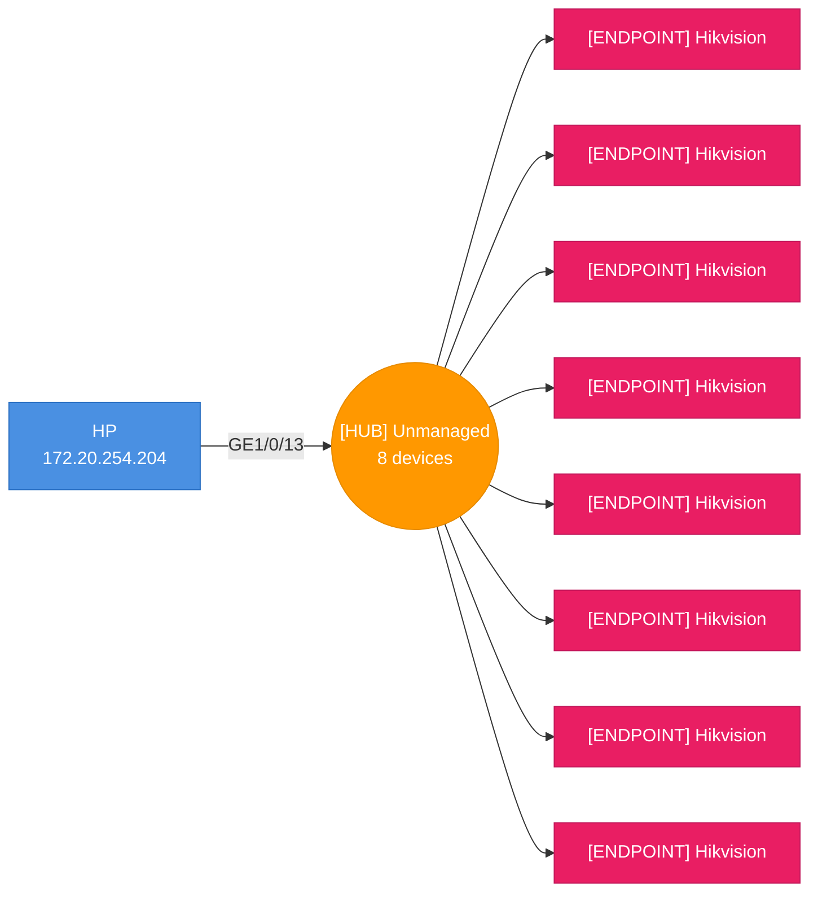
```mermaid
graph LR
  hub_78485972ecee_p13(("[HUB] Unmanaged<br>8 devices"))
  78485972ecee["HP<br>172.20.254.204"]
  78485972ecee-- "GE1/0/13" -->hub_78485972ecee_p13
  style 78485972ecee fill:#4A90E2,stroke:#2A6FC2,color:#fff
  bc9b5e37bf26["[ENDPOINT] Hikvision"]
  hub_78485972ecee_p13-->bc9b5e37bf26
  style bc9b5e37bf26 fill:#E91E63,stroke:#C2185B,color:#fff
  bc9b5e37bf2b["[ENDPOINT] Hikvision"]
  hub_78485972ecee_p13-->bc9b5e37bf2b
  style bc9b5e37bf2b fill:#E91E63,stroke:#C2185B,color:#fff
  bc9b5e37bf2f["[ENDPOINT] Hikvision"]
  hub_78485972ecee_p13-->bc9b5e37bf2f
  style bc9b5e37bf2f fill:#E91E63,stroke:#C2185B,color:#fff
  bc9b5e37bf30["[ENDPOINT] Hikvision"]
  hub_78485972ecee_p13-->bc9b5e37bf30
  style bc9b5e37bf30 fill:#E91E63,stroke:#C2185B,color:#fff
  bc9b5e37bf43["[ENDPOINT] Hikvision"]
  hub_78485972ecee_p13-->bc9b5e37bf43
  style bc9b5e37bf43 fill:#E91E63,stroke:#C2185B,color:#fff
  bc9b5e37bf53["[ENDPOINT] Hikvision"]
  hub_78485972ecee_p13-->bc9b5e37bf53
  style bc9b5e37bf53 fill:#E91E63,stroke:#C2185B,color:#fff
  bc9b5e37bf57["[ENDPOINT] Hikvision"]
  hub_78485972ecee_p13-->bc9b5e37bf57
  style bc9b5e37bf57 fill:#E91E63,stroke:#C2185B,color:#fff
  bc9b5e37bf58["[ENDPOINT] Hikvision"]
  hub_78485972ecee_p13-->bc9b5e37bf58
  style bc9b5e37bf58 fill:#E91E63,stroke:#C2185B,color:#fff
  style hub_78485972ecee_p13 fill:#FF9800,stroke:#E68A00,color:#fff
```

**Ulanganlar:** 8 ta qurilma

### Shadow IT #19: [HUB] Unmanaged
6 devices


```mermaid
graph LR
  hub_f8f0827ad969_p2(("[HUB] Unmanaged<br>6 devices"))
  f8f0827ad969["E109<br>172.20.230.22"]
  f8f0827ad969-- "Eth1/0/2" -->hub_f8f0827ad969_p2
  style f8f0827ad969 fill:#4A90E2,stroke:#2A6FC2,color:#fff
  bc9b5e37bf12["[ENDPOINT] Hikvision"]
  hub_f8f0827ad969_p2-->bc9b5e37bf12
  style bc9b5e37bf12 fill:#E91E63,stroke:#C2185B,color:#fff
  bc9b5e37bf14["[ENDPOINT] Hikvision"]
  hub_f8f0827ad969_p2-->bc9b5e37bf14
  style bc9b5e37bf14 fill:#E91E63,stroke:#C2185B,color:#fff
  bc9b5e37bf21["[ENDPOINT] Hikvision"]
  hub_f8f0827ad969_p2-->bc9b5e37bf21
  style bc9b5e37bf21 fill:#E91E63,stroke:#C2185B,color:#fff
  bc9b5e37bf24["[ENDPOINT] Hikvision"]
  hub_f8f0827ad969_p2-->bc9b5e37bf24
  style bc9b5e37bf24 fill:#E91E63,stroke:#C2185B,color:#fff
  bc9b5e37bf35["[ENDPOINT] Hikvision"]
  hub_f8f0827ad969_p2-->bc9b5e37bf35
  style bc9b5e37bf35 fill:#E91E63,stroke:#C2185B,color:#fff
  bc9b5e37bf5b["[ENDPOINT] Hikvision"]
  hub_f8f0827ad969_p2-->bc9b5e37bf5b
  style bc9b5e37bf5b fill:#E91E63,stroke:#C2185B,color:#fff
  style hub_f8f0827ad969_p2 fill:#FF9800,stroke:#E68A00,color:#fff
```

**Ulanganlar:** 6 ta qurilma

### Shadow IT #20: [HUB] Unmanaged
5 devices

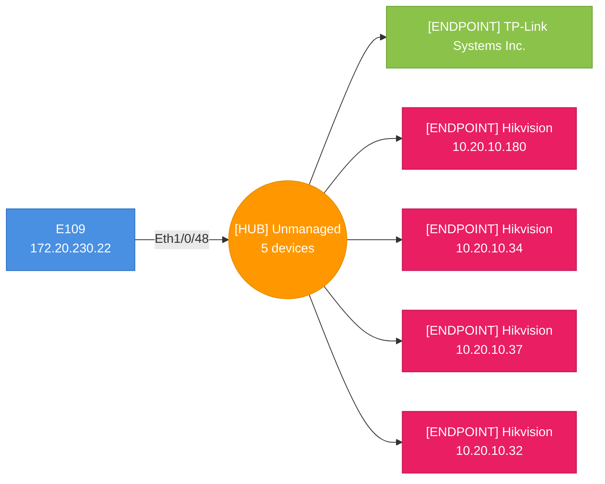
```mermaid
graph LR
  hub_f8f0827ad969_p48(("[HUB] Unmanaged<br>5 devices"))
  f8f0827ad969["E109<br>172.20.230.22"]
  f8f0827ad969-- "Eth1/0/48" -->hub_f8f0827ad969_p48
  style f8f0827ad969 fill:#4A90E2,stroke:#2A6FC2,color:#fff
  8c902d4f5c93["[ENDPOINT] TP-Link Systems Inc."]
  hub_f8f0827ad969_p48-->8c902d4f5c93
  style 8c902d4f5c93 fill:#8BC34A,stroke:#6B9F30,color:#fff
  bc9b5e476221["[ENDPOINT] Hikvision<br>10.20.10.180"]
  hub_f8f0827ad969_p48-->bc9b5e476221
  style bc9b5e476221 fill:#E91E63,stroke:#C2185B,color:#fff
  bc9b5e476224["[ENDPOINT] Hikvision<br>10.20.10.34"]
  hub_f8f0827ad969_p48-->bc9b5e476224
  style bc9b5e476224 fill:#E91E63,stroke:#C2185B,color:#fff
  bc9b5e476339["[ENDPOINT] Hikvision<br>10.20.10.37"]
  hub_f8f0827ad969_p48-->bc9b5e476339
  style bc9b5e476339 fill:#E91E63,stroke:#C2185B,color:#fff
  bc9b5e47669d["[ENDPOINT] Hikvision<br>10.20.10.32"]
  hub_f8f0827ad969_p48-->bc9b5e47669d
  style bc9b5e47669d fill:#E91E63,stroke:#C2185B,color:#fff
  style hub_f8f0827ad969_p48 fill:#FF9800,stroke:#E68A00,color:#fff
```

**Ulanganlar:** 5 ta qurilma

### Shadow IT #21: [HUB] Unmanaged
2 devices

```mermaid
graph LR
  hub_f8f0827c2cc7_p2(("[HUB] Unmanaged<br>2 devices"))
  f8f0827c2cc7["E-209<br>172.20.230.33"]
  f8f0827c2cc7-- "Eth1/0/2" -->hub_f8f0827c2cc7_p2
  style f8f0827c2cc7 fill:#4A90E2,stroke:#2A6FC2,color:#fff
  909a4a24f1dd["[ENDPOINT] TP-LINK TECHNOLOGIES CO.,LTD.<br>172.16.12.18"]
  hub_f8f0827c2cc7_p2-->909a4a24f1dd
  style 909a4a24f1dd fill:#8BC34A,stroke:#6B9F30,color:#fff
  98eecbe08980["[ENDPOINT] Wistron<br>172.16.12.156"]
  hub_f8f0827c2cc7_p2-->98eecbe08980
  style 98eecbe08980 fill:#8BC34A,stroke:#6B9F30,color:#fff
  style hub_f8f0827c2cc7_p2 fill:#FF9800,stroke:#E68A00,color:#fff
```

**Ulanganlar:** 2 ta qurilma

### Shadow IT #22: [HUB] Unmanaged
3 devices

```mermaid
graph LR
  hub_f8f0827c2cc7_p27(("[HUB] Unmanaged<br>3 devices"))
  f8f0827c2cc7["E-209<br>172.20.230.33"]
  f8f0827c2cc7-- "Eth1/0/27" -->hub_f8f0827c2cc7_p27
  style f8f0827c2cc7 fill:#4A90E2,stroke:#2A6FC2,color:#fff
  085411a4cc3b["[ENDPOINT] Hikvision<br>10.20.10.56"]
  hub_f8f0827c2cc7_p27-->085411a4cc3b
  style 085411a4cc3b fill:#E91E63,stroke:#C2185B,color:#fff
  50e538fd9bcf["[ENDPOINT] Hikvision<br>10.20.10.220"]
  hub_f8f0827c2cc7_p27-->50e538fd9bcf
  style 50e538fd9bcf fill:#E91E63,stroke:#C2185B,color:#fff
  50e538fd9c72["[ENDPOINT] Hikvision<br>10.20.10.219"]
  hub_f8f0827c2cc7_p27-->50e538fd9c72
  style 50e538fd9c72 fill:#E91E63,stroke:#C2185B,color:#fff
  style hub_f8f0827c2cc7_p27 fill:#FF9800,stroke:#E68A00,color:#fff
```

**Ulanganlar:** 3 ta qurilma

### Shadow IT #23: [HUB] Unmanaged
4 devices

```mermaid
graph LR
  hub_f8f0827c2d17_p18(("[HUB] Unmanaged<br>4 devices"))
  f8f0827c2d17["E109-2<br>172.20.230.24"]
  f8f0827c2d17-- "Eth1/0/18" -->hub_f8f0827c2d17_p18
  style f8f0827c2d17 fill:#4A90E2,stroke:#2A6FC2,color:#fff
  123558344d56["[WiFi]"]
  hub_f8f0827c2d17_p18-->123558344d56
  style 123558344d56 fill:#8BC34A,stroke:#6B9F30,color:#fff
  a4cf995d8c79["[ENDPOINT] Apple, Inc.<br>172.16.2.192"]
  hub_f8f0827c2d17_p18-->a4cf995d8c79
  style a4cf995d8c79 fill:#8BC34A,stroke:#6B9F30,color:#fff
  b0a7b9ee8d6e["[ENDPOINT] TP-Link Systems Inc<br>172.16.14.170"]
  hub_f8f0827c2d17_p18-->b0a7b9ee8d6e
  style b0a7b9ee8d6e fill:#8BC34A,stroke:#6B9F30,color:#fff
  c0bfbed99bd7["[ENDPOINT] AzureWave Technology Inc.<br>172.16.14.151"]
  hub_f8f0827c2d17_p18-->c0bfbed99bd7
  style c0bfbed99bd7 fill:#8BC34A,stroke:#6B9F30,color:#fff
  style hub_f8f0827c2d17_p18 fill:#FF9800,stroke:#E68A00,color:#fff
```

**Ulanganlar:** 4 ta qurilma

### Shadow IT #24: [HUB] Unmanaged
6 devices

```mermaid
graph LR
  hub_f8f0827c30cf_p17(("[HUB] Unmanaged<br>6 devices"))
  f8f0827c30cf["E205-24<br>172.20.230.32"]
  f8f0827c30cf-- "Eth1/0/17" -->hub_f8f0827c30cf_p17
  style f8f0827c30cf fill:#4A90E2,stroke:#2A6FC2,color:#fff
  00e04cf1708d["[ENDPOINT] Realtek<br>172.16.13.6"]
  hub_f8f0827c30cf_p17-->00e04cf1708d
  style 00e04cf1708d fill:#8BC34A,stroke:#6B9F30,color:#fff
  00e070aaa91e["[ENDPOINT] DH TECHNOLOGY<br>172.16.15.74"]
  hub_f8f0827c30cf_p17-->00e070aaa91e
  style 00e070aaa91e fill:#8BC34A,stroke:#6B9F30,color:#fff
  10b6768b2fdd["[ENDPOINT] HP Inc.<br>172.16.12.138"]
  hub_f8f0827c30cf_p17-->10b6768b2fdd
  style 10b6768b2fdd fill:#8BC34A,stroke:#6B9F30,color:#fff
  28c5c85f53a4["[ENDPOINT] HP Inc.<br>172.16.13.163"]
  hub_f8f0827c30cf_p17-->28c5c85f53a4
  style 28c5c85f53a4 fill:#8BC34A,stroke:#6B9F30,color:#fff
  e45ad4441dc0["[ENDPOINT] Eltex Enterprise Ltd.<br>172.16.14.252"]
  hub_f8f0827c30cf_p17-->e45ad4441dc0
  style e45ad4441dc0 fill:#8BC34A,stroke:#6B9F30,color:#fff
  e45ad4441dda["[ENDPOINT] Eltex Enterprise Ltd."]
  hub_f8f0827c30cf_p17-->e45ad4441dda
  style e45ad4441dda fill:#8BC34A,stroke:#6B9F30,color:#fff
  style hub_f8f0827c30cf_p17 fill:#FF9800,stroke:#E68A00,color:#fff
```

**Ulanganlar:** 6 ta qurilma

### Shadow IT #25: [HUB] Unmanaged
7 devices

```mermaid
graph LR
  hub_f8f0827cf958_p24(("[HUB] Unmanaged<br>7 devices"))
  f8f0827cf958["F-3(1)<br>172.20.240.10"]
  f8f0827cf958-- "Eth1/0/24" -->hub_f8f0827cf958_p24
  style f8f0827cf958 fill:#4A90E2,stroke:#2A6FC2,color:#fff
  54af9782f4c5["[ENDPOINT] TP-Link<br>172.15.12.251"]
  hub_f8f0827cf958_p24-->54af9782f4c5
  style 54af9782f4c5 fill:#8BC34A,stroke:#6B9F30,color:#fff
  5e3df11768dc["[WiFi]<br>172.15.38.48"]
  hub_f8f0827cf958_p24-->5e3df11768dc
  style 5e3df11768dc fill:#8BC34A,stroke:#6B9F30,color:#fff
  7845587c85bc["[ENDPOINT] Ubiquiti<br>172.15.1.35"]
  hub_f8f0827cf958_p24-->7845587c85bc
  style 7845587c85bc fill:#8BC34A,stroke:#6B9F30,color:#fff
  7845587c85d5["[ENDPOINT] Ubiquiti<br>172.15.1.39"]
  hub_f8f0827cf958_p24-->7845587c85d5
  style 7845587c85d5 fill:#8BC34A,stroke:#6B9F30,color:#fff
  7845587c87c8["[ENDPOINT] Ubiquiti<br>172.15.12.245"]
  hub_f8f0827cf958_p24-->7845587c87c8
  style 7845587c87c8 fill:#8BC34A,stroke:#6B9F30,color:#fff
  7845587c88ed["[ENDPOINT] Ubiquiti<br>172.15.1.37"]
  hub_f8f0827cf958_p24-->7845587c88ed
  style 7845587c88ed fill:#8BC34A,stroke:#6B9F30,color:#fff
  98597aa1f7d4["[ENDPOINT] Intel Corporate<br>172.15.57.26"]
  hub_f8f0827cf958_p24-->98597aa1f7d4
  style 98597aa1f7d4 fill:#8BC34A,stroke:#6B9F30,color:#fff
  style hub_f8f0827cf958_p24 fill:#FF9800,stroke:#E68A00,color:#fff
```

**Ulanganlar:** 7 ta qurilma

### Shadow IT #26: [HUB] Unmanaged
5 devices

```mermaid
graph LR
  hub_f8f0827cfa26_p24(("[HUB] Unmanaged<br>5 devices"))
  f8f0827cfa26["F-7(1)<br>172.20.240.6"]
  f8f0827cfa26-- "Eth1/0/24" -->hub_f8f0827cfa26_p24
  style f8f0827cfa26 fill:#4A90E2,stroke:#2A6FC2,color:#fff
  104a7d30fa7a["[ENDPOINT] Intel Corporate"]
  hub_f8f0827cfa26_p24-->104a7d30fa7a
  style 104a7d30fa7a fill:#8BC34A,stroke:#6B9F30,color:#fff
  54af9782f4c3["[ENDPOINT] TP-Link<br>172.15.12.252"]
  hub_f8f0827cfa26_p24-->54af9782f4c3
  style 54af9782f4c3 fill:#8BC34A,stroke:#6B9F30,color:#fff
  7845587c8565["[ENDPOINT] Ubiquiti<br>172.15.1.33"]
  hub_f8f0827cfa26_p24-->7845587c8565
  style 7845587c8565 fill:#8BC34A,stroke:#6B9F30,color:#fff
  7845587c8847["[ENDPOINT] Ubiquiti<br>172.15.13.0"]
  hub_f8f0827cfa26_p24-->7845587c8847
  style 7845587c8847 fill:#8BC34A,stroke:#6B9F30,color:#fff
  80a589fdeab5["[ENDPOINT] AzureWave Technology Inc.<br>172.15.62.149"]
  hub_f8f0827cfa26_p24-->80a589fdeab5
  style 80a589fdeab5 fill:#8BC34A,stroke:#6B9F30,color:#fff
  style hub_f8f0827cfa26_p24 fill:#FF9800,stroke:#E68A00,color:#fff
```

**Ulanganlar:** 5 ta qurilma

### Shadow IT #27: [HUB] Unmanaged
9 devices

```mermaid
graph LR
  hub_f8f0827cfa72_p24(("[HUB] Unmanaged<br>9 devices"))
  f8f0827cfa72["F-6(1)<br>172.20.240.8"]
  f8f0827cfa72-- "Eth1/0/24" -->hub_f8f0827cfa72_p24
  style f8f0827cfa72 fill:#4A90E2,stroke:#2A6FC2,color:#fff
  029a9fa9fb22["[WiFi]<br>172.15.67.15"]
  hub_f8f0827cfa72_p24-->029a9fa9fb22
  style 029a9fa9fb22 fill:#8BC34A,stroke:#6B9F30,color:#fff
  06d9e1ee79e8["[WiFi]"]
  hub_f8f0827cfa72_p24-->06d9e1ee79e8
  style 06d9e1ee79e8 fill:#8BC34A,stroke:#6B9F30,color:#fff
  54af9782f4c2["[ENDPOINT] TP-Link<br>172.15.13.6"]
  hub_f8f0827cfa72_p24-->54af9782f4c2
  style 54af9782f4c2 fill:#8BC34A,stroke:#6B9F30,color:#fff
  5ef588d67644["[WiFi]<br>172.15.56.160"]
  hub_f8f0827cfa72_p24-->5ef588d67644
  style 5ef588d67644 fill:#8BC34A,stroke:#6B9F30,color:#fff
  6e2498c2d586["[WiFi]"]
  hub_f8f0827cfa72_p24-->6e2498c2d586
  style 6e2498c2d586 fill:#8BC34A,stroke:#6B9F30,color:#fff
  7845587c878e["[ENDPOINT] Ubiquiti<br>172.15.13.16"]
  hub_f8f0827cfa72_p24-->7845587c878e
  style 7845587c878e fill:#8BC34A,stroke:#6B9F30,color:#fff
  7845587c883a["[ENDPOINT] Ubiquiti<br>172.15.1.32"]
  hub_f8f0827cfa72_p24-->7845587c883a
  style 7845587c883a fill:#8BC34A,stroke:#6B9F30,color:#fff
  7845587c8841["[ENDPOINT] Ubiquiti<br>172.15.1.30"]
  hub_f8f0827cfa72_p24-->7845587c8841
  style 7845587c8841 fill:#8BC34A,stroke:#6B9F30,color:#fff
  9a320bda4897["[WiFi]<br>172.15.10.247"]
  hub_f8f0827cfa72_p24-->9a320bda4897
  style 9a320bda4897 fill:#8BC34A,stroke:#6B9F30,color:#fff
  style hub_f8f0827cfa72_p24 fill:#FF9800,stroke:#E68A00,color:#fff
```

**Ulanganlar:** 9 ta qurilma

### Shadow IT #28: [HUB] Unmanaged
8 devices

```mermaid
graph LR
  hub_f8f0827cfaca_p1(("[HUB] Unmanaged<br>8 devices"))
  f8f0827cfaca["F-1<br>172.20.240.13"]
  f8f0827cfaca-- "Eth1/0/1" -->hub_f8f0827cfaca_p1
  style f8f0827cfaca fill:#4A90E2,stroke:#2A6FC2,color:#fff
  bc9b5e37bf18["[ENDPOINT] Hikvision"]
  hub_f8f0827cfaca_p1-->bc9b5e37bf18
  style bc9b5e37bf18 fill:#E91E63,stroke:#C2185B,color:#fff
  bc9b5e37bf41["[ENDPOINT] Hikvision"]
  hub_f8f0827cfaca_p1-->bc9b5e37bf41
  style bc9b5e37bf41 fill:#E91E63,stroke:#C2185B,color:#fff
  bc9b5e37bf44["[ENDPOINT] Hikvision"]
  hub_f8f0827cfaca_p1-->bc9b5e37bf44
  style bc9b5e37bf44 fill:#E91E63,stroke:#C2185B,color:#fff
  bc9b5e37bf4a["[ENDPOINT] Hikvision"]
  hub_f8f0827cfaca_p1-->bc9b5e37bf4a
  style bc9b5e37bf4a fill:#E91E63,stroke:#C2185B,color:#fff
  bc9b5e37bf56["[ENDPOINT] Hikvision"]
  hub_f8f0827cfaca_p1-->bc9b5e37bf56
  style bc9b5e37bf56 fill:#E91E63,stroke:#C2185B,color:#fff
  bc9b5e37bf59["[ENDPOINT] Hikvision"]
  hub_f8f0827cfaca_p1-->bc9b5e37bf59
  style bc9b5e37bf59 fill:#E91E63,stroke:#C2185B,color:#fff
  e0baad90617c["[ENDPOINT] Hangzhou Hikvision Digital Technology Co.,Ltd."]
  hub_f8f0827cfaca_p1-->e0baad90617c
  style e0baad90617c fill:#E91E63,stroke:#C2185B,color:#fff
  e0baad906189["[ENDPOINT] Hangzhou Hikvision Digital Technology Co.,Ltd."]
  hub_f8f0827cfaca_p1-->e0baad906189
  style e0baad906189 fill:#E91E63,stroke:#C2185B,color:#fff
  style hub_f8f0827cfaca_p1 fill:#FF9800,stroke:#E68A00,color:#fff
```

**Ulanganlar:** 8 ta qurilma

### Shadow IT #29: [HUB] Unmanaged
7 devices

```mermaid
graph LR
  hub_f8f0827cfaca_p20(("[HUB] Unmanaged<br>7 devices"))
  f8f0827cfaca["F-1<br>172.20.240.13"]
  f8f0827cfaca-- "Eth1/0/20" -->hub_f8f0827cfaca_p20
  style f8f0827cfaca fill:#4A90E2,stroke:#2A6FC2,color:#fff
  54af9782f4e7["[ENDPOINT] TP-Link<br>172.15.12.246"]
  hub_f8f0827cfaca_p20-->54af9782f4e7
  style 54af9782f4e7 fill:#8BC34A,stroke:#6B9F30,color:#fff
  706871f25d86["[ENDPOINT] FN-LINK TECHNOLOGY Ltd.<br>172.16.13.46"]
  hub_f8f0827cfaca_p20-->706871f25d86
  style 706871f25d86 fill:#8BC34A,stroke:#6B9F30,color:#fff
  7845587c85c2["[ENDPOINT] Ubiquiti<br>172.15.12.243"]
  hub_f8f0827cfaca_p20-->7845587c85c2
  style 7845587c85c2 fill:#8BC34A,stroke:#6B9F30,color:#fff
  7845587c85f8["[ENDPOINT] Ubiquiti<br>172.15.12.244"]
  hub_f8f0827cfaca_p20-->7845587c85f8
  style 7845587c85f8 fill:#8BC34A,stroke:#6B9F30,color:#fff
  7845587c85fe["[ENDPOINT] Ubiquiti<br>172.15.13.17"]
  hub_f8f0827cfaca_p20-->7845587c85fe
  style 7845587c85fe fill:#8BC34A,stroke:#6B9F30,color:#fff
  a2696c52b7a8["[WiFi]<br>172.15.197.241"]
  hub_f8f0827cfaca_p20-->a2696c52b7a8
  style a2696c52b7a8 fill:#8BC34A,stroke:#6B9F30,color:#fff
  d49e3b4284e2["[ENDPOINT] Guangzhou Shiyuan Electronic Technology Company Limited<br>172.15.188.92"]
  hub_f8f0827cfaca_p20-->d49e3b4284e2
  style d49e3b4284e2 fill:#8BC34A,stroke:#6B9F30,color:#fff
  style hub_f8f0827cfaca_p20 fill:#FF9800,stroke:#E68A00,color:#fff
```

**Ulanganlar:** 7 ta qurilma

### Shadow IT #30: [HUB] Unmanaged
4 devices

```mermaid
graph LR
  hub_f8f082d022ce_p48(("[HUB] Unmanaged<br>4 devices"))
  f8f082d022ce["F-8<br>172.20.240.4"]
  f8f082d022ce-- "Eth1/0/48" -->hub_f8f082d022ce_p48
  style f8f082d022ce fill:#4A90E2,stroke:#2A6FC2,color:#fff
  54af9782f4c6["[ENDPOINT] TP-Link<br>172.15.12.236"]
  hub_f8f082d022ce_p48-->54af9782f4c6
  style 54af9782f4c6 fill:#8BC34A,stroke:#6B9F30,color:#fff
  7845587c8749["[ENDPOINT] Ubiquiti<br>172.15.1.38"]
  hub_f8f082d022ce_p48-->7845587c8749
  style 7845587c8749 fill:#8BC34A,stroke:#6B9F30,color:#fff
  7845587c882a["[ENDPOINT] Ubiquiti<br>172.15.1.53"]
  hub_f8f082d022ce_p48-->7845587c882a
  style 7845587c882a fill:#8BC34A,stroke:#6B9F30,color:#fff
  7845587c8848["[ENDPOINT] Ubiquiti<br>172.15.1.27"]
  hub_f8f082d022ce_p48-->7845587c8848
  style 7845587c8848 fill:#8BC34A,stroke:#6B9F30,color:#fff
  style hub_f8f082d022ce_p48 fill:#FF9800,stroke:#E68A00,color:#fff
```

**Ulanganlar:** 4 ta qurilma

### Shadow IT #31: [HUB] Unmanaged
6 devices

```mermaid
graph LR
  hub_f8f082d0230a_p48(("[HUB] Unmanaged<br>6 devices"))
  f8f082d0230a["F-5<br>172.20.240.5"]
  f8f082d0230a-- "Eth1/0/48" -->hub_f8f082d0230a_p48
  style f8f082d0230a fill:#4A90E2,stroke:#2A6FC2,color:#fff
  200b7498cc4c["[ENDPOINT] AzureWave Technology Inc.<br>172.15.73.53"]
  hub_f8f082d0230a_p48-->200b7498cc4c
  style 200b7498cc4c fill:#8BC34A,stroke:#6B9F30,color:#fff
  54af9782f4c7["[ENDPOINT] TP-Link<br>172.15.12.237"]
  hub_f8f082d0230a_p48-->54af9782f4c7
  style 54af9782f4c7 fill:#8BC34A,stroke:#6B9F30,color:#fff
  7845587c86e2["[ENDPOINT] Ubiquiti<br>172.15.1.40"]
  hub_f8f082d0230a_p48-->7845587c86e2
  style 7845587c86e2 fill:#8BC34A,stroke:#6B9F30,color:#fff
  7845587c8973["[ENDPOINT] Ubiquiti<br>172.15.1.42"]
  hub_f8f082d0230a_p48-->7845587c8973
  style 7845587c8973 fill:#8BC34A,stroke:#6B9F30,color:#fff
  7845587c8975["[ENDPOINT] Ubiquiti<br>172.15.1.44"]
  hub_f8f082d0230a_p48-->7845587c8975
  style 7845587c8975 fill:#8BC34A,stroke:#6B9F30,color:#fff
  9c971bfcf481["[ENDPOINT] Intel Corporate<br>172.15.17.87"]
  hub_f8f082d0230a_p48-->9c971bfcf481
  style 9c971bfcf481 fill:#8BC34A,stroke:#6B9F30,color:#fff
  style hub_f8f082d0230a_p48 fill:#FF9800,stroke:#E68A00,color:#fff
```

**Ulanganlar:** 6 ta qurilma

### Shadow IT #32: [HUB] Unmanaged
6 devices

```mermaid
graph LR
  hub_f8f082d02392_p48(("[HUB] Unmanaged<br>6 devices"))
  f8f082d02392["F-4_48P<br>172.20.240.1"]
  f8f082d02392-- "Eth1/0/48" -->hub_f8f082d02392_p48
  style f8f082d02392 fill:#4A90E2,stroke:#2A6FC2,color:#fff
  54af9782f4c0["[ENDPOINT] TP-Link<br>172.15.12.238"]
  hub_f8f082d02392_p48-->54af9782f4c0
  style 54af9782f4c0 fill:#8BC34A,stroke:#6B9F30,color:#fff
  7845587c8794["[ENDPOINT] Ubiquiti<br>172.15.13.3"]
  hub_f8f082d02392_p48-->7845587c8794
  style 7845587c8794 fill:#8BC34A,stroke:#6B9F30,color:#fff
  7845587c884c["[ENDPOINT] Ubiquiti<br>172.15.1.41"]
  hub_f8f082d02392_p48-->7845587c884c
  style 7845587c884c fill:#8BC34A,stroke:#6B9F30,color:#fff
  7845587c8864["[ENDPOINT] Ubiquiti<br>172.15.13.9"]
  hub_f8f082d02392_p48-->7845587c8864
  style 7845587c8864 fill:#8BC34A,stroke:#6B9F30,color:#fff
  7845587c88a2["[ENDPOINT] Ubiquiti<br>172.15.1.51"]
  hub_f8f082d02392_p48-->7845587c88a2
  style 7845587c88a2 fill:#8BC34A,stroke:#6B9F30,color:#fff
  9061aee257ac["[ENDPOINT] Intel Corporate<br>172.15.20.246"]
  hub_f8f082d02392_p48-->9061aee257ac
  style 9061aee257ac fill:#8BC34A,stroke:#6B9F30,color:#fff
  style hub_f8f082d02392_p48 fill:#FF9800,stroke:#E68A00,color:#fff
```

**Ulanganlar:** 6 ta qurilma

### Shadow IT #33: [HUB] Unmanaged
3 devices

```mermaid
graph LR
  hub_f8f082d87e81_p3(("[HUB] Unmanaged<br>3 devices"))
  f8f082d87e81["A_padval_SNR<br>172.20.230.51"]
  f8f082d87e81-- "Eth1/0/3" -->hub_f8f082d87e81_p3
  style f8f082d87e81 fill:#4A90E2,stroke:#2A6FC2,color:#fff
  502a8b35d920["[ENDPOINT] Telekom Research and Development Sdn Bhd<br>172.16.24.54"]
  hub_f8f082d87e81_p3-->502a8b35d920
  style 502a8b35d920 fill:#8BC34A,stroke:#6B9F30,color:#fff
  6c9cedbd8118["[ENDPOINT] Cisco Systems, Inc"]
  hub_f8f082d87e81_p3-->6c9cedbd8118
  style 6c9cedbd8118 fill:#8BC34A,stroke:#6B9F30,color:#fff
  6c9cedbd8140["[ENDPOINT] Cisco Systems, Inc<br>172.16.24.55"]
  hub_f8f082d87e81_p3-->6c9cedbd8140
  style 6c9cedbd8140 fill:#8BC34A,stroke:#6B9F30,color:#fff
  style hub_f8f082d87e81_p3 fill:#FF9800,stroke:#E68A00,color:#fff
```

**Ulanganlar:** 3 ta qurilma

## 8. Hypervisor Serverlar (batafsil)

### Hypervisor #1: [HYPERVISOR] VMware ESXi — 5 VMs on ge1/0/4 — VMs: 10.10.10.25, 10.10.10.24, 10.10.10.31, 10.10.10.31, 10.10.10.66

```mermaid
graph LR
  hyp_4caea3277eca_ge1_0_4{{"[HYPERVISOR] VMware ESXi<br>5 VMs on ge1/0/4<br>VMs: 10.10.10.25, 10.10.10.24, 10.10.10.31, 10.10.10.31, 10.10.10.66"}}
  4caea3277eca["HPE<br>172.20.254.10"]
  4caea3277eca-- "ge1/0/4" -->hyp_4caea3277eca_ge1_0_4
  style 4caea3277eca fill:#4A90E2,stroke:#2A6FC2,color:#fff
  000c2920d660["[VM] 🐧 Linux VMware<br>10.10.10.25"]
  hyp_4caea3277eca_ge1_0_4-->000c2920d660
  style 000c2920d660 fill:#9C27B0,stroke:#7B1FA2,color:#fff
  000c29586fca["[VM] 💻 VMware VM VMware<br>10.10.10.24"]
  hyp_4caea3277eca_ge1_0_4-->000c29586fca
  style 000c29586fca fill:#9C27B0,stroke:#7B1FA2,color:#fff
  000c29778352["[VM] 💻 VMware VM VMware<br>10.10.10.31"]
  hyp_4caea3277eca_ge1_0_4-->000c29778352
  style 000c29778352 fill:#9C27B0,stroke:#7B1FA2,color:#fff
  000c29778366["[VM] 💻 VMware VM VMware<br>10.10.10.31"]
  hyp_4caea3277eca_ge1_0_4-->000c29778366
  style 000c29778366 fill:#9C27B0,stroke:#7B1FA2,color:#fff
  000c29d2c063["[VM] 🪟 Windows VMware<br>10.10.10.66"]
  hyp_4caea3277eca_ge1_0_4-->000c29d2c063
  style 000c29d2c063 fill:#9C27B0,stroke:#7B1FA2,color:#fff
  style hyp_4caea3277eca_ge1_0_4 fill:#26C6DA,stroke:#0097A7,color:#fff
```

**Virtual mashinalar:** 5 ta

### Hypervisor #2: [HYPERVISOR] VMware ESXi — 3 VMs on ge1/0/5 — VMs: 10.10.10.30, 10.10.10.23, 10.10.10.22

```mermaid
graph LR
  hyp_4caea3277eca_ge1_0_5{{"[HYPERVISOR] VMware ESXi<br>3 VMs on ge1/0/5<br>VMs: 10.10.10.30, 10.10.10.23, 10.10.10.22"}}
  4caea3277eca["HPE<br>172.20.254.10"]
  4caea3277eca-- "ge1/0/5" -->hyp_4caea3277eca_ge1_0_5
  style 4caea3277eca fill:#4A90E2,stroke:#2A6FC2,color:#fff
  000c2914e3ea["[VM] 🪟 Windows VMware<br>10.10.10.30"]
  hyp_4caea3277eca_ge1_0_5-->000c2914e3ea
  style 000c2914e3ea fill:#9C27B0,stroke:#7B1FA2,color:#fff
  000c294ceb58["[VM] 💻 VMware VM VMware<br>10.10.10.23"]
  hyp_4caea3277eca_ge1_0_5-->000c294ceb58
  style 000c294ceb58 fill:#9C27B0,stroke:#7B1FA2,color:#fff
  000c29f6812a["[VM] 🪟 Windows VMware<br>10.10.10.22"]
  hyp_4caea3277eca_ge1_0_5-->000c29f6812a
  style 000c29f6812a fill:#9C27B0,stroke:#7B1FA2,color:#fff
  style hyp_4caea3277eca_ge1_0_5 fill:#26C6DA,stroke:#0097A7,color:#fff
```

**Virtual mashinalar:** 3 ta

### Hypervisor #3: [HYPERVISOR] VMware ESXi — 7 VMs on ge1/0/18 — VMs: 172.20.10.192, 172.20.7.132, 172.16.0.126, 172.20.16.97, 172.16.24.218

```mermaid
graph LR
  hyp_4caea327864a_ge1_0_18{{"[HYPERVISOR] VMware ESXi<br>7 VMs on ge1/0/18<br>VMs: 172.20.10.192, 172.20.7.132, 172.16.0.126, 172.20.16.97, 172.16.24.218"}}
  4caea327864a["HPE<br>172.20.254.199"]
  4caea327864a-- "ge1/0/18" -->hyp_4caea327864a_ge1_0_18
  style 4caea327864a fill:#4A90E2,stroke:#2A6FC2,color:#fff
  000c292387e1["[VM] 💻 VMware VM VMware<br>172.20.10.192"]
  hyp_4caea327864a_ge1_0_18-->000c292387e1
  style 000c292387e1 fill:#9C27B0,stroke:#7B1FA2,color:#fff
  000c2949d0d5["[VM] 💻 VMware VM VMware<br>172.20.7.132"]
  hyp_4caea327864a_ge1_0_18-->000c2949d0d5
  style 000c2949d0d5 fill:#9C27B0,stroke:#7B1FA2,color:#fff
  000c2949d0df["[VM] 💻 VMware VM VMware"]
  hyp_4caea327864a_ge1_0_18-->000c2949d0df
  style 000c2949d0df fill:#9C27B0,stroke:#7B1FA2,color:#fff
  000c2949d0e9["[VM] 🪟 Windows VMware<br>172.16.0.126"]
  hyp_4caea327864a_ge1_0_18-->000c2949d0e9
  style 000c2949d0e9 fill:#9C27B0,stroke:#7B1FA2,color:#fff
  000c29bdeedd["[VM] 🐧 Linux VMware<br>172.20.16.97"]
  hyp_4caea327864a_ge1_0_18-->000c29bdeedd
  style 000c29bdeedd fill:#9C27B0,stroke:#7B1FA2,color:#fff
  000c29bdeee7["[VM] 🪟 Windows VMware<br>172.16.24.218"]
  hyp_4caea327864a_ge1_0_18-->000c29bdeee7
  style 000c29bdeee7 fill:#9C27B0,stroke:#7B1FA2,color:#fff
  000c29bdeef1["[VM] 💻 VMware VM VMware"]
  hyp_4caea327864a_ge1_0_18-->000c29bdeef1
  style 000c29bdeef1 fill:#9C27B0,stroke:#7B1FA2,color:#fff
  style hyp_4caea327864a_ge1_0_18 fill:#26C6DA,stroke:#0097A7,color:#fff
```

**Virtual mashinalar:** 7 ta

### Hypervisor #4: [HYPERVISOR] VMware ESXi — 4 VMs on ge1/0/22 — VMs: 172.20.16.109, 172.20.9.126, 172.20.225.45, 172.20.225.30

```mermaid
graph LR
  hyp_4caea327864a_ge1_0_22{{"[HYPERVISOR] VMware ESXi<br>4 VMs on ge1/0/22<br>VMs: 172.20.16.109, 172.20.9.126, 172.20.225.45, 172.20.225.30"}}
  4caea327864a["HPE<br>172.20.254.199"]
  4caea327864a-- "ge1/0/22" -->hyp_4caea327864a_ge1_0_22
  style 4caea327864a fill:#4A90E2,stroke:#2A6FC2,color:#fff
  000c29149cac["[VM] 🐧 Linux VMware<br>172.20.16.109"]
  hyp_4caea327864a_ge1_0_22-->000c29149cac
  style 000c29149cac fill:#9C27B0,stroke:#7B1FA2,color:#fff
  000c293c25b4["[VM] 🪟 Windows VMware<br>172.20.9.126"]
  hyp_4caea327864a_ge1_0_22-->000c293c25b4
  style 000c293c25b4 fill:#9C27B0,stroke:#7B1FA2,color:#fff
  000c296bb336["[VM] 🐧 Linux VMware<br>172.20.225.45"]
  hyp_4caea327864a_ge1_0_22-->000c296bb336
  style 000c296bb336 fill:#9C27B0,stroke:#7B1FA2,color:#fff
  000c29b3efb2["[VM] 🪟 Windows VMware<br>172.20.225.30"]
  hyp_4caea327864a_ge1_0_22-->000c29b3efb2
  style 000c29b3efb2 fill:#9C27B0,stroke:#7B1FA2,color:#fff
  style hyp_4caea327864a_ge1_0_22 fill:#26C6DA,stroke:#0097A7,color:#fff
```

**Virtual mashinalar:** 4 ta

### Hypervisor #5: [HYPERVISOR] VMware ESXi — 6 VMs on ge1/0/24 — VMs: 172.20.15.36, 172.20.15.179, 172.20.88.16, 172.20.224.18, 172.20.88.17, 10.10.10.26

```mermaid
graph LR
  hyp_4caea327864a_ge1_0_24{{"[HYPERVISOR] VMware ESXi<br>6 VMs on ge1/0/24<br>VMs: 172.20.15.36, 172.20.15.179, 172.20.88.16, 172.20.224.18, 172.20.88.17, 10.10.10.26"}}
  4caea327864a["HPE<br>172.20.254.199"]
  4caea327864a-- "ge1/0/24" -->hyp_4caea327864a_ge1_0_24
  style 4caea327864a fill:#4A90E2,stroke:#2A6FC2,color:#fff
  000c297a7e54["[VM] 💻 VMware VM VMware<br>172.20.15.36"]
  hyp_4caea327864a_ge1_0_24-->000c297a7e54
  style 000c297a7e54 fill:#9C27B0,stroke:#7B1FA2,color:#fff
  000c29c72cfd["[VM] 💻 VMware VM VMware<br>172.20.15.179"]
  hyp_4caea327864a_ge1_0_24-->000c29c72cfd
  style 000c29c72cfd fill:#9C27B0,stroke:#7B1FA2,color:#fff
  000c29ce9b60["[VM] 💻 VMware VM VMware<br>172.20.88.16"]
  hyp_4caea327864a_ge1_0_24-->000c29ce9b60
  style 000c29ce9b60 fill:#9C27B0,stroke:#7B1FA2,color:#fff
  000c29dd6d6b["[VM] 🪟 Windows VMware<br>172.20.224.18"]
  hyp_4caea327864a_ge1_0_24-->000c29dd6d6b
  style 000c29dd6d6b fill:#9C27B0,stroke:#7B1FA2,color:#fff
  000c29e9fdda["[VM] 🐧 Linux VMware<br>172.20.88.17"]
  hyp_4caea327864a_ge1_0_24-->000c29e9fdda
  style 000c29e9fdda fill:#9C27B0,stroke:#7B1FA2,color:#fff
  000c29f6ec02["[VM] 🪟 Windows VMware<br>10.10.10.26"]
  hyp_4caea327864a_ge1_0_24-->000c29f6ec02
  style 000c29f6ec02 fill:#9C27B0,stroke:#7B1FA2,color:#fff
  style hyp_4caea327864a_ge1_0_24 fill:#26C6DA,stroke:#0097A7,color:#fff
```

**Virtual mashinalar:** 6 ta

### Hypervisor #6: [HYPERVISOR] VMware ESXi — 3 VMs on ge1/0/26 — VMs: 172.20.226.17, 172.20.15.118

```mermaid
graph LR
  hyp_4caea327864a_ge1_0_26{{"[HYPERVISOR] VMware ESXi<br>3 VMs on ge1/0/26<br>VMs: 172.20.226.17, 172.20.15.118"}}
  4caea327864a["HPE<br>172.20.254.199"]
  4caea327864a-- "ge1/0/26" -->hyp_4caea327864a_ge1_0_26
  style 4caea327864a fill:#4A90E2,stroke:#2A6FC2,color:#fff
  000c29ba729c["[VM] 🐧 Linux VMware<br>172.20.226.17"]
  hyp_4caea327864a_ge1_0_26-->000c29ba729c
  style 000c29ba729c fill:#9C27B0,stroke:#7B1FA2,color:#fff
  000c29ba72a6["[VM] 💻 VMware VM VMware"]
  hyp_4caea327864a_ge1_0_26-->000c29ba72a6
  style 000c29ba72a6 fill:#9C27B0,stroke:#7B1FA2,color:#fff
  000c29dcdac0["[VM] 🪟 Windows VMware<br>172.20.15.118"]
  hyp_4caea327864a_ge1_0_26-->000c29dcdac0
  style 000c29dcdac0 fill:#9C27B0,stroke:#7B1FA2,color:#fff
  style hyp_4caea327864a_ge1_0_26 fill:#26C6DA,stroke:#0097A7,color:#fff
```

**Virtual mashinalar:** 3 ta

### Hypervisor #7: [HYPERVISOR] VMware ESXi — 4 VMs on ge1/0/28 — VMs: 172.20.228.1, 172.20.20.100, 172.20.14.186, 172.20.10.227

```mermaid
graph LR
  hyp_4caea327864a_ge1_0_28{{"[HYPERVISOR] VMware ESXi<br>4 VMs on ge1/0/28<br>VMs: 172.20.228.1, 172.20.20.100, 172.20.14.186, 172.20.10.227"}}
  4caea327864a["HPE<br>172.20.254.199"]
  4caea327864a-- "ge1/0/28" -->hyp_4caea327864a_ge1_0_28
  style 4caea327864a fill:#4A90E2,stroke:#2A6FC2,color:#fff
  000c29150fe9["[VM] 🐧 Linux VMware<br>172.20.228.1"]
  hyp_4caea327864a_ge1_0_28-->000c29150fe9
  style 000c29150fe9 fill:#9C27B0,stroke:#7B1FA2,color:#fff
  000c29854ecd["[VM] 💻 VMware VM VMware<br>172.20.20.100"]
  hyp_4caea327864a_ge1_0_28-->000c29854ecd
  style 000c29854ecd fill:#9C27B0,stroke:#7B1FA2,color:#fff
  000c2989bd99["[VM] 🪟 Windows VMware<br>172.20.14.186"]
  hyp_4caea327864a_ge1_0_28-->000c2989bd99
  style 000c2989bd99 fill:#9C27B0,stroke:#7B1FA2,color:#fff
  000c299c4267["[VM] 💻 VMware VM VMware<br>172.20.10.227"]
  hyp_4caea327864a_ge1_0_28-->000c299c4267
  style 000c299c4267 fill:#9C27B0,stroke:#7B1FA2,color:#fff
  style hyp_4caea327864a_ge1_0_28 fill:#26C6DA,stroke:#0097A7,color:#fff
```

**Virtual mashinalar:** 4 ta

### Hypervisor #8: [HYPERVISOR] VMware ESXi — 4 VMs on ge1/0/30 — VMs: 172.16.24.136, 172.20.7.141, 172.20.10.162, 172.20.1.106

```mermaid
graph LR
  hyp_4caea327864a_ge1_0_30{{"[HYPERVISOR] VMware ESXi<br>4 VMs on ge1/0/30<br>VMs: 172.16.24.136, 172.20.7.141, 172.20.10.162, 172.20.1.106"}}
  4caea327864a["HPE<br>172.20.254.199"]
  4caea327864a-- "ge1/0/30" -->hyp_4caea327864a_ge1_0_30
  style 4caea327864a fill:#4A90E2,stroke:#2A6FC2,color:#fff
  000c293b7908["[VM] 💻 VMware VM VMware<br>172.16.24.136"]
  hyp_4caea327864a_ge1_0_30-->000c293b7908
  style 000c293b7908 fill:#9C27B0,stroke:#7B1FA2,color:#fff
  000c293b79fe["[VM] 🐧 Linux VMware<br>172.20.7.141"]
  hyp_4caea327864a_ge1_0_30-->000c293b79fe
  style 000c293b79fe fill:#9C27B0,stroke:#7B1FA2,color:#fff
  000c295d6952["[VM] 🪟 Windows VMware<br>172.20.10.162"]
  hyp_4caea327864a_ge1_0_30-->000c295d6952
  style 000c295d6952 fill:#9C27B0,stroke:#7B1FA2,color:#fff
  000c29cff3a3["[VM] 🪟 Windows VMware<br>172.20.1.106"]
  hyp_4caea327864a_ge1_0_30-->000c29cff3a3
  style 000c29cff3a3 fill:#9C27B0,stroke:#7B1FA2,color:#fff
  style hyp_4caea327864a_ge1_0_30 fill:#26C6DA,stroke:#0097A7,color:#fff
```

**Virtual mashinalar:** 4 ta

### Hypervisor #9: [HYPERVISOR] VMware ESXi — 4 VMs on ge1/0/31 — VMs: 172.20.0.5, 172.20.9.199, 172.20.224.49, 195.158.2.222

```mermaid
graph LR
  hyp_4caea327864a_ge1_0_31{{"[HYPERVISOR] VMware ESXi<br>4 VMs on ge1/0/31<br>VMs: 172.20.0.5, 172.20.9.199, 172.20.224.49, 195.158.2.222"}}
  4caea327864a["HPE<br>172.20.254.199"]
  4caea327864a-- "ge1/0/31" -->hyp_4caea327864a_ge1_0_31
  style 4caea327864a fill:#4A90E2,stroke:#2A6FC2,color:#fff
  000c2922d8af["[VM] 🐧 Linux VMware<br>172.20.0.5"]
  hyp_4caea327864a_ge1_0_31-->000c2922d8af
  style 000c2922d8af fill:#9C27B0,stroke:#7B1FA2,color:#fff
  000c29885a31["[VM] 💻 VMware VM VMware<br>172.20.9.199"]
  hyp_4caea327864a_ge1_0_31-->000c29885a31
  style 000c29885a31 fill:#9C27B0,stroke:#7B1FA2,color:#fff
  000c29c6ef90["[VM] 🐧 Linux VMware<br>172.20.224.49"]
  hyp_4caea327864a_ge1_0_31-->000c29c6ef90
  style 000c29c6ef90 fill:#9C27B0,stroke:#7B1FA2,color:#fff
  000c29c6ef9a["[VM] 🪟 Windows VMware<br>195.158.2.222"]
  hyp_4caea327864a_ge1_0_31-->000c29c6ef9a
  style 000c29c6ef9a fill:#9C27B0,stroke:#7B1FA2,color:#fff
  style hyp_4caea327864a_ge1_0_31 fill:#26C6DA,stroke:#0097A7,color:#fff
```

**Virtual mashinalar:** 4 ta

### Hypervisor #10: [HYPERVISOR] VMware ESXi — 2 VMs on ge1/0/32 — VMs: 172.20.9.121, 195.158.2.214

```mermaid
graph LR
  hyp_4caea327864a_ge1_0_32{{"[HYPERVISOR] VMware ESXi<br>2 VMs on ge1/0/32<br>VMs: 172.20.9.121, 195.158.2.214"}}
  4caea327864a["HPE<br>172.20.254.199"]
  4caea327864a-- "ge1/0/32" -->hyp_4caea327864a_ge1_0_32
  style 4caea327864a fill:#4A90E2,stroke:#2A6FC2,color:#fff
  000c291ca1db["[VM] 🐧 Linux VMware<br>172.20.9.121"]
  hyp_4caea327864a_ge1_0_32-->000c291ca1db
  style 000c291ca1db fill:#9C27B0,stroke:#7B1FA2,color:#fff
  000c2971afaf["[VM] 🪟 Windows VMware<br>195.158.2.214"]
  hyp_4caea327864a_ge1_0_32-->000c2971afaf
  style 000c2971afaf fill:#9C27B0,stroke:#7B1FA2,color:#fff
  style hyp_4caea327864a_ge1_0_32 fill:#26C6DA,stroke:#0097A7,color:#fff
```

**Virtual mashinalar:** 2 ta

### Hypervisor #11: [HYPERVISOR] VMware ESXi — 13 VMs on ge1/0/26 — VMs: 172.20.7.72, 172.20.18.209, 172.20.7.58, 172.20.19.209, 172.20.17.47, 172.20.14.78, 172.20.19.122, 172.20.14.120, 172.20.16.67, 172.20.11.187, 172.20.20.218, 172.20.7.71, 172.20.14.159

```mermaid
graph LR
  hyp_4caea38deec9_ge1_0_26{{"[HYPERVISOR] VMware ESXi<br>13 VMs on ge1/0/26<br>VMs: 172.20.7.72, 172.20.18.209, 172.20.7.58, 172.20.19.209, 172.20.17.47, 172.20.14.78, 172.20.19.122, 172.20.14.120, 172.20.16.67, 172.20.11.187, 172.20.20.218, 172.20.7.71, 172.20.14.159"}}
  4caea38deec9["HPE<br>172.20.254.202"]
  4caea38deec9-- "ge1/0/26" -->hyp_4caea38deec9_ge1_0_26
  style 4caea38deec9 fill:#4A90E2,stroke:#2A6FC2,color:#fff
  000c2909f978["[VM] 💻 VMware VM VMware<br>172.20.7.72"]
  hyp_4caea38deec9_ge1_0_26-->000c2909f978
  style 000c2909f978 fill:#9C27B0,stroke:#7B1FA2,color:#fff
  000c29230ede["[VM] 🐧 Linux VMware<br>172.20.18.209"]
  hyp_4caea38deec9_ge1_0_26-->000c29230ede
  style 000c29230ede fill:#9C27B0,stroke:#7B1FA2,color:#fff
  000c2933fe3a["[VM] 🪟 Windows VMware<br>172.20.7.58"]
  hyp_4caea38deec9_ge1_0_26-->000c2933fe3a
  style 000c2933fe3a fill:#9C27B0,stroke:#7B1FA2,color:#fff
  000c293f4c99["[VM] 🐧 Linux VMware<br>172.20.19.209"]
  hyp_4caea38deec9_ge1_0_26-->000c293f4c99
  style 000c293f4c99 fill:#9C27B0,stroke:#7B1FA2,color:#fff
  000c2956aaee["[VM] 💻 VMware VM VMware<br>172.20.17.47"]
  hyp_4caea38deec9_ge1_0_26-->000c2956aaee
  style 000c2956aaee fill:#9C27B0,stroke:#7B1FA2,color:#fff
  000c2970e098["[VM] 🪟 Windows VMware<br>172.20.14.78"]
  hyp_4caea38deec9_ge1_0_26-->000c2970e098
  style 000c2970e098 fill:#9C27B0,stroke:#7B1FA2,color:#fff
  000c2973ea78["[VM] 🪟 Windows VMware<br>172.20.19.122"]
  hyp_4caea38deec9_ge1_0_26-->000c2973ea78
  style 000c2973ea78 fill:#9C27B0,stroke:#7B1FA2,color:#fff
  000c29787783["[VM] 💻 VMware VM VMware<br>172.20.14.120"]
  hyp_4caea38deec9_ge1_0_26-->000c29787783
  style 000c29787783 fill:#9C27B0,stroke:#7B1FA2,color:#fff
  000c297b621a["[VM] 💻 VMware VM VMware<br>172.20.16.67"]
  hyp_4caea38deec9_ge1_0_26-->000c297b621a
  style 000c297b621a fill:#9C27B0,stroke:#7B1FA2,color:#fff
  000c2990198e["[VM] 💻 VMware VM VMware<br>172.20.11.187"]
  hyp_4caea38deec9_ge1_0_26-->000c2990198e
  style 000c2990198e fill:#9C27B0,stroke:#7B1FA2,color:#fff
  000c299889f0["[VM] 🪟 Windows VMware<br>172.20.20.218"]
  hyp_4caea38deec9_ge1_0_26-->000c299889f0
  style 000c299889f0 fill:#9C27B0,stroke:#7B1FA2,color:#fff
  000c29cddff5["[VM] 💻 VMware VM VMware<br>172.20.7.71"]
  hyp_4caea38deec9_ge1_0_26-->000c29cddff5
  style 000c29cddff5 fill:#9C27B0,stroke:#7B1FA2,color:#fff
  000c29d6db3f["[VM] 💻 VMware VM VMware<br>172.20.14.159"]
  hyp_4caea38deec9_ge1_0_26-->000c29d6db3f
  style 000c29d6db3f fill:#9C27B0,stroke:#7B1FA2,color:#fff
  style hyp_4caea38deec9_ge1_0_26 fill:#26C6DA,stroke:#0097A7,color:#fff
```

**Virtual mashinalar:** 13 ta

### Hypervisor #12: [HYPERVISOR] VMware ESXi — 2 VMs on ge1/0/32 — VMs: 172.20.13.243, 172.20.6.247

```mermaid
graph LR
  hyp_4caea38deec9_ge1_0_32{{"[HYPERVISOR] VMware ESXi<br>2 VMs on ge1/0/32<br>VMs: 172.20.13.243, 172.20.6.247"}}
  4caea38deec9["HPE<br>172.20.254.202"]
  4caea38deec9-- "ge1/0/32" -->hyp_4caea38deec9_ge1_0_32
  style 4caea38deec9 fill:#4A90E2,stroke:#2A6FC2,color:#fff
  000c29735e0b["[VM] 💻 VMware VM VMware<br>172.20.13.243"]
  hyp_4caea38deec9_ge1_0_32-->000c29735e0b
  style 000c29735e0b fill:#9C27B0,stroke:#7B1FA2,color:#fff
  000c297f194e["[VM] 💻 VMware VM VMware<br>172.20.6.247"]
  hyp_4caea38deec9_ge1_0_32-->000c297f194e
  style 000c297f194e fill:#9C27B0,stroke:#7B1FA2,color:#fff
  style hyp_4caea38deec9_ge1_0_32 fill:#26C6DA,stroke:#0097A7,color:#fff
```

**Virtual mashinalar:** 2 ta

### Hypervisor #13: [HYPERVISOR] VMware ESXi — 3 VMs on ge1/0/35 — VMs: 172.20.1.253, 172.20.1.219, 172.20.11.130

```mermaid
graph LR
  hyp_4caea38deec9_ge1_0_35{{"[HYPERVISOR] VMware ESXi<br>3 VMs on ge1/0/35<br>VMs: 172.20.1.253, 172.20.1.219, 172.20.11.130"}}
  4caea38deec9["HPE<br>172.20.254.202"]
  4caea38deec9-- "ge1/0/35" -->hyp_4caea38deec9_ge1_0_35
  style 4caea38deec9 fill:#4A90E2,stroke:#2A6FC2,color:#fff
  000c292c884a["[VM] 🐧 Linux VMware<br>172.20.1.253"]
  hyp_4caea38deec9_ge1_0_35-->000c292c884a
  style 000c292c884a fill:#9C27B0,stroke:#7B1FA2,color:#fff
  000c298e31bb["[VM] 💻 VMware VM VMware<br>172.20.1.219"]
  hyp_4caea38deec9_ge1_0_35-->000c298e31bb
  style 000c298e31bb fill:#9C27B0,stroke:#7B1FA2,color:#fff
  000c29bb0142["[VM] 🪟 Windows VMware<br>172.20.11.130"]
  hyp_4caea38deec9_ge1_0_35-->000c29bb0142
  style 000c29bb0142 fill:#9C27B0,stroke:#7B1FA2,color:#fff
  style hyp_4caea38deec9_ge1_0_35 fill:#26C6DA,stroke:#0097A7,color:#fff
```

**Virtual mashinalar:** 3 ta

## 9. Tavsiyalar

- STP Root Bridge core switchda sozlang (priority 0 yoki 4096)
- 33 ta boshqarilmaydigan qurilma aniqlandi — portlarni tekshiring
