## 7. Shadow IT Tarmoqlar (batafsil)

### Shadow IT #1: [HUB] Unmanaged
7 devices

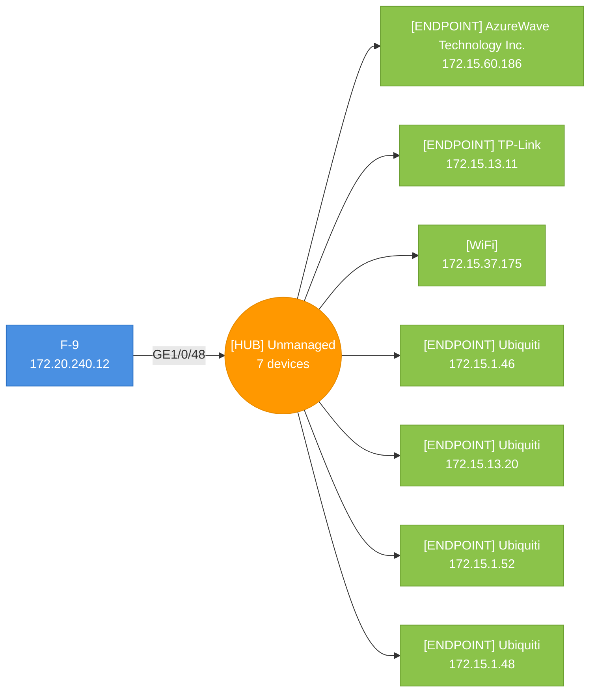
```mermaid
graph LR
  hub_4caea327768a_p48(("[HUB] Unmanaged<br>7 devices"))
  4caea327768a["F-9<br>172.20.240.12"]
  4caea327768a-- "GE1/0/48" -->hub_4caea327768a_p48
  style 4caea327768a fill:#4A90E2,stroke:#2A6FC2,color:#fff
  1068380a0779["[ENDPOINT] AzureWave Technology Inc.<br>172.15.60.186"]
  hub_4caea327768a_p48-->1068380a0779
  style 1068380a0779 fill:#8BC34A,stroke:#6B9F30,color:#fff
  54af9782f4c4["[ENDPOINT] TP-Link<br>172.15.13.11"]
  hub_4caea327768a_p48-->54af9782f4c4
  style 54af9782f4c4 fill:#8BC34A,stroke:#6B9F30,color:#fff
  563a98b65c1a["[WiFi]<br>172.15.37.175"]
  hub_4caea327768a_p48-->563a98b65c1a
  style 563a98b65c1a fill:#8BC34A,stroke:#6B9F30,color:#fff
  7845587c874f["[ENDPOINT] Ubiquiti<br>172.15.1.46"]
  hub_4caea327768a_p48-->7845587c874f
  style 7845587c874f fill:#8BC34A,stroke:#6B9F30,color:#fff
  7845587c87a0["[ENDPOINT] Ubiquiti<br>172.15.13.20"]
  hub_4caea327768a_p48-->7845587c87a0
  style 7845587c87a0 fill:#8BC34A,stroke:#6B9F30,color:#fff
  7845587c88e4["[ENDPOINT] Ubiquiti<br>172.15.1.52"]
  hub_4caea327768a_p48-->7845587c88e4
  style 7845587c88e4 fill:#8BC34A,stroke:#6B9F30,color:#fff
  7845587c8947["[ENDPOINT] Ubiquiti<br>172.15.1.48"]
  hub_4caea327768a_p48-->7845587c8947
  style 7845587c8947 fill:#8BC34A,stroke:#6B9F30,color:#fff
  style hub_4caea327768a_p48 fill:#FF9800,stroke:#E68A00,color:#fff
```

**Ulanganlar:** 7 ta qurilma

### Shadow IT #2: [HUB] Unmanaged
2 devices

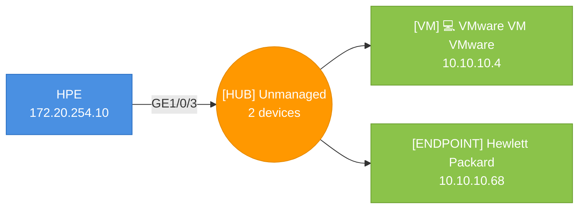
```mermaid
graph LR
  hub_4caea3277eca_p3(("[HUB] Unmanaged<br>2 devices"))
  4caea3277eca["HPE<br>172.20.254.10"]
  4caea3277eca-- "GE1/0/3" -->hub_4caea3277eca_p3
  style 4caea3277eca fill:#4A90E2,stroke:#2A6FC2,color:#fff
  000c29b745bb["[VM] 💻 VMware VM VMware<br>10.10.10.4"]
  hub_4caea3277eca_p3-->000c29b745bb
  style 000c29b745bb fill:#8BC34A,stroke:#6B9F30,color:#fff
  c4346bb84194["[ENDPOINT] Hewlett Packard<br>10.10.10.68"]
  hub_4caea3277eca_p3-->c4346bb84194
  style c4346bb84194 fill:#8BC34A,stroke:#6B9F30,color:#fff
  style hub_4caea3277eca_p3 fill:#FF9800,stroke:#E68A00,color:#fff
```

**Ulanganlar:** 2 ta qurilma

### Shadow IT #3: [HUB] Unmanaged
3 devices

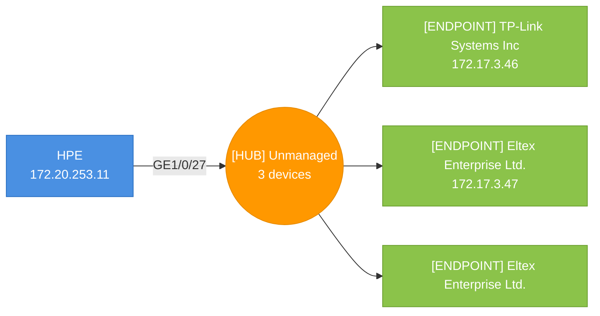
```mermaid
graph LR
  hub_4caea38dd599_p27(("[HUB] Unmanaged<br>3 devices"))
  4caea38dd599["HPE<br>172.20.253.11"]
  4caea38dd599-- "GE1/0/27" -->hub_4caea38dd599_p27
  style 4caea38dd599 fill:#4A90E2,stroke:#2A6FC2,color:#fff
  5091e396806f["[ENDPOINT] TP-Link Systems Inc<br>172.17.3.46"]
  hub_4caea38dd599_p27-->5091e396806f
  style 5091e396806f fill:#8BC34A,stroke:#6B9F30,color:#fff
  e45ad46b3a00["[ENDPOINT] Eltex Enterprise Ltd.<br>172.17.3.47"]
  hub_4caea38dd599_p27-->e45ad46b3a00
  style e45ad46b3a00 fill:#8BC34A,stroke:#6B9F30,color:#fff
  e45ad46b3a1b["[ENDPOINT] Eltex Enterprise Ltd."]
  hub_4caea38dd599_p27-->e45ad46b3a1b
  style e45ad46b3a1b fill:#8BC34A,stroke:#6B9F30,color:#fff
  style hub_4caea38dd599_p27 fill:#FF9800,stroke:#E68A00,color:#fff
```

**Ulanganlar:** 3 ta qurilma

### Shadow IT #4: [HUB] Unmanaged
2 devices

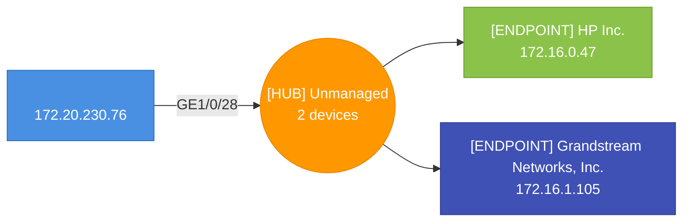
```mermaid
graph LR
  hub_4caea38decc1_p28(("[HUB] Unmanaged<br>2 devices"))
  4caea38decc1["<br>172.20.230.76"]
  4caea38decc1-- "GE1/0/28" -->hub_4caea38decc1_p28
  style 4caea38decc1 fill:#4A90E2,stroke:#2A6FC2,color:#fff
  c018035b6542["[ENDPOINT] HP Inc.<br>172.16.0.47"]
  hub_4caea38decc1_p28-->c018035b6542
  style c018035b6542 fill:#8BC34A,stroke:#6B9F30,color:#fff
  c074ad90018e["[ENDPOINT] Grandstream Networks, Inc.<br>172.16.1.105"]
  hub_4caea38decc1_p28-->c074ad90018e
  style c074ad90018e fill:#3F51B5,stroke:#303F9F,color:#fff
  style hub_4caea38decc1_p28 fill:#FF9800,stroke:#E68A00,color:#fff
```

**Ulanganlar:** 2 ta qurilma

### Shadow IT #5: [HUB] Unmanaged
2 devices

```mermaid
graph LR
  hub_4caea38decc1_p4(("[HUB] Unmanaged<br>2 devices"))
  4caea38decc1["<br>172.20.230.76"]
  4caea38decc1-- "GE1/0/4" -->hub_4caea38decc1_p4
  style 4caea38decc1 fill:#4A90E2,stroke:#2A6FC2,color:#fff
  902e169d3d37["[ENDPOINT] LCFC<br>172.16.0.57"]
  hub_4caea38decc1_p4-->902e169d3d37
  style 902e169d3d37 fill:#8BC34A,stroke:#6B9F30,color:#fff
  ec74d764cb9f["[ENDPOINT] Grandstream Networks Inc<br>172.16.2.189"]
  hub_4caea38decc1_p4-->ec74d764cb9f
  style ec74d764cb9f fill:#3F51B5,stroke:#303F9F,color:#fff
  style hub_4caea38decc1_p4 fill:#FF9800,stroke:#E68A00,color:#fff
```

**Ulanganlar:** 2 ta qurilma

### Shadow IT #6: [HUB] Unmanaged
2 devices

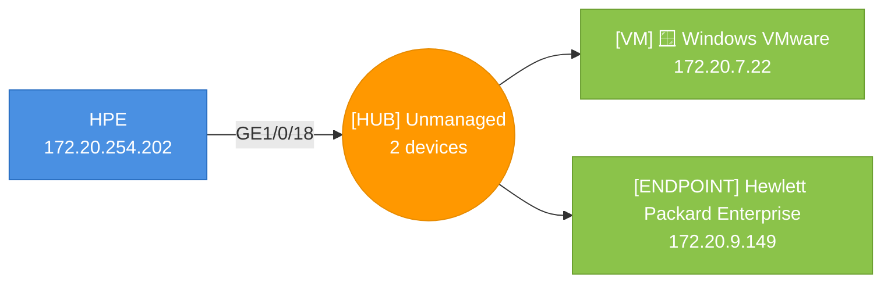
```mermaid
graph LR
  hub_4caea38deec9_p18(("[HUB] Unmanaged<br>2 devices"))
  4caea38deec9["HPE<br>172.20.254.202"]
  4caea38deec9-- "GE1/0/18" -->hub_4caea38deec9_p18
  style 4caea38deec9 fill:#4A90E2,stroke:#2A6FC2,color:#fff
  000c292dde3c["[VM] 🪟 Windows VMware<br>172.20.7.22"]
  hub_4caea38deec9_p18-->000c292dde3c
  style 000c292dde3c fill:#8BC34A,stroke:#6B9F30,color:#fff
  08f1ea8d264e["[ENDPOINT] Hewlett Packard Enterprise<br>172.20.9.149"]
  hub_4caea38deec9_p18-->08f1ea8d264e
  style 08f1ea8d264e fill:#8BC34A,stroke:#6B9F30,color:#fff
  style hub_4caea38deec9_p18 fill:#FF9800,stroke:#E68A00,color:#fff
```

**Ulanganlar:** 2 ta qurilma

### Shadow IT #7: [HUB] Unmanaged
5 devices

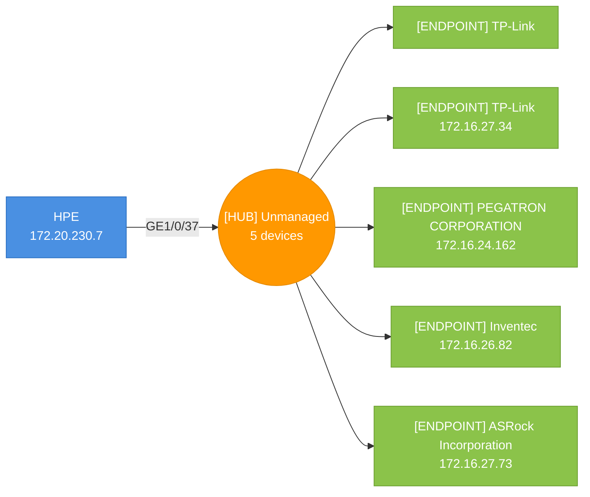
```mermaid
graph LR
  hub_4caea38e1909_p37(("[HUB] Unmanaged<br>5 devices"))
  4caea38e1909["HPE<br>172.20.230.7"]
  4caea38e1909-- "GE1/0/37" -->hub_4caea38e1909_p37
  style 4caea38e1909 fill:#4A90E2,stroke:#2A6FC2,color:#fff
  10feed5a195e["[ENDPOINT] TP-Link"]
  hub_4caea38e1909_p37-->10feed5a195e
  style 10feed5a195e fill:#8BC34A,stroke:#6B9F30,color:#fff
  10feed5a195f["[ENDPOINT] TP-Link<br>172.16.27.34"]
  hub_4caea38e1909_p37-->10feed5a195f
  style 10feed5a195f fill:#8BC34A,stroke:#6B9F30,color:#fff
  54b203712a46["[ENDPOINT] PEGATRON CORPORATION<br>172.16.24.162"]
  hub_4caea38e1909_p37-->54b203712a46
  style 54b203712a46 fill:#8BC34A,stroke:#6B9F30,color:#fff
  64c901f59176["[ENDPOINT] Inventec<br>172.16.26.82"]
  hub_4caea38e1909_p37-->64c901f59176
  style 64c901f59176 fill:#8BC34A,stroke:#6B9F30,color:#fff
  a8a159a0c9a3["[ENDPOINT] ASRock Incorporation<br>172.16.27.73"]
  hub_4caea38e1909_p37-->a8a159a0c9a3
  style a8a159a0c9a3 fill:#8BC34A,stroke:#6B9F30,color:#fff
  style hub_4caea38e1909_p37 fill:#FF9800,stroke:#E68A00,color:#fff
```

**Ulanganlar:** 5 ta qurilma

### Shadow IT #8: [HUB] Unmanaged
8 devices

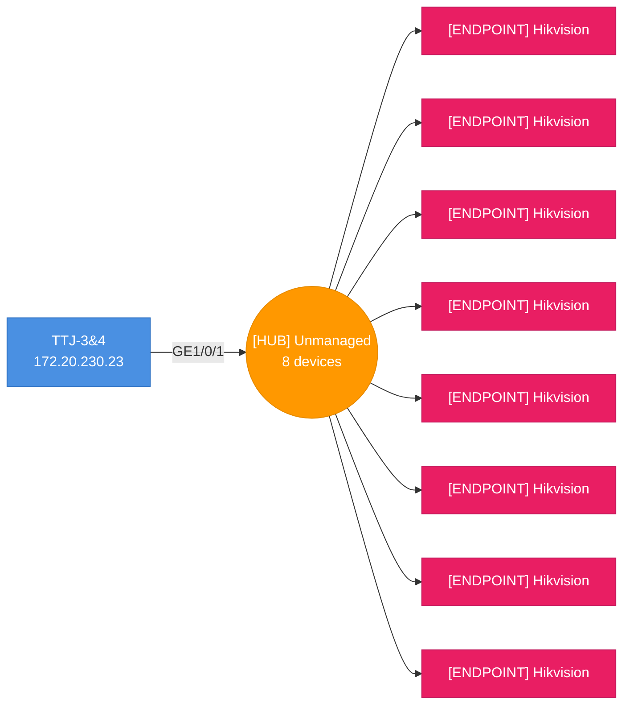
```mermaid
graph LR
  hub_4caea3a201ac_p1(("[HUB] Unmanaged<br>8 devices"))
  4caea3a201ac["TTJ-3&4<br>172.20.230.23"]
  4caea3a201ac-- "GE1/0/1" -->hub_4caea3a201ac_p1
  style 4caea3a201ac fill:#4A90E2,stroke:#2A6FC2,color:#fff
  bc9b5e37bf19["[ENDPOINT] Hikvision"]
  hub_4caea3a201ac_p1-->bc9b5e37bf19
  style bc9b5e37bf19 fill:#E91E63,stroke:#C2185B,color:#fff
  bc9b5e37bf20["[ENDPOINT] Hikvision"]
  hub_4caea3a201ac_p1-->bc9b5e37bf20
  style bc9b5e37bf20 fill:#E91E63,stroke:#C2185B,color:#fff
  bc9b5e37bf22["[ENDPOINT] Hikvision"]
  hub_4caea3a201ac_p1-->bc9b5e37bf22
  style bc9b5e37bf22 fill:#E91E63,stroke:#C2185B,color:#fff
  bc9b5e37bf33["[ENDPOINT] Hikvision"]
  hub_4caea3a201ac_p1-->bc9b5e37bf33
  style bc9b5e37bf33 fill:#E91E63,stroke:#C2185B,color:#fff
  bc9b5e37bf3a["[ENDPOINT] Hikvision"]
  hub_4caea3a201ac_p1-->bc9b5e37bf3a
  style bc9b5e37bf3a fill:#E91E63,stroke:#C2185B,color:#fff
  bc9b5e37bf3b["[ENDPOINT] Hikvision"]
  hub_4caea3a201ac_p1-->bc9b5e37bf3b
  style bc9b5e37bf3b fill:#E91E63,stroke:#C2185B,color:#fff
  bc9b5e37bf49["[ENDPOINT] Hikvision"]
  hub_4caea3a201ac_p1-->bc9b5e37bf49
  style bc9b5e37bf49 fill:#E91E63,stroke:#C2185B,color:#fff
  bc9b5e37bf4b["[ENDPOINT] Hikvision"]
  hub_4caea3a201ac_p1-->bc9b5e37bf4b
  style bc9b5e37bf4b fill:#E91E63,stroke:#C2185B,color:#fff
  style hub_4caea3a201ac_p1 fill:#FF9800,stroke:#E68A00,color:#fff
```

**Ulanganlar:** 8 ta qurilma

### Shadow IT #9: [HUB] Unmanaged
2 devices

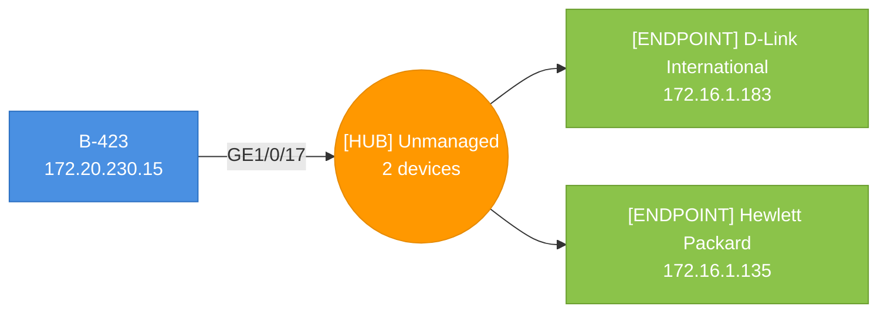
```mermaid
graph LR
  hub_4caea3a2032c_p17(("[HUB] Unmanaged<br>2 devices"))
  4caea3a2032c["B-423<br>172.20.230.15"]
  4caea3a2032c-- "GE1/0/17" -->hub_4caea3a2032c_p17
  style 4caea3a2032c fill:#4A90E2,stroke:#2A6FC2,color:#fff
  6c198fcfc8c3["[ENDPOINT] D-Link International<br>172.16.1.183"]
  hub_4caea3a2032c_p17-->6c198fcfc8c3
  style 6c198fcfc8c3 fill:#8BC34A,stroke:#6B9F30,color:#fff
  c8d3ffbb2890["[ENDPOINT] Hewlett Packard<br>172.16.1.135"]
  hub_4caea3a2032c_p17-->c8d3ffbb2890
  style c8d3ffbb2890 fill:#8BC34A,stroke:#6B9F30,color:#fff
  style hub_4caea3a2032c_p17 fill:#FF9800,stroke:#E68A00,color:#fff
```

**Ulanganlar:** 2 ta qurilma

### Shadow IT #10: [HUB] Unmanaged
2 devices

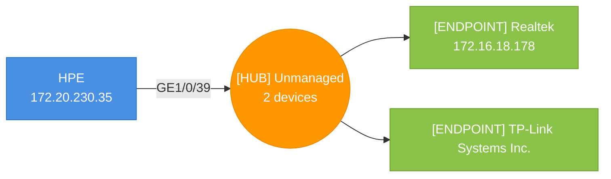
```mermaid
graph LR
  hub_4caea3a20d4c_p39(("[HUB] Unmanaged<br>2 devices"))
  4caea3a20d4c["HPE<br>172.20.230.35"]
  4caea3a20d4c-- "GE1/0/39" -->hub_4caea3a20d4c_p39
  style 4caea3a20d4c fill:#4A90E2,stroke:#2A6FC2,color:#fff
  00e04cf04fb4["[ENDPOINT] Realtek<br>172.16.18.178"]
  hub_4caea3a20d4c_p39-->00e04cf04fb4
  style 00e04cf04fb4 fill:#8BC34A,stroke:#6B9F30,color:#fff
  a8294859b3c3["[ENDPOINT] TP-Link Systems Inc."]
  hub_4caea3a20d4c_p39-->a8294859b3c3
  style a8294859b3c3 fill:#8BC34A,stroke:#6B9F30,color:#fff
  style hub_4caea3a20d4c_p39 fill:#FF9800,stroke:#E68A00,color:#fff
```

**Ulanganlar:** 2 ta qurilma

### Shadow IT #11: [HUB] Unmanaged
6 devices

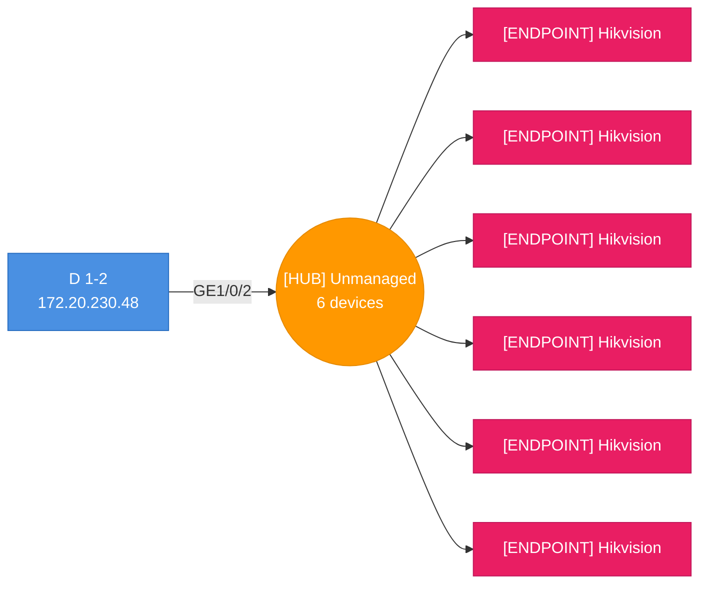
```mermaid
graph LR
  hub_4caea3a215ec_p2(("[HUB] Unmanaged<br>6 devices"))
  4caea3a215ec["D 1-2<br>172.20.230.48"]
  4caea3a215ec-- "GE1/0/2" -->hub_4caea3a215ec_p2
  style 4caea3a215ec fill:#4A90E2,stroke:#2A6FC2,color:#fff
  bc9b5e37bf15["[ENDPOINT] Hikvision"]
  hub_4caea3a215ec_p2-->bc9b5e37bf15
  style bc9b5e37bf15 fill:#E91E63,stroke:#C2185B,color:#fff
  bc9b5e37bf17["[ENDPOINT] Hikvision"]
  hub_4caea3a215ec_p2-->bc9b5e37bf17
  style bc9b5e37bf17 fill:#E91E63,stroke:#C2185B,color:#fff
  bc9b5e37bf28["[ENDPOINT] Hikvision"]
  hub_4caea3a215ec_p2-->bc9b5e37bf28
  style bc9b5e37bf28 fill:#E91E63,stroke:#C2185B,color:#fff
  bc9b5e37bf38["[ENDPOINT] Hikvision"]
  hub_4caea3a215ec_p2-->bc9b5e37bf38
  style bc9b5e37bf38 fill:#E91E63,stroke:#C2185B,color:#fff
  bc9b5e37bf39["[ENDPOINT] Hikvision"]
  hub_4caea3a215ec_p2-->bc9b5e37bf39
  style bc9b5e37bf39 fill:#E91E63,stroke:#C2185B,color:#fff
  bc9b5e37bf50["[ENDPOINT] Hikvision"]
  hub_4caea3a215ec_p2-->bc9b5e37bf50
  style bc9b5e37bf50 fill:#E91E63,stroke:#C2185B,color:#fff
  style hub_4caea3a215ec_p2 fill:#FF9800,stroke:#E68A00,color:#fff
```

**Ulanganlar:** 6 ta qurilma

### Shadow IT #12: [HUB] Unmanaged
8 devices

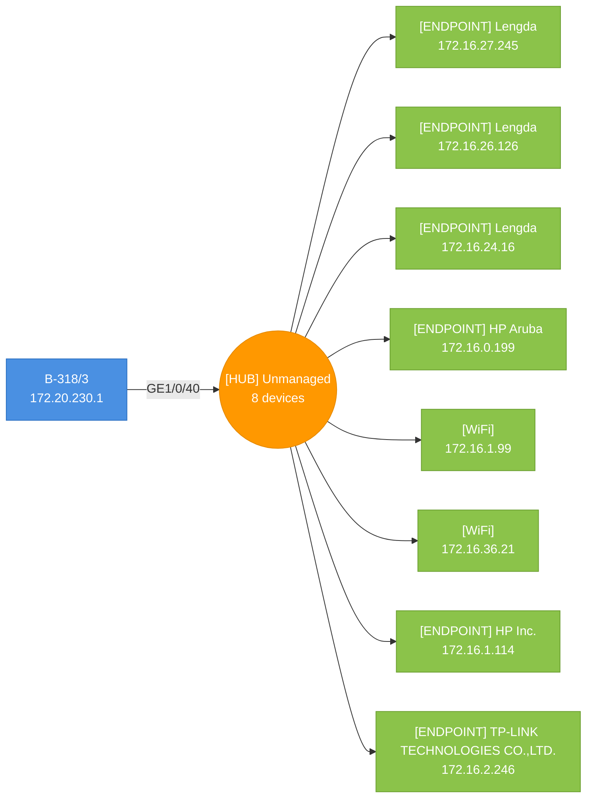
```mermaid
graph LR
  hub_4caea3a2182c_p40(("[HUB] Unmanaged<br>8 devices"))
  4caea3a2182c["B-318/3<br>172.20.230.1"]
  4caea3a2182c-- "GE1/0/40" -->hub_4caea3a2182c_p40
  style 4caea3a2182c fill:#4A90E2,stroke:#2A6FC2,color:#fff
  002381549be2["[ENDPOINT] Lengda<br>172.16.27.245"]
  hub_4caea3a2182c_p40-->002381549be2
  style 002381549be2 fill:#8BC34A,stroke:#6B9F30,color:#fff
  002381549be5["[ENDPOINT] Lengda<br>172.16.26.126"]
  hub_4caea3a2182c_p40-->002381549be5
  style 002381549be5 fill:#8BC34A,stroke:#6B9F30,color:#fff
  002381549c03["[ENDPOINT] Lengda<br>172.16.24.16"]
  hub_4caea3a2182c_p40-->002381549c03
  style 002381549c03 fill:#8BC34A,stroke:#6B9F30,color:#fff
  004e35cb4f9a["[ENDPOINT] HP Aruba<br>172.16.0.199"]
  hub_4caea3a2182c_p40-->004e35cb4f9a
  style 004e35cb4f9a fill:#8BC34A,stroke:#6B9F30,color:#fff
  4e6d487b43dc["[WiFi]<br>172.16.1.99"]
  hub_4caea3a2182c_p40-->4e6d487b43dc
  style 4e6d487b43dc fill:#8BC34A,stroke:#6B9F30,color:#fff
  667a54eff633["[WiFi]<br>172.16.36.21"]
  hub_4caea3a2182c_p40-->667a54eff633
  style 667a54eff633 fill:#8BC34A,stroke:#6B9F30,color:#fff
  c01803886bb2["[ENDPOINT] HP Inc.<br>172.16.1.114"]
  hub_4caea3a2182c_p40-->c01803886bb2
  style c01803886bb2 fill:#8BC34A,stroke:#6B9F30,color:#fff
  e4c32adb8931["[ENDPOINT] TP-LINK TECHNOLOGIES CO.,LTD.<br>172.16.2.246"]
  hub_4caea3a2182c_p40-->e4c32adb8931
  style e4c32adb8931 fill:#8BC34A,stroke:#6B9F30,color:#fff
  style hub_4caea3a2182c_p40 fill:#FF9800,stroke:#E68A00,color:#fff
```

**Ulanganlar:** 8 ta qurilma

### Shadow IT #13: [HUB] Unmanaged
8 devices

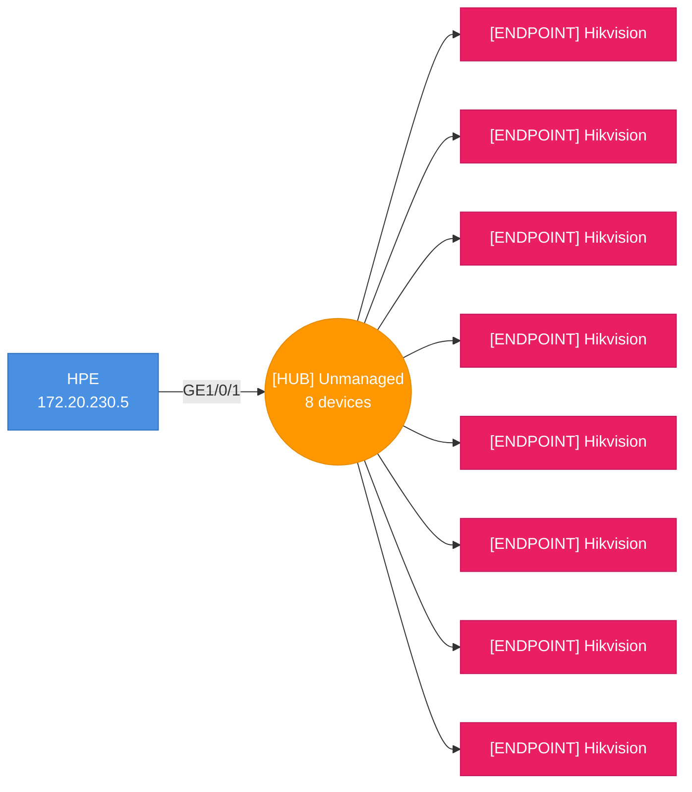
```mermaid
graph LR
  hub_4caea3a218ec_p1(("[HUB] Unmanaged<br>8 devices"))
  4caea3a218ec["HPE<br>172.20.230.5"]
  4caea3a218ec-- "GE1/0/1" -->hub_4caea3a218ec_p1
  style 4caea3a218ec fill:#4A90E2,stroke:#2A6FC2,color:#fff
  bc9b5e37bf45["[ENDPOINT] Hikvision"]
  hub_4caea3a218ec_p1-->bc9b5e37bf45
  style bc9b5e37bf45 fill:#E91E63,stroke:#C2185B,color:#fff
  bc9b5e37bf46["[ENDPOINT] Hikvision"]
  hub_4caea3a218ec_p1-->bc9b5e37bf46
  style bc9b5e37bf46 fill:#E91E63,stroke:#C2185B,color:#fff
  bc9b5e37bf4c["[ENDPOINT] Hikvision"]
  hub_4caea3a218ec_p1-->bc9b5e37bf4c
  style bc9b5e37bf4c fill:#E91E63,stroke:#C2185B,color:#fff
  bc9b5e37bf4d["[ENDPOINT] Hikvision"]
  hub_4caea3a218ec_p1-->bc9b5e37bf4d
  style bc9b5e37bf4d fill:#E91E63,stroke:#C2185B,color:#fff
  bc9b5e37bf4e["[ENDPOINT] Hikvision"]
  hub_4caea3a218ec_p1-->bc9b5e37bf4e
  style bc9b5e37bf4e fill:#E91E63,stroke:#C2185B,color:#fff
  bc9b5e37bf54["[ENDPOINT] Hikvision"]
  hub_4caea3a218ec_p1-->bc9b5e37bf54
  style bc9b5e37bf54 fill:#E91E63,stroke:#C2185B,color:#fff
  bc9b5e37bf55["[ENDPOINT] Hikvision"]
  hub_4caea3a218ec_p1-->bc9b5e37bf55
  style bc9b5e37bf55 fill:#E91E63,stroke:#C2185B,color:#fff
  bc9b5e37bf5a["[ENDPOINT] Hikvision"]
  hub_4caea3a218ec_p1-->bc9b5e37bf5a
  style bc9b5e37bf5a fill:#E91E63,stroke:#C2185B,color:#fff
  style hub_4caea3a218ec_p1 fill:#FF9800,stroke:#E68A00,color:#fff
```

**Ulanganlar:** 8 ta qurilma

### Shadow IT #14: [HUB] Unmanaged
6 devices

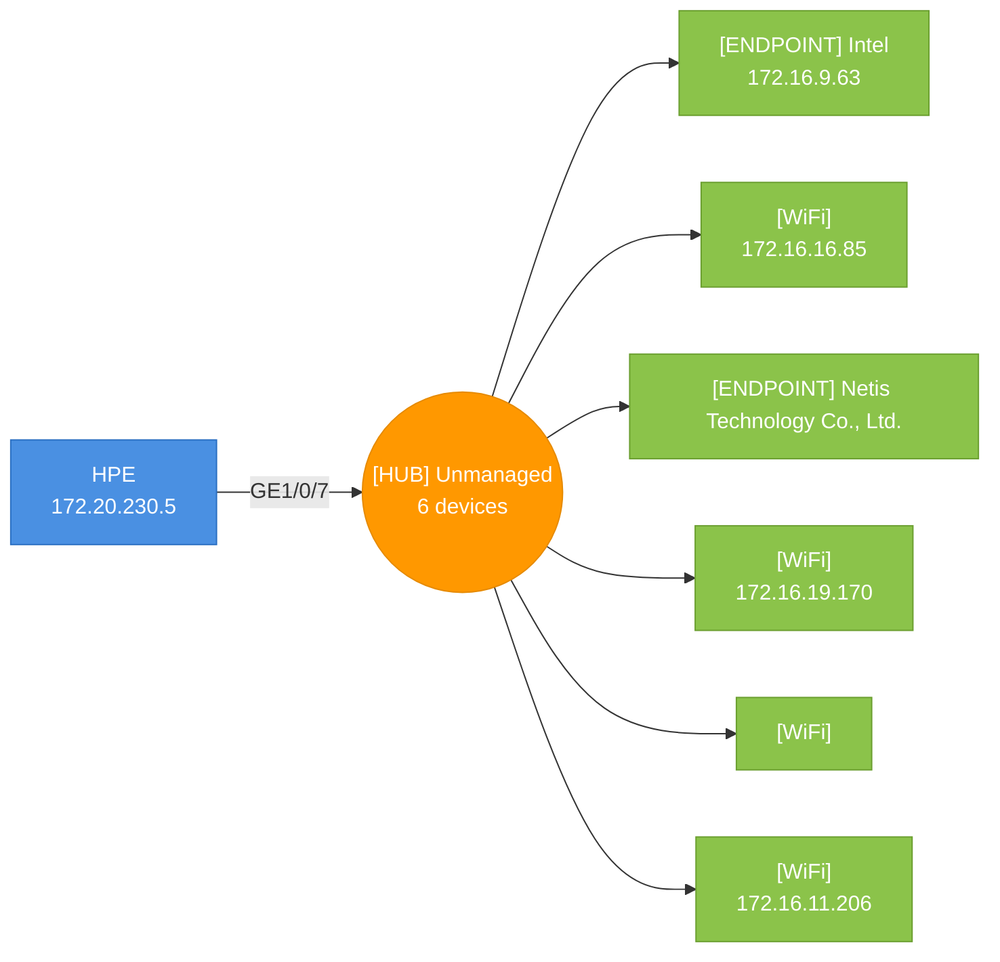
```mermaid
graph LR
  hub_4caea3a218ec_p7(("[HUB] Unmanaged<br>6 devices"))
  4caea3a218ec["HPE<br>172.20.230.5"]
  4caea3a218ec-- "GE1/0/7" -->hub_4caea3a218ec_p7
  style 4caea3a218ec fill:#4A90E2,stroke:#2A6FC2,color:#fff
  14857fccb76c["[ENDPOINT] Intel<br>172.16.9.63"]
  hub_4caea3a218ec_p7-->14857fccb76c
  style 14857fccb76c fill:#8BC34A,stroke:#6B9F30,color:#fff
  3609c6c1053b["[WiFi]<br>172.16.16.85"]
  hub_4caea3a218ec_p7-->3609c6c1053b
  style 3609c6c1053b fill:#8BC34A,stroke:#6B9F30,color:#fff
  64eeb7a7d170["[ENDPOINT] Netis Technology Co., Ltd."]
  hub_4caea3a218ec_p7-->64eeb7a7d170
  style 64eeb7a7d170 fill:#8BC34A,stroke:#6B9F30,color:#fff
  7aaad80032bf["[WiFi]<br>172.16.19.170"]
  hub_4caea3a218ec_p7-->7aaad80032bf
  style 7aaad80032bf fill:#8BC34A,stroke:#6B9F30,color:#fff
  aaa395632235["[WiFi]"]
  hub_4caea3a218ec_p7-->aaa395632235
  style aaa395632235 fill:#8BC34A,stroke:#6B9F30,color:#fff
  f23285d256dd["[WiFi]<br>172.16.11.206"]
  hub_4caea3a218ec_p7-->f23285d256dd
  style f23285d256dd fill:#8BC34A,stroke:#6B9F30,color:#fff
  style hub_4caea3a218ec_p7 fill:#FF9800,stroke:#E68A00,color:#fff
```

**Ulanganlar:** 6 ta qurilma

### Shadow IT #15: [HUB] Unmanaged
2 devices

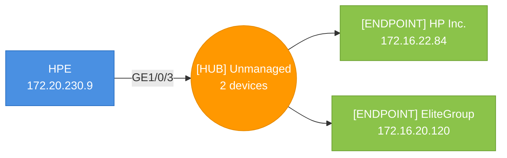
```mermaid
graph LR
  hub_4caea3a219ac_p3(("[HUB] Unmanaged<br>2 devices"))
  4caea3a219ac["HPE<br>172.20.230.9"]
  4caea3a219ac-- "GE1/0/3" -->hub_4caea3a219ac_p3
  style 4caea3a219ac fill:#4A90E2,stroke:#2A6FC2,color:#fff
  30138baf846b["[ENDPOINT] HP Inc.<br>172.16.22.84"]
  hub_4caea3a219ac_p3-->30138baf846b
  style 30138baf846b fill:#8BC34A,stroke:#6B9F30,color:#fff
  94c6913ff8f8["[ENDPOINT] EliteGroup<br>172.16.20.120"]
  hub_4caea3a219ac_p3-->94c6913ff8f8
  style 94c6913ff8f8 fill:#8BC34A,stroke:#6B9F30,color:#fff
  style hub_4caea3a219ac_p3 fill:#FF9800,stroke:#E68A00,color:#fff
```

**Ulanganlar:** 2 ta qurilma

### Shadow IT #16: [HUB] Unmanaged
3 devices

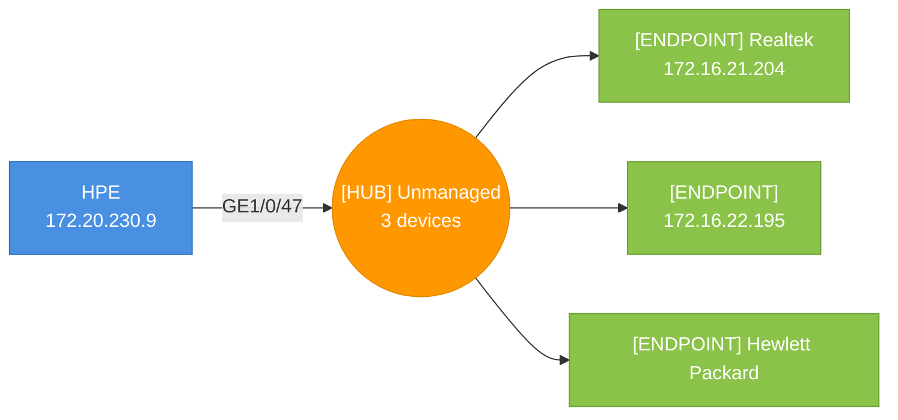
```mermaid
graph LR
  hub_4caea3a219ac_p47(("[HUB] Unmanaged<br>3 devices"))
  4caea3a219ac["HPE<br>172.20.230.9"]
  4caea3a219ac-- "GE1/0/47" -->hub_4caea3a219ac_p47
  style 4caea3a219ac fill:#4A90E2,stroke:#2A6FC2,color:#fff
  00e04cf0dfc3["[ENDPOINT] Realtek<br>172.16.21.204"]
  hub_4caea3a219ac_p47-->00e04cf0dfc3
  style 00e04cf0dfc3 fill:#8BC34A,stroke:#6B9F30,color:#fff
  00e269537b36["[ENDPOINT]<br>172.16.22.195"]
  hub_4caea3a219ac_p47-->00e269537b36
  style 00e269537b36 fill:#8BC34A,stroke:#6B9F30,color:#fff
  443192b4d11b["[ENDPOINT] Hewlett Packard"]
  hub_4caea3a219ac_p47-->443192b4d11b
  style 443192b4d11b fill:#8BC34A,stroke:#6B9F30,color:#fff
  style hub_4caea3a219ac_p47 fill:#FF9800,stroke:#E68A00,color:#fff
```

**Ulanganlar:** 3 ta qurilma

### Shadow IT #17: [HUB] Unmanaged
8 devices

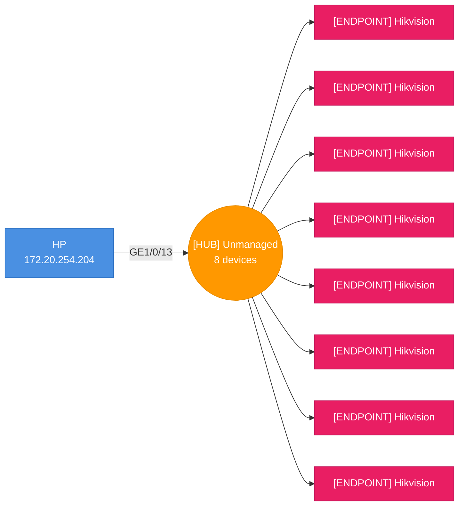
```mermaid
graph LR
  hub_78485972ecee_p13(("[HUB] Unmanaged<br>8 devices"))
  78485972ecee["HP<br>172.20.254.204"]
  78485972ecee-- "GE1/0/13" -->hub_78485972ecee_p13
  style 78485972ecee fill:#4A90E2,stroke:#2A6FC2,color:#fff
  bc9b5e37bf26["[ENDPOINT] Hikvision"]
  hub_78485972ecee_p13-->bc9b5e37bf26
  style bc9b5e37bf26 fill:#E91E63,stroke:#C2185B,color:#fff
  bc9b5e37bf2b["[ENDPOINT] Hikvision"]
  hub_78485972ecee_p13-->bc9b5e37bf2b
  style bc9b5e37bf2b fill:#E91E63,stroke:#C2185B,color:#fff
  bc9b5e37bf2f["[ENDPOINT] Hikvision"]
  hub_78485972ecee_p13-->bc9b5e37bf2f
  style bc9b5e37bf2f fill:#E91E63,stroke:#C2185B,color:#fff
  bc9b5e37bf30["[ENDPOINT] Hikvision"]
  hub_78485972ecee_p13-->bc9b5e37bf30
  style bc9b5e37bf30 fill:#E91E63,stroke:#C2185B,color:#fff
  bc9b5e37bf43["[ENDPOINT] Hikvision"]
  hub_78485972ecee_p13-->bc9b5e37bf43
  style bc9b5e37bf43 fill:#E91E63,stroke:#C2185B,color:#fff
  bc9b5e37bf53["[ENDPOINT] Hikvision"]
  hub_78485972ecee_p13-->bc9b5e37bf53
  style bc9b5e37bf53 fill:#E91E63,stroke:#C2185B,color:#fff
  bc9b5e37bf57["[ENDPOINT] Hikvision"]
  hub_78485972ecee_p13-->bc9b5e37bf57
  style bc9b5e37bf57 fill:#E91E63,stroke:#C2185B,color:#fff
  bc9b5e37bf58["[ENDPOINT] Hikvision"]
  hub_78485972ecee_p13-->bc9b5e37bf58
  style bc9b5e37bf58 fill:#E91E63,stroke:#C2185B,color:#fff
  style hub_78485972ecee_p13 fill:#FF9800,stroke:#E68A00,color:#fff
```

**Ulanganlar:** 8 ta qurilma

### Shadow IT #18: [HUB] Unmanaged
6 devices

```mermaid
graph LR
  hub_f8f0827ad969_p2(("[HUB] Unmanaged<br>6 devices"))
  f8f0827ad969["E109<br>172.20.230.22"]
  f8f0827ad969-- "Eth1/0/2" -->hub_f8f0827ad969_p2
  style f8f0827ad969 fill:#4A90E2,stroke:#2A6FC2,color:#fff
  bc9b5e37bf12["[ENDPOINT] Hikvision"]
  hub_f8f0827ad969_p2-->bc9b5e37bf12
  style bc9b5e37bf12 fill:#E91E63,stroke:#C2185B,color:#fff
  bc9b5e37bf14["[ENDPOINT] Hikvision"]
  hub_f8f0827ad969_p2-->bc9b5e37bf14
  style bc9b5e37bf14 fill:#E91E63,stroke:#C2185B,color:#fff
  bc9b5e37bf21["[ENDPOINT] Hikvision"]
  hub_f8f0827ad969_p2-->bc9b5e37bf21
  style bc9b5e37bf21 fill:#E91E63,stroke:#C2185B,color:#fff
  bc9b5e37bf24["[ENDPOINT] Hikvision"]
  hub_f8f0827ad969_p2-->bc9b5e37bf24
  style bc9b5e37bf24 fill:#E91E63,stroke:#C2185B,color:#fff
  bc9b5e37bf35["[ENDPOINT] Hikvision"]
  hub_f8f0827ad969_p2-->bc9b5e37bf35
  style bc9b5e37bf35 fill:#E91E63,stroke:#C2185B,color:#fff
  bc9b5e37bf5b["[ENDPOINT] Hikvision"]
  hub_f8f0827ad969_p2-->bc9b5e37bf5b
  style bc9b5e37bf5b fill:#E91E63,stroke:#C2185B,color:#fff
  style hub_f8f0827ad969_p2 fill:#FF9800,stroke:#E68A00,color:#fff
```

**Ulanganlar:** 6 ta qurilma

### Shadow IT #19: [HUB] Unmanaged
5 devices

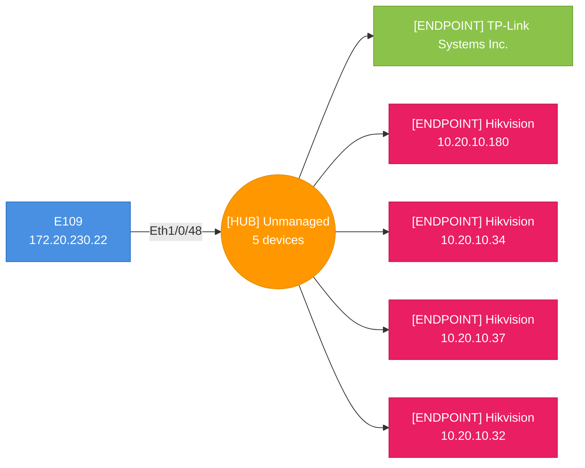
```mermaid
graph LR
  hub_f8f0827ad969_p48(("[HUB] Unmanaged<br>5 devices"))
  f8f0827ad969["E109<br>172.20.230.22"]
  f8f0827ad969-- "Eth1/0/48" -->hub_f8f0827ad969_p48
  style f8f0827ad969 fill:#4A90E2,stroke:#2A6FC2,color:#fff
  8c902d4f5c93["[ENDPOINT] TP-Link Systems Inc."]
  hub_f8f0827ad969_p48-->8c902d4f5c93
  style 8c902d4f5c93 fill:#8BC34A,stroke:#6B9F30,color:#fff
  bc9b5e476221["[ENDPOINT] Hikvision<br>10.20.10.180"]
  hub_f8f0827ad969_p48-->bc9b5e476221
  style bc9b5e476221 fill:#E91E63,stroke:#C2185B,color:#fff
  bc9b5e476224["[ENDPOINT] Hikvision<br>10.20.10.34"]
  hub_f8f0827ad969_p48-->bc9b5e476224
  style bc9b5e476224 fill:#E91E63,stroke:#C2185B,color:#fff
  bc9b5e476339["[ENDPOINT] Hikvision<br>10.20.10.37"]
  hub_f8f0827ad969_p48-->bc9b5e476339
  style bc9b5e476339 fill:#E91E63,stroke:#C2185B,color:#fff
  bc9b5e47669d["[ENDPOINT] Hikvision<br>10.20.10.32"]
  hub_f8f0827ad969_p48-->bc9b5e47669d
  style bc9b5e47669d fill:#E91E63,stroke:#C2185B,color:#fff
  style hub_f8f0827ad969_p48 fill:#FF9800,stroke:#E68A00,color:#fff
```

**Ulanganlar:** 5 ta qurilma

### Shadow IT #20: [HUB] Unmanaged
2 devices

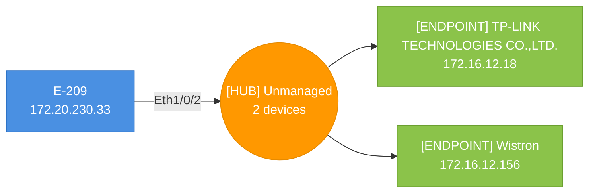
```mermaid
graph LR
  hub_f8f0827c2cc7_p2(("[HUB] Unmanaged<br>2 devices"))
  f8f0827c2cc7["E-209<br>172.20.230.33"]
  f8f0827c2cc7-- "Eth1/0/2" -->hub_f8f0827c2cc7_p2
  style f8f0827c2cc7 fill:#4A90E2,stroke:#2A6FC2,color:#fff
  909a4a24f1dd["[ENDPOINT] TP-LINK TECHNOLOGIES CO.,LTD.<br>172.16.12.18"]
  hub_f8f0827c2cc7_p2-->909a4a24f1dd
  style 909a4a24f1dd fill:#8BC34A,stroke:#6B9F30,color:#fff
  98eecbe08980["[ENDPOINT] Wistron<br>172.16.12.156"]
  hub_f8f0827c2cc7_p2-->98eecbe08980
  style 98eecbe08980 fill:#8BC34A,stroke:#6B9F30,color:#fff
  style hub_f8f0827c2cc7_p2 fill:#FF9800,stroke:#E68A00,color:#fff
```

**Ulanganlar:** 2 ta qurilma

### Shadow IT #21: [HUB] Unmanaged
3 devices

```mermaid
graph LR
  hub_f8f0827c2cc7_p27(("[HUB] Unmanaged<br>3 devices"))
  f8f0827c2cc7["E-209<br>172.20.230.33"]
  f8f0827c2cc7-- "Eth1/0/27" -->hub_f8f0827c2cc7_p27
  style f8f0827c2cc7 fill:#4A90E2,stroke:#2A6FC2,color:#fff
  085411a4cc3b["[ENDPOINT] Hikvision<br>10.20.10.56"]
  hub_f8f0827c2cc7_p27-->085411a4cc3b
  style 085411a4cc3b fill:#E91E63,stroke:#C2185B,color:#fff
  50e538fd9bcf["[ENDPOINT] Hikvision<br>10.20.10.220"]
  hub_f8f0827c2cc7_p27-->50e538fd9bcf
  style 50e538fd9bcf fill:#E91E63,stroke:#C2185B,color:#fff
  50e538fd9c72["[ENDPOINT] Hikvision<br>10.20.10.219"]
  hub_f8f0827c2cc7_p27-->50e538fd9c72
  style 50e538fd9c72 fill:#E91E63,stroke:#C2185B,color:#fff
  style hub_f8f0827c2cc7_p27 fill:#FF9800,stroke:#E68A00,color:#fff
```

**Ulanganlar:** 3 ta qurilma

### Shadow IT #22: [HUB] Unmanaged
4 devices

```mermaid
graph LR
  hub_f8f0827c2d17_p18(("[HUB] Unmanaged<br>4 devices"))
  f8f0827c2d17["E109-2<br>172.20.230.24"]
  f8f0827c2d17-- "Eth1/0/18" -->hub_f8f0827c2d17_p18
  style f8f0827c2d17 fill:#4A90E2,stroke:#2A6FC2,color:#fff
  123558344d56["[WiFi]"]
  hub_f8f0827c2d17_p18-->123558344d56
  style 123558344d56 fill:#8BC34A,stroke:#6B9F30,color:#fff
  a4cf995d8c79["[ENDPOINT] Apple, Inc.<br>172.16.2.192"]
  hub_f8f0827c2d17_p18-->a4cf995d8c79
  style a4cf995d8c79 fill:#8BC34A,stroke:#6B9F30,color:#fff
  b0a7b9ee8d6e["[ENDPOINT] TP-Link Systems Inc<br>172.16.14.170"]
  hub_f8f0827c2d17_p18-->b0a7b9ee8d6e
  style b0a7b9ee8d6e fill:#8BC34A,stroke:#6B9F30,color:#fff
  c0bfbed99bd7["[ENDPOINT] AzureWave Technology Inc.<br>172.16.14.151"]
  hub_f8f0827c2d17_p18-->c0bfbed99bd7
  style c0bfbed99bd7 fill:#8BC34A,stroke:#6B9F30,color:#fff
  style hub_f8f0827c2d17_p18 fill:#FF9800,stroke:#E68A00,color:#fff
```

**Ulanganlar:** 4 ta qurilma

### Shadow IT #23: [HUB] Unmanaged
6 devices

```mermaid
graph LR
  hub_f8f0827c30cf_p17(("[HUB] Unmanaged<br>6 devices"))
  f8f0827c30cf["E205-24<br>172.20.230.32"]
  f8f0827c30cf-- "Eth1/0/17" -->hub_f8f0827c30cf_p17
  style f8f0827c30cf fill:#4A90E2,stroke:#2A6FC2,color:#fff
  00e04cf1708d["[ENDPOINT] Realtek<br>172.16.13.6"]
  hub_f8f0827c30cf_p17-->00e04cf1708d
  style 00e04cf1708d fill:#8BC34A,stroke:#6B9F30,color:#fff
  00e070aaa91e["[ENDPOINT] DH TECHNOLOGY<br>172.16.15.74"]
  hub_f8f0827c30cf_p17-->00e070aaa91e
  style 00e070aaa91e fill:#8BC34A,stroke:#6B9F30,color:#fff
  10b6768b2fdd["[ENDPOINT] HP Inc.<br>172.16.12.138"]
  hub_f8f0827c30cf_p17-->10b6768b2fdd
  style 10b6768b2fdd fill:#8BC34A,stroke:#6B9F30,color:#fff
  28c5c85f53a4["[ENDPOINT] HP Inc.<br>172.16.13.163"]
  hub_f8f0827c30cf_p17-->28c5c85f53a4
  style 28c5c85f53a4 fill:#8BC34A,stroke:#6B9F30,color:#fff
  e45ad4441dc0["[ENDPOINT] Eltex Enterprise Ltd.<br>172.16.14.252"]
  hub_f8f0827c30cf_p17-->e45ad4441dc0
  style e45ad4441dc0 fill:#8BC34A,stroke:#6B9F30,color:#fff
  e45ad4441dda["[ENDPOINT] Eltex Enterprise Ltd."]
  hub_f8f0827c30cf_p17-->e45ad4441dda
  style e45ad4441dda fill:#8BC34A,stroke:#6B9F30,color:#fff
  style hub_f8f0827c30cf_p17 fill:#FF9800,stroke:#E68A00,color:#fff
```

**Ulanganlar:** 6 ta qurilma

### Shadow IT #24: [HUB] Unmanaged
7 devices

```mermaid
graph LR
  hub_f8f0827cf958_p24(("[HUB] Unmanaged<br>7 devices"))
  f8f0827cf958["F-3(1)<br>172.20.240.10"]
  f8f0827cf958-- "Eth1/0/24" -->hub_f8f0827cf958_p24
  style f8f0827cf958 fill:#4A90E2,stroke:#2A6FC2,color:#fff
  54af9782f4c5["[ENDPOINT] TP-Link<br>172.15.12.251"]
  hub_f8f0827cf958_p24-->54af9782f4c5
  style 54af9782f4c5 fill:#8BC34A,stroke:#6B9F30,color:#fff
  5e3df11768dc["[WiFi]<br>172.15.38.48"]
  hub_f8f0827cf958_p24-->5e3df11768dc
  style 5e3df11768dc fill:#8BC34A,stroke:#6B9F30,color:#fff
  7845587c85bc["[ENDPOINT] Ubiquiti<br>172.15.1.35"]
  hub_f8f0827cf958_p24-->7845587c85bc
  style 7845587c85bc fill:#8BC34A,stroke:#6B9F30,color:#fff
  7845587c85d5["[ENDPOINT] Ubiquiti<br>172.15.1.39"]
  hub_f8f0827cf958_p24-->7845587c85d5
  style 7845587c85d5 fill:#8BC34A,stroke:#6B9F30,color:#fff
  7845587c87c8["[ENDPOINT] Ubiquiti<br>172.15.12.245"]
  hub_f8f0827cf958_p24-->7845587c87c8
  style 7845587c87c8 fill:#8BC34A,stroke:#6B9F30,color:#fff
  7845587c88ed["[ENDPOINT] Ubiquiti<br>172.15.1.37"]
  hub_f8f0827cf958_p24-->7845587c88ed
  style 7845587c88ed fill:#8BC34A,stroke:#6B9F30,color:#fff
  98597aa1f7d4["[ENDPOINT] Intel Corporate<br>172.15.57.26"]
  hub_f8f0827cf958_p24-->98597aa1f7d4
  style 98597aa1f7d4 fill:#8BC34A,stroke:#6B9F30,color:#fff
  style hub_f8f0827cf958_p24 fill:#FF9800,stroke:#E68A00,color:#fff
```

**Ulanganlar:** 7 ta qurilma

### Shadow IT #25: [HUB] Unmanaged
5 devices

```mermaid
graph LR
  hub_f8f0827cfa26_p24(("[HUB] Unmanaged<br>5 devices"))
  f8f0827cfa26["F-7(1)<br>172.20.240.6"]
  f8f0827cfa26-- "Eth1/0/24" -->hub_f8f0827cfa26_p24
  style f8f0827cfa26 fill:#4A90E2,stroke:#2A6FC2,color:#fff
  104a7d30fa7a["[ENDPOINT] Intel Corporate"]
  hub_f8f0827cfa26_p24-->104a7d30fa7a
  style 104a7d30fa7a fill:#8BC34A,stroke:#6B9F30,color:#fff
  54af9782f4c3["[ENDPOINT] TP-Link<br>172.15.12.252"]
  hub_f8f0827cfa26_p24-->54af9782f4c3
  style 54af9782f4c3 fill:#8BC34A,stroke:#6B9F30,color:#fff
  7845587c8565["[ENDPOINT] Ubiquiti<br>172.15.1.33"]
  hub_f8f0827cfa26_p24-->7845587c8565
  style 7845587c8565 fill:#8BC34A,stroke:#6B9F30,color:#fff
  7845587c8847["[ENDPOINT] Ubiquiti<br>172.15.13.0"]
  hub_f8f0827cfa26_p24-->7845587c8847
  style 7845587c8847 fill:#8BC34A,stroke:#6B9F30,color:#fff
  80a589fdeab5["[ENDPOINT] AzureWave Technology Inc.<br>172.15.62.149"]
  hub_f8f0827cfa26_p24-->80a589fdeab5
  style 80a589fdeab5 fill:#8BC34A,stroke:#6B9F30,color:#fff
  style hub_f8f0827cfa26_p24 fill:#FF9800,stroke:#E68A00,color:#fff
```

**Ulanganlar:** 5 ta qurilma

### Shadow IT #26: [HUB] Unmanaged
9 devices

```mermaid
graph LR
  hub_f8f0827cfa72_p24(("[HUB] Unmanaged<br>9 devices"))
  f8f0827cfa72["F-6(1)<br>172.20.240.8"]
  f8f0827cfa72-- "Eth1/0/24" -->hub_f8f0827cfa72_p24
  style f8f0827cfa72 fill:#4A90E2,stroke:#2A6FC2,color:#fff
  029a9fa9fb22["[WiFi]<br>172.15.67.15"]
  hub_f8f0827cfa72_p24-->029a9fa9fb22
  style 029a9fa9fb22 fill:#8BC34A,stroke:#6B9F30,color:#fff
  06d9e1ee79e8["[WiFi]"]
  hub_f8f0827cfa72_p24-->06d9e1ee79e8
  style 06d9e1ee79e8 fill:#8BC34A,stroke:#6B9F30,color:#fff
  54af9782f4c2["[ENDPOINT] TP-Link<br>172.15.13.6"]
  hub_f8f0827cfa72_p24-->54af9782f4c2
  style 54af9782f4c2 fill:#8BC34A,stroke:#6B9F30,color:#fff
  5ef588d67644["[WiFi]<br>172.15.56.160"]
  hub_f8f0827cfa72_p24-->5ef588d67644
  style 5ef588d67644 fill:#8BC34A,stroke:#6B9F30,color:#fff
  6e2498c2d586["[WiFi]"]
  hub_f8f0827cfa72_p24-->6e2498c2d586
  style 6e2498c2d586 fill:#8BC34A,stroke:#6B9F30,color:#fff
  7845587c878e["[ENDPOINT] Ubiquiti<br>172.15.13.16"]
  hub_f8f0827cfa72_p24-->7845587c878e
  style 7845587c878e fill:#8BC34A,stroke:#6B9F30,color:#fff
  7845587c883a["[ENDPOINT] Ubiquiti<br>172.15.1.32"]
  hub_f8f0827cfa72_p24-->7845587c883a
  style 7845587c883a fill:#8BC34A,stroke:#6B9F30,color:#fff
  7845587c8841["[ENDPOINT] Ubiquiti<br>172.15.1.30"]
  hub_f8f0827cfa72_p24-->7845587c8841
  style 7845587c8841 fill:#8BC34A,stroke:#6B9F30,color:#fff
  9a320bda4897["[WiFi]<br>172.15.10.247"]
  hub_f8f0827cfa72_p24-->9a320bda4897
  style 9a320bda4897 fill:#8BC34A,stroke:#6B9F30,color:#fff
  style hub_f8f0827cfa72_p24 fill:#FF9800,stroke:#E68A00,color:#fff
```

**Ulanganlar:** 9 ta qurilma

### Shadow IT #27: [HUB] Unmanaged
8 devices

```mermaid
graph LR
  hub_f8f0827cfaca_p1(("[HUB] Unmanaged<br>8 devices"))
  f8f0827cfaca["F-1<br>172.20.240.13"]
  f8f0827cfaca-- "Eth1/0/1" -->hub_f8f0827cfaca_p1
  style f8f0827cfaca fill:#4A90E2,stroke:#2A6FC2,color:#fff
  bc9b5e37bf18["[ENDPOINT] Hikvision"]
  hub_f8f0827cfaca_p1-->bc9b5e37bf18
  style bc9b5e37bf18 fill:#E91E63,stroke:#C2185B,color:#fff
  bc9b5e37bf41["[ENDPOINT] Hikvision"]
  hub_f8f0827cfaca_p1-->bc9b5e37bf41
  style bc9b5e37bf41 fill:#E91E63,stroke:#C2185B,color:#fff
  bc9b5e37bf44["[ENDPOINT] Hikvision"]
  hub_f8f0827cfaca_p1-->bc9b5e37bf44
  style bc9b5e37bf44 fill:#E91E63,stroke:#C2185B,color:#fff
  bc9b5e37bf4a["[ENDPOINT] Hikvision"]
  hub_f8f0827cfaca_p1-->bc9b5e37bf4a
  style bc9b5e37bf4a fill:#E91E63,stroke:#C2185B,color:#fff
  bc9b5e37bf56["[ENDPOINT] Hikvision"]
  hub_f8f0827cfaca_p1-->bc9b5e37bf56
  style bc9b5e37bf56 fill:#E91E63,stroke:#C2185B,color:#fff
  bc9b5e37bf59["[ENDPOINT] Hikvision"]
  hub_f8f0827cfaca_p1-->bc9b5e37bf59
  style bc9b5e37bf59 fill:#E91E63,stroke:#C2185B,color:#fff
  e0baad90617c["[ENDPOINT] Hangzhou Hikvision Digital Technology Co.,Ltd."]
  hub_f8f0827cfaca_p1-->e0baad90617c
  style e0baad90617c fill:#E91E63,stroke:#C2185B,color:#fff
  e0baad906189["[ENDPOINT] Hangzhou Hikvision Digital Technology Co.,Ltd."]
  hub_f8f0827cfaca_p1-->e0baad906189
  style e0baad906189 fill:#E91E63,stroke:#C2185B,color:#fff
  style hub_f8f0827cfaca_p1 fill:#FF9800,stroke:#E68A00,color:#fff
```

**Ulanganlar:** 8 ta qurilma

### Shadow IT #28: [HUB] Unmanaged
7 devices

```mermaid
graph LR
  hub_f8f0827cfaca_p20(("[HUB] Unmanaged<br>7 devices"))
  f8f0827cfaca["F-1<br>172.20.240.13"]
  f8f0827cfaca-- "Eth1/0/20" -->hub_f8f0827cfaca_p20
  style f8f0827cfaca fill:#4A90E2,stroke:#2A6FC2,color:#fff
  54af9782f4e7["[ENDPOINT] TP-Link<br>172.15.12.246"]
  hub_f8f0827cfaca_p20-->54af9782f4e7
  style 54af9782f4e7 fill:#8BC34A,stroke:#6B9F30,color:#fff
  706871f25d86["[ENDPOINT] FN-LINK TECHNOLOGY Ltd.<br>172.16.13.46"]
  hub_f8f0827cfaca_p20-->706871f25d86
  style 706871f25d86 fill:#8BC34A,stroke:#6B9F30,color:#fff
  7845587c85c2["[ENDPOINT] Ubiquiti<br>172.15.12.243"]
  hub_f8f0827cfaca_p20-->7845587c85c2
  style 7845587c85c2 fill:#8BC34A,stroke:#6B9F30,color:#fff
  7845587c85f8["[ENDPOINT] Ubiquiti<br>172.15.12.244"]
  hub_f8f0827cfaca_p20-->7845587c85f8
  style 7845587c85f8 fill:#8BC34A,stroke:#6B9F30,color:#fff
  7845587c85fe["[ENDPOINT] Ubiquiti<br>172.15.13.17"]
  hub_f8f0827cfaca_p20-->7845587c85fe
  style 7845587c85fe fill:#8BC34A,stroke:#6B9F30,color:#fff
  a2696c52b7a8["[WiFi]<br>172.15.197.241"]
  hub_f8f0827cfaca_p20-->a2696c52b7a8
  style a2696c52b7a8 fill:#8BC34A,stroke:#6B9F30,color:#fff
  d49e3b4284e2["[ENDPOINT] Guangzhou Shiyuan Electronic Technology Company Limited<br>172.15.188.92"]
  hub_f8f0827cfaca_p20-->d49e3b4284e2
  style d49e3b4284e2 fill:#8BC34A,stroke:#6B9F30,color:#fff
  style hub_f8f0827cfaca_p20 fill:#FF9800,stroke:#E68A00,color:#fff
```

**Ulanganlar:** 7 ta qurilma

### Shadow IT #29: [HUB] Unmanaged
4 devices

```mermaid
graph LR
  hub_f8f082d022ce_p48(("[HUB] Unmanaged<br>4 devices"))
  f8f082d022ce["F-8<br>172.20.240.4"]
  f8f082d022ce-- "Eth1/0/48" -->hub_f8f082d022ce_p48
  style f8f082d022ce fill:#4A90E2,stroke:#2A6FC2,color:#fff
  54af9782f4c6["[ENDPOINT] TP-Link<br>172.15.12.236"]
  hub_f8f082d022ce_p48-->54af9782f4c6
  style 54af9782f4c6 fill:#8BC34A,stroke:#6B9F30,color:#fff
  7845587c8749["[ENDPOINT] Ubiquiti<br>172.15.1.38"]
  hub_f8f082d022ce_p48-->7845587c8749
  style 7845587c8749 fill:#8BC34A,stroke:#6B9F30,color:#fff
  7845587c882a["[ENDPOINT] Ubiquiti<br>172.15.1.53"]
  hub_f8f082d022ce_p48-->7845587c882a
  style 7845587c882a fill:#8BC34A,stroke:#6B9F30,color:#fff
  7845587c8848["[ENDPOINT] Ubiquiti<br>172.15.1.27"]
  hub_f8f082d022ce_p48-->7845587c8848
  style 7845587c8848 fill:#8BC34A,stroke:#6B9F30,color:#fff
  style hub_f8f082d022ce_p48 fill:#FF9800,stroke:#E68A00,color:#fff
```

**Ulanganlar:** 4 ta qurilma

### Shadow IT #30: [HUB] Unmanaged
6 devices

```mermaid
graph LR
  hub_f8f082d0230a_p48(("[HUB] Unmanaged<br>6 devices"))
  f8f082d0230a["F-5<br>172.20.240.5"]
  f8f082d0230a-- "Eth1/0/48" -->hub_f8f082d0230a_p48
  style f8f082d0230a fill:#4A90E2,stroke:#2A6FC2,color:#fff
  200b7498cc4c["[ENDPOINT] AzureWave Technology Inc.<br>172.15.73.53"]
  hub_f8f082d0230a_p48-->200b7498cc4c
  style 200b7498cc4c fill:#8BC34A,stroke:#6B9F30,color:#fff
  54af9782f4c7["[ENDPOINT] TP-Link<br>172.15.12.237"]
  hub_f8f082d0230a_p48-->54af9782f4c7
  style 54af9782f4c7 fill:#8BC34A,stroke:#6B9F30,color:#fff
  7845587c86e2["[ENDPOINT] Ubiquiti<br>172.15.1.40"]
  hub_f8f082d0230a_p48-->7845587c86e2
  style 7845587c86e2 fill:#8BC34A,stroke:#6B9F30,color:#fff
  7845587c8973["[ENDPOINT] Ubiquiti<br>172.15.1.42"]
  hub_f8f082d0230a_p48-->7845587c8973
  style 7845587c8973 fill:#8BC34A,stroke:#6B9F30,color:#fff
  7845587c8975["[ENDPOINT] Ubiquiti<br>172.15.1.44"]
  hub_f8f082d0230a_p48-->7845587c8975
  style 7845587c8975 fill:#8BC34A,stroke:#6B9F30,color:#fff
  9c971bfcf481["[ENDPOINT] Intel Corporate<br>172.15.17.87"]
  hub_f8f082d0230a_p48-->9c971bfcf481
  style 9c971bfcf481 fill:#8BC34A,stroke:#6B9F30,color:#fff
  style hub_f8f082d0230a_p48 fill:#FF9800,stroke:#E68A00,color:#fff
```

**Ulanganlar:** 6 ta qurilma

### Shadow IT #31: [HUB] Unmanaged
6 devices

```mermaid
graph LR
  hub_f8f082d02392_p48(("[HUB] Unmanaged<br>6 devices"))
  f8f082d02392["F-4_48P<br>172.20.240.1"]
  f8f082d02392-- "Eth1/0/48" -->hub_f8f082d02392_p48
  style f8f082d02392 fill:#4A90E2,stroke:#2A6FC2,color:#fff
  54af9782f4c0["[ENDPOINT] TP-Link<br>172.15.12.238"]
  hub_f8f082d02392_p48-->54af9782f4c0
  style 54af9782f4c0 fill:#8BC34A,stroke:#6B9F30,color:#fff
  7845587c8794["[ENDPOINT] Ubiquiti<br>172.15.13.3"]
  hub_f8f082d02392_p48-->7845587c8794
  style 7845587c8794 fill:#8BC34A,stroke:#6B9F30,color:#fff
  7845587c884c["[ENDPOINT] Ubiquiti<br>172.15.1.41"]
  hub_f8f082d02392_p48-->7845587c884c
  style 7845587c884c fill:#8BC34A,stroke:#6B9F30,color:#fff
  7845587c8864["[ENDPOINT] Ubiquiti<br>172.15.13.9"]
  hub_f8f082d02392_p48-->7845587c8864
  style 7845587c8864 fill:#8BC34A,stroke:#6B9F30,color:#fff
  7845587c88a2["[ENDPOINT] Ubiquiti<br>172.15.1.51"]
  hub_f8f082d02392_p48-->7845587c88a2
  style 7845587c88a2 fill:#8BC34A,stroke:#6B9F30,color:#fff
  9061aee257ac["[ENDPOINT] Intel Corporate<br>172.15.20.246"]
  hub_f8f082d02392_p48-->9061aee257ac
  style 9061aee257ac fill:#8BC34A,stroke:#6B9F30,color:#fff
  style hub_f8f082d02392_p48 fill:#FF9800,stroke:#E68A00,color:#fff
```

**Ulanganlar:** 6 ta qurilma

### Shadow IT #32: [HUB] Unmanaged
3 devices

```mermaid
graph LR
  hub_f8f082d87e81_p3(("[HUB] Unmanaged<br>3 devices"))
  f8f082d87e81["A_padval_SNR<br>172.20.230.51"]
  f8f082d87e81-- "Eth1/0/3" -->hub_f8f082d87e81_p3
  style f8f082d87e81 fill:#4A90E2,stroke:#2A6FC2,color:#fff
  502a8b35d920["[ENDPOINT] Telekom Research and Development Sdn Bhd<br>172.16.24.54"]
  hub_f8f082d87e81_p3-->502a8b35d920
  style 502a8b35d920 fill:#8BC34A,stroke:#6B9F30,color:#fff
  6c9cedbd8118["[ENDPOINT] Cisco Systems, Inc"]
  hub_f8f082d87e81_p3-->6c9cedbd8118
  style 6c9cedbd8118 fill:#8BC34A,stroke:#6B9F30,color:#fff
  6c9cedbd8140["[ENDPOINT] Cisco Systems, Inc<br>172.16.24.55"]
  hub_f8f082d87e81_p3-->6c9cedbd8140
  style 6c9cedbd8140 fill:#8BC34A,stroke:#6B9F30,color:#fff
  style hub_f8f082d87e81_p3 fill:#FF9800,stroke:#E68A00,color:#fff
```

**Ulanganlar:** 3 ta qurilma

## 8. Hypervisor Serverlar (batafsil)

### Hypervisor #1: [HYPERVISOR] VMware ESXi — [LLDP-EP] Zoran Corporation — WIN-PV5G8BJ7CAO — 172.16.3.57

```mermaid
graph LR
  000ec89ff5c0{{"[HYPERVISOR] VMware ESXi<br>[LLDP-EP] Zoran Corporation<br>WIN-PV5G8BJ7CAO<br>172.16.3.57"}}
  4caea3a2182c["B-318/3<br>172.20.230.1"]
  4caea3a2182c-- "GE1/0/7 [V160] 1G" -->000ec89ff5c0
  style 4caea3a2182c fill:#4A90E2,stroke:#2A6FC2,color:#fff
  style 000ec89ff5c0 fill:#26C6DA,stroke:#0097A7,color:#fff
```

**Virtual mashinalar:** 0 ta

### Hypervisor #2: [HYPERVISOR] VMware ESXi — [ENDPOINT] CASwell INC. — 195.158.2.202 — [DNS] PC-JAMIL

```mermaid
graph LR
  083571ec4612{{"[HYPERVISOR] VMware ESXi<br>[ENDPOINT] CASwell INC.<br>195.158.2.202<br>[DNS] PC-JAMIL"}}
  4caea3a2098c["<br>172.20.254.203"]
  4caea3a2098c-- "GE1/0/7 [V26]" -->083571ec4612
  style 4caea3a2098c fill:#4A90E2,stroke:#2A6FC2,color:#fff
  style 083571ec4612 fill:#26C6DA,stroke:#0097A7,color:#fff
```

**Virtual mashinalar:** 0 ta

### Hypervisor #3: [HYPERVISOR] VMware ESXi — [WiFi] — 172.16.16.223 — [DNS] nas01

```mermaid
graph LR
  568bcad333cd{{"[HYPERVISOR] VMware ESXi<br>[WiFi]<br>172.16.16.223<br>[DNS] nas01"}}
  4caea327702a["HPE<br>172.20.230.36"]
  4caea327702a-- "GE1/0/47 [V1616]" -->568bcad333cd
  style 4caea327702a fill:#4A90E2,stroke:#2A6FC2,color:#fff
  style 568bcad333cd fill:#26C6DA,stroke:#0097A7,color:#fff
```

**Virtual mashinalar:** 0 ta

### Hypervisor #4: [HYPERVISOR] VMware ESXi — [ENDPOINT] TP-Link Systems Inc — 172.16.0.121

```mermaid
graph LR
  5c628bb8b311{{"[HYPERVISOR] VMware ESXi<br>[ENDPOINT] TP-Link Systems Inc<br>172.16.0.121"}}
  4caea32785ea["B-318/2<br>172.20.230.11"]
  4caea32785ea-- "GE1/0/11 [V160]" -->5c628bb8b311
  style 4caea32785ea fill:#4A90E2,stroke:#2A6FC2,color:#fff
  style 5c628bb8b311 fill:#26C6DA,stroke:#0097A7,color:#fff
```

**Virtual mashinalar:** 0 ta

### Hypervisor #5: [HYPERVISOR] VMware ESXi — [BMC] HPE iLO HPE — 172.20.6.139 — [DNS] ILOCZJ33411C3

```mermaid
graph LR
  5ced8cbaa47c{{"[HYPERVISOR] VMware ESXi<br>[BMC] HPE iLO HPE<br>172.20.6.139<br>[DNS] ILOCZJ33411C3"}}
  4caea38deec9["HPE<br>172.20.254.202"]
  4caea38deec9-- "GE1/0/11" -->5ced8cbaa47c
  style 4caea38deec9 fill:#4A90E2,stroke:#2A6FC2,color:#fff
  style 5ced8cbaa47c fill:#26C6DA,stroke:#0097A7,color:#fff
```

**Virtual mashinalar:** 0 ta

### Hypervisor #6: [HYPERVISOR] VMware ESXi — [BMC] Fujitsu iRMC — 172.16.25.231

```mermaid
graph LR
  901b0ef84446{{"[HYPERVISOR] VMware ESXi<br>[BMC] Fujitsu iRMC<br>172.16.25.231"}}
  4caea3278b2a["A 3 Etaj<br>172.20.230.46"]
  4caea3278b2a-- "GE1/0/7 [V1624] 100M" -->901b0ef84446
  style 4caea3278b2a fill:#4A90E2,stroke:#2A6FC2,color:#fff
  style 901b0ef84446 fill:#26C6DA,stroke:#0097A7,color:#fff
```

**Virtual mashinalar:** 0 ta

### Hypervisor #7: [HYPERVISOR] VMware ESXi — 5 VMs on ge1/0/4 — VMs: 10.10.10.25, 10.10.10.24, 10.10.10.31, 10.10.10.31, 10.10.10.66

```mermaid
graph LR
  hyp_4caea3277eca_ge1_0_4{{"[HYPERVISOR] VMware ESXi<br>5 VMs on ge1/0/4<br>VMs: 10.10.10.25, 10.10.10.24, 10.10.10.31, 10.10.10.31, 10.10.10.66"}}
  4caea3277eca["HPE<br>172.20.254.10"]
  4caea3277eca-- "ge1/0/4" -->hyp_4caea3277eca_ge1_0_4
  style 4caea3277eca fill:#4A90E2,stroke:#2A6FC2,color:#fff
  000c2920d660["[HYPERVISOR] VMware ESXi<br>[VM] 🐧 Linux VMware"]
  hyp_4caea3277eca_ge1_0_4-->000c2920d660
  style 000c2920d660 fill:#26C6DA,stroke:#0097A7,color:#fff
  000c29586fca["[VM] 💻 VMware VM VMware<br>10.10.10.24"]
  hyp_4caea3277eca_ge1_0_4-->000c29586fca
  style 000c29586fca fill:#9C27B0,stroke:#7B1FA2,color:#fff
  000c29778352["[VM] 💻 VMware VM VMware<br>10.10.10.31"]
  hyp_4caea3277eca_ge1_0_4-->000c29778352
  style 000c29778352 fill:#9C27B0,stroke:#7B1FA2,color:#fff
  000c29778366["[VM] 💻 VMware VM VMware<br>10.10.10.31"]
  hyp_4caea3277eca_ge1_0_4-->000c29778366
  style 000c29778366 fill:#9C27B0,stroke:#7B1FA2,color:#fff
  000c29d2c063["[VM] 🪟 Windows VMware<br>10.10.10.66"]
  hyp_4caea3277eca_ge1_0_4-->000c29d2c063
  style 000c29d2c063 fill:#9C27B0,stroke:#7B1FA2,color:#fff
  style hyp_4caea3277eca_ge1_0_4 fill:#26C6DA,stroke:#0097A7,color:#fff
```

**Virtual mashinalar:** 5 ta

### Hypervisor #8: [HYPERVISOR] VMware ESXi — 3 VMs on ge1/0/5 — VMs: 10.10.10.30, 10.10.10.23, 10.10.10.22

```mermaid
graph LR
  hyp_4caea3277eca_ge1_0_5{{"[HYPERVISOR] VMware ESXi<br>3 VMs on ge1/0/5<br>VMs: 10.10.10.30, 10.10.10.23, 10.10.10.22"}}
  4caea3277eca["HPE<br>172.20.254.10"]
  4caea3277eca-- "ge1/0/5" -->hyp_4caea3277eca_ge1_0_5
  style 4caea3277eca fill:#4A90E2,stroke:#2A6FC2,color:#fff
  000c2914e3ea["[VM] 🪟 Windows VMware<br>10.10.10.30"]
  hyp_4caea3277eca_ge1_0_5-->000c2914e3ea
  style 000c2914e3ea fill:#9C27B0,stroke:#7B1FA2,color:#fff
  000c294ceb58["[VM] 💻 VMware VM VMware<br>10.10.10.23"]
  hyp_4caea3277eca_ge1_0_5-->000c294ceb58
  style 000c294ceb58 fill:#9C27B0,stroke:#7B1FA2,color:#fff
  000c29f6812a["[VM] 🪟 Windows VMware<br>10.10.10.22"]
  hyp_4caea3277eca_ge1_0_5-->000c29f6812a
  style 000c29f6812a fill:#9C27B0,stroke:#7B1FA2,color:#fff
  style hyp_4caea3277eca_ge1_0_5 fill:#26C6DA,stroke:#0097A7,color:#fff
```

**Virtual mashinalar:** 3 ta

### Hypervisor #9: [HYPERVISOR] VMware ESXi — 7 VMs on ge1/0/18 — VMs: 172.20.10.192, 172.20.7.132, 172.16.0.126, 172.20.16.97, 172.16.24.218

```mermaid
graph LR
  hyp_4caea327864a_ge1_0_18{{"[HYPERVISOR] VMware ESXi<br>7 VMs on ge1/0/18<br>VMs: 172.20.10.192, 172.20.7.132, 172.16.0.126, 172.20.16.97, 172.16.24.218"}}
  4caea327864a["HPE<br>172.20.254.199"]
  4caea327864a-- "ge1/0/18" -->hyp_4caea327864a_ge1_0_18
  style 4caea327864a fill:#4A90E2,stroke:#2A6FC2,color:#fff
  000c292387e1["[VM] 💻 VMware VM VMware<br>172.20.10.192"]
  hyp_4caea327864a_ge1_0_18-->000c292387e1
  style 000c292387e1 fill:#9C27B0,stroke:#7B1FA2,color:#fff
  000c2949d0d5["[VM] 💻 VMware VM VMware<br>172.20.7.132"]
  hyp_4caea327864a_ge1_0_18-->000c2949d0d5
  style 000c2949d0d5 fill:#9C27B0,stroke:#7B1FA2,color:#fff
  000c2949d0df["[VM] 💻 VMware VM VMware"]
  hyp_4caea327864a_ge1_0_18-->000c2949d0df
  style 000c2949d0df fill:#9C27B0,stroke:#7B1FA2,color:#fff
  000c2949d0e9["[VM] 🪟 Windows VMware<br>172.16.0.126"]
  hyp_4caea327864a_ge1_0_18-->000c2949d0e9
  style 000c2949d0e9 fill:#9C27B0,stroke:#7B1FA2,color:#fff
  000c29bdeedd["[VM] 🐧 Linux VMware<br>172.20.16.97"]
  hyp_4caea327864a_ge1_0_18-->000c29bdeedd
  style 000c29bdeedd fill:#9C27B0,stroke:#7B1FA2,color:#fff
  000c29bdeee7["[VM] 🪟 Windows VMware<br>172.16.24.218"]
  hyp_4caea327864a_ge1_0_18-->000c29bdeee7
  style 000c29bdeee7 fill:#9C27B0,stroke:#7B1FA2,color:#fff
  000c29bdeef1["[VM] 💻 VMware VM VMware"]
  hyp_4caea327864a_ge1_0_18-->000c29bdeef1
  style 000c29bdeef1 fill:#9C27B0,stroke:#7B1FA2,color:#fff
  style hyp_4caea327864a_ge1_0_18 fill:#26C6DA,stroke:#0097A7,color:#fff
```

**Virtual mashinalar:** 7 ta

### Hypervisor #10: [HYPERVISOR] VMware ESXi — 4 VMs on ge1/0/22 — VMs: 172.20.16.109, 172.20.9.126, 172.20.225.45, 172.20.225.30

```mermaid
graph LR
  hyp_4caea327864a_ge1_0_22{{"[HYPERVISOR] VMware ESXi<br>4 VMs on ge1/0/22<br>VMs: 172.20.16.109, 172.20.9.126, 172.20.225.45, 172.20.225.30"}}
  4caea327864a["HPE<br>172.20.254.199"]
  4caea327864a-- "ge1/0/22" -->hyp_4caea327864a_ge1_0_22
  style 4caea327864a fill:#4A90E2,stroke:#2A6FC2,color:#fff
  000c29149cac["[VM] 🐧 Linux VMware<br>172.20.16.109"]
  hyp_4caea327864a_ge1_0_22-->000c29149cac
  style 000c29149cac fill:#9C27B0,stroke:#7B1FA2,color:#fff
  000c293c25b4["[VM] 🪟 Windows VMware<br>172.20.9.126"]
  hyp_4caea327864a_ge1_0_22-->000c293c25b4
  style 000c293c25b4 fill:#9C27B0,stroke:#7B1FA2,color:#fff
  000c296bb336["[VM] 🐧 Linux VMware<br>172.20.225.45"]
  hyp_4caea327864a_ge1_0_22-->000c296bb336
  style 000c296bb336 fill:#9C27B0,stroke:#7B1FA2,color:#fff
  000c29b3efb2["[VM] 🪟 Windows VMware<br>172.20.225.30"]
  hyp_4caea327864a_ge1_0_22-->000c29b3efb2
  style 000c29b3efb2 fill:#9C27B0,stroke:#7B1FA2,color:#fff
  style hyp_4caea327864a_ge1_0_22 fill:#26C6DA,stroke:#0097A7,color:#fff
```

**Virtual mashinalar:** 4 ta

### Hypervisor #11: [HYPERVISOR] VMware ESXi — 6 VMs on ge1/0/24 — VMs: 172.20.15.36, 172.20.15.179, 172.20.88.16, 172.20.224.18, 172.20.88.17, 10.10.10.26

```mermaid
graph LR
  hyp_4caea327864a_ge1_0_24{{"[HYPERVISOR] VMware ESXi<br>6 VMs on ge1/0/24<br>VMs: 172.20.15.36, 172.20.15.179, 172.20.88.16, 172.20.224.18, 172.20.88.17, 10.10.10.26"}}
  4caea327864a["HPE<br>172.20.254.199"]
  4caea327864a-- "ge1/0/24" -->hyp_4caea327864a_ge1_0_24
  style 4caea327864a fill:#4A90E2,stroke:#2A6FC2,color:#fff
  000c297a7e54["[VM] 💻 VMware VM VMware<br>172.20.15.36"]
  hyp_4caea327864a_ge1_0_24-->000c297a7e54
  style 000c297a7e54 fill:#9C27B0,stroke:#7B1FA2,color:#fff
  000c29c72cfd["[VM] 💻 VMware VM VMware<br>172.20.15.179"]
  hyp_4caea327864a_ge1_0_24-->000c29c72cfd
  style 000c29c72cfd fill:#9C27B0,stroke:#7B1FA2,color:#fff
  000c29ce9b60["[VM] 💻 VMware VM VMware<br>172.20.88.16"]
  hyp_4caea327864a_ge1_0_24-->000c29ce9b60
  style 000c29ce9b60 fill:#9C27B0,stroke:#7B1FA2,color:#fff
  000c29dd6d6b["[VM] 🪟 Windows VMware<br>172.20.224.18"]
  hyp_4caea327864a_ge1_0_24-->000c29dd6d6b
  style 000c29dd6d6b fill:#9C27B0,stroke:#7B1FA2,color:#fff
  000c29e9fdda["[VM] 🐧 Linux VMware<br>172.20.88.17"]
  hyp_4caea327864a_ge1_0_24-->000c29e9fdda
  style 000c29e9fdda fill:#9C27B0,stroke:#7B1FA2,color:#fff
  000c29f6ec02["[VM] 🪟 Windows VMware<br>10.10.10.26"]
  hyp_4caea327864a_ge1_0_24-->000c29f6ec02
  style 000c29f6ec02 fill:#9C27B0,stroke:#7B1FA2,color:#fff
  style hyp_4caea327864a_ge1_0_24 fill:#26C6DA,stroke:#0097A7,color:#fff
```

**Virtual mashinalar:** 6 ta

### Hypervisor #12: [HYPERVISOR] VMware ESXi — 3 VMs on ge1/0/26 — VMs: 172.20.226.17, 172.20.15.118

```mermaid
graph LR
  hyp_4caea327864a_ge1_0_26{{"[HYPERVISOR] VMware ESXi<br>3 VMs on ge1/0/26<br>VMs: 172.20.226.17, 172.20.15.118"}}
  4caea327864a["HPE<br>172.20.254.199"]
  4caea327864a-- "ge1/0/26" -->hyp_4caea327864a_ge1_0_26
  style 4caea327864a fill:#4A90E2,stroke:#2A6FC2,color:#fff
  000c29ba729c["[VM] 🐧 Linux VMware<br>172.20.226.17"]
  hyp_4caea327864a_ge1_0_26-->000c29ba729c
  style 000c29ba729c fill:#9C27B0,stroke:#7B1FA2,color:#fff
  000c29ba72a6["[VM] 💻 VMware VM VMware"]
  hyp_4caea327864a_ge1_0_26-->000c29ba72a6
  style 000c29ba72a6 fill:#9C27B0,stroke:#7B1FA2,color:#fff
  000c29dcdac0["[VM] 🪟 Windows VMware<br>172.20.15.118"]
  hyp_4caea327864a_ge1_0_26-->000c29dcdac0
  style 000c29dcdac0 fill:#9C27B0,stroke:#7B1FA2,color:#fff
  style hyp_4caea327864a_ge1_0_26 fill:#26C6DA,stroke:#0097A7,color:#fff
```

**Virtual mashinalar:** 3 ta

### Hypervisor #13: [HYPERVISOR] VMware ESXi — 4 VMs on ge1/0/28 — VMs: 172.20.228.1, 172.20.20.100, 172.20.14.186, 172.20.10.227

```mermaid
graph LR
  hyp_4caea327864a_ge1_0_28{{"[HYPERVISOR] VMware ESXi<br>4 VMs on ge1/0/28<br>VMs: 172.20.228.1, 172.20.20.100, 172.20.14.186, 172.20.10.227"}}
  4caea327864a["HPE<br>172.20.254.199"]
  4caea327864a-- "ge1/0/28" -->hyp_4caea327864a_ge1_0_28
  style 4caea327864a fill:#4A90E2,stroke:#2A6FC2,color:#fff
  000c29150fe9["[VM] 🐧 Linux VMware<br>172.20.228.1"]
  hyp_4caea327864a_ge1_0_28-->000c29150fe9
  style 000c29150fe9 fill:#9C27B0,stroke:#7B1FA2,color:#fff
  000c29854ecd["[VM] 💻 VMware VM VMware<br>172.20.20.100"]
  hyp_4caea327864a_ge1_0_28-->000c29854ecd
  style 000c29854ecd fill:#9C27B0,stroke:#7B1FA2,color:#fff
  000c2989bd99["[VM] 🪟 Windows VMware<br>172.20.14.186"]
  hyp_4caea327864a_ge1_0_28-->000c2989bd99
  style 000c2989bd99 fill:#9C27B0,stroke:#7B1FA2,color:#fff
  000c299c4267["[VM] 💻 VMware VM VMware<br>172.20.10.227"]
  hyp_4caea327864a_ge1_0_28-->000c299c4267
  style 000c299c4267 fill:#9C27B0,stroke:#7B1FA2,color:#fff
  style hyp_4caea327864a_ge1_0_28 fill:#26C6DA,stroke:#0097A7,color:#fff
```

**Virtual mashinalar:** 4 ta

### Hypervisor #14: [HYPERVISOR] VMware ESXi — 4 VMs on ge1/0/30 — VMs: 172.16.24.136, 172.20.7.141, 172.20.10.162, 172.20.1.106

```mermaid
graph LR
  hyp_4caea327864a_ge1_0_30{{"[HYPERVISOR] VMware ESXi<br>4 VMs on ge1/0/30<br>VMs: 172.16.24.136, 172.20.7.141, 172.20.10.162, 172.20.1.106"}}
  4caea327864a["HPE<br>172.20.254.199"]
  4caea327864a-- "ge1/0/30" -->hyp_4caea327864a_ge1_0_30
  style 4caea327864a fill:#4A90E2,stroke:#2A6FC2,color:#fff
  000c293b7908["[VM] 💻 VMware VM VMware<br>172.16.24.136"]
  hyp_4caea327864a_ge1_0_30-->000c293b7908
  style 000c293b7908 fill:#9C27B0,stroke:#7B1FA2,color:#fff
  000c293b79fe["[VM] 🐧 Linux VMware<br>172.20.7.141"]
  hyp_4caea327864a_ge1_0_30-->000c293b79fe
  style 000c293b79fe fill:#9C27B0,stroke:#7B1FA2,color:#fff
  000c295d6952["[VM] 🪟 Windows VMware<br>172.20.10.162"]
  hyp_4caea327864a_ge1_0_30-->000c295d6952
  style 000c295d6952 fill:#9C27B0,stroke:#7B1FA2,color:#fff
  000c29cff3a3["[VM] 🪟 Windows VMware<br>172.20.1.106"]
  hyp_4caea327864a_ge1_0_30-->000c29cff3a3
  style 000c29cff3a3 fill:#9C27B0,stroke:#7B1FA2,color:#fff
  style hyp_4caea327864a_ge1_0_30 fill:#26C6DA,stroke:#0097A7,color:#fff
```

**Virtual mashinalar:** 4 ta

### Hypervisor #15: [HYPERVISOR] VMware ESXi — 4 VMs on ge1/0/31 — VMs: 172.20.0.5, 172.20.9.199, 172.20.224.49, 195.158.2.222

```mermaid
graph LR
  hyp_4caea327864a_ge1_0_31{{"[HYPERVISOR] VMware ESXi<br>4 VMs on ge1/0/31<br>VMs: 172.20.0.5, 172.20.9.199, 172.20.224.49, 195.158.2.222"}}
  4caea327864a["HPE<br>172.20.254.199"]
  4caea327864a-- "ge1/0/31" -->hyp_4caea327864a_ge1_0_31
  style 4caea327864a fill:#4A90E2,stroke:#2A6FC2,color:#fff
  000c2922d8af["[VM] 🐧 Linux VMware<br>172.20.0.5"]
  hyp_4caea327864a_ge1_0_31-->000c2922d8af
  style 000c2922d8af fill:#9C27B0,stroke:#7B1FA2,color:#fff
  000c29885a31["[VM] 💻 VMware VM VMware<br>172.20.9.199"]
  hyp_4caea327864a_ge1_0_31-->000c29885a31
  style 000c29885a31 fill:#9C27B0,stroke:#7B1FA2,color:#fff
  000c29c6ef90["[VM] 🐧 Linux VMware<br>172.20.224.49"]
  hyp_4caea327864a_ge1_0_31-->000c29c6ef90
  style 000c29c6ef90 fill:#9C27B0,stroke:#7B1FA2,color:#fff
  000c29c6ef9a["[VM] 🪟 Windows VMware<br>195.158.2.222"]
  hyp_4caea327864a_ge1_0_31-->000c29c6ef9a
  style 000c29c6ef9a fill:#9C27B0,stroke:#7B1FA2,color:#fff
  style hyp_4caea327864a_ge1_0_31 fill:#26C6DA,stroke:#0097A7,color:#fff
```

**Virtual mashinalar:** 4 ta

### Hypervisor #16: [HYPERVISOR] VMware ESXi — 2 VMs on ge1/0/32 — VMs: 172.20.9.121, 195.158.2.214

```mermaid
graph LR
  hyp_4caea327864a_ge1_0_32{{"[HYPERVISOR] VMware ESXi<br>2 VMs on ge1/0/32<br>VMs: 172.20.9.121, 195.158.2.214"}}
  4caea327864a["HPE<br>172.20.254.199"]
  4caea327864a-- "ge1/0/32" -->hyp_4caea327864a_ge1_0_32
  style 4caea327864a fill:#4A90E2,stroke:#2A6FC2,color:#fff
  000c291ca1db["[VM] 🐧 Linux VMware<br>172.20.9.121"]
  hyp_4caea327864a_ge1_0_32-->000c291ca1db
  style 000c291ca1db fill:#9C27B0,stroke:#7B1FA2,color:#fff
  000c2971afaf["[VM] 🪟 Windows VMware<br>195.158.2.214"]
  hyp_4caea327864a_ge1_0_32-->000c2971afaf
  style 000c2971afaf fill:#9C27B0,stroke:#7B1FA2,color:#fff
  style hyp_4caea327864a_ge1_0_32 fill:#26C6DA,stroke:#0097A7,color:#fff
```

**Virtual mashinalar:** 2 ta

### Hypervisor #17: [HYPERVISOR] VMware ESXi — 13 VMs on ge1/0/26 — VMs: 172.20.7.72, 172.20.18.209, 172.20.7.58, 172.20.19.209, 172.20.17.47, 172.20.14.78, 172.20.19.122, 172.20.14.120, 172.20.16.67, 172.20.11.187, 172.20.20.218, 172.20.7.71, 172.20.14.159

```mermaid
graph LR
  hyp_4caea38deec9_ge1_0_26{{"[HYPERVISOR] VMware ESXi<br>13 VMs on ge1/0/26<br>VMs: 172.20.7.72, 172.20.18.209, 172.20.7.58, 172.20.19.209, 172.20.17.47, 172.20.14.78, 172.20.19.122, 172.20.14.120, 172.20.16.67, 172.20.11.187, 172.20.20.218, 172.20.7.71, 172.20.14.159"}}
  4caea38deec9["HPE<br>172.20.254.202"]
  4caea38deec9-- "ge1/0/26" -->hyp_4caea38deec9_ge1_0_26
  style 4caea38deec9 fill:#4A90E2,stroke:#2A6FC2,color:#fff
  000c2909f978["[VM] 💻 VMware VM VMware<br>172.20.7.72"]
  hyp_4caea38deec9_ge1_0_26-->000c2909f978
  style 000c2909f978 fill:#9C27B0,stroke:#7B1FA2,color:#fff
  000c29230ede["[VM] 🐧 Linux VMware<br>172.20.18.209"]
  hyp_4caea38deec9_ge1_0_26-->000c29230ede
  style 000c29230ede fill:#9C27B0,stroke:#7B1FA2,color:#fff
  000c2933fe3a["[VM] 🪟 Windows VMware<br>172.20.7.58"]
  hyp_4caea38deec9_ge1_0_26-->000c2933fe3a
  style 000c2933fe3a fill:#9C27B0,stroke:#7B1FA2,color:#fff
  000c293f4c99["[VM] 🐧 Linux VMware<br>172.20.19.209"]
  hyp_4caea38deec9_ge1_0_26-->000c293f4c99
  style 000c293f4c99 fill:#9C27B0,stroke:#7B1FA2,color:#fff
  000c2956aaee["[VM] 💻 VMware VM VMware<br>172.20.17.47"]
  hyp_4caea38deec9_ge1_0_26-->000c2956aaee
  style 000c2956aaee fill:#9C27B0,stroke:#7B1FA2,color:#fff
  000c2970e098["[VM] 🪟 Windows VMware<br>172.20.14.78"]
  hyp_4caea38deec9_ge1_0_26-->000c2970e098
  style 000c2970e098 fill:#9C27B0,stroke:#7B1FA2,color:#fff
  000c2973ea78["[VM] 🪟 Windows VMware<br>172.20.19.122"]
  hyp_4caea38deec9_ge1_0_26-->000c2973ea78
  style 000c2973ea78 fill:#9C27B0,stroke:#7B1FA2,color:#fff
  000c29787783["[VM] 💻 VMware VM VMware<br>172.20.14.120"]
  hyp_4caea38deec9_ge1_0_26-->000c29787783
  style 000c29787783 fill:#9C27B0,stroke:#7B1FA2,color:#fff
  000c297b621a["[VM] 💻 VMware VM VMware<br>172.20.16.67"]
  hyp_4caea38deec9_ge1_0_26-->000c297b621a
  style 000c297b621a fill:#9C27B0,stroke:#7B1FA2,color:#fff
  000c2990198e["[VM] 💻 VMware VM VMware<br>172.20.11.187"]
  hyp_4caea38deec9_ge1_0_26-->000c2990198e
  style 000c2990198e fill:#9C27B0,stroke:#7B1FA2,color:#fff
  000c299889f0["[VM] 🪟 Windows VMware<br>172.20.20.218"]
  hyp_4caea38deec9_ge1_0_26-->000c299889f0
  style 000c299889f0 fill:#9C27B0,stroke:#7B1FA2,color:#fff
  000c29cddff5["[VM] 💻 VMware VM VMware<br>172.20.7.71"]
  hyp_4caea38deec9_ge1_0_26-->000c29cddff5
  style 000c29cddff5 fill:#9C27B0,stroke:#7B1FA2,color:#fff
  000c29d6db3f["[VM] 💻 VMware VM VMware<br>172.20.14.159"]
  hyp_4caea38deec9_ge1_0_26-->000c29d6db3f
  style 000c29d6db3f fill:#9C27B0,stroke:#7B1FA2,color:#fff
  style hyp_4caea38deec9_ge1_0_26 fill:#26C6DA,stroke:#0097A7,color:#fff
```

**Virtual mashinalar:** 13 ta

### Hypervisor #18: [HYPERVISOR] VMware ESXi — 2 VMs on ge1/0/32 — VMs: 172.20.13.243, 172.20.6.247

```mermaid
graph LR
  hyp_4caea38deec9_ge1_0_32{{"[HYPERVISOR] VMware ESXi<br>2 VMs on ge1/0/32<br>VMs: 172.20.13.243, 172.20.6.247"}}
  4caea38deec9["HPE<br>172.20.254.202"]
  4caea38deec9-- "ge1/0/32" -->hyp_4caea38deec9_ge1_0_32
  style 4caea38deec9 fill:#4A90E2,stroke:#2A6FC2,color:#fff
  000c29735e0b["[VM] 💻 VMware VM VMware<br>172.20.13.243"]
  hyp_4caea38deec9_ge1_0_32-->000c29735e0b
  style 000c29735e0b fill:#9C27B0,stroke:#7B1FA2,color:#fff
  000c297f194e["[VM] 💻 VMware VM VMware<br>172.20.6.247"]
  hyp_4caea38deec9_ge1_0_32-->000c297f194e
  style 000c297f194e fill:#9C27B0,stroke:#7B1FA2,color:#fff
  style hyp_4caea38deec9_ge1_0_32 fill:#26C6DA,stroke:#0097A7,color:#fff
```

**Virtual mashinalar:** 2 ta

### Hypervisor #19: [HYPERVISOR] VMware ESXi — 3 VMs on ge1/0/35 — VMs: 172.20.1.253, 172.20.1.219, 172.20.11.130

```mermaid
graph LR
  hyp_4caea38deec9_ge1_0_35{{"[HYPERVISOR] VMware ESXi<br>3 VMs on ge1/0/35<br>VMs: 172.20.1.253, 172.20.1.219, 172.20.11.130"}}
  4caea38deec9["HPE<br>172.20.254.202"]
  4caea38deec9-- "ge1/0/35" -->hyp_4caea38deec9_ge1_0_35
  style 4caea38deec9 fill:#4A90E2,stroke:#2A6FC2,color:#fff
  000c292c884a["[VM] 🐧 Linux VMware<br>172.20.1.253"]
  hyp_4caea38deec9_ge1_0_35-->000c292c884a
  style 000c292c884a fill:#9C27B0,stroke:#7B1FA2,color:#fff
  000c298e31bb["[VM] 💻 VMware VM VMware<br>172.20.1.219"]
  hyp_4caea38deec9_ge1_0_35-->000c298e31bb
  style 000c298e31bb fill:#9C27B0,stroke:#7B1FA2,color:#fff
  000c29bb0142["[VM] 🪟 Windows VMware<br>172.20.11.130"]
  hyp_4caea38deec9_ge1_0_35-->000c29bb0142
  style 000c29bb0142 fill:#9C27B0,stroke:#7B1FA2,color:#fff
  style hyp_4caea38deec9_ge1_0_35 fill:#26C6DA,stroke:#0097A7,color:#fff
```

**Virtual mashinalar:** 3 ta

### Hypervisor #20: [HYPERVISOR] VMware ESXi — 2 VMs on ge1/0/5 — VMs: 172.20.224.1, 172.20.224.2

```mermaid
graph LR
  hyp_hub_4caea38deec9_p5_ge1_0_5{{"[HYPERVISOR] VMware ESXi<br>2 VMs on ge1/0/5<br>VMs: 172.20.224.1, 172.20.224.2"}}
  hub_4caea38deec9_p5["[MINIHUB] Mini hub<br>4 devices"]
  hub_4caea38deec9_p5-->hyp_hub_4caea38deec9_p5_ge1_0_5
  style hub_4caea38deec9_p5 fill:#4A90E2,stroke:#2A6FC2,color:#fff
  000c298114a2["[VM] 🐧 Linux VMware<br>172.20.224.1"]
  hyp_hub_4caea38deec9_p5_ge1_0_5-->000c298114a2
  style 000c298114a2 fill:#9C27B0,stroke:#7B1FA2,color:#fff
  000c29f1645d["[VM] 🪟 Windows VMware<br>172.20.224.2"]
  hyp_hub_4caea38deec9_p5_ge1_0_5-->000c29f1645d
  style 000c29f1645d fill:#9C27B0,stroke:#7B1FA2,color:#fff
  style hyp_hub_4caea38deec9_p5_ge1_0_5 fill:#26C6DA,stroke:#0097A7,color:#fff
```

**Virtual mashinalar:** 2 ta

