## 7. Shadow IT Tarmoqlar (batafsil)

### Shadow IT #1: [HUB] Unmanaged
4 devices

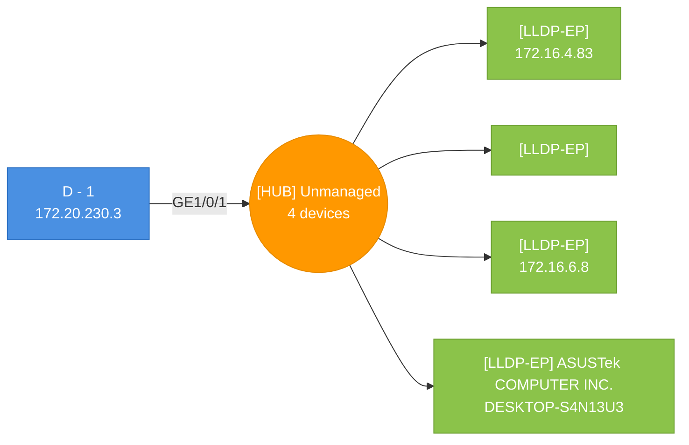
```mermaid
graph LR
  hub_4caea3275faa_p1(("[HUB] Unmanaged<br>4 devices"))
  4caea3275faa["D - 1<br>172.20.230.3"]
  4caea3275faa-- "GE1/0/1" -->hub_4caea3275faa_p1
  style 4caea3275faa fill:#4A90E2,stroke:#2A6FC2,color:#fff
  00e2694ca5da["[LLDP-EP]<br>172.16.4.83"]
  hub_4caea3275faa_p1-->00e2694ca5da
  style 00e2694ca5da fill:#8BC34A,stroke:#6B9F30,color:#fff
  00e2694ca73d["[LLDP-EP]"]
  hub_4caea3275faa_p1-->00e2694ca73d
  style 00e2694ca73d fill:#8BC34A,stroke:#6B9F30,color:#fff
  00e2694ca808["[LLDP-EP]<br>172.16.6.8"]
  hub_4caea3275faa_p1-->00e2694ca808
  style 00e2694ca808 fill:#8BC34A,stroke:#6B9F30,color:#fff
  60cf847140b1["[LLDP-EP] ASUSTek COMPUTER INC.<br>DESKTOP-S4N13U3"]
  hub_4caea3275faa_p1-->60cf847140b1
  style 60cf847140b1 fill:#8BC34A,stroke:#6B9F30,color:#fff
  style hub_4caea3275faa_p1 fill:#FF9800,stroke:#E68A00,color:#fff
```

**Ulanganlar:** 4 ta qurilma

### Shadow IT #2: [HUB] Unmanaged
8 devices

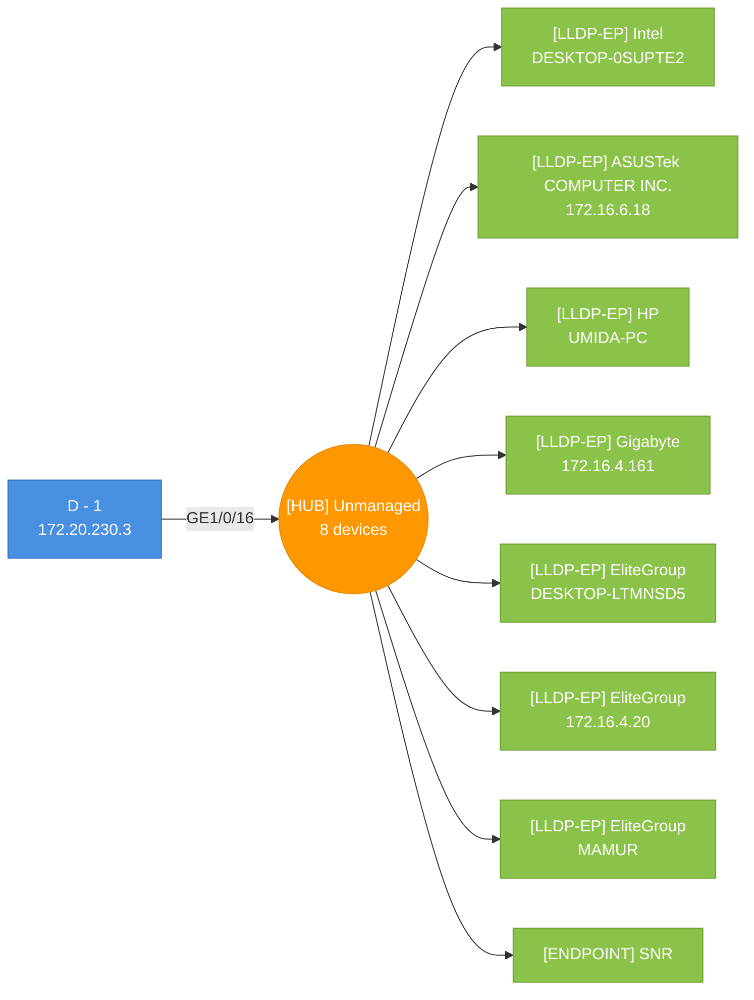
```mermaid
graph LR
  hub_4caea3275faa_p16(("[HUB] Unmanaged<br>8 devices"))
  4caea3275faa["D - 1<br>172.20.230.3"]
  4caea3275faa-- "GE1/0/16" -->hub_4caea3275faa_p16
  style 4caea3275faa fill:#4A90E2,stroke:#2A6FC2,color:#fff
  00cfe05b06e1["[LLDP-EP] Intel<br>DESKTOP-0SUPTE2"]
  hub_4caea3275faa_p16-->00cfe05b06e1
  style 00cfe05b06e1 fill:#8BC34A,stroke:#6B9F30,color:#fff
  581122d56ac6["[LLDP-EP] ASUSTek COMPUTER INC.<br>172.16.6.18"]
  hub_4caea3275faa_p16-->581122d56ac6
  style 581122d56ac6 fill:#8BC34A,stroke:#6B9F30,color:#fff
  84699354fd43["[LLDP-EP] HP<br>UMIDA-PC"]
  hub_4caea3275faa_p16-->84699354fd43
  style 84699354fd43 fill:#8BC34A,stroke:#6B9F30,color:#fff
  e0d55ef6f1bd["[LLDP-EP] Gigabyte<br>172.16.4.161"]
  hub_4caea3275faa_p16-->e0d55ef6f1bd
  style e0d55ef6f1bd fill:#8BC34A,stroke:#6B9F30,color:#fff
  f44d30c7f476["[LLDP-EP] EliteGroup<br>DESKTOP-LTMNSD5"]
  hub_4caea3275faa_p16-->f44d30c7f476
  style f44d30c7f476 fill:#8BC34A,stroke:#6B9F30,color:#fff
  f44d30c7f661["[LLDP-EP] EliteGroup<br>172.16.4.20"]
  hub_4caea3275faa_p16-->f44d30c7f661
  style f44d30c7f661 fill:#8BC34A,stroke:#6B9F30,color:#fff
  f44d30c7f9ba["[LLDP-EP] EliteGroup<br>MAMUR"]
  hub_4caea3275faa_p16-->f44d30c7f9ba
  style f44d30c7f9ba fill:#8BC34A,stroke:#6B9F30,color:#fff
  f8f082d87440["[ENDPOINT] SNR"]
  hub_4caea3275faa_p16-->f8f082d87440
  style f8f082d87440 fill:#8BC34A,stroke:#6B9F30,color:#fff
  style hub_4caea3275faa_p16 fill:#FF9800,stroke:#E68A00,color:#fff
```

**Ulanganlar:** 8 ta qurilma

### Shadow IT #3: [HUB] Unmanaged
6 devices

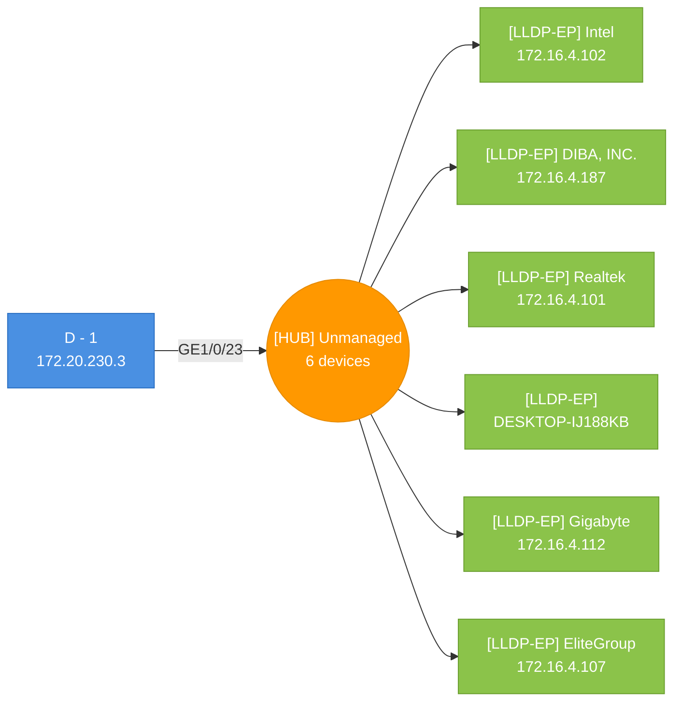
```mermaid
graph LR
  hub_4caea3275faa_p23(("[HUB] Unmanaged<br>6 devices"))
  4caea3275faa["D - 1<br>172.20.230.3"]
  4caea3275faa-- "GE1/0/23" -->hub_4caea3275faa_p23
  style 4caea3275faa fill:#4A90E2,stroke:#2A6FC2,color:#fff
  00cfe05b06d8["[LLDP-EP] Intel<br>172.16.4.102"]
  hub_4caea3275faa_p23-->00cfe05b06d8
  style 00cfe05b06d8 fill:#8BC34A,stroke:#6B9F30,color:#fff
  00e00aef0353["[LLDP-EP] DIBA, INC.<br>172.16.4.187"]
  hub_4caea3275faa_p23-->00e00aef0353
  style 00e00aef0353 fill:#8BC34A,stroke:#6B9F30,color:#fff
  00e04c7fc5c1["[LLDP-EP] Realtek<br>172.16.4.101"]
  hub_4caea3275faa_p23-->00e04c7fc5c1
  style 00e04c7fc5c1 fill:#8BC34A,stroke:#6B9F30,color:#fff
  00e269537e55["[LLDP-EP]<br>DESKTOP-IJ188KB"]
  hub_4caea3275faa_p23-->00e269537e55
  style 00e269537e55 fill:#8BC34A,stroke:#6B9F30,color:#fff
  18c04d5ee095["[LLDP-EP] Gigabyte<br>172.16.4.112"]
  hub_4caea3275faa_p23-->18c04d5ee095
  style 18c04d5ee095 fill:#8BC34A,stroke:#6B9F30,color:#fff
  94c6913b29a1["[LLDP-EP] EliteGroup<br>172.16.4.107"]
  hub_4caea3275faa_p23-->94c6913b29a1
  style 94c6913b29a1 fill:#8BC34A,stroke:#6B9F30,color:#fff
  style hub_4caea3275faa_p23 fill:#FF9800,stroke:#E68A00,color:#fff
```

**Ulanganlar:** 6 ta qurilma

### Shadow IT #4: [HUB] Unmanaged
2 devices

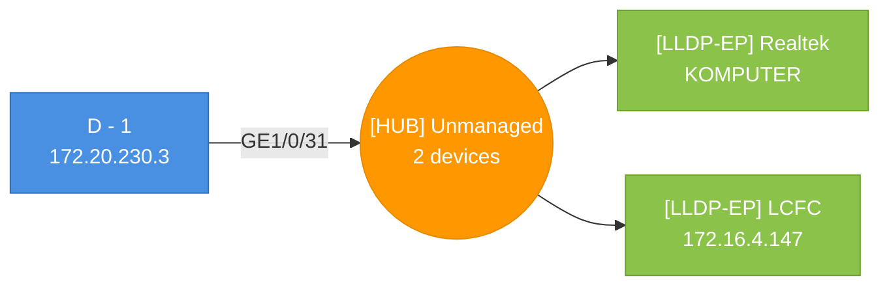
```mermaid
graph LR
  hub_4caea3275faa_p31(("[HUB] Unmanaged<br>2 devices"))
  4caea3275faa["D - 1<br>172.20.230.3"]
  4caea3275faa-- "GE1/0/31" -->hub_4caea3275faa_p31
  style 4caea3275faa fill:#4A90E2,stroke:#2A6FC2,color:#fff
  00e04c363757["[LLDP-EP] Realtek<br>KOMPUTER"]
  hub_4caea3275faa_p31-->00e04c363757
  style 00e04c363757 fill:#8BC34A,stroke:#6B9F30,color:#fff
  902e16d43d60["[LLDP-EP] LCFC<br>172.16.4.147"]
  hub_4caea3275faa_p31-->902e16d43d60
  style 902e16d43d60 fill:#8BC34A,stroke:#6B9F30,color:#fff
  style hub_4caea3275faa_p31 fill:#FF9800,stroke:#E68A00,color:#fff
```

**Ulanganlar:** 2 ta qurilma

### Shadow IT #5: [HUB] Unmanaged
5 devices

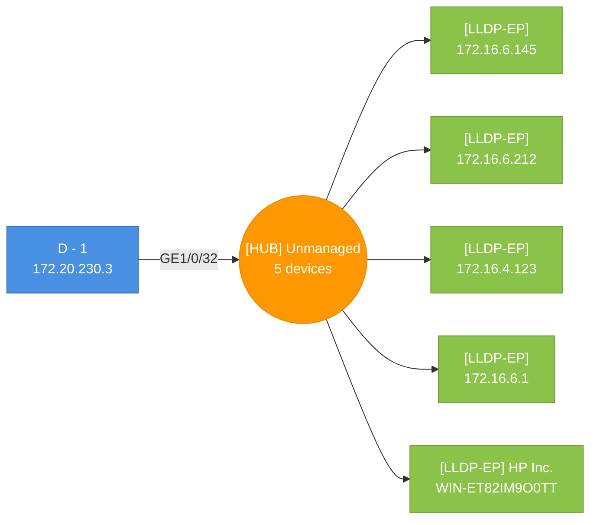
```mermaid
graph LR
  hub_4caea3275faa_p32(("[HUB] Unmanaged<br>5 devices"))
  4caea3275faa["D - 1<br>172.20.230.3"]
  4caea3275faa-- "GE1/0/32" -->hub_4caea3275faa_p32
  style 4caea3275faa fill:#4A90E2,stroke:#2A6FC2,color:#fff
  00e26953ed92["[LLDP-EP]<br>172.16.6.145"]
  hub_4caea3275faa_p32-->00e26953ed92
  style 00e26953ed92 fill:#8BC34A,stroke:#6B9F30,color:#fff
  00e26953ef84["[LLDP-EP]<br>172.16.6.212"]
  hub_4caea3275faa_p32-->00e26953ef84
  style 00e26953ef84 fill:#8BC34A,stroke:#6B9F30,color:#fff
  00e269551152["[LLDP-EP]<br>172.16.4.123"]
  hub_4caea3275faa_p32-->00e269551152
  style 00e269551152 fill:#8BC34A,stroke:#6B9F30,color:#fff
  48f3170760fd["[LLDP-EP]<br>172.16.6.1"]
  hub_4caea3275faa_p32-->48f3170760fd
  style 48f3170760fd fill:#8BC34A,stroke:#6B9F30,color:#fff
  acf4662ab12a["[LLDP-EP] HP Inc.<br>WIN-ET82IM9O0TT"]
  hub_4caea3275faa_p32-->acf4662ab12a
  style acf4662ab12a fill:#8BC34A,stroke:#6B9F30,color:#fff
  style hub_4caea3275faa_p32 fill:#FF9800,stroke:#E68A00,color:#fff
```

**Ulanganlar:** 5 ta qurilma

### Shadow IT #6: [HUB] Unmanaged
2 devices

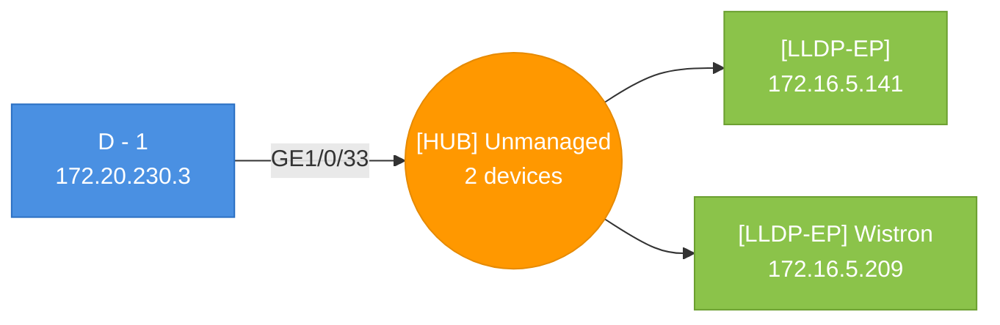
```mermaid
graph LR
  hub_4caea3275faa_p33(("[HUB] Unmanaged<br>2 devices"))
  4caea3275faa["D - 1<br>172.20.230.3"]
  4caea3275faa-- "GE1/0/33" -->hub_4caea3275faa_p33
  style 4caea3275faa fill:#4A90E2,stroke:#2A6FC2,color:#fff
  48f3170755e9["[LLDP-EP]<br>172.16.5.141"]
  hub_4caea3275faa_p33-->48f3170755e9
  style 48f3170755e9 fill:#8BC34A,stroke:#6B9F30,color:#fff
  98eecbe08974["[LLDP-EP] Wistron<br>172.16.5.209"]
  hub_4caea3275faa_p33-->98eecbe08974
  style 98eecbe08974 fill:#8BC34A,stroke:#6B9F30,color:#fff
  style hub_4caea3275faa_p33 fill:#FF9800,stroke:#E68A00,color:#fff
```

**Ulanganlar:** 2 ta qurilma

### Shadow IT #7: [HUB] Unmanaged
6 devices

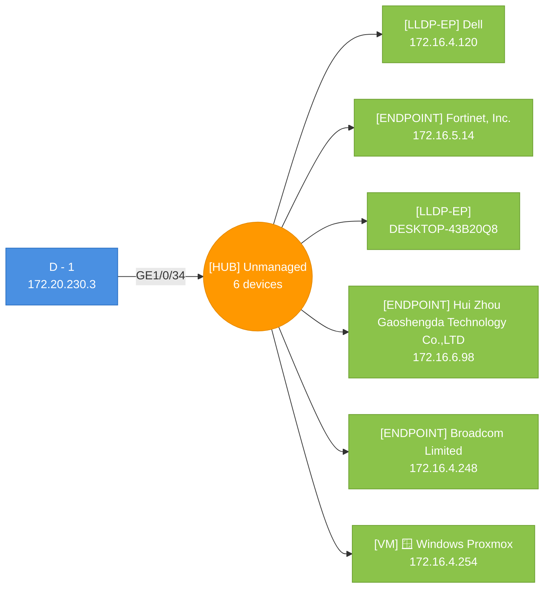
```mermaid
graph LR
  hub_4caea3275faa_p34(("[HUB] Unmanaged<br>6 devices"))
  4caea3275faa["D - 1<br>172.20.230.3"]
  4caea3275faa-- "GE1/0/34" -->hub_4caea3275faa_p34
  style 4caea3275faa fill:#4A90E2,stroke:#2A6FC2,color:#fff
  004e01c0a6b7["[LLDP-EP] Dell<br>172.16.4.120"]
  hub_4caea3275faa_p34-->004e01c0a6b7
  style 004e01c0a6b7 fill:#8BC34A,stroke:#6B9F30,color:#fff
  04d59067b5a0["[ENDPOINT] Fortinet, Inc.<br>172.16.5.14"]
  hub_4caea3275faa_p34-->04d59067b5a0
  style 04d59067b5a0 fill:#8BC34A,stroke:#6B9F30,color:#fff
  4c4bf9540095["[LLDP-EP]<br>DESKTOP-43B20Q8"]
  hub_4caea3275faa_p34-->4c4bf9540095
  style 4c4bf9540095 fill:#8BC34A,stroke:#6B9F30,color:#fff
  84c8a01f53b2["[ENDPOINT] Hui Zhou Gaoshengda Technology Co.,LTD<br>172.16.6.98"]
  hub_4caea3275faa_p34-->84c8a01f53b2
  style 84c8a01f53b2 fill:#8BC34A,stroke:#6B9F30,color:#fff
  b02628ff59a1["[ENDPOINT] Broadcom Limited<br>172.16.4.248"]
  hub_4caea3275faa_p34-->b02628ff59a1
  style b02628ff59a1 fill:#8BC34A,stroke:#6B9F30,color:#fff
  bc24116ce497["[VM] 🪟 Windows Proxmox<br>172.16.4.254"]
  hub_4caea3275faa_p34-->bc24116ce497
  style bc24116ce497 fill:#8BC34A,stroke:#6B9F30,color:#fff
  style hub_4caea3275faa_p34 fill:#FF9800,stroke:#E68A00,color:#fff
```

**Ulanganlar:** 6 ta qurilma

### Shadow IT #8: [HUB] Unmanaged
5 devices

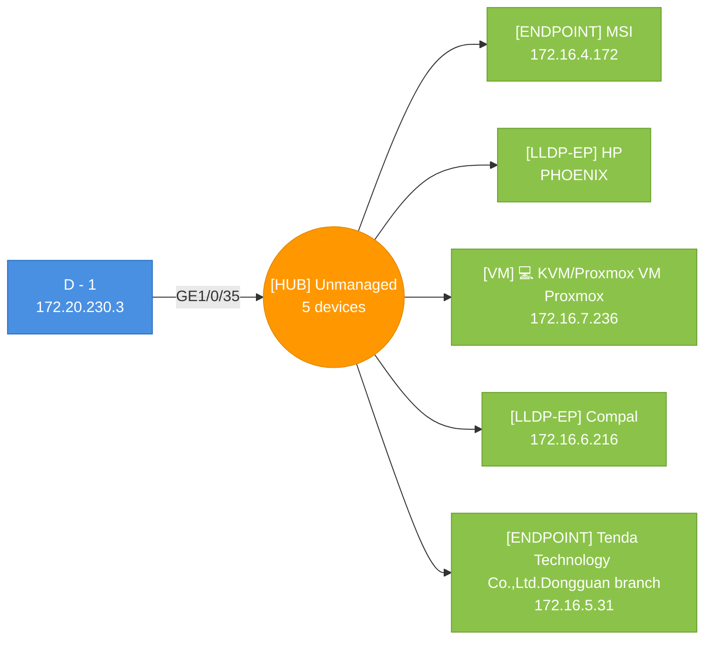
```mermaid
graph LR
  hub_4caea3275faa_p35(("[HUB] Unmanaged<br>5 devices"))
  4caea3275faa["D - 1<br>172.20.230.3"]
  4caea3275faa-- "GE1/0/35" -->hub_4caea3275faa_p35
  style 4caea3275faa fill:#4A90E2,stroke:#2A6FC2,color:#fff
  00d861b4bf5a["[ENDPOINT] MSI<br>172.16.4.172"]
  hub_4caea3275faa_p35-->00d861b4bf5a
  style 00d861b4bf5a fill:#8BC34A,stroke:#6B9F30,color:#fff
  84699355501a["[LLDP-EP] HP<br>PHOENIX"]
  hub_4caea3275faa_p35-->84699355501a
  style 84699355501a fill:#8BC34A,stroke:#6B9F30,color:#fff
  bc2411c67cc5["[VM] 💻 KVM/Proxmox VM Proxmox<br>172.16.7.236"]
  hub_4caea3275faa_p35-->bc2411c67cc5
  style bc2411c67cc5 fill:#8BC34A,stroke:#6B9F30,color:#fff
  bceca036098f["[LLDP-EP] Compal<br>172.16.6.216"]
  hub_4caea3275faa_p35-->bceca036098f
  style bceca036098f fill:#8BC34A,stroke:#6B9F30,color:#fff
  e865d47fabb9["[ENDPOINT] Tenda Technology Co.,Ltd.Dongguan branch<br>172.16.5.31"]
  hub_4caea3275faa_p35-->e865d47fabb9
  style e865d47fabb9 fill:#8BC34A,stroke:#6B9F30,color:#fff
  style hub_4caea3275faa_p35 fill:#FF9800,stroke:#E68A00,color:#fff
```

**Ulanganlar:** 5 ta qurilma

### Shadow IT #9: [HUB] Unmanaged
7 devices

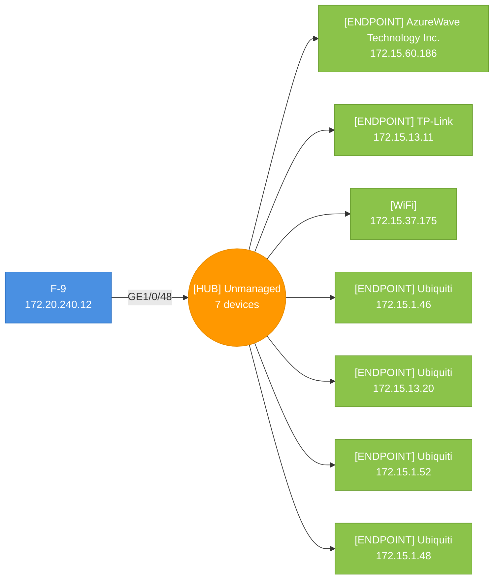
```mermaid
graph LR
  hub_4caea327768a_p48(("[HUB] Unmanaged<br>7 devices"))
  4caea327768a["F-9<br>172.20.240.12"]
  4caea327768a-- "GE1/0/48" -->hub_4caea327768a_p48
  style 4caea327768a fill:#4A90E2,stroke:#2A6FC2,color:#fff
  1068380a0779["[ENDPOINT] AzureWave Technology Inc.<br>172.15.60.186"]
  hub_4caea327768a_p48-->1068380a0779
  style 1068380a0779 fill:#8BC34A,stroke:#6B9F30,color:#fff
  54af9782f4c4["[ENDPOINT] TP-Link<br>172.15.13.11"]
  hub_4caea327768a_p48-->54af9782f4c4
  style 54af9782f4c4 fill:#8BC34A,stroke:#6B9F30,color:#fff
  563a98b65c1a["[WiFi]<br>172.15.37.175"]
  hub_4caea327768a_p48-->563a98b65c1a
  style 563a98b65c1a fill:#8BC34A,stroke:#6B9F30,color:#fff
  7845587c874f["[ENDPOINT] Ubiquiti<br>172.15.1.46"]
  hub_4caea327768a_p48-->7845587c874f
  style 7845587c874f fill:#8BC34A,stroke:#6B9F30,color:#fff
  7845587c87a0["[ENDPOINT] Ubiquiti<br>172.15.13.20"]
  hub_4caea327768a_p48-->7845587c87a0
  style 7845587c87a0 fill:#8BC34A,stroke:#6B9F30,color:#fff
  7845587c88e4["[ENDPOINT] Ubiquiti<br>172.15.1.52"]
  hub_4caea327768a_p48-->7845587c88e4
  style 7845587c88e4 fill:#8BC34A,stroke:#6B9F30,color:#fff
  7845587c8947["[ENDPOINT] Ubiquiti<br>172.15.1.48"]
  hub_4caea327768a_p48-->7845587c8947
  style 7845587c8947 fill:#8BC34A,stroke:#6B9F30,color:#fff
  style hub_4caea327768a_p48 fill:#FF9800,stroke:#E68A00,color:#fff
```

**Ulanganlar:** 7 ta qurilma

### Shadow IT #10: [HUB] Unmanaged
3 devices

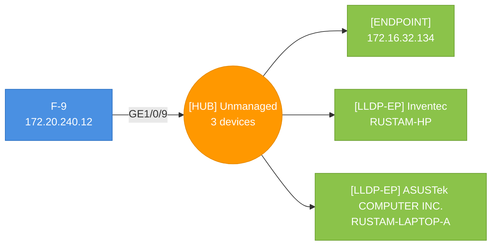
```mermaid
graph LR
  hub_4caea327768a_p9(("[HUB] Unmanaged<br>3 devices"))
  4caea327768a["F-9<br>172.20.240.12"]
  4caea327768a-- "GE1/0/9" -->hub_4caea327768a_p9
  style 4caea327768a fill:#4A90E2,stroke:#2A6FC2,color:#fff
  48f317077bbd["[ENDPOINT]<br>172.16.32.134"]
  hub_4caea327768a_p9-->48f317077bbd
  style 48f317077bbd fill:#8BC34A,stroke:#6B9F30,color:#fff
  64c901f5a32b["[LLDP-EP] Inventec<br>RUSTAM-HP"]
  hub_4caea327768a_p9-->64c901f5a32b
  style 64c901f5a32b fill:#8BC34A,stroke:#6B9F30,color:#fff
  704d7b3f5741["[LLDP-EP] ASUSTek COMPUTER INC.<br>RUSTAM-LAPTOP-A"]
  hub_4caea327768a_p9-->704d7b3f5741
  style 704d7b3f5741 fill:#8BC34A,stroke:#6B9F30,color:#fff
  style hub_4caea327768a_p9 fill:#FF9800,stroke:#E68A00,color:#fff
```

**Ulanganlar:** 3 ta qurilma

### Shadow IT #11: [HUB] Unmanaged
3 devices

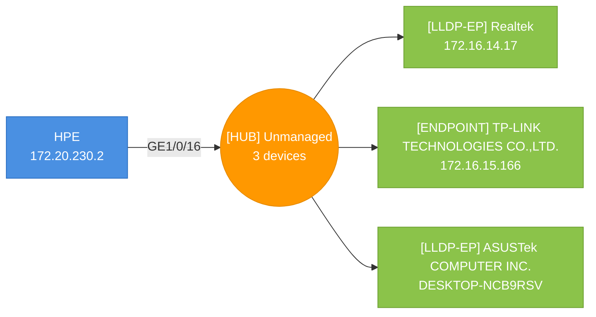
```mermaid
graph LR
  hub_4caea32784ca_p16(("[HUB] Unmanaged<br>3 devices"))
  4caea32784ca["HPE<br>172.20.230.2"]
  4caea32784ca-- "GE1/0/16" -->hub_4caea32784ca_p16
  style 4caea32784ca fill:#4A90E2,stroke:#2A6FC2,color:#fff
  00e04cf16eb7["[LLDP-EP] Realtek<br>172.16.14.17"]
  hub_4caea32784ca_p16-->00e04cf16eb7
  style 00e04cf16eb7 fill:#8BC34A,stroke:#6B9F30,color:#fff
  50d4f7662bd1["[ENDPOINT] TP-LINK TECHNOLOGIES CO.,LTD.<br>172.16.15.166"]
  hub_4caea32784ca_p16-->50d4f7662bd1
  style 50d4f7662bd1 fill:#8BC34A,stroke:#6B9F30,color:#fff
  a036bc266ee9["[LLDP-EP] ASUSTek COMPUTER INC.<br>DESKTOP-NCB9RSV"]
  hub_4caea32784ca_p16-->a036bc266ee9
  style a036bc266ee9 fill:#8BC34A,stroke:#6B9F30,color:#fff
  style hub_4caea32784ca_p16 fill:#FF9800,stroke:#E68A00,color:#fff
```

**Ulanganlar:** 3 ta qurilma

### Shadow IT #12: [HUB] Unmanaged
4 devices

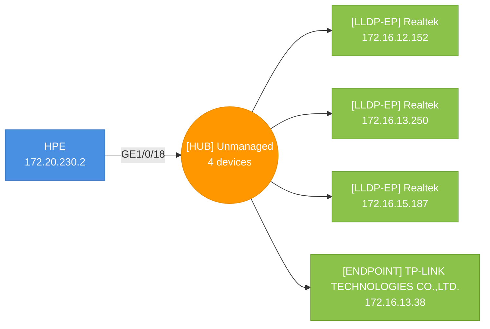
```mermaid
graph LR
  hub_4caea32784ca_p18(("[HUB] Unmanaged<br>4 devices"))
  4caea32784ca["HPE<br>172.20.230.2"]
  4caea32784ca-- "GE1/0/18" -->hub_4caea32784ca_p18
  style 4caea32784ca fill:#4A90E2,stroke:#2A6FC2,color:#fff
  00e04cf0e0b5["[LLDP-EP] Realtek<br>172.16.12.152"]
  hub_4caea32784ca_p18-->00e04cf0e0b5
  style 00e04cf0e0b5 fill:#8BC34A,stroke:#6B9F30,color:#fff
  00e04cf0e0f4["[LLDP-EP] Realtek<br>172.16.13.250"]
  hub_4caea32784ca_p18-->00e04cf0e0f4
  style 00e04cf0e0f4 fill:#8BC34A,stroke:#6B9F30,color:#fff
  00e04cf0e191["[LLDP-EP] Realtek<br>172.16.15.187"]
  hub_4caea32784ca_p18-->00e04cf0e191
  style 00e04cf0e191 fill:#8BC34A,stroke:#6B9F30,color:#fff
  50d4f7662efd["[ENDPOINT] TP-LINK TECHNOLOGIES CO.,LTD.<br>172.16.13.38"]
  hub_4caea32784ca_p18-->50d4f7662efd
  style 50d4f7662efd fill:#8BC34A,stroke:#6B9F30,color:#fff
  style hub_4caea32784ca_p18 fill:#FF9800,stroke:#E68A00,color:#fff
```

**Ulanganlar:** 4 ta qurilma

### Shadow IT #13: [HUB] Unmanaged
13 devices

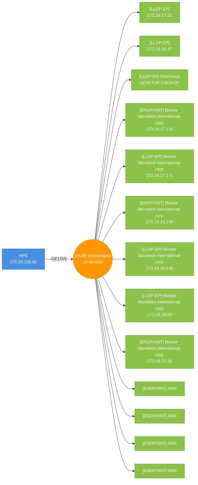
```mermaid
graph LR
  hub_4caea3278b8a_p6(("[HUB] Unmanaged<br>13 devices"))
  4caea3278b8a["HPE<br>172.20.230.82"]
  4caea3278b8a-- "GE1/0/6" -->hub_4caea3278b8a_p6
  style 4caea3278b8a fill:#4A90E2,stroke:#2A6FC2,color:#fff
  508d5cab45bc["[LLDP-EP]<br>172.16.17.22"]
  hub_4caea3278b8a_p6-->508d5cab45bc
  style 508d5cab45bc fill:#8BC34A,stroke:#6B9F30,color:#fff
  508d5cab50c1["[LLDP-EP]<br>172.16.16.47"]
  hub_4caea3278b8a_p6-->508d5cab50c1
  style 508d5cab50c1 fill:#8BC34A,stroke:#6B9F30,color:#fff
  f44d30c7f6f7["[LLDP-EP] EliteGroup<br>DESKTOP-14EAK3P"]
  hub_4caea3278b8a_p6-->f44d30c7f6f7
  style f44d30c7f6f7 fill:#8BC34A,stroke:#6B9F30,color:#fff
  f4b520077bb6["[ENDPOINT] Biostar Microtech international corp.<br>172.16.17.116"]
  hub_4caea3278b8a_p6-->f4b520077bb6
  style f4b520077bb6 fill:#8BC34A,stroke:#6B9F30,color:#fff
  f4b5201e88f2["[LLDP-EP] Biostar Microtech international corp.<br>172.16.17.171"]
  hub_4caea3278b8a_p6-->f4b5201e88f2
  style f4b5201e88f2 fill:#8BC34A,stroke:#6B9F30,color:#fff
  f4b5201f4d58["[ENDPOINT] Biostar Microtech international corp.<br>172.16.19.135"]
  hub_4caea3278b8a_p6-->f4b5201f4d58
  style f4b5201f4d58 fill:#8BC34A,stroke:#6B9F30,color:#fff
  f4b5201f5155["[LLDP-EP] Biostar Microtech international corp.<br>172.16.16.138"]
  hub_4caea3278b8a_p6-->f4b5201f5155
  style f4b5201f5155 fill:#8BC34A,stroke:#6B9F30,color:#fff
  f4b5201f5215["[LLDP-EP] Biostar Microtech international corp.<br>172.16.18.60"]
  hub_4caea3278b8a_p6-->f4b5201f5215
  style f4b5201f5215 fill:#8BC34A,stroke:#6B9F30,color:#fff
  f4b5201f53a2["[ENDPOINT] Biostar Microtech international corp.<br>172.16.17.16"]
  hub_4caea3278b8a_p6-->f4b5201f53a2
  style f4b5201f53a2 fill:#8BC34A,stroke:#6B9F30,color:#fff
  f8f0827975a5["[ENDPOINT] SNR"]
  hub_4caea3278b8a_p6-->f8f0827975a5
  style f8f0827975a5 fill:#8BC34A,stroke:#6B9F30,color:#fff
  f8f082797d97["[ENDPOINT] SNR"]
  hub_4caea3278b8a_p6-->f8f082797d97
  style f8f082797d97 fill:#8BC34A,stroke:#6B9F30,color:#fff
  f8f08279807f["[ENDPOINT] SNR"]
  hub_4caea3278b8a_p6-->f8f08279807f
  style f8f08279807f fill:#8BC34A,stroke:#6B9F30,color:#fff
  f8f082798981["[ENDPOINT] SNR"]
  hub_4caea3278b8a_p6-->f8f082798981
  style f8f082798981 fill:#8BC34A,stroke:#6B9F30,color:#fff
  style hub_4caea3278b8a_p6 fill:#FF9800,stroke:#E68A00,color:#fff
```

**Ulanganlar:** 13 ta qurilma

### Shadow IT #14: [HUB] Unmanaged
2 devices

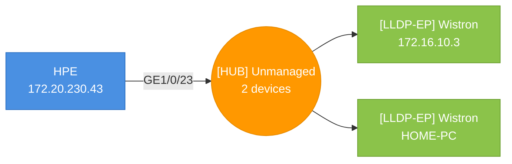
```mermaid
graph LR
  hub_4caea38db379_p23(("[HUB] Unmanaged<br>2 devices"))
  4caea38db379["HPE<br>172.20.230.43"]
  4caea38db379-- "GE1/0/23" -->hub_4caea38db379_p23
  style 4caea38db379 fill:#4A90E2,stroke:#2A6FC2,color:#fff
  98eecbe08989["[LLDP-EP] Wistron<br>172.16.10.3"]
  hub_4caea38db379_p23-->98eecbe08989
  style 98eecbe08989 fill:#8BC34A,stroke:#6B9F30,color:#fff
  98eecbe08bd9["[LLDP-EP] Wistron<br>HOME-PC"]
  hub_4caea38db379_p23-->98eecbe08bd9
  style 98eecbe08bd9 fill:#8BC34A,stroke:#6B9F30,color:#fff
  style hub_4caea38db379_p23 fill:#FF9800,stroke:#E68A00,color:#fff
```

**Ulanganlar:** 2 ta qurilma

### Shadow IT #15: [HUB] Unmanaged
3 devices

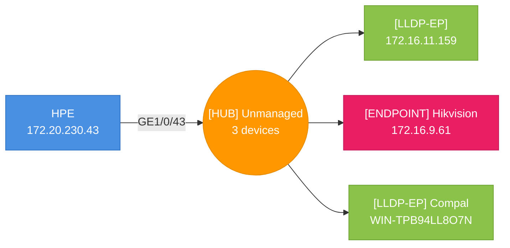
```mermaid
graph LR
  hub_4caea38db379_p43(("[HUB] Unmanaged<br>3 devices"))
  4caea38db379["HPE<br>172.20.230.43"]
  4caea38db379-- "GE1/0/43" -->hub_4caea38db379_p43
  style 4caea38db379 fill:#4A90E2,stroke:#2A6FC2,color:#fff
  042d3423d4d2["[LLDP-EP]<br>172.16.11.159"]
  hub_4caea38db379_p43-->042d3423d4d2
  style 042d3423d4d2 fill:#8BC34A,stroke:#6B9F30,color:#fff
  80beafc8a56b["[ENDPOINT] Hikvision<br>172.16.9.61"]
  hub_4caea38db379_p43-->80beafc8a56b
  style 80beafc8a56b fill:#E91E63,stroke:#C2185B,color:#fff
  e4a8df9ded04["[LLDP-EP] Compal<br>WIN-TPB94LL8O7N"]
  hub_4caea38db379_p43-->e4a8df9ded04
  style e4a8df9ded04 fill:#8BC34A,stroke:#6B9F30,color:#fff
  style hub_4caea38db379_p43 fill:#FF9800,stroke:#E68A00,color:#fff
```

**Ulanganlar:** 3 ta qurilma

### Shadow IT #16: [HUB] Unmanaged
3 devices

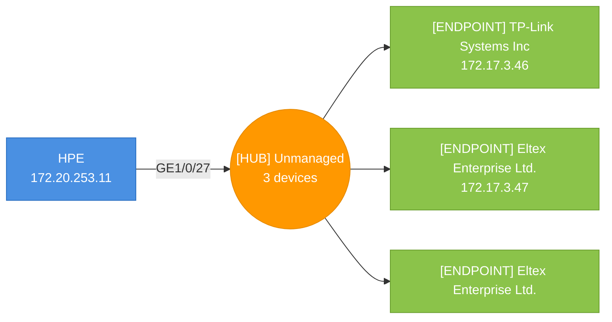
```mermaid
graph LR
  hub_4caea38dd599_p27(("[HUB] Unmanaged<br>3 devices"))
  4caea38dd599["HPE<br>172.20.253.11"]
  4caea38dd599-- "GE1/0/27" -->hub_4caea38dd599_p27
  style 4caea38dd599 fill:#4A90E2,stroke:#2A6FC2,color:#fff
  5091e396806f["[ENDPOINT] TP-Link Systems Inc<br>172.17.3.46"]
  hub_4caea38dd599_p27-->5091e396806f
  style 5091e396806f fill:#8BC34A,stroke:#6B9F30,color:#fff
  e45ad46b3a00["[ENDPOINT] Eltex Enterprise Ltd.<br>172.17.3.47"]
  hub_4caea38dd599_p27-->e45ad46b3a00
  style e45ad46b3a00 fill:#8BC34A,stroke:#6B9F30,color:#fff
  e45ad46b3a1b["[ENDPOINT] Eltex Enterprise Ltd."]
  hub_4caea38dd599_p27-->e45ad46b3a1b
  style e45ad46b3a1b fill:#8BC34A,stroke:#6B9F30,color:#fff
  style hub_4caea38dd599_p27 fill:#FF9800,stroke:#E68A00,color:#fff
```

**Ulanganlar:** 3 ta qurilma

### Shadow IT #17: [HUB] Unmanaged
5 devices

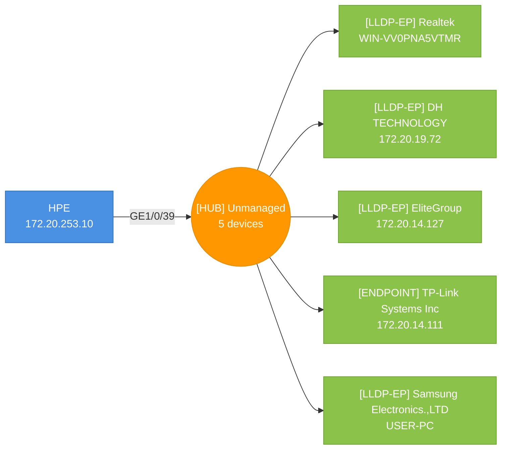
```mermaid
graph LR
  hub_4caea38de091_p39(("[HUB] Unmanaged<br>5 devices"))
  4caea38de091["HPE<br>172.20.253.10"]
  4caea38de091-- "GE1/0/39" -->hub_4caea38de091_p39
  style 4caea38de091 fill:#4A90E2,stroke:#2A6FC2,color:#fff
  00e04c50dcba["[LLDP-EP] Realtek<br>WIN-VV0PNA5VTMR"]
  hub_4caea38de091_p39-->00e04c50dcba
  style 00e04c50dcba fill:#8BC34A,stroke:#6B9F30,color:#fff
  00e070c19405["[LLDP-EP] DH TECHNOLOGY<br>172.20.19.72"]
  hub_4caea38de091_p39-->00e070c19405
  style 00e070c19405 fill:#8BC34A,stroke:#6B9F30,color:#fff
  94c6913ff83a["[LLDP-EP] EliteGroup<br>172.20.14.127"]
  hub_4caea38de091_p39-->94c6913ff83a
  style 94c6913ff83a fill:#8BC34A,stroke:#6B9F30,color:#fff
  9c53221a9c21["[ENDPOINT] TP-Link Systems Inc<br>172.20.14.111"]
  hub_4caea38de091_p39-->9c53221a9c21
  style 9c53221a9c21 fill:#8BC34A,stroke:#6B9F30,color:#fff
  c8418a220e38["[LLDP-EP] Samsung Electronics.,LTD<br>USER-PC"]
  hub_4caea38de091_p39-->c8418a220e38
  style c8418a220e38 fill:#8BC34A,stroke:#6B9F30,color:#fff
  style hub_4caea38de091_p39 fill:#FF9800,stroke:#E68A00,color:#fff
```

**Ulanganlar:** 5 ta qurilma

### Shadow IT #18: [HUB] Unmanaged
2 devices

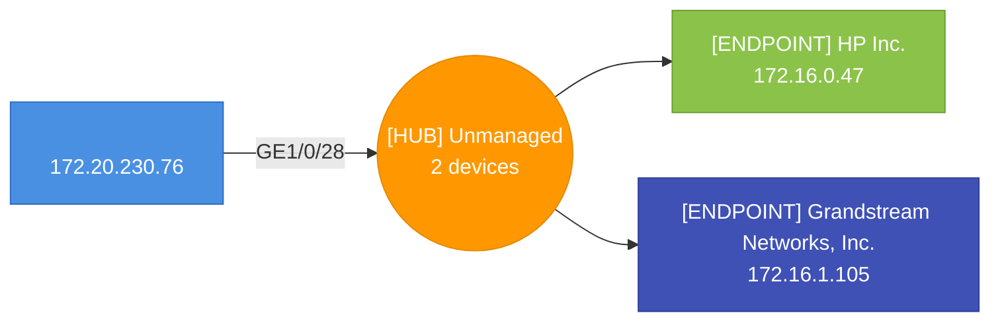
```mermaid
graph LR
  hub_4caea38decc1_p28(("[HUB] Unmanaged<br>2 devices"))
  4caea38decc1["<br>172.20.230.76"]
  4caea38decc1-- "GE1/0/28" -->hub_4caea38decc1_p28
  style 4caea38decc1 fill:#4A90E2,stroke:#2A6FC2,color:#fff
  c018035b6542["[ENDPOINT] HP Inc.<br>172.16.0.47"]
  hub_4caea38decc1_p28-->c018035b6542
  style c018035b6542 fill:#8BC34A,stroke:#6B9F30,color:#fff
  c074ad90018e["[ENDPOINT] Grandstream Networks, Inc.<br>172.16.1.105"]
  hub_4caea38decc1_p28-->c074ad90018e
  style c074ad90018e fill:#3F51B5,stroke:#303F9F,color:#fff
  style hub_4caea38decc1_p28 fill:#FF9800,stroke:#E68A00,color:#fff
```

**Ulanganlar:** 2 ta qurilma

### Shadow IT #19: [HUB] Unmanaged
2 devices

```mermaid
graph LR
  hub_4caea38decc1_p4(("[HUB] Unmanaged<br>2 devices"))
  4caea38decc1["<br>172.20.230.76"]
  4caea38decc1-- "GE1/0/4" -->hub_4caea38decc1_p4
  style 4caea38decc1 fill:#4A90E2,stroke:#2A6FC2,color:#fff
  902e169d3d37["[ENDPOINT] LCFC<br>172.16.0.57"]
  hub_4caea38decc1_p4-->902e169d3d37
  style 902e169d3d37 fill:#8BC34A,stroke:#6B9F30,color:#fff
  ec74d764cb9f["[ENDPOINT] Grandstream Networks Inc<br>172.16.2.189"]
  hub_4caea38decc1_p4-->ec74d764cb9f
  style ec74d764cb9f fill:#3F51B5,stroke:#303F9F,color:#fff
  style hub_4caea38decc1_p4 fill:#FF9800,stroke:#E68A00,color:#fff
```

**Ulanganlar:** 2 ta qurilma

### Shadow IT #20: [HUB] Unmanaged
5 devices

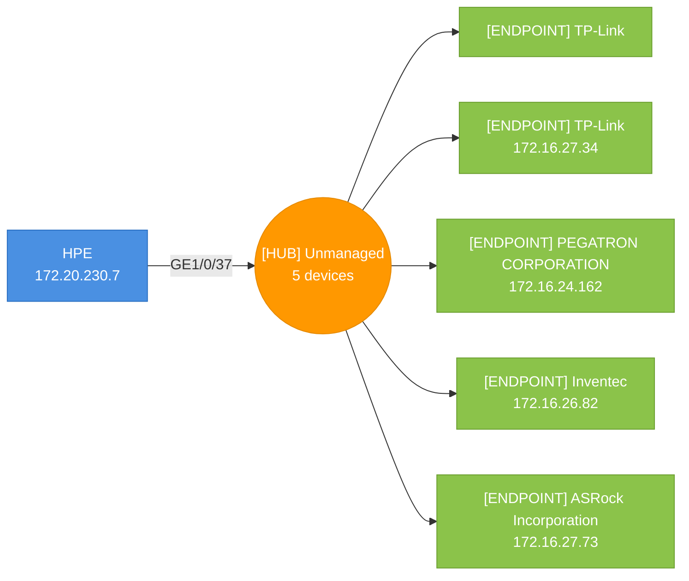
```mermaid
graph LR
  hub_4caea38e1909_p37(("[HUB] Unmanaged<br>5 devices"))
  4caea38e1909["HPE<br>172.20.230.7"]
  4caea38e1909-- "GE1/0/37" -->hub_4caea38e1909_p37
  style 4caea38e1909 fill:#4A90E2,stroke:#2A6FC2,color:#fff
  10feed5a195e["[ENDPOINT] TP-Link"]
  hub_4caea38e1909_p37-->10feed5a195e
  style 10feed5a195e fill:#8BC34A,stroke:#6B9F30,color:#fff
  10feed5a195f["[ENDPOINT] TP-Link<br>172.16.27.34"]
  hub_4caea38e1909_p37-->10feed5a195f
  style 10feed5a195f fill:#8BC34A,stroke:#6B9F30,color:#fff
  54b203712a46["[ENDPOINT] PEGATRON CORPORATION<br>172.16.24.162"]
  hub_4caea38e1909_p37-->54b203712a46
  style 54b203712a46 fill:#8BC34A,stroke:#6B9F30,color:#fff
  64c901f59176["[ENDPOINT] Inventec<br>172.16.26.82"]
  hub_4caea38e1909_p37-->64c901f59176
  style 64c901f59176 fill:#8BC34A,stroke:#6B9F30,color:#fff
  a8a159a0c9a3["[ENDPOINT] ASRock Incorporation<br>172.16.27.73"]
  hub_4caea38e1909_p37-->a8a159a0c9a3
  style a8a159a0c9a3 fill:#8BC34A,stroke:#6B9F30,color:#fff
  style hub_4caea38e1909_p37 fill:#FF9800,stroke:#E68A00,color:#fff
```

**Ulanganlar:** 5 ta qurilma

### Shadow IT #21: [HUB] Unmanaged
8 devices

```mermaid
graph LR
  hub_4caea3a201ac_p1(("[HUB] Unmanaged<br>8 devices"))
  4caea3a201ac["TTJ-3&4<br>172.20.230.23"]
  4caea3a201ac-- "GE1/0/1" -->hub_4caea3a201ac_p1
  style 4caea3a201ac fill:#4A90E2,stroke:#2A6FC2,color:#fff
  bc9b5e37bf19["[ENDPOINT] Hikvision"]
  hub_4caea3a201ac_p1-->bc9b5e37bf19
  style bc9b5e37bf19 fill:#E91E63,stroke:#C2185B,color:#fff
  bc9b5e37bf20["[ENDPOINT] Hikvision"]
  hub_4caea3a201ac_p1-->bc9b5e37bf20
  style bc9b5e37bf20 fill:#E91E63,stroke:#C2185B,color:#fff
  bc9b5e37bf22["[ENDPOINT] Hikvision"]
  hub_4caea3a201ac_p1-->bc9b5e37bf22
  style bc9b5e37bf22 fill:#E91E63,stroke:#C2185B,color:#fff
  bc9b5e37bf33["[ENDPOINT] Hikvision"]
  hub_4caea3a201ac_p1-->bc9b5e37bf33
  style bc9b5e37bf33 fill:#E91E63,stroke:#C2185B,color:#fff
  bc9b5e37bf3a["[ENDPOINT] Hikvision"]
  hub_4caea3a201ac_p1-->bc9b5e37bf3a
  style bc9b5e37bf3a fill:#E91E63,stroke:#C2185B,color:#fff
  bc9b5e37bf3b["[ENDPOINT] Hikvision"]
  hub_4caea3a201ac_p1-->bc9b5e37bf3b
  style bc9b5e37bf3b fill:#E91E63,stroke:#C2185B,color:#fff
  bc9b5e37bf49["[ENDPOINT] Hikvision"]
  hub_4caea3a201ac_p1-->bc9b5e37bf49
  style bc9b5e37bf49 fill:#E91E63,stroke:#C2185B,color:#fff
  bc9b5e37bf4b["[ENDPOINT] Hikvision"]
  hub_4caea3a201ac_p1-->bc9b5e37bf4b
  style bc9b5e37bf4b fill:#E91E63,stroke:#C2185B,color:#fff
  style hub_4caea3a201ac_p1 fill:#FF9800,stroke:#E68A00,color:#fff
```

**Ulanganlar:** 8 ta qurilma

### Shadow IT #22: [HUB] Unmanaged
2 devices

```mermaid
graph LR
  hub_4caea3a201ac_p8(("[HUB] Unmanaged<br>2 devices"))
  4caea3a201ac["TTJ-3&4<br>172.20.230.23"]
  4caea3a201ac-- "GE1/0/8" -->hub_4caea3a201ac_p8
  style 4caea3a201ac fill:#4A90E2,stroke:#2A6FC2,color:#fff
  00e269537bd1["[LLDP-EP]<br>172.16.32.194"]
  hub_4caea3a201ac_p8-->00e269537bd1
  style 00e269537bd1 fill:#8BC34A,stroke:#6B9F30,color:#fff
  345a608220fd["[LLDP-EP] Micro-Star INTL CO., LTD.<br>DESKTOP-YAMORI"]
  hub_4caea3a201ac_p8-->345a608220fd
  style 345a608220fd fill:#8BC34A,stroke:#6B9F30,color:#fff
  style hub_4caea3a201ac_p8 fill:#FF9800,stroke:#E68A00,color:#fff
```

**Ulanganlar:** 2 ta qurilma

### Shadow IT #23: [HUB] Unmanaged
2 devices

```mermaid
graph LR
  hub_4caea3a2032c_p17(("[HUB] Unmanaged<br>2 devices"))
  4caea3a2032c["B-423<br>172.20.230.15"]
  4caea3a2032c-- "GE1/0/17" -->hub_4caea3a2032c_p17
  style 4caea3a2032c fill:#4A90E2,stroke:#2A6FC2,color:#fff
  6c198fcfc8c3["[ENDPOINT] D-Link International<br>172.16.1.183"]
  hub_4caea3a2032c_p17-->6c198fcfc8c3
  style 6c198fcfc8c3 fill:#8BC34A,stroke:#6B9F30,color:#fff
  c8d3ffbb2890["[ENDPOINT] Hewlett Packard<br>172.16.1.135"]
  hub_4caea3a2032c_p17-->c8d3ffbb2890
  style c8d3ffbb2890 fill:#8BC34A,stroke:#6B9F30,color:#fff
  style hub_4caea3a2032c_p17 fill:#FF9800,stroke:#E68A00,color:#fff
```

**Ulanganlar:** 2 ta qurilma

### Shadow IT #24: [HUB] Unmanaged
4 devices

```mermaid
graph LR
  hub_4caea3a206ec_p21(("[HUB] Unmanaged<br>4 devices"))
  4caea3a206ec["A-332<br>172.20.230.8"]
  4caea3a206ec-- "GE1/0/21" -->hub_4caea3a206ec_p21
  style 4caea3a206ec fill:#4A90E2,stroke:#2A6FC2,color:#fff
  00e04cf16c7a["[LLDP-EP] Realtek<br>172.16.20.182"]
  hub_4caea3a206ec_p21-->00e04cf16c7a
  style 00e04cf16c7a fill:#8BC34A,stroke:#6B9F30,color:#fff
  48f3170756c8["[LLDP-EP]<br>172.16.23.163"]
  hub_4caea3a206ec_p21-->48f3170756c8
  style 48f3170756c8 fill:#8BC34A,stroke:#6B9F30,color:#fff
  9c53221aae78["[ENDPOINT] TP-Link Systems Inc<br>172.16.23.161"]
  hub_4caea3a206ec_p21-->9c53221aae78
  style 9c53221aae78 fill:#8BC34A,stroke:#6B9F30,color:#fff
  c0c9e3b7589d["[ENDPOINT] TP-LINK TECHNOLOGIES CO.,LTD.<br>172.16.21.167"]
  hub_4caea3a206ec_p21-->c0c9e3b7589d
  style c0c9e3b7589d fill:#8BC34A,stroke:#6B9F30,color:#fff
  style hub_4caea3a206ec_p21 fill:#FF9800,stroke:#E68A00,color:#fff
```

**Ulanganlar:** 4 ta qurilma

### Shadow IT #25: [HUB] Unmanaged
12 devices

```mermaid
graph LR
  hub_4caea3a209ec_p45(("[HUB] Unmanaged<br>12 devices"))
  4caea3a209ec["C 424/a<br>172.20.230.4"]
  4caea3a209ec-- "GE1/0/45" -->hub_4caea3a209ec_p45
  style 4caea3a209ec fill:#4A90E2,stroke:#2A6FC2,color:#fff
  004e35cb3c1a["[LLDP-EP] HP Aruba<br>ArubaOS (MODEL: 207), Version Aruba IAP"]
  hub_4caea3a209ec_p45-->004e35cb3c1a
  style 004e35cb3c1a fill:#8BC34A,stroke:#6B9F30,color:#fff
  004e35cb44a2["[LLDP-EP] HP Aruba<br>ArubaOS (MODEL: 207), Version Aruba IAP"]
  hub_4caea3a209ec_p45-->004e35cb44a2
  style 004e35cb44a2 fill:#8BC34A,stroke:#6B9F30,color:#fff
  004e35cb4c12["[LLDP-EP] HP Aruba<br>ArubaOS (MODEL: 207), Version Aruba IAP"]
  hub_4caea3a209ec_p45-->004e35cb4c12
  style 004e35cb4c12 fill:#8BC34A,stroke:#6B9F30,color:#fff
  00e04cf0e125["[LLDP-EP] Realtek<br>172.16.19.24"]
  hub_4caea3a209ec_p45-->00e04cf0e125
  style 00e04cf0e125 fill:#8BC34A,stroke:#6B9F30,color:#fff
  00e04cf17080["[LLDP-EP] Realtek<br>172.16.19.121"]
  hub_4caea3a209ec_p45-->00e04cf17080
  style 00e04cf17080 fill:#8BC34A,stroke:#6B9F30,color:#fff
  345a607d0c1e["[LLDP-EP] Micro-Star INTL CO., LTD.<br>MUSLIMBEK"]
  hub_4caea3a209ec_p45-->345a607d0c1e
  style 345a607d0c1e fill:#8BC34A,stroke:#6B9F30,color:#fff
  64c901f4d565["[LLDP-EP] Inventec<br>172.16.17.196"]
  hub_4caea3a209ec_p45-->64c901f4d565
  style 64c901f4d565 fill:#8BC34A,stroke:#6B9F30,color:#fff
  74bfc0dc21ff["[ENDPOINT] CANON INC.<br>172.16.19.151"]
  hub_4caea3a209ec_p45-->74bfc0dc21ff
  style 74bfc0dc21ff fill:#8BC34A,stroke:#6B9F30,color:#fff
  f44d30c7f4bc["[LLDP-EP] EliteGroup<br>MANAVIYAT"]
  hub_4caea3a209ec_p45-->f44d30c7f4bc
  style f44d30c7f4bc fill:#8BC34A,stroke:#6B9F30,color:#fff
  f44d30c7f6a0["[LLDP-EP] EliteGroup<br>ADMIN"]
  hub_4caea3a209ec_p45-->f44d30c7f6a0
  style f44d30c7f6a0 fill:#8BC34A,stroke:#6B9F30,color:#fff
  f44d30c7f97f["[LLDP-EP] EliteGroup<br>172.16.16.46"]
  hub_4caea3a209ec_p45-->f44d30c7f97f
  style f44d30c7f97f fill:#8BC34A,stroke:#6B9F30,color:#fff
  f44d30c7fb9f["[LLDP-EP] EliteGroup<br>172.16.18.218"]
  hub_4caea3a209ec_p45-->f44d30c7fb9f
  style f44d30c7fb9f fill:#8BC34A,stroke:#6B9F30,color:#fff
  style hub_4caea3a209ec_p45 fill:#FF9800,stroke:#E68A00,color:#fff
```

**Ulanganlar:** 12 ta qurilma

### Shadow IT #26: [HUB] Unmanaged
2 devices

```mermaid
graph LR
  hub_4caea3a20d4c_p39(("[HUB] Unmanaged<br>2 devices"))
  4caea3a20d4c["HPE<br>172.20.230.35"]
  4caea3a20d4c-- "GE1/0/39" -->hub_4caea3a20d4c_p39
  style 4caea3a20d4c fill:#4A90E2,stroke:#2A6FC2,color:#fff
  00e04cf04fb4["[ENDPOINT] Realtek<br>172.16.18.178"]
  hub_4caea3a20d4c_p39-->00e04cf04fb4
  style 00e04cf04fb4 fill:#8BC34A,stroke:#6B9F30,color:#fff
  a8294859b3c3["[ENDPOINT] TP-Link Systems Inc."]
  hub_4caea3a20d4c_p39-->a8294859b3c3
  style a8294859b3c3 fill:#8BC34A,stroke:#6B9F30,color:#fff
  style hub_4caea3a20d4c_p39 fill:#FF9800,stroke:#E68A00,color:#fff
```

**Ulanganlar:** 2 ta qurilma

### Shadow IT #27: [HUB] Unmanaged
4 devices

```mermaid
graph LR
  hub_4caea3a212ec_p37(("[HUB] Unmanaged<br>4 devices"))
  4caea3a212ec["A RRT Kalidor<br>172.20.230.42"]
  4caea3a212ec-- "GE1/0/37" -->hub_4caea3a212ec_p37
  style 4caea3a212ec fill:#4A90E2,stroke:#2A6FC2,color:#fff
  28c5c818ebc8["[ENDPOINT] HP Inc.<br>172.16.25.7"]
  hub_4caea3a212ec_p37-->28c5c818ebc8
  style 28c5c818ebc8 fill:#8BC34A,stroke:#6B9F30,color:#fff
  98eecbe089ea["[LLDP-EP] Wistron<br>WIN-OBHRCJOVNO0"]
  hub_4caea3a212ec_p37-->98eecbe089ea
  style 98eecbe089ea fill:#8BC34A,stroke:#6B9F30,color:#fff
  98eecbe08c07["[LLDP-EP] Wistron<br>172.16.27.156"]
  hub_4caea3a212ec_p37-->98eecbe08c07
  style 98eecbe08c07 fill:#8BC34A,stroke:#6B9F30,color:#fff
  f44d30c7f5f6["[LLDP-EP] EliteGroup<br>172.16.24.68"]
  hub_4caea3a212ec_p37-->f44d30c7f5f6
  style f44d30c7f5f6 fill:#8BC34A,stroke:#6B9F30,color:#fff
  style hub_4caea3a212ec_p37 fill:#FF9800,stroke:#E68A00,color:#fff
```

**Ulanganlar:** 4 ta qurilma

### Shadow IT #28: [HUB] Unmanaged
5 devices

```mermaid
graph LR
  hub_4caea3a2134c_p37(("[HUB] Unmanaged<br>5 devices"))
  4caea3a2134c["HPE<br>172.20.230.41"]
  4caea3a2134c-- "GE1/0/37" -->hub_4caea3a2134c_p37
  style 4caea3a2134c fill:#4A90E2,stroke:#2A6FC2,color:#fff
  00e04c7c8766["[LLDP-EP] Realtek<br>172.16.19.230"]
  hub_4caea3a2134c_p37-->00e04c7c8766
  style 00e04c7c8766 fill:#8BC34A,stroke:#6B9F30,color:#fff
  5c60ba65fe5f["[LLDP-EP] HP Inc.<br>WIN-7O9L6O4NMS5"]
  hub_4caea3a2134c_p37-->5c60ba65fe5f
  style 5c60ba65fe5f fill:#8BC34A,stroke:#6B9F30,color:#fff
  98eecbe089c4["[LLDP-EP] Wistron<br>172.16.17.227"]
  hub_4caea3a2134c_p37-->98eecbe089c4
  style 98eecbe089c4 fill:#8BC34A,stroke:#6B9F30,color:#fff
  98eecbe08aaa["[LLDP-EP] Wistron<br>172.16.17.173"]
  hub_4caea3a2134c_p37-->98eecbe08aaa
  style 98eecbe08aaa fill:#8BC34A,stroke:#6B9F30,color:#fff
  c04a00f571e9["[ENDPOINT] TP-LINK TECHNOLOGIES CO.,LTD.<br>172.16.19.161"]
  hub_4caea3a2134c_p37-->c04a00f571e9
  style c04a00f571e9 fill:#8BC34A,stroke:#6B9F30,color:#fff
  style hub_4caea3a2134c_p37 fill:#FF9800,stroke:#E68A00,color:#fff
```

**Ulanganlar:** 5 ta qurilma

### Shadow IT #29: [HUB] Unmanaged
19 devices

```mermaid
graph LR
  hub_4caea3a215ec_p1(("[HUB] Unmanaged<br>19 devices"))
  4caea3a215ec["D 1-2<br>172.20.230.48"]
  4caea3a215ec-- "GE1/0/1" -->hub_4caea3a215ec_p1
  style 4caea3a215ec fill:#4A90E2,stroke:#2A6FC2,color:#fff
  00238155bcd0["[LLDP-EP] Lengda<br>DESKTOP-1OT35GQ"]
  hub_4caea3a215ec_p1-->00238155bcd0
  style 00238155bcd0 fill:#8BC34A,stroke:#6B9F30,color:#fff
  00238155bcdc["[LLDP-EP] Lengda<br>DESKTOP-KQC5GE0"]
  hub_4caea3a215ec_p1-->00238155bcdc
  style 00238155bcdc fill:#8BC34A,stroke:#6B9F30,color:#fff
  00238155bcec["[LLDP-EP] Lengda<br>DESKTOP-9H5C4R7"]
  hub_4caea3a215ec_p1-->00238155bcec
  style 00238155bcec fill:#8BC34A,stroke:#6B9F30,color:#fff
  00e04c701c0c["[LLDP-EP] Realtek<br>172.16.4.182"]
  hub_4caea3a215ec_p1-->00e04c701c0c
  style 00e04c701c0c fill:#8BC34A,stroke:#6B9F30,color:#fff
  10bbf363f638["[LLDP-EP] HUNAN FN-LINK TECHNOLOGY LIMITED<br>WIN-M19JTQAQGG4"]
  hub_4caea3a215ec_p1-->10bbf363f638
  style 10bbf363f638 fill:#8BC34A,stroke:#6B9F30,color:#fff
  28c5c85f54fe["[LLDP-EP] HP Inc.<br>WIN-2J0LU3AK4N6"]
  hub_4caea3a215ec_p1-->28c5c85f54fe
  style 28c5c85f54fe fill:#8BC34A,stroke:#6B9F30,color:#fff
  4c4bf953d863["[LLDP-EP]<br>DESKTOP-74A8Q2C"]
  hub_4caea3a215ec_p1-->4c4bf953d863
  style 4c4bf953d863 fill:#8BC34A,stroke:#6B9F30,color:#fff
  d0ad08f08a88["[LLDP-EP] HP Inc.<br>DESKTOP-20ENET9"]
  hub_4caea3a215ec_p1-->d0ad08f08a88
  style d0ad08f08a88 fill:#8BC34A,stroke:#6B9F30,color:#fff
  d461370381dd["[LLDP-EP]<br>172.16.4.255"]
  hub_4caea3a215ec_p1-->d461370381dd
  style d461370381dd fill:#8BC34A,stroke:#6B9F30,color:#fff
  d461370381e0["[LLDP-EP]<br>172.16.4.212"]
  hub_4caea3a215ec_p1-->d461370381e0
  style d461370381e0 fill:#8BC34A,stroke:#6B9F30,color:#fff
  d46137038254["[LLDP-EP]<br>172.16.6.122"]
  hub_4caea3a215ec_p1-->d46137038254
  style d46137038254 fill:#8BC34A,stroke:#6B9F30,color:#fff
  d4613703826c["[LLDP-EP]<br>172.16.6.78"]
  hub_4caea3a215ec_p1-->d4613703826c
  style d4613703826c fill:#8BC34A,stroke:#6B9F30,color:#fff
  d4613703826d["[LLDP-EP]<br>172.16.5.193"]
  hub_4caea3a215ec_p1-->d4613703826d
  style d4613703826d fill:#8BC34A,stroke:#6B9F30,color:#fff
  e073e7c3cd44["[LLDP-EP] HP Inc.<br>DESKTOP-VGINIPN"]
  hub_4caea3a215ec_p1-->e073e7c3cd44
  style e073e7c3cd44 fill:#8BC34A,stroke:#6B9F30,color:#fff
  e073e7c3ce13["[LLDP-EP] HP Inc.<br>DESKTOP-IMLRFQR"]
  hub_4caea3a215ec_p1-->e073e7c3ce13
  style e073e7c3ce13 fill:#8BC34A,stroke:#6B9F30,color:#fff
  e073e7c3ce15["[ENDPOINT] HP Inc.<br>172.16.6.233"]
  hub_4caea3a215ec_p1-->e073e7c3ce15
  style e073e7c3ce15 fill:#8BC34A,stroke:#6B9F30,color:#fff
  e073e7c3ce8c["[LLDP-EP] HP Inc.<br>DESKTOP-CBVJO96"]
  hub_4caea3a215ec_p1-->e073e7c3ce8c
  style e073e7c3ce8c fill:#8BC34A,stroke:#6B9F30,color:#fff
  f8f082d87880["[ENDPOINT] SNR"]
  hub_4caea3a215ec_p1-->f8f082d87880
  style f8f082d87880 fill:#8BC34A,stroke:#6B9F30,color:#fff
  f8f082d87d1c["[ENDPOINT] SNR"]
  hub_4caea3a215ec_p1-->f8f082d87d1c
  style f8f082d87d1c fill:#8BC34A,stroke:#6B9F30,color:#fff
  style hub_4caea3a215ec_p1 fill:#FF9800,stroke:#E68A00,color:#fff
```

**Ulanganlar:** 19 ta qurilma

### Shadow IT #30: [HUB] Unmanaged
7 devices

```mermaid
graph LR
  hub_4caea3a215ec_p17(("[HUB] Unmanaged<br>7 devices"))
  4caea3a215ec["D 1-2<br>172.20.230.48"]
  4caea3a215ec-- "GE1/0/17" -->hub_4caea3a215ec_p17
  style 4caea3a215ec fill:#4A90E2,stroke:#2A6FC2,color:#fff
  00e269537c3b["[LLDP-EP]<br>172.16.4.46"]
  hub_4caea3a215ec_p17-->00e269537c3b
  style 00e269537c3b fill:#8BC34A,stroke:#6B9F30,color:#fff
  48f317075809["[LLDP-EP]<br>172.16.5.19"]
  hub_4caea3a215ec_p17-->48f317075809
  style 48f317075809 fill:#8BC34A,stroke:#6B9F30,color:#fff
  48f317075886["[LLDP-EP]<br>172.16.7.157"]
  hub_4caea3a215ec_p17-->48f317075886
  style 48f317075886 fill:#8BC34A,stroke:#6B9F30,color:#fff
  48f31707600d["[LLDP-EP]<br>172.16.6.253"]
  hub_4caea3a215ec_p17-->48f31707600d
  style 48f31707600d fill:#8BC34A,stroke:#6B9F30,color:#fff
  48f31707601b["[LLDP-EP]<br>172.16.5.21"]
  hub_4caea3a215ec_p17-->48f31707601b
  style 48f31707601b fill:#8BC34A,stroke:#6B9F30,color:#fff
  98eecbe08984["[LLDP-EP] Wistron<br>172.16.4.41"]
  hub_4caea3a215ec_p17-->98eecbe08984
  style 98eecbe08984 fill:#8BC34A,stroke:#6B9F30,color:#fff
  bceca036091f["[LLDP-EP] Compal<br>CYBER07"]
  hub_4caea3a215ec_p17-->bceca036091f
  style bceca036091f fill:#8BC34A,stroke:#6B9F30,color:#fff
  style hub_4caea3a215ec_p17 fill:#FF9800,stroke:#E68A00,color:#fff
```

**Ulanganlar:** 7 ta qurilma

### Shadow IT #31: [HUB] Unmanaged
6 devices

```mermaid
graph LR
  hub_4caea3a215ec_p18(("[HUB] Unmanaged<br>6 devices"))
  4caea3a215ec["D 1-2<br>172.20.230.48"]
  4caea3a215ec-- "GE1/0/18" -->hub_4caea3a215ec_p18
  style 4caea3a215ec fill:#4A90E2,stroke:#2A6FC2,color:#fff
  00e2695375db["[LLDP-EP]<br>DESKTOP-UL2ARCO"]
  hub_4caea3a215ec_p18-->00e2695375db
  style 00e2695375db fill:#8BC34A,stroke:#6B9F30,color:#fff
  00e26953ef8f["[LLDP-EP]<br>172.16.4.114"]
  hub_4caea3a215ec_p18-->00e26953ef8f
  style 00e26953ef8f fill:#8BC34A,stroke:#6B9F30,color:#fff
  2cf05dd091ae["[LLDP-EP] Micro-Star INTL CO., LTD.<br>172.16.4.103"]
  hub_4caea3a215ec_p18-->2cf05dd091ae
  style 2cf05dd091ae fill:#8BC34A,stroke:#6B9F30,color:#fff
  2cf05dd092a5["[LLDP-EP] Micro-Star INTL CO., LTD.<br>172.16.4.135"]
  hub_4caea3a215ec_p18-->2cf05dd092a5
  style 2cf05dd092a5 fill:#8BC34A,stroke:#6B9F30,color:#fff
  98254af34e93["[ENDPOINT] TP-Link Systems Inc<br>172.16.6.250"]
  hub_4caea3a215ec_p18-->98254af34e93
  style 98254af34e93 fill:#8BC34A,stroke:#6B9F30,color:#fff
  f44d30c7f881["[LLDP-EP] EliteGroup<br>172.16.4.92"]
  hub_4caea3a215ec_p18-->f44d30c7f881
  style f44d30c7f881 fill:#8BC34A,stroke:#6B9F30,color:#fff
  style hub_4caea3a215ec_p18 fill:#FF9800,stroke:#E68A00,color:#fff
```

**Ulanganlar:** 6 ta qurilma

### Shadow IT #32: [HUB] Unmanaged
6 devices

```mermaid
graph LR
  hub_4caea3a215ec_p2(("[HUB] Unmanaged<br>6 devices"))
  4caea3a215ec["D 1-2<br>172.20.230.48"]
  4caea3a215ec-- "GE1/0/2" -->hub_4caea3a215ec_p2
  style 4caea3a215ec fill:#4A90E2,stroke:#2A6FC2,color:#fff
  bc9b5e37bf15["[ENDPOINT] Hikvision"]
  hub_4caea3a215ec_p2-->bc9b5e37bf15
  style bc9b5e37bf15 fill:#E91E63,stroke:#C2185B,color:#fff
  bc9b5e37bf17["[ENDPOINT] Hikvision"]
  hub_4caea3a215ec_p2-->bc9b5e37bf17
  style bc9b5e37bf17 fill:#E91E63,stroke:#C2185B,color:#fff
  bc9b5e37bf28["[ENDPOINT] Hikvision"]
  hub_4caea3a215ec_p2-->bc9b5e37bf28
  style bc9b5e37bf28 fill:#E91E63,stroke:#C2185B,color:#fff
  bc9b5e37bf38["[ENDPOINT] Hikvision"]
  hub_4caea3a215ec_p2-->bc9b5e37bf38
  style bc9b5e37bf38 fill:#E91E63,stroke:#C2185B,color:#fff
  bc9b5e37bf39["[ENDPOINT] Hikvision"]
  hub_4caea3a215ec_p2-->bc9b5e37bf39
  style bc9b5e37bf39 fill:#E91E63,stroke:#C2185B,color:#fff
  bc9b5e37bf50["[ENDPOINT] Hikvision"]
  hub_4caea3a215ec_p2-->bc9b5e37bf50
  style bc9b5e37bf50 fill:#E91E63,stroke:#C2185B,color:#fff
  style hub_4caea3a215ec_p2 fill:#FF9800,stroke:#E68A00,color:#fff
```

**Ulanganlar:** 6 ta qurilma

### Shadow IT #33: [HUB] Unmanaged
2 devices

```mermaid
graph LR
  hub_4caea3a215ec_p40(("[HUB] Unmanaged<br>2 devices"))
  4caea3a215ec["D 1-2<br>172.20.230.48"]
  4caea3a215ec-- "GE1/0/40" -->hub_4caea3a215ec_p40
  style 4caea3a215ec fill:#4A90E2,stroke:#2A6FC2,color:#fff
  98eecbe08a97["[LLDP-EP] Wistron<br>DESKTOP-MP93NU3"]
  hub_4caea3a215ec_p40-->98eecbe08a97
  style 98eecbe08a97 fill:#8BC34A,stroke:#6B9F30,color:#fff
  98eecbe08bd7["[LLDP-EP] Wistron<br>172.16.4.141"]
  hub_4caea3a215ec_p40-->98eecbe08bd7
  style 98eecbe08bd7 fill:#8BC34A,stroke:#6B9F30,color:#fff
  style hub_4caea3a215ec_p40 fill:#FF9800,stroke:#E68A00,color:#fff
```

**Ulanganlar:** 2 ta qurilma

### Shadow IT #34: [HUB] Unmanaged
11 devices

```mermaid
graph LR
  hub_4caea3a215ec_p42(("[HUB] Unmanaged<br>11 devices"))
  4caea3a215ec["D 1-2<br>172.20.230.48"]
  4caea3a215ec-- "GE1/0/42" -->hub_4caea3a215ec_p42
  style 4caea3a215ec fill:#4A90E2,stroke:#2A6FC2,color:#fff
  00e01b6800f7["[LLDP-EP] SPHERE COMMUNICATIONS, INC.<br>172.16.4.216"]
  hub_4caea3a215ec_p42-->00e01b6800f7
  style 00e01b6800f7 fill:#8BC34A,stroke:#6B9F30,color:#fff
  5c60ba5ef980["[ENDPOINT] HP Inc.<br>172.16.4.244"]
  hub_4caea3a215ec_p42-->5c60ba5ef980
  style 5c60ba5ef980 fill:#8BC34A,stroke:#6B9F30,color:#fff
  98eecbe08981["[LLDP-EP] Wistron<br>172.16.4.155"]
  hub_4caea3a215ec_p42-->98eecbe08981
  style 98eecbe08981 fill:#8BC34A,stroke:#6B9F30,color:#fff
  98eecbe089fb["[LLDP-EP] Wistron<br>ACER"]
  hub_4caea3a215ec_p42-->98eecbe089fb
  style 98eecbe089fb fill:#8BC34A,stroke:#6B9F30,color:#fff
  98eecbe08b4e["[LLDP-EP] Wistron<br>HOME-PC"]
  hub_4caea3a215ec_p42-->98eecbe08b4e
  style 98eecbe08b4e fill:#8BC34A,stroke:#6B9F30,color:#fff
  98eecbe08b67["[LLDP-EP] Wistron<br>HOME-PC"]
  hub_4caea3a215ec_p42-->98eecbe08b67
  style 98eecbe08b67 fill:#8BC34A,stroke:#6B9F30,color:#fff
  bceca03609b9["[LLDP-EP] Compal<br>DESKTOP-MNLI2IK"]
  hub_4caea3a215ec_p42-->bceca03609b9
  style bceca03609b9 fill:#8BC34A,stroke:#6B9F30,color:#fff
  bceca03609ce["[LLDP-EP] Compal<br>USER"]
  hub_4caea3a215ec_p42-->bceca03609ce
  style bceca03609ce fill:#8BC34A,stroke:#6B9F30,color:#fff
  bceca0360a10["[LLDP-EP] Compal<br>ADMIN"]
  hub_4caea3a215ec_p42-->bceca0360a10
  style bceca0360a10 fill:#8BC34A,stroke:#6B9F30,color:#fff
  bceca0360a73["[LLDP-EP] Compal<br>WIN-DOVBGH61MT2"]
  hub_4caea3a215ec_p42-->bceca0360a73
  style bceca0360a73 fill:#8BC34A,stroke:#6B9F30,color:#fff
  bceca0360b6c["[LLDP-EP] Compal<br>WIN-DOVBGH61MT2"]
  hub_4caea3a215ec_p42-->bceca0360b6c
  style bceca0360b6c fill:#8BC34A,stroke:#6B9F30,color:#fff
  style hub_4caea3a215ec_p42 fill:#FF9800,stroke:#E68A00,color:#fff
```

**Ulanganlar:** 11 ta qurilma

### Shadow IT #35: [HUB] Unmanaged
2 devices

```mermaid
graph LR
  hub_4caea3a2182c_p4(("[HUB] Unmanaged<br>2 devices"))
  4caea3a2182c["B-318/3<br>172.20.230.1"]
  4caea3a2182c-- "GE1/0/4" -->hub_4caea3a2182c_p4
  style 4caea3a2182c fill:#4A90E2,stroke:#2A6FC2,color:#fff
  00e269537c54["[LLDP-EP]<br>172.16.1.68"]
  hub_4caea3a2182c_p4-->00e269537c54
  style 00e269537c54 fill:#8BC34A,stroke:#6B9F30,color:#fff
  48f317075663["[LLDP-EP]<br>172.16.1.253"]
  hub_4caea3a2182c_p4-->48f317075663
  style 48f317075663 fill:#8BC34A,stroke:#6B9F30,color:#fff
  style hub_4caea3a2182c_p4 fill:#FF9800,stroke:#E68A00,color:#fff
```

**Ulanganlar:** 2 ta qurilma

### Shadow IT #36: [HUB] Unmanaged
8 devices

```mermaid
graph LR
  hub_4caea3a2182c_p40(("[HUB] Unmanaged<br>8 devices"))
  4caea3a2182c["B-318/3<br>172.20.230.1"]
  4caea3a2182c-- "GE1/0/40" -->hub_4caea3a2182c_p40
  style 4caea3a2182c fill:#4A90E2,stroke:#2A6FC2,color:#fff
  002381549be2["[ENDPOINT] Lengda<br>172.16.27.245"]
  hub_4caea3a2182c_p40-->002381549be2
  style 002381549be2 fill:#8BC34A,stroke:#6B9F30,color:#fff
  002381549be5["[ENDPOINT] Lengda<br>172.16.26.126"]
  hub_4caea3a2182c_p40-->002381549be5
  style 002381549be5 fill:#8BC34A,stroke:#6B9F30,color:#fff
  002381549c03["[ENDPOINT] Lengda<br>172.16.24.16"]
  hub_4caea3a2182c_p40-->002381549c03
  style 002381549c03 fill:#8BC34A,stroke:#6B9F30,color:#fff
  004e35cb4f9a["[ENDPOINT] HP Aruba<br>172.16.0.199"]
  hub_4caea3a2182c_p40-->004e35cb4f9a
  style 004e35cb4f9a fill:#8BC34A,stroke:#6B9F30,color:#fff
  4e6d487b43dc["[WiFi]<br>172.16.1.99"]
  hub_4caea3a2182c_p40-->4e6d487b43dc
  style 4e6d487b43dc fill:#8BC34A,stroke:#6B9F30,color:#fff
  667a54eff633["[WiFi]<br>172.16.36.21"]
  hub_4caea3a2182c_p40-->667a54eff633
  style 667a54eff633 fill:#8BC34A,stroke:#6B9F30,color:#fff
  c01803886bb2["[ENDPOINT] HP Inc.<br>172.16.1.114"]
  hub_4caea3a2182c_p40-->c01803886bb2
  style c01803886bb2 fill:#8BC34A,stroke:#6B9F30,color:#fff
  e4c32adb8931["[ENDPOINT] TP-LINK TECHNOLOGIES CO.,LTD.<br>172.16.2.246"]
  hub_4caea3a2182c_p40-->e4c32adb8931
  style e4c32adb8931 fill:#8BC34A,stroke:#6B9F30,color:#fff
  style hub_4caea3a2182c_p40 fill:#FF9800,stroke:#E68A00,color:#fff
```

**Ulanganlar:** 8 ta qurilma

### Shadow IT #37: [HUB] Unmanaged
8 devices

```mermaid
graph LR
  hub_4caea3a218ec_p1(("[HUB] Unmanaged<br>8 devices"))
  4caea3a218ec["HPE<br>172.20.230.5"]
  4caea3a218ec-- "GE1/0/1" -->hub_4caea3a218ec_p1
  style 4caea3a218ec fill:#4A90E2,stroke:#2A6FC2,color:#fff
  bc9b5e37bf45["[ENDPOINT] Hikvision"]
  hub_4caea3a218ec_p1-->bc9b5e37bf45
  style bc9b5e37bf45 fill:#E91E63,stroke:#C2185B,color:#fff
  bc9b5e37bf46["[ENDPOINT] Hikvision"]
  hub_4caea3a218ec_p1-->bc9b5e37bf46
  style bc9b5e37bf46 fill:#E91E63,stroke:#C2185B,color:#fff
  bc9b5e37bf4c["[ENDPOINT] Hikvision"]
  hub_4caea3a218ec_p1-->bc9b5e37bf4c
  style bc9b5e37bf4c fill:#E91E63,stroke:#C2185B,color:#fff
  bc9b5e37bf4d["[ENDPOINT] Hikvision"]
  hub_4caea3a218ec_p1-->bc9b5e37bf4d
  style bc9b5e37bf4d fill:#E91E63,stroke:#C2185B,color:#fff
  bc9b5e37bf4e["[ENDPOINT] Hikvision"]
  hub_4caea3a218ec_p1-->bc9b5e37bf4e
  style bc9b5e37bf4e fill:#E91E63,stroke:#C2185B,color:#fff
  bc9b5e37bf54["[ENDPOINT] Hikvision"]
  hub_4caea3a218ec_p1-->bc9b5e37bf54
  style bc9b5e37bf54 fill:#E91E63,stroke:#C2185B,color:#fff
  bc9b5e37bf55["[ENDPOINT] Hikvision"]
  hub_4caea3a218ec_p1-->bc9b5e37bf55
  style bc9b5e37bf55 fill:#E91E63,stroke:#C2185B,color:#fff
  bc9b5e37bf5a["[ENDPOINT] Hikvision"]
  hub_4caea3a218ec_p1-->bc9b5e37bf5a
  style bc9b5e37bf5a fill:#E91E63,stroke:#C2185B,color:#fff
  style hub_4caea3a218ec_p1 fill:#FF9800,stroke:#E68A00,color:#fff
```

**Ulanganlar:** 8 ta qurilma

### Shadow IT #38: [HUB] Unmanaged
6 devices

```mermaid
graph LR
  hub_4caea3a218ec_p7(("[HUB] Unmanaged<br>6 devices"))
  4caea3a218ec["HPE<br>172.20.230.5"]
  4caea3a218ec-- "GE1/0/7" -->hub_4caea3a218ec_p7
  style 4caea3a218ec fill:#4A90E2,stroke:#2A6FC2,color:#fff
  14857fccb76c["[ENDPOINT] Intel<br>172.16.9.63"]
  hub_4caea3a218ec_p7-->14857fccb76c
  style 14857fccb76c fill:#8BC34A,stroke:#6B9F30,color:#fff
  3609c6c1053b["[WiFi]<br>172.16.16.85"]
  hub_4caea3a218ec_p7-->3609c6c1053b
  style 3609c6c1053b fill:#8BC34A,stroke:#6B9F30,color:#fff
  64eeb7a7d170["[ENDPOINT] Netis Technology Co., Ltd."]
  hub_4caea3a218ec_p7-->64eeb7a7d170
  style 64eeb7a7d170 fill:#8BC34A,stroke:#6B9F30,color:#fff
  7aaad80032bf["[WiFi]<br>172.16.19.170"]
  hub_4caea3a218ec_p7-->7aaad80032bf
  style 7aaad80032bf fill:#8BC34A,stroke:#6B9F30,color:#fff
  aaa395632235["[WiFi]"]
  hub_4caea3a218ec_p7-->aaa395632235
  style aaa395632235 fill:#8BC34A,stroke:#6B9F30,color:#fff
  f23285d256dd["[WiFi]<br>172.16.11.206"]
  hub_4caea3a218ec_p7-->f23285d256dd
  style f23285d256dd fill:#8BC34A,stroke:#6B9F30,color:#fff
  style hub_4caea3a218ec_p7 fill:#FF9800,stroke:#E68A00,color:#fff
```

**Ulanganlar:** 6 ta qurilma

### Shadow IT #39: [HUB] Unmanaged
2 devices

```mermaid
graph LR
  hub_4caea3a219ac_p3(("[HUB] Unmanaged<br>2 devices"))
  4caea3a219ac["HPE<br>172.20.230.9"]
  4caea3a219ac-- "GE1/0/3" -->hub_4caea3a219ac_p3
  style 4caea3a219ac fill:#4A90E2,stroke:#2A6FC2,color:#fff
  30138baf846b["[ENDPOINT] HP Inc.<br>172.16.22.84"]
  hub_4caea3a219ac_p3-->30138baf846b
  style 30138baf846b fill:#8BC34A,stroke:#6B9F30,color:#fff
  94c6913ff8f8["[ENDPOINT] EliteGroup<br>172.16.20.120"]
  hub_4caea3a219ac_p3-->94c6913ff8f8
  style 94c6913ff8f8 fill:#8BC34A,stroke:#6B9F30,color:#fff
  style hub_4caea3a219ac_p3 fill:#FF9800,stroke:#E68A00,color:#fff
```

**Ulanganlar:** 2 ta qurilma

### Shadow IT #40: [HUB] Unmanaged
3 devices

```mermaid
graph LR
  hub_4caea3a219ac_p47(("[HUB] Unmanaged<br>3 devices"))
  4caea3a219ac["HPE<br>172.20.230.9"]
  4caea3a219ac-- "GE1/0/47" -->hub_4caea3a219ac_p47
  style 4caea3a219ac fill:#4A90E2,stroke:#2A6FC2,color:#fff
  00e04cf0dfc3["[ENDPOINT] Realtek<br>172.16.21.204"]
  hub_4caea3a219ac_p47-->00e04cf0dfc3
  style 00e04cf0dfc3 fill:#8BC34A,stroke:#6B9F30,color:#fff
  00e269537b36["[ENDPOINT]<br>172.16.22.195"]
  hub_4caea3a219ac_p47-->00e269537b36
  style 00e269537b36 fill:#8BC34A,stroke:#6B9F30,color:#fff
  443192b4d11b["[ENDPOINT] Hewlett Packard"]
  hub_4caea3a219ac_p47-->443192b4d11b
  style 443192b4d11b fill:#8BC34A,stroke:#6B9F30,color:#fff
  style hub_4caea3a219ac_p47 fill:#FF9800,stroke:#E68A00,color:#fff
```

**Ulanganlar:** 3 ta qurilma

### Shadow IT #41: [HUB] Unmanaged
8 devices

```mermaid
graph LR
  hub_78485972ecee_p13(("[HUB] Unmanaged<br>8 devices"))
  78485972ecee["HP<br>172.20.254.204"]
  78485972ecee-- "GE1/0/13" -->hub_78485972ecee_p13
  style 78485972ecee fill:#4A90E2,stroke:#2A6FC2,color:#fff
  bc9b5e37bf26["[ENDPOINT] Hikvision"]
  hub_78485972ecee_p13-->bc9b5e37bf26
  style bc9b5e37bf26 fill:#E91E63,stroke:#C2185B,color:#fff
  bc9b5e37bf2b["[ENDPOINT] Hikvision"]
  hub_78485972ecee_p13-->bc9b5e37bf2b
  style bc9b5e37bf2b fill:#E91E63,stroke:#C2185B,color:#fff
  bc9b5e37bf2f["[ENDPOINT] Hikvision"]
  hub_78485972ecee_p13-->bc9b5e37bf2f
  style bc9b5e37bf2f fill:#E91E63,stroke:#C2185B,color:#fff
  bc9b5e37bf30["[ENDPOINT] Hikvision"]
  hub_78485972ecee_p13-->bc9b5e37bf30
  style bc9b5e37bf30 fill:#E91E63,stroke:#C2185B,color:#fff
  bc9b5e37bf43["[ENDPOINT] Hikvision"]
  hub_78485972ecee_p13-->bc9b5e37bf43
  style bc9b5e37bf43 fill:#E91E63,stroke:#C2185B,color:#fff
  bc9b5e37bf53["[ENDPOINT] Hikvision"]
  hub_78485972ecee_p13-->bc9b5e37bf53
  style bc9b5e37bf53 fill:#E91E63,stroke:#C2185B,color:#fff
  bc9b5e37bf57["[ENDPOINT] Hikvision"]
  hub_78485972ecee_p13-->bc9b5e37bf57
  style bc9b5e37bf57 fill:#E91E63,stroke:#C2185B,color:#fff
  bc9b5e37bf58["[ENDPOINT] Hikvision"]
  hub_78485972ecee_p13-->bc9b5e37bf58
  style bc9b5e37bf58 fill:#E91E63,stroke:#C2185B,color:#fff
  style hub_78485972ecee_p13 fill:#FF9800,stroke:#E68A00,color:#fff
```

**Ulanganlar:** 8 ta qurilma

### Shadow IT #42: [HUB] Unmanaged
6 devices

```mermaid
graph LR
  hub_f8f0827ad969_p2(("[HUB] Unmanaged<br>6 devices"))
  f8f0827ad969["E109<br>172.20.230.22"]
  f8f0827ad969-- "Eth1/0/2" -->hub_f8f0827ad969_p2
  style f8f0827ad969 fill:#4A90E2,stroke:#2A6FC2,color:#fff
  bc9b5e37bf12["[ENDPOINT] Hikvision"]
  hub_f8f0827ad969_p2-->bc9b5e37bf12
  style bc9b5e37bf12 fill:#E91E63,stroke:#C2185B,color:#fff
  bc9b5e37bf14["[ENDPOINT] Hikvision"]
  hub_f8f0827ad969_p2-->bc9b5e37bf14
  style bc9b5e37bf14 fill:#E91E63,stroke:#C2185B,color:#fff
  bc9b5e37bf21["[ENDPOINT] Hikvision"]
  hub_f8f0827ad969_p2-->bc9b5e37bf21
  style bc9b5e37bf21 fill:#E91E63,stroke:#C2185B,color:#fff
  bc9b5e37bf24["[ENDPOINT] Hikvision"]
  hub_f8f0827ad969_p2-->bc9b5e37bf24
  style bc9b5e37bf24 fill:#E91E63,stroke:#C2185B,color:#fff
  bc9b5e37bf35["[ENDPOINT] Hikvision"]
  hub_f8f0827ad969_p2-->bc9b5e37bf35
  style bc9b5e37bf35 fill:#E91E63,stroke:#C2185B,color:#fff
  bc9b5e37bf5b["[ENDPOINT] Hikvision"]
  hub_f8f0827ad969_p2-->bc9b5e37bf5b
  style bc9b5e37bf5b fill:#E91E63,stroke:#C2185B,color:#fff
  style hub_f8f0827ad969_p2 fill:#FF9800,stroke:#E68A00,color:#fff
```

**Ulanganlar:** 6 ta qurilma

### Shadow IT #43: [HUB] Unmanaged
5 devices

```mermaid
graph LR
  hub_f8f0827ad969_p48(("[HUB] Unmanaged<br>5 devices"))
  f8f0827ad969["E109<br>172.20.230.22"]
  f8f0827ad969-- "Eth1/0/48" -->hub_f8f0827ad969_p48
  style f8f0827ad969 fill:#4A90E2,stroke:#2A6FC2,color:#fff
  8c902d4f5c93["[ENDPOINT] TP-Link Systems Inc."]
  hub_f8f0827ad969_p48-->8c902d4f5c93
  style 8c902d4f5c93 fill:#8BC34A,stroke:#6B9F30,color:#fff
  bc9b5e476221["[ENDPOINT] Hikvision<br>10.20.10.180"]
  hub_f8f0827ad969_p48-->bc9b5e476221
  style bc9b5e476221 fill:#E91E63,stroke:#C2185B,color:#fff
  bc9b5e476224["[ENDPOINT] Hikvision<br>10.20.10.34"]
  hub_f8f0827ad969_p48-->bc9b5e476224
  style bc9b5e476224 fill:#E91E63,stroke:#C2185B,color:#fff
  bc9b5e476339["[ENDPOINT] Hikvision<br>10.20.10.37"]
  hub_f8f0827ad969_p48-->bc9b5e476339
  style bc9b5e476339 fill:#E91E63,stroke:#C2185B,color:#fff
  bc9b5e47669d["[ENDPOINT] Hikvision<br>10.20.10.32"]
  hub_f8f0827ad969_p48-->bc9b5e47669d
  style bc9b5e47669d fill:#E91E63,stroke:#C2185B,color:#fff
  style hub_f8f0827ad969_p48 fill:#FF9800,stroke:#E68A00,color:#fff
```

**Ulanganlar:** 5 ta qurilma

### Shadow IT #44: [HUB] Unmanaged
16 devices

```mermaid
graph LR
  hub_f8f0827c2ca1_p2(("[HUB] Unmanaged<br>16 devices"))
  f8f0827c2ca1["E202-24<br>172.20.230.29"]
  f8f0827c2ca1-- "Eth1/0/2" -->hub_f8f0827c2ca1_p2
  style f8f0827c2ca1 fill:#4A90E2,stroke:#2A6FC2,color:#fff
  00e04cf0de14["[LLDP-EP] Realtek<br>172.17.3.168"]
  hub_f8f0827c2ca1_p2-->00e04cf0de14
  style 00e04cf0de14 fill:#8BC34A,stroke:#6B9F30,color:#fff
  00e04cf0deca["[LLDP-EP] Realtek<br>172.17.3.170"]
  hub_f8f0827c2ca1_p2-->00e04cf0deca
  style 00e04cf0deca fill:#8BC34A,stroke:#6B9F30,color:#fff
  00e04cf0e063["[LLDP-EP] Realtek<br>172.16.15.98"]
  hub_f8f0827c2ca1_p2-->00e04cf0e063
  style 00e04cf0e063 fill:#8BC34A,stroke:#6B9F30,color:#fff
  00e04cf0e0b4["[LLDP-EP] Realtek<br>172.17.3.177"]
  hub_f8f0827c2ca1_p2-->00e04cf0e0b4
  style 00e04cf0e0b4 fill:#8BC34A,stroke:#6B9F30,color:#fff
  00e04cf0e0b8["[LLDP-EP] Realtek<br>172.16.12.125"]
  hub_f8f0827c2ca1_p2-->00e04cf0e0b8
  style 00e04cf0e0b8 fill:#8BC34A,stroke:#6B9F30,color:#fff
  00e04cf0e0c7["[LLDP-EP] Realtek<br>172.17.3.145"]
  hub_f8f0827c2ca1_p2-->00e04cf0e0c7
  style 00e04cf0e0c7 fill:#8BC34A,stroke:#6B9F30,color:#fff
  00e04cf0e0f0["[LLDP-EP] Realtek<br>172.16.13.55"]
  hub_f8f0827c2ca1_p2-->00e04cf0e0f0
  style 00e04cf0e0f0 fill:#8BC34A,stroke:#6B9F30,color:#fff
  00e04cf0e120["[LLDP-EP] Realtek<br>172.16.12.141"]
  hub_f8f0827c2ca1_p2-->00e04cf0e120
  style 00e04cf0e120 fill:#8BC34A,stroke:#6B9F30,color:#fff
  00e04cf0e12d["[LLDP-EP] Realtek<br>172.16.12.126"]
  hub_f8f0827c2ca1_p2-->00e04cf0e12d
  style 00e04cf0e12d fill:#8BC34A,stroke:#6B9F30,color:#fff
  00e04cf0e12f["[LLDP-EP] Realtek<br>172.17.3.149"]
  hub_f8f0827c2ca1_p2-->00e04cf0e12f
  style 00e04cf0e12f fill:#8BC34A,stroke:#6B9F30,color:#fff
  00e04cf0e130["[LLDP-EP] Realtek<br>172.17.3.140"]
  hub_f8f0827c2ca1_p2-->00e04cf0e130
  style 00e04cf0e130 fill:#8BC34A,stroke:#6B9F30,color:#fff
  00e04cf0e15a["[LLDP-EP] Realtek<br>172.17.3.172"]
  hub_f8f0827c2ca1_p2-->00e04cf0e15a
  style 00e04cf0e15a fill:#8BC34A,stroke:#6B9F30,color:#fff
  00e04cf0e161["[LLDP-EP] Realtek<br>172.17.3.143"]
  hub_f8f0827c2ca1_p2-->00e04cf0e161
  style 00e04cf0e161 fill:#8BC34A,stroke:#6B9F30,color:#fff
  00e04cf0e17c["[LLDP-EP] Realtek<br>172.17.3.153"]
  hub_f8f0827c2ca1_p2-->00e04cf0e17c
  style 00e04cf0e17c fill:#8BC34A,stroke:#6B9F30,color:#fff
  00e04cf17226["[LLDP-EP] Realtek<br>172.17.3.158"]
  hub_f8f0827c2ca1_p2-->00e04cf17226
  style 00e04cf17226 fill:#8BC34A,stroke:#6B9F30,color:#fff
  f8f0827ad94e["[ENDPOINT] SNR<br>172.20.230.30"]
  hub_f8f0827c2ca1_p2-->f8f0827ad94e
  style f8f0827ad94e fill:#8BC34A,stroke:#6B9F30,color:#fff
  style hub_f8f0827c2ca1_p2 fill:#FF9800,stroke:#E68A00,color:#fff
```

**Ulanganlar:** 16 ta qurilma

### Shadow IT #45: [HUB] Unmanaged
2 devices

```mermaid
graph LR
  hub_f8f0827c2cc7_p2(("[HUB] Unmanaged<br>2 devices"))
  f8f0827c2cc7["E-209<br>172.20.230.33"]
  f8f0827c2cc7-- "Eth1/0/2" -->hub_f8f0827c2cc7_p2
  style f8f0827c2cc7 fill:#4A90E2,stroke:#2A6FC2,color:#fff
  909a4a24f1dd["[ENDPOINT] TP-LINK TECHNOLOGIES CO.,LTD.<br>172.16.12.18"]
  hub_f8f0827c2cc7_p2-->909a4a24f1dd
  style 909a4a24f1dd fill:#8BC34A,stroke:#6B9F30,color:#fff
  98eecbe08980["[ENDPOINT] Wistron<br>172.16.12.156"]
  hub_f8f0827c2cc7_p2-->98eecbe08980
  style 98eecbe08980 fill:#8BC34A,stroke:#6B9F30,color:#fff
  style hub_f8f0827c2cc7_p2 fill:#FF9800,stroke:#E68A00,color:#fff
```

**Ulanganlar:** 2 ta qurilma

### Shadow IT #46: [HUB] Unmanaged
3 devices

```mermaid
graph LR
  hub_f8f0827c2cc7_p27(("[HUB] Unmanaged<br>3 devices"))
  f8f0827c2cc7["E-209<br>172.20.230.33"]
  f8f0827c2cc7-- "Eth1/0/27" -->hub_f8f0827c2cc7_p27
  style f8f0827c2cc7 fill:#4A90E2,stroke:#2A6FC2,color:#fff
  085411a4cc3b["[ENDPOINT] Hikvision<br>10.20.10.56"]
  hub_f8f0827c2cc7_p27-->085411a4cc3b
  style 085411a4cc3b fill:#E91E63,stroke:#C2185B,color:#fff
  50e538fd9bcf["[ENDPOINT] Hikvision<br>10.20.10.220"]
  hub_f8f0827c2cc7_p27-->50e538fd9bcf
  style 50e538fd9bcf fill:#E91E63,stroke:#C2185B,color:#fff
  50e538fd9c72["[ENDPOINT] Hikvision<br>10.20.10.219"]
  hub_f8f0827c2cc7_p27-->50e538fd9c72
  style 50e538fd9c72 fill:#E91E63,stroke:#C2185B,color:#fff
  style hub_f8f0827c2cc7_p27 fill:#FF9800,stroke:#E68A00,color:#fff
```

**Ulanganlar:** 3 ta qurilma

### Shadow IT #47: [HUB] Unmanaged
3 devices

```mermaid
graph LR
  hub_f8f0827c2cc7_p6(("[HUB] Unmanaged<br>3 devices"))
  f8f0827c2cc7["E-209<br>172.20.230.33"]
  f8f0827c2cc7-- "Eth1/0/6" -->hub_f8f0827c2cc7_p6
  style f8f0827c2cc7 fill:#4A90E2,stroke:#2A6FC2,color:#fff
  00e04cf0c5c9["[LLDP-EP] Realtek<br>172.16.14.112"]
  hub_f8f0827c2cc7_p6-->00e04cf0c5c9
  style 00e04cf0c5c9 fill:#8BC34A,stroke:#6B9F30,color:#fff
  00e04cf0e212["[LLDP-EP] Realtek<br>172.16.13.209"]
  hub_f8f0827c2cc7_p6-->00e04cf0e212
  style 00e04cf0e212 fill:#8BC34A,stroke:#6B9F30,color:#fff
  344b504ebb98["[ENDPOINT] zte corporation"]
  hub_f8f0827c2cc7_p6-->344b504ebb98
  style 344b504ebb98 fill:#8BC34A,stroke:#6B9F30,color:#fff
  style hub_f8f0827c2cc7_p6 fill:#FF9800,stroke:#E68A00,color:#fff
```

**Ulanganlar:** 3 ta qurilma

### Shadow IT #48: [HUB] Unmanaged
4 devices

```mermaid
graph LR
  hub_f8f0827c2d17_p18(("[HUB] Unmanaged<br>4 devices"))
  f8f0827c2d17["E109-2<br>172.20.230.24"]
  f8f0827c2d17-- "Eth1/0/18" -->hub_f8f0827c2d17_p18
  style f8f0827c2d17 fill:#4A90E2,stroke:#2A6FC2,color:#fff
  123558344d56["[WiFi]"]
  hub_f8f0827c2d17_p18-->123558344d56
  style 123558344d56 fill:#8BC34A,stroke:#6B9F30,color:#fff
  a4cf995d8c79["[ENDPOINT] Apple, Inc.<br>172.16.2.192"]
  hub_f8f0827c2d17_p18-->a4cf995d8c79
  style a4cf995d8c79 fill:#8BC34A,stroke:#6B9F30,color:#fff
  b0a7b9ee8d6e["[ENDPOINT] TP-Link Systems Inc<br>172.16.14.170"]
  hub_f8f0827c2d17_p18-->b0a7b9ee8d6e
  style b0a7b9ee8d6e fill:#8BC34A,stroke:#6B9F30,color:#fff
  c0bfbed99bd7["[ENDPOINT] AzureWave Technology Inc.<br>172.16.14.151"]
  hub_f8f0827c2d17_p18-->c0bfbed99bd7
  style c0bfbed99bd7 fill:#8BC34A,stroke:#6B9F30,color:#fff
  style hub_f8f0827c2d17_p18 fill:#FF9800,stroke:#E68A00,color:#fff
```

**Ulanganlar:** 4 ta qurilma

### Shadow IT #49: [HUB] Unmanaged
6 devices

```mermaid
graph LR
  hub_f8f0827c30cf_p17(("[HUB] Unmanaged<br>6 devices"))
  f8f0827c30cf["E205-24<br>172.20.230.32"]
  f8f0827c30cf-- "Eth1/0/17" -->hub_f8f0827c30cf_p17
  style f8f0827c30cf fill:#4A90E2,stroke:#2A6FC2,color:#fff
  00e04cf1708d["[ENDPOINT] Realtek<br>172.16.13.6"]
  hub_f8f0827c30cf_p17-->00e04cf1708d
  style 00e04cf1708d fill:#8BC34A,stroke:#6B9F30,color:#fff
  00e070aaa91e["[ENDPOINT] DH TECHNOLOGY<br>172.16.15.74"]
  hub_f8f0827c30cf_p17-->00e070aaa91e
  style 00e070aaa91e fill:#8BC34A,stroke:#6B9F30,color:#fff
  10b6768b2fdd["[ENDPOINT] HP Inc.<br>172.16.12.138"]
  hub_f8f0827c30cf_p17-->10b6768b2fdd
  style 10b6768b2fdd fill:#8BC34A,stroke:#6B9F30,color:#fff
  28c5c85f53a4["[ENDPOINT] HP Inc.<br>172.16.13.163"]
  hub_f8f0827c30cf_p17-->28c5c85f53a4
  style 28c5c85f53a4 fill:#8BC34A,stroke:#6B9F30,color:#fff
  e45ad4441dc0["[ENDPOINT] Eltex Enterprise Ltd.<br>172.16.14.252"]
  hub_f8f0827c30cf_p17-->e45ad4441dc0
  style e45ad4441dc0 fill:#8BC34A,stroke:#6B9F30,color:#fff
  e45ad4441dda["[ENDPOINT] Eltex Enterprise Ltd."]
  hub_f8f0827c30cf_p17-->e45ad4441dda
  style e45ad4441dda fill:#8BC34A,stroke:#6B9F30,color:#fff
  style hub_f8f0827c30cf_p17 fill:#FF9800,stroke:#E68A00,color:#fff
```

**Ulanganlar:** 6 ta qurilma

### Shadow IT #50: [HUB] Unmanaged
7 devices

```mermaid
graph LR
  hub_f8f0827cf958_p24(("[HUB] Unmanaged<br>7 devices"))
  f8f0827cf958["F-3(1)<br>172.20.240.10"]
  f8f0827cf958-- "Eth1/0/24" -->hub_f8f0827cf958_p24
  style f8f0827cf958 fill:#4A90E2,stroke:#2A6FC2,color:#fff
  54af9782f4c5["[ENDPOINT] TP-Link<br>172.15.12.251"]
  hub_f8f0827cf958_p24-->54af9782f4c5
  style 54af9782f4c5 fill:#8BC34A,stroke:#6B9F30,color:#fff
  5e3df11768dc["[WiFi]<br>172.15.38.48"]
  hub_f8f0827cf958_p24-->5e3df11768dc
  style 5e3df11768dc fill:#8BC34A,stroke:#6B9F30,color:#fff
  7845587c85bc["[ENDPOINT] Ubiquiti<br>172.15.1.35"]
  hub_f8f0827cf958_p24-->7845587c85bc
  style 7845587c85bc fill:#8BC34A,stroke:#6B9F30,color:#fff
  7845587c85d5["[ENDPOINT] Ubiquiti<br>172.15.1.39"]
  hub_f8f0827cf958_p24-->7845587c85d5
  style 7845587c85d5 fill:#8BC34A,stroke:#6B9F30,color:#fff
  7845587c87c8["[ENDPOINT] Ubiquiti<br>172.15.12.245"]
  hub_f8f0827cf958_p24-->7845587c87c8
  style 7845587c87c8 fill:#8BC34A,stroke:#6B9F30,color:#fff
  7845587c88ed["[ENDPOINT] Ubiquiti<br>172.15.1.37"]
  hub_f8f0827cf958_p24-->7845587c88ed
  style 7845587c88ed fill:#8BC34A,stroke:#6B9F30,color:#fff
  98597aa1f7d4["[ENDPOINT] Intel Corporate<br>172.15.57.26"]
  hub_f8f0827cf958_p24-->98597aa1f7d4
  style 98597aa1f7d4 fill:#8BC34A,stroke:#6B9F30,color:#fff
  style hub_f8f0827cf958_p24 fill:#FF9800,stroke:#E68A00,color:#fff
```

**Ulanganlar:** 7 ta qurilma

### Shadow IT #51: [HUB] Unmanaged
4 devices

```mermaid
graph LR
  hub_f8f0827cfa26_p20(("[HUB] Unmanaged<br>4 devices"))
  f8f0827cfa26["F-7(1)<br>172.20.240.6"]
  f8f0827cfa26-- "Eth1/0/20" -->hub_f8f0827cfa26_p20
  style f8f0827cfa26 fill:#4A90E2,stroke:#2A6FC2,color:#fff
  3cab7213f67a["[ENDPOINT] Nanjing Qinheng Microelectronics Co., Ltd.<br>172.16.32.128"]
  hub_f8f0827cfa26_p20-->3cab7213f67a
  style 3cab7213f67a fill:#8BC34A,stroke:#6B9F30,color:#fff
  48f317075758["[LLDP-EP]<br>172.16.33.50"]
  hub_f8f0827cfa26_p20-->48f317075758
  style 48f317075758 fill:#8BC34A,stroke:#6B9F30,color:#fff
  80e82cf59cdd["[LLDP-EP] Hewlett Packard<br>172.16.35.42"]
  hub_f8f0827cfa26_p20-->80e82cf59cdd
  style 80e82cf59cdd fill:#8BC34A,stroke:#6B9F30,color:#fff
  80e82cf59d1d["[LLDP-EP] Hewlett Packard<br>172.16.32.47"]
  hub_f8f0827cfa26_p20-->80e82cf59d1d
  style 80e82cf59d1d fill:#8BC34A,stroke:#6B9F30,color:#fff
  style hub_f8f0827cfa26_p20 fill:#FF9800,stroke:#E68A00,color:#fff
```

**Ulanganlar:** 4 ta qurilma

### Shadow IT #52: [HUB] Unmanaged
5 devices

```mermaid
graph LR
  hub_f8f0827cfa26_p24(("[HUB] Unmanaged<br>5 devices"))
  f8f0827cfa26["F-7(1)<br>172.20.240.6"]
  f8f0827cfa26-- "Eth1/0/24" -->hub_f8f0827cfa26_p24
  style f8f0827cfa26 fill:#4A90E2,stroke:#2A6FC2,color:#fff
  104a7d30fa7a["[ENDPOINT] Intel Corporate"]
  hub_f8f0827cfa26_p24-->104a7d30fa7a
  style 104a7d30fa7a fill:#8BC34A,stroke:#6B9F30,color:#fff
  54af9782f4c3["[ENDPOINT] TP-Link<br>172.15.12.252"]
  hub_f8f0827cfa26_p24-->54af9782f4c3
  style 54af9782f4c3 fill:#8BC34A,stroke:#6B9F30,color:#fff
  7845587c8565["[ENDPOINT] Ubiquiti<br>172.15.1.33"]
  hub_f8f0827cfa26_p24-->7845587c8565
  style 7845587c8565 fill:#8BC34A,stroke:#6B9F30,color:#fff
  7845587c8847["[ENDPOINT] Ubiquiti<br>172.15.13.0"]
  hub_f8f0827cfa26_p24-->7845587c8847
  style 7845587c8847 fill:#8BC34A,stroke:#6B9F30,color:#fff
  80a589fdeab5["[ENDPOINT] AzureWave Technology Inc.<br>172.15.62.149"]
  hub_f8f0827cfa26_p24-->80a589fdeab5
  style 80a589fdeab5 fill:#8BC34A,stroke:#6B9F30,color:#fff
  style hub_f8f0827cfa26_p24 fill:#FF9800,stroke:#E68A00,color:#fff
```

**Ulanganlar:** 5 ta qurilma

### Shadow IT #53: [HUB] Unmanaged
2 devices

```mermaid
graph LR
  hub_f8f0827cfa72_p13(("[HUB] Unmanaged<br>2 devices"))
  f8f0827cfa72["F-6(1)<br>172.20.240.8"]
  f8f0827cfa72-- "Eth1/0/13" -->hub_f8f0827cfa72_p13
  style f8f0827cfa72 fill:#4A90E2,stroke:#2A6FC2,color:#fff
  98eecbe08b5e["[LLDP-EP] Wistron<br>DESKTOP-S40ML8F"]
  hub_f8f0827cfa72_p13-->98eecbe08b5e
  style 98eecbe08b5e fill:#8BC34A,stroke:#6B9F30,color:#fff
  f44d30c7f426["[LLDP-EP] EliteGroup<br>172.16.34.236"]
  hub_f8f0827cfa72_p13-->f44d30c7f426
  style f44d30c7f426 fill:#8BC34A,stroke:#6B9F30,color:#fff
  style hub_f8f0827cfa72_p13 fill:#FF9800,stroke:#E68A00,color:#fff
```

**Ulanganlar:** 2 ta qurilma

### Shadow IT #54: [HUB] Unmanaged
9 devices

```mermaid
graph LR
  hub_f8f0827cfa72_p24(("[HUB] Unmanaged<br>9 devices"))
  f8f0827cfa72["F-6(1)<br>172.20.240.8"]
  f8f0827cfa72-- "Eth1/0/24" -->hub_f8f0827cfa72_p24
  style f8f0827cfa72 fill:#4A90E2,stroke:#2A6FC2,color:#fff
  029a9fa9fb22["[WiFi]<br>172.15.67.15"]
  hub_f8f0827cfa72_p24-->029a9fa9fb22
  style 029a9fa9fb22 fill:#8BC34A,stroke:#6B9F30,color:#fff
  06d9e1ee79e8["[WiFi]"]
  hub_f8f0827cfa72_p24-->06d9e1ee79e8
  style 06d9e1ee79e8 fill:#8BC34A,stroke:#6B9F30,color:#fff
  54af9782f4c2["[ENDPOINT] TP-Link<br>172.15.13.6"]
  hub_f8f0827cfa72_p24-->54af9782f4c2
  style 54af9782f4c2 fill:#8BC34A,stroke:#6B9F30,color:#fff
  5ef588d67644["[WiFi]<br>172.15.56.160"]
  hub_f8f0827cfa72_p24-->5ef588d67644
  style 5ef588d67644 fill:#8BC34A,stroke:#6B9F30,color:#fff
  6e2498c2d586["[WiFi]"]
  hub_f8f0827cfa72_p24-->6e2498c2d586
  style 6e2498c2d586 fill:#8BC34A,stroke:#6B9F30,color:#fff
  7845587c878e["[ENDPOINT] Ubiquiti<br>172.15.13.16"]
  hub_f8f0827cfa72_p24-->7845587c878e
  style 7845587c878e fill:#8BC34A,stroke:#6B9F30,color:#fff
  7845587c883a["[ENDPOINT] Ubiquiti<br>172.15.1.32"]
  hub_f8f0827cfa72_p24-->7845587c883a
  style 7845587c883a fill:#8BC34A,stroke:#6B9F30,color:#fff
  7845587c8841["[ENDPOINT] Ubiquiti<br>172.15.1.30"]
  hub_f8f0827cfa72_p24-->7845587c8841
  style 7845587c8841 fill:#8BC34A,stroke:#6B9F30,color:#fff
  9a320bda4897["[WiFi]<br>172.15.10.247"]
  hub_f8f0827cfa72_p24-->9a320bda4897
  style 9a320bda4897 fill:#8BC34A,stroke:#6B9F30,color:#fff
  style hub_f8f0827cfa72_p24 fill:#FF9800,stroke:#E68A00,color:#fff
```

**Ulanganlar:** 9 ta qurilma

### Shadow IT #55: [HUB] Unmanaged
8 devices

```mermaid
graph LR
  hub_f8f0827cfaca_p1(("[HUB] Unmanaged<br>8 devices"))
  f8f0827cfaca["F-1<br>172.20.240.13"]
  f8f0827cfaca-- "Eth1/0/1" -->hub_f8f0827cfaca_p1
  style f8f0827cfaca fill:#4A90E2,stroke:#2A6FC2,color:#fff
  bc9b5e37bf18["[ENDPOINT] Hikvision"]
  hub_f8f0827cfaca_p1-->bc9b5e37bf18
  style bc9b5e37bf18 fill:#E91E63,stroke:#C2185B,color:#fff
  bc9b5e37bf41["[ENDPOINT] Hikvision"]
  hub_f8f0827cfaca_p1-->bc9b5e37bf41
  style bc9b5e37bf41 fill:#E91E63,stroke:#C2185B,color:#fff
  bc9b5e37bf44["[ENDPOINT] Hikvision"]
  hub_f8f0827cfaca_p1-->bc9b5e37bf44
  style bc9b5e37bf44 fill:#E91E63,stroke:#C2185B,color:#fff
  bc9b5e37bf4a["[ENDPOINT] Hikvision"]
  hub_f8f0827cfaca_p1-->bc9b5e37bf4a
  style bc9b5e37bf4a fill:#E91E63,stroke:#C2185B,color:#fff
  bc9b5e37bf56["[ENDPOINT] Hikvision"]
  hub_f8f0827cfaca_p1-->bc9b5e37bf56
  style bc9b5e37bf56 fill:#E91E63,stroke:#C2185B,color:#fff
  bc9b5e37bf59["[ENDPOINT] Hikvision"]
  hub_f8f0827cfaca_p1-->bc9b5e37bf59
  style bc9b5e37bf59 fill:#E91E63,stroke:#C2185B,color:#fff
  e0baad90617c["[ENDPOINT] Hangzhou Hikvision Digital Technology Co.,Ltd."]
  hub_f8f0827cfaca_p1-->e0baad90617c
  style e0baad90617c fill:#E91E63,stroke:#C2185B,color:#fff
  e0baad906189["[ENDPOINT] Hangzhou Hikvision Digital Technology Co.,Ltd."]
  hub_f8f0827cfaca_p1-->e0baad906189
  style e0baad906189 fill:#E91E63,stroke:#C2185B,color:#fff
  style hub_f8f0827cfaca_p1 fill:#FF9800,stroke:#E68A00,color:#fff
```

**Ulanganlar:** 8 ta qurilma

### Shadow IT #56: [HUB] Unmanaged
7 devices

```mermaid
graph LR
  hub_f8f0827cfaca_p20(("[HUB] Unmanaged<br>7 devices"))
  f8f0827cfaca["F-1<br>172.20.240.13"]
  f8f0827cfaca-- "Eth1/0/20" -->hub_f8f0827cfaca_p20
  style f8f0827cfaca fill:#4A90E2,stroke:#2A6FC2,color:#fff
  54af9782f4e7["[ENDPOINT] TP-Link<br>172.15.12.246"]
  hub_f8f0827cfaca_p20-->54af9782f4e7
  style 54af9782f4e7 fill:#8BC34A,stroke:#6B9F30,color:#fff
  706871f25d86["[ENDPOINT] FN-LINK TECHNOLOGY Ltd.<br>172.16.13.46"]
  hub_f8f0827cfaca_p20-->706871f25d86
  style 706871f25d86 fill:#8BC34A,stroke:#6B9F30,color:#fff
  7845587c85c2["[ENDPOINT] Ubiquiti<br>172.15.12.243"]
  hub_f8f0827cfaca_p20-->7845587c85c2
  style 7845587c85c2 fill:#8BC34A,stroke:#6B9F30,color:#fff
  7845587c85f8["[ENDPOINT] Ubiquiti<br>172.15.12.244"]
  hub_f8f0827cfaca_p20-->7845587c85f8
  style 7845587c85f8 fill:#8BC34A,stroke:#6B9F30,color:#fff
  7845587c85fe["[ENDPOINT] Ubiquiti<br>172.15.13.17"]
  hub_f8f0827cfaca_p20-->7845587c85fe
  style 7845587c85fe fill:#8BC34A,stroke:#6B9F30,color:#fff
  a2696c52b7a8["[WiFi]<br>172.15.197.241"]
  hub_f8f0827cfaca_p20-->a2696c52b7a8
  style a2696c52b7a8 fill:#8BC34A,stroke:#6B9F30,color:#fff
  d49e3b4284e2["[ENDPOINT] Guangzhou Shiyuan Electronic Technology Company Limited<br>172.15.188.92"]
  hub_f8f0827cfaca_p20-->d49e3b4284e2
  style d49e3b4284e2 fill:#8BC34A,stroke:#6B9F30,color:#fff
  style hub_f8f0827cfaca_p20 fill:#FF9800,stroke:#E68A00,color:#fff
```

**Ulanganlar:** 7 ta qurilma

### Shadow IT #57: [HUB] Unmanaged
3 devices

```mermaid
graph LR
  hub_f8f0827cfb0e_p3(("[HUB] Unmanaged<br>3 devices"))
  f8f0827cfb0e["F-6(2)<br>172.20.240.9"]
  f8f0827cfb0e-- "Eth1/0/3" -->hub_f8f0827cfb0e_p3
  style f8f0827cfb0e fill:#4A90E2,stroke:#2A6FC2,color:#fff
  48f317075918["[LLDP-EP]<br>172.16.34.87"]
  hub_f8f0827cfb0e_p3-->48f317075918
  style 48f317075918 fill:#8BC34A,stroke:#6B9F30,color:#fff
  80e82cf59843["[LLDP-EP] Hewlett Packard<br>172.16.34.126"]
  hub_f8f0827cfb0e_p3-->80e82cf59843
  style 80e82cf59843 fill:#8BC34A,stroke:#6B9F30,color:#fff
  b07b2510323c["[LLDP-EP] Dell Inc.<br>DESKTOP-NO2APF4"]
  hub_f8f0827cfb0e_p3-->b07b2510323c
  style b07b2510323c fill:#8BC34A,stroke:#6B9F30,color:#fff
  style hub_f8f0827cfb0e_p3 fill:#FF9800,stroke:#E68A00,color:#fff
```

**Ulanganlar:** 3 ta qurilma

### Shadow IT #58: [HUB] Unmanaged
4 devices

```mermaid
graph LR
  hub_f8f082d022ce_p48(("[HUB] Unmanaged<br>4 devices"))
  f8f082d022ce["F-8<br>172.20.240.4"]
  f8f082d022ce-- "Eth1/0/48" -->hub_f8f082d022ce_p48
  style f8f082d022ce fill:#4A90E2,stroke:#2A6FC2,color:#fff
  54af9782f4c6["[ENDPOINT] TP-Link<br>172.15.12.236"]
  hub_f8f082d022ce_p48-->54af9782f4c6
  style 54af9782f4c6 fill:#8BC34A,stroke:#6B9F30,color:#fff
  7845587c8749["[ENDPOINT] Ubiquiti<br>172.15.1.38"]
  hub_f8f082d022ce_p48-->7845587c8749
  style 7845587c8749 fill:#8BC34A,stroke:#6B9F30,color:#fff
  7845587c882a["[ENDPOINT] Ubiquiti<br>172.15.1.53"]
  hub_f8f082d022ce_p48-->7845587c882a
  style 7845587c882a fill:#8BC34A,stroke:#6B9F30,color:#fff
  7845587c8848["[ENDPOINT] Ubiquiti<br>172.15.1.27"]
  hub_f8f082d022ce_p48-->7845587c8848
  style 7845587c8848 fill:#8BC34A,stroke:#6B9F30,color:#fff
  style hub_f8f082d022ce_p48 fill:#FF9800,stroke:#E68A00,color:#fff
```

**Ulanganlar:** 4 ta qurilma

### Shadow IT #59: [HUB] Unmanaged
6 devices

```mermaid
graph LR
  hub_f8f082d0230a_p48(("[HUB] Unmanaged<br>6 devices"))
  f8f082d0230a["F-5<br>172.20.240.5"]
  f8f082d0230a-- "Eth1/0/48" -->hub_f8f082d0230a_p48
  style f8f082d0230a fill:#4A90E2,stroke:#2A6FC2,color:#fff
  200b7498cc4c["[ENDPOINT] AzureWave Technology Inc.<br>172.15.73.53"]
  hub_f8f082d0230a_p48-->200b7498cc4c
  style 200b7498cc4c fill:#8BC34A,stroke:#6B9F30,color:#fff
  54af9782f4c7["[ENDPOINT] TP-Link<br>172.15.12.237"]
  hub_f8f082d0230a_p48-->54af9782f4c7
  style 54af9782f4c7 fill:#8BC34A,stroke:#6B9F30,color:#fff
  7845587c86e2["[ENDPOINT] Ubiquiti<br>172.15.1.40"]
  hub_f8f082d0230a_p48-->7845587c86e2
  style 7845587c86e2 fill:#8BC34A,stroke:#6B9F30,color:#fff
  7845587c8973["[ENDPOINT] Ubiquiti<br>172.15.1.42"]
  hub_f8f082d0230a_p48-->7845587c8973
  style 7845587c8973 fill:#8BC34A,stroke:#6B9F30,color:#fff
  7845587c8975["[ENDPOINT] Ubiquiti<br>172.15.1.44"]
  hub_f8f082d0230a_p48-->7845587c8975
  style 7845587c8975 fill:#8BC34A,stroke:#6B9F30,color:#fff
  9c971bfcf481["[ENDPOINT] Intel Corporate<br>172.15.17.87"]
  hub_f8f082d0230a_p48-->9c971bfcf481
  style 9c971bfcf481 fill:#8BC34A,stroke:#6B9F30,color:#fff
  style hub_f8f082d0230a_p48 fill:#FF9800,stroke:#E68A00,color:#fff
```

**Ulanganlar:** 6 ta qurilma

### Shadow IT #60: [HUB] Unmanaged
6 devices

```mermaid
graph LR
  hub_f8f082d02392_p48(("[HUB] Unmanaged<br>6 devices"))
  f8f082d02392["F-4_48P<br>172.20.240.1"]
  f8f082d02392-- "Eth1/0/48" -->hub_f8f082d02392_p48
  style f8f082d02392 fill:#4A90E2,stroke:#2A6FC2,color:#fff
  54af9782f4c0["[ENDPOINT] TP-Link<br>172.15.12.238"]
  hub_f8f082d02392_p48-->54af9782f4c0
  style 54af9782f4c0 fill:#8BC34A,stroke:#6B9F30,color:#fff
  7845587c8794["[ENDPOINT] Ubiquiti<br>172.15.13.3"]
  hub_f8f082d02392_p48-->7845587c8794
  style 7845587c8794 fill:#8BC34A,stroke:#6B9F30,color:#fff
  7845587c884c["[ENDPOINT] Ubiquiti<br>172.15.1.41"]
  hub_f8f082d02392_p48-->7845587c884c
  style 7845587c884c fill:#8BC34A,stroke:#6B9F30,color:#fff
  7845587c8864["[ENDPOINT] Ubiquiti<br>172.15.13.9"]
  hub_f8f082d02392_p48-->7845587c8864
  style 7845587c8864 fill:#8BC34A,stroke:#6B9F30,color:#fff
  7845587c88a2["[ENDPOINT] Ubiquiti<br>172.15.1.51"]
  hub_f8f082d02392_p48-->7845587c88a2
  style 7845587c88a2 fill:#8BC34A,stroke:#6B9F30,color:#fff
  9061aee257ac["[ENDPOINT] Intel Corporate<br>172.15.20.246"]
  hub_f8f082d02392_p48-->9061aee257ac
  style 9061aee257ac fill:#8BC34A,stroke:#6B9F30,color:#fff
  style hub_f8f082d02392_p48 fill:#FF9800,stroke:#E68A00,color:#fff
```

**Ulanganlar:** 6 ta qurilma

### Shadow IT #61: [HUB] Unmanaged
3 devices

```mermaid
graph LR
  hub_f8f082d87e81_p3(("[HUB] Unmanaged<br>3 devices"))
  f8f082d87e81["A_padval_SNR<br>172.20.230.51"]
  f8f082d87e81-- "Eth1/0/3" -->hub_f8f082d87e81_p3
  style f8f082d87e81 fill:#4A90E2,stroke:#2A6FC2,color:#fff
  502a8b35d920["[ENDPOINT] Telekom Research and Development Sdn Bhd<br>172.16.24.54"]
  hub_f8f082d87e81_p3-->502a8b35d920
  style 502a8b35d920 fill:#8BC34A,stroke:#6B9F30,color:#fff
  6c9cedbd8118["[ENDPOINT] Cisco Systems, Inc"]
  hub_f8f082d87e81_p3-->6c9cedbd8118
  style 6c9cedbd8118 fill:#8BC34A,stroke:#6B9F30,color:#fff
  6c9cedbd8140["[ENDPOINT] Cisco Systems, Inc<br>172.16.24.55"]
  hub_f8f082d87e81_p3-->6c9cedbd8140
  style 6c9cedbd8140 fill:#8BC34A,stroke:#6B9F30,color:#fff
  style hub_f8f082d87e81_p3 fill:#FF9800,stroke:#E68A00,color:#fff
```

**Ulanganlar:** 3 ta qurilma

## 8. Hypervisor Serverlar (batafsil)

### Hypervisor #1: [HYPERVISOR] VMware ESXi — [LLDP-EP] Zoran Corporation — WIN-PV5G8BJ7CAO — 172.16.3.57

```mermaid
graph LR
  000ec89ff5c0{{"[HYPERVISOR] VMware ESXi<br>[LLDP-EP] Zoran Corporation<br>WIN-PV5G8BJ7CAO<br>172.16.3.57"}}
  4caea3a2182c["B-318/3<br>172.20.230.1"]
  4caea3a2182c-- "GE1/0/7 [V160] 1G" -->000ec89ff5c0
  style 4caea3a2182c fill:#4A90E2,stroke:#2A6FC2,color:#fff
  style 000ec89ff5c0 fill:#26C6DA,stroke:#0097A7,color:#fff
```

**Virtual mashinalar:** 0 ta

### Hypervisor #2: [HYPERVISOR] VMware ESXi — [ENDPOINT] CASwell INC. — 195.158.2.202 — [DNS] PC-JAMIL

```mermaid
graph LR
  083571ec4612{{"[HYPERVISOR] VMware ESXi<br>[ENDPOINT] CASwell INC.<br>195.158.2.202<br>[DNS] PC-JAMIL"}}
  4caea3a2098c["<br>172.20.254.203"]
  4caea3a2098c-- "GE1/0/7 [V26]" -->083571ec4612
  style 4caea3a2098c fill:#4A90E2,stroke:#2A6FC2,color:#fff
  style 083571ec4612 fill:#26C6DA,stroke:#0097A7,color:#fff
```

**Virtual mashinalar:** 0 ta

### Hypervisor #3: [HYPERVISOR] VMware ESXi — 1 VMs on ge1/0/18 — [ENDPOINT] Hewlett Packard Enterprise — 172.20.9.149 — VMs: 172.20.7.22

```mermaid
graph LR
  08f1ea8d264e{{"[HYPERVISOR] VMware ESXi<br>1 VMs on ge1/0/18<br>[ENDPOINT] Hewlett Packard Enterprise<br>172.20.9.149<br>VMs: 172.20.7.22"}}
  4caea38deec9["HPE<br>172.20.254.202"]
  4caea38deec9-- "GE1/0/18" -->08f1ea8d264e
  style 4caea38deec9 fill:#4A90E2,stroke:#2A6FC2,color:#fff
  000c292dde3c["[VM] 🪟 Windows VMware<br>172.20.7.22"]
  08f1ea8d264e-->000c292dde3c
  style 000c292dde3c fill:#9C27B0,stroke:#7B1FA2,color:#fff
  style 08f1ea8d264e fill:#26C6DA,stroke:#0097A7,color:#fff
```

**Virtual mashinalar:** 1 ta

### Hypervisor #4: [HYPERVISOR] VMware ESXi — 2 VMs on ge1/0/32 — [ENDPOINT] Intel Corporate — 172.20.0.50 — [DNS] pc-0-50 — VMs: 172.20.13.243, 172.20.6.247

```mermaid
graph LR
  507c6f62e24c{{"[HYPERVISOR] VMware ESXi<br>2 VMs on ge1/0/32<br>[ENDPOINT] Intel Corporate<br>172.20.0.50<br>[DNS] pc-0-50<br>VMs: 172.20.13.243, 172.20.6.247"}}
  4caea38deec9["HPE<br>172.20.254.202"]
  4caea38deec9-- "GE1/0/32" -->507c6f62e24c
  style 4caea38deec9 fill:#4A90E2,stroke:#2A6FC2,color:#fff
  000c29735e0b["[VM] 💻 VMware VM VMware<br>172.20.13.243"]
  507c6f62e24c-->000c29735e0b
  style 000c29735e0b fill:#9C27B0,stroke:#7B1FA2,color:#fff
  000c297f194e["[VM] 💻 VMware VM VMware<br>172.20.6.247"]
  507c6f62e24c-->000c297f194e
  style 000c297f194e fill:#9C27B0,stroke:#7B1FA2,color:#fff
  style 507c6f62e24c fill:#26C6DA,stroke:#0097A7,color:#fff
```

**Virtual mashinalar:** 2 ta

### Hypervisor #5: [HYPERVISOR] VMware ESXi — [WiFi] — 172.16.16.223 — [DNS] nas01

```mermaid
graph LR
  568bcad333cd{{"[HYPERVISOR] VMware ESXi<br>[WiFi]<br>172.16.16.223<br>[DNS] nas01"}}
  4caea327702a["HPE<br>172.20.230.36"]
  4caea327702a-- "GE1/0/47 [V1616]" -->568bcad333cd
  style 4caea327702a fill:#4A90E2,stroke:#2A6FC2,color:#fff
  style 568bcad333cd fill:#26C6DA,stroke:#0097A7,color:#fff
```

**Virtual mashinalar:** 0 ta

### Hypervisor #6: [HYPERVISOR] VMware ESXi — [ENDPOINT] TP-Link Systems Inc — 172.16.0.121

```mermaid
graph LR
  5c628bb8b311{{"[HYPERVISOR] VMware ESXi<br>[ENDPOINT] TP-Link Systems Inc<br>172.16.0.121"}}
  4caea32785ea["B-318/2<br>172.20.230.11"]
  4caea32785ea-- "GE1/0/11 [V160]" -->5c628bb8b311
  style 4caea32785ea fill:#4A90E2,stroke:#2A6FC2,color:#fff
  style 5c628bb8b311 fill:#26C6DA,stroke:#0097A7,color:#fff
```

**Virtual mashinalar:** 0 ta

### Hypervisor #7: [HYPERVISOR] VMware ESXi — [BMC] HPE iLO HPE — 172.20.6.139 — [DNS] ILOCZJ33411C3

```mermaid
graph LR
  5ced8cbaa47c{{"[HYPERVISOR] VMware ESXi<br>[BMC] HPE iLO HPE<br>172.20.6.139<br>[DNS] ILOCZJ33411C3"}}
  4caea38deec9["HPE<br>172.20.254.202"]
  4caea38deec9-- "GE1/0/11" -->5ced8cbaa47c
  style 4caea38deec9 fill:#4A90E2,stroke:#2A6FC2,color:#fff
  style 5ced8cbaa47c fill:#26C6DA,stroke:#0097A7,color:#fff
```

**Virtual mashinalar:** 0 ta

### Hypervisor #8: [HYPERVISOR] VMware ESXi — [BMC] Fujitsu iRMC — 172.16.25.231

```mermaid
graph LR
  901b0ef84446{{"[HYPERVISOR] VMware ESXi<br>[BMC] Fujitsu iRMC<br>172.16.25.231"}}
  4caea3278b2a["A 3 Etaj<br>172.20.230.46"]
  4caea3278b2a-- "GE1/0/7 [V1624] 100M" -->901b0ef84446
  style 4caea3278b2a fill:#4A90E2,stroke:#2A6FC2,color:#fff
  style 901b0ef84446 fill:#26C6DA,stroke:#0097A7,color:#fff
```

**Virtual mashinalar:** 0 ta

### Hypervisor #9: [HYPERVISOR] VMware ESXi — 3 VMs on ge1/0/5 — [ENDPOINT] Hewlett Packard Enterprise — 10.10.10.70 — [DNS] pc-10-70 — VMs: 10.10.10.30, 10.10.10.23, 10.10.10.22

```mermaid
graph LR
  98f2b3225c18{{"[HYPERVISOR] VMware ESXi<br>3 VMs on ge1/0/5<br>[ENDPOINT] Hewlett Packard Enterprise<br>10.10.10.70<br>[DNS] pc-10-70<br>VMs: 10.10.10.30, 10.10.10.23, 10.10.10.22"}}
  4caea3277eca["HPE<br>172.20.254.10"]
  4caea3277eca-- "GE1/0/5 [V10]" -->98f2b3225c18
  style 4caea3277eca fill:#4A90E2,stroke:#2A6FC2,color:#fff
  000c2914e3ea["[VM] 🪟 Windows VMware<br>10.10.10.30"]
  98f2b3225c18-->000c2914e3ea
  style 000c2914e3ea fill:#9C27B0,stroke:#7B1FA2,color:#fff
  000c294ceb58["[VM] 💻 VMware VM VMware<br>10.10.10.23"]
  98f2b3225c18-->000c294ceb58
  style 000c294ceb58 fill:#9C27B0,stroke:#7B1FA2,color:#fff
  000c29f6812a["[VM] 🪟 Windows VMware<br>10.10.10.22"]
  98f2b3225c18-->000c29f6812a
  style 000c29f6812a fill:#9C27B0,stroke:#7B1FA2,color:#fff
  style 98f2b3225c18 fill:#26C6DA,stroke:#0097A7,color:#fff
```

**Virtual mashinalar:** 3 ta

### Hypervisor #10: [HYPERVISOR] VMware ESXi — 1 VMs on ge1/0/3 — [ENDPOINT] Hewlett Packard — 10.10.10.68 — VMs: 10.10.10.4

```mermaid
graph LR
  c4346bb84194{{"[HYPERVISOR] VMware ESXi<br>1 VMs on ge1/0/3<br>[ENDPOINT] Hewlett Packard<br>10.10.10.68<br>VMs: 10.10.10.4"}}
  4caea3277eca["HPE<br>172.20.254.10"]
  4caea3277eca-- "GE1/0/3 [V10]" -->c4346bb84194
  style 4caea3277eca fill:#4A90E2,stroke:#2A6FC2,color:#fff
  000c29b745bb["[VM] 💻 VMware VM VMware<br>10.10.10.4"]
  c4346bb84194-->000c29b745bb
  style 000c29b745bb fill:#9C27B0,stroke:#7B1FA2,color:#fff
  style c4346bb84194 fill:#26C6DA,stroke:#0097A7,color:#fff
```

**Virtual mashinalar:** 1 ta

### Hypervisor #11: [HYPERVISOR] VMware ESXi — 5 VMs on ge1/0/4 — [ENDPOINT] Hewlett Packard Enterprise — 10.10.10.69 — VMs: 10.10.10.25, 10.10.10.24, 10.10.10.31, 10.10.10.31, 10.10.10.66

```mermaid
graph LR
  d4f5ef4db5cf{{"[HYPERVISOR] VMware ESXi<br>5 VMs on ge1/0/4<br>[ENDPOINT] Hewlett Packard Enterprise<br>10.10.10.69<br>VMs: 10.10.10.25, 10.10.10.24, 10.10.10.31, 10.10.10.31, 10.10.10.66"}}
  4caea3277eca["HPE<br>172.20.254.10"]
  4caea3277eca-- "GE1/0/4 [V10]" -->d4f5ef4db5cf
  style 4caea3277eca fill:#4A90E2,stroke:#2A6FC2,color:#fff
  000c2920d660["[HYPERVISOR] VMware ESXi<br>[VM] 🐧 Linux VMware"]
  d4f5ef4db5cf-->000c2920d660
  style 000c2920d660 fill:#26C6DA,stroke:#0097A7,color:#fff
  000c29586fca["[VM] 💻 VMware VM VMware<br>10.10.10.24"]
  d4f5ef4db5cf-->000c29586fca
  style 000c29586fca fill:#9C27B0,stroke:#7B1FA2,color:#fff
  000c29778352["[VM] 💻 VMware VM VMware<br>10.10.10.31"]
  d4f5ef4db5cf-->000c29778352
  style 000c29778352 fill:#9C27B0,stroke:#7B1FA2,color:#fff
  000c29778366["[VM] 💻 VMware VM VMware<br>10.10.10.31"]
  d4f5ef4db5cf-->000c29778366
  style 000c29778366 fill:#9C27B0,stroke:#7B1FA2,color:#fff
  000c29d2c063["[VM] 🪟 Windows VMware<br>10.10.10.66"]
  d4f5ef4db5cf-->000c29d2c063
  style 000c29d2c063 fill:#9C27B0,stroke:#7B1FA2,color:#fff
  style d4f5ef4db5cf fill:#26C6DA,stroke:#0097A7,color:#fff
```

**Virtual mashinalar:** 5 ta

### Hypervisor #12: [HYPERVISOR] VMware ESXi — 7 VMs on ge1/0/18 — VMs: 172.20.10.192, 172.20.7.132, 172.16.0.126, 172.20.16.97, 172.16.24.218

```mermaid
graph LR
  hyp_4caea327864a_ge1_0_18{{"[HYPERVISOR] VMware ESXi<br>7 VMs on ge1/0/18<br>VMs: 172.20.10.192, 172.20.7.132, 172.16.0.126, 172.20.16.97, 172.16.24.218"}}
  4caea327864a["HPE<br>172.20.254.199"]
  4caea327864a-- "ge1/0/18" -->hyp_4caea327864a_ge1_0_18
  style 4caea327864a fill:#4A90E2,stroke:#2A6FC2,color:#fff
  000c292387e1["[VM] 💻 VMware VM VMware<br>172.20.10.192"]
  hyp_4caea327864a_ge1_0_18-->000c292387e1
  style 000c292387e1 fill:#9C27B0,stroke:#7B1FA2,color:#fff
  000c2949d0d5["[VM] 💻 VMware VM VMware<br>172.20.7.132"]
  hyp_4caea327864a_ge1_0_18-->000c2949d0d5
  style 000c2949d0d5 fill:#9C27B0,stroke:#7B1FA2,color:#fff
  000c2949d0df["[VM] 💻 VMware VM VMware"]
  hyp_4caea327864a_ge1_0_18-->000c2949d0df
  style 000c2949d0df fill:#9C27B0,stroke:#7B1FA2,color:#fff
  000c2949d0e9["[VM] 🪟 Windows VMware<br>172.16.0.126"]
  hyp_4caea327864a_ge1_0_18-->000c2949d0e9
  style 000c2949d0e9 fill:#9C27B0,stroke:#7B1FA2,color:#fff
  000c29bdeedd["[VM] 🐧 Linux VMware<br>172.20.16.97"]
  hyp_4caea327864a_ge1_0_18-->000c29bdeedd
  style 000c29bdeedd fill:#9C27B0,stroke:#7B1FA2,color:#fff
  000c29bdeee7["[VM] 🪟 Windows VMware<br>172.16.24.218"]
  hyp_4caea327864a_ge1_0_18-->000c29bdeee7
  style 000c29bdeee7 fill:#9C27B0,stroke:#7B1FA2,color:#fff
  000c29bdeef1["[VM] 💻 VMware VM VMware"]
  hyp_4caea327864a_ge1_0_18-->000c29bdeef1
  style 000c29bdeef1 fill:#9C27B0,stroke:#7B1FA2,color:#fff
  style hyp_4caea327864a_ge1_0_18 fill:#26C6DA,stroke:#0097A7,color:#fff
```

**Virtual mashinalar:** 7 ta

### Hypervisor #13: [HYPERVISOR] VMware ESXi — 4 VMs on ge1/0/22 — VMs: 172.20.16.109, 172.20.9.126, 172.20.225.45, 172.20.225.30

```mermaid
graph LR
  hyp_4caea327864a_ge1_0_22{{"[HYPERVISOR] VMware ESXi<br>4 VMs on ge1/0/22<br>VMs: 172.20.16.109, 172.20.9.126, 172.20.225.45, 172.20.225.30"}}
  4caea327864a["HPE<br>172.20.254.199"]
  4caea327864a-- "ge1/0/22" -->hyp_4caea327864a_ge1_0_22
  style 4caea327864a fill:#4A90E2,stroke:#2A6FC2,color:#fff
  000c29149cac["[VM] 🐧 Linux VMware<br>172.20.16.109"]
  hyp_4caea327864a_ge1_0_22-->000c29149cac
  style 000c29149cac fill:#9C27B0,stroke:#7B1FA2,color:#fff
  000c293c25b4["[VM] 🪟 Windows VMware<br>172.20.9.126"]
  hyp_4caea327864a_ge1_0_22-->000c293c25b4
  style 000c293c25b4 fill:#9C27B0,stroke:#7B1FA2,color:#fff
  000c296bb336["[VM] 🐧 Linux VMware<br>172.20.225.45"]
  hyp_4caea327864a_ge1_0_22-->000c296bb336
  style 000c296bb336 fill:#9C27B0,stroke:#7B1FA2,color:#fff
  000c29b3efb2["[VM] 🪟 Windows VMware<br>172.20.225.30"]
  hyp_4caea327864a_ge1_0_22-->000c29b3efb2
  style 000c29b3efb2 fill:#9C27B0,stroke:#7B1FA2,color:#fff
  style hyp_4caea327864a_ge1_0_22 fill:#26C6DA,stroke:#0097A7,color:#fff
```

**Virtual mashinalar:** 4 ta

### Hypervisor #14: [HYPERVISOR] VMware ESXi — 6 VMs on ge1/0/24 — VMs: 172.20.15.36, 172.20.15.179, 172.20.88.16, 172.20.224.18, 172.20.88.17, 10.10.10.26

```mermaid
graph LR
  hyp_4caea327864a_ge1_0_24{{"[HYPERVISOR] VMware ESXi<br>6 VMs on ge1/0/24<br>VMs: 172.20.15.36, 172.20.15.179, 172.20.88.16, 172.20.224.18, 172.20.88.17, 10.10.10.26"}}
  4caea327864a["HPE<br>172.20.254.199"]
  4caea327864a-- "ge1/0/24" -->hyp_4caea327864a_ge1_0_24
  style 4caea327864a fill:#4A90E2,stroke:#2A6FC2,color:#fff
  000c297a7e54["[VM] 💻 VMware VM VMware<br>172.20.15.36"]
  hyp_4caea327864a_ge1_0_24-->000c297a7e54
  style 000c297a7e54 fill:#9C27B0,stroke:#7B1FA2,color:#fff
  000c29c72cfd["[VM] 💻 VMware VM VMware<br>172.20.15.179"]
  hyp_4caea327864a_ge1_0_24-->000c29c72cfd
  style 000c29c72cfd fill:#9C27B0,stroke:#7B1FA2,color:#fff
  000c29ce9b60["[VM] 💻 VMware VM VMware<br>172.20.88.16"]
  hyp_4caea327864a_ge1_0_24-->000c29ce9b60
  style 000c29ce9b60 fill:#9C27B0,stroke:#7B1FA2,color:#fff
  000c29dd6d6b["[VM] 🪟 Windows VMware<br>172.20.224.18"]
  hyp_4caea327864a_ge1_0_24-->000c29dd6d6b
  style 000c29dd6d6b fill:#9C27B0,stroke:#7B1FA2,color:#fff
  000c29e9fdda["[VM] 🐧 Linux VMware<br>172.20.88.17"]
  hyp_4caea327864a_ge1_0_24-->000c29e9fdda
  style 000c29e9fdda fill:#9C27B0,stroke:#7B1FA2,color:#fff
  000c29f6ec02["[VM] 🪟 Windows VMware<br>10.10.10.26"]
  hyp_4caea327864a_ge1_0_24-->000c29f6ec02
  style 000c29f6ec02 fill:#9C27B0,stroke:#7B1FA2,color:#fff
  style hyp_4caea327864a_ge1_0_24 fill:#26C6DA,stroke:#0097A7,color:#fff
```

**Virtual mashinalar:** 6 ta

### Hypervisor #15: [HYPERVISOR] VMware ESXi — 3 VMs on ge1/0/26 — VMs: 172.20.226.17, 172.20.15.118

```mermaid
graph LR
  hyp_4caea327864a_ge1_0_26{{"[HYPERVISOR] VMware ESXi<br>3 VMs on ge1/0/26<br>VMs: 172.20.226.17, 172.20.15.118"}}
  4caea327864a["HPE<br>172.20.254.199"]
  4caea327864a-- "ge1/0/26" -->hyp_4caea327864a_ge1_0_26
  style 4caea327864a fill:#4A90E2,stroke:#2A6FC2,color:#fff
  000c29ba729c["[VM] 🐧 Linux VMware<br>172.20.226.17"]
  hyp_4caea327864a_ge1_0_26-->000c29ba729c
  style 000c29ba729c fill:#9C27B0,stroke:#7B1FA2,color:#fff
  000c29ba72a6["[VM] 💻 VMware VM VMware"]
  hyp_4caea327864a_ge1_0_26-->000c29ba72a6
  style 000c29ba72a6 fill:#9C27B0,stroke:#7B1FA2,color:#fff
  000c29dcdac0["[VM] 🪟 Windows VMware<br>172.20.15.118"]
  hyp_4caea327864a_ge1_0_26-->000c29dcdac0
  style 000c29dcdac0 fill:#9C27B0,stroke:#7B1FA2,color:#fff
  style hyp_4caea327864a_ge1_0_26 fill:#26C6DA,stroke:#0097A7,color:#fff
```

**Virtual mashinalar:** 3 ta

### Hypervisor #16: [HYPERVISOR] VMware ESXi — 4 VMs on ge1/0/28 — VMs: 172.20.228.1, 172.20.20.100, 172.20.14.186, 172.20.10.227

```mermaid
graph LR
  hyp_4caea327864a_ge1_0_28{{"[HYPERVISOR] VMware ESXi<br>4 VMs on ge1/0/28<br>VMs: 172.20.228.1, 172.20.20.100, 172.20.14.186, 172.20.10.227"}}
  4caea327864a["HPE<br>172.20.254.199"]
  4caea327864a-- "ge1/0/28" -->hyp_4caea327864a_ge1_0_28
  style 4caea327864a fill:#4A90E2,stroke:#2A6FC2,color:#fff
  000c29150fe9["[VM] 🐧 Linux VMware<br>172.20.228.1"]
  hyp_4caea327864a_ge1_0_28-->000c29150fe9
  style 000c29150fe9 fill:#9C27B0,stroke:#7B1FA2,color:#fff
  000c29854ecd["[VM] 💻 VMware VM VMware<br>172.20.20.100"]
  hyp_4caea327864a_ge1_0_28-->000c29854ecd
  style 000c29854ecd fill:#9C27B0,stroke:#7B1FA2,color:#fff
  000c2989bd99["[VM] 🪟 Windows VMware<br>172.20.14.186"]
  hyp_4caea327864a_ge1_0_28-->000c2989bd99
  style 000c2989bd99 fill:#9C27B0,stroke:#7B1FA2,color:#fff
  000c299c4267["[VM] 💻 VMware VM VMware<br>172.20.10.227"]
  hyp_4caea327864a_ge1_0_28-->000c299c4267
  style 000c299c4267 fill:#9C27B0,stroke:#7B1FA2,color:#fff
  style hyp_4caea327864a_ge1_0_28 fill:#26C6DA,stroke:#0097A7,color:#fff
```

**Virtual mashinalar:** 4 ta

### Hypervisor #17: [HYPERVISOR] VMware ESXi — 4 VMs on ge1/0/30 — VMs: 172.16.24.136, 172.20.7.141, 172.20.10.162, 172.20.1.106

```mermaid
graph LR
  hyp_4caea327864a_ge1_0_30{{"[HYPERVISOR] VMware ESXi<br>4 VMs on ge1/0/30<br>VMs: 172.16.24.136, 172.20.7.141, 172.20.10.162, 172.20.1.106"}}
  4caea327864a["HPE<br>172.20.254.199"]
  4caea327864a-- "ge1/0/30" -->hyp_4caea327864a_ge1_0_30
  style 4caea327864a fill:#4A90E2,stroke:#2A6FC2,color:#fff
  000c293b7908["[VM] 💻 VMware VM VMware<br>172.16.24.136"]
  hyp_4caea327864a_ge1_0_30-->000c293b7908
  style 000c293b7908 fill:#9C27B0,stroke:#7B1FA2,color:#fff
  000c293b79fe["[VM] 🐧 Linux VMware<br>172.20.7.141"]
  hyp_4caea327864a_ge1_0_30-->000c293b79fe
  style 000c293b79fe fill:#9C27B0,stroke:#7B1FA2,color:#fff
  000c295d6952["[VM] 🪟 Windows VMware<br>172.20.10.162"]
  hyp_4caea327864a_ge1_0_30-->000c295d6952
  style 000c295d6952 fill:#9C27B0,stroke:#7B1FA2,color:#fff
  000c29cff3a3["[VM] 🪟 Windows VMware<br>172.20.1.106"]
  hyp_4caea327864a_ge1_0_30-->000c29cff3a3
  style 000c29cff3a3 fill:#9C27B0,stroke:#7B1FA2,color:#fff
  style hyp_4caea327864a_ge1_0_30 fill:#26C6DA,stroke:#0097A7,color:#fff
```

**Virtual mashinalar:** 4 ta

### Hypervisor #18: [HYPERVISOR] VMware ESXi — 4 VMs on ge1/0/31 — VMs: 172.20.0.5, 172.20.9.199, 172.20.224.49, 195.158.2.222

```mermaid
graph LR
  hyp_4caea327864a_ge1_0_31{{"[HYPERVISOR] VMware ESXi<br>4 VMs on ge1/0/31<br>VMs: 172.20.0.5, 172.20.9.199, 172.20.224.49, 195.158.2.222"}}
  4caea327864a["HPE<br>172.20.254.199"]
  4caea327864a-- "ge1/0/31" -->hyp_4caea327864a_ge1_0_31
  style 4caea327864a fill:#4A90E2,stroke:#2A6FC2,color:#fff
  000c2922d8af["[VM] 🐧 Linux VMware<br>172.20.0.5"]
  hyp_4caea327864a_ge1_0_31-->000c2922d8af
  style 000c2922d8af fill:#9C27B0,stroke:#7B1FA2,color:#fff
  000c29885a31["[VM] 💻 VMware VM VMware<br>172.20.9.199"]
  hyp_4caea327864a_ge1_0_31-->000c29885a31
  style 000c29885a31 fill:#9C27B0,stroke:#7B1FA2,color:#fff
  000c29c6ef90["[VM] 🐧 Linux VMware<br>172.20.224.49"]
  hyp_4caea327864a_ge1_0_31-->000c29c6ef90
  style 000c29c6ef90 fill:#9C27B0,stroke:#7B1FA2,color:#fff
  000c29c6ef9a["[VM] 🪟 Windows VMware<br>195.158.2.222"]
  hyp_4caea327864a_ge1_0_31-->000c29c6ef9a
  style 000c29c6ef9a fill:#9C27B0,stroke:#7B1FA2,color:#fff
  style hyp_4caea327864a_ge1_0_31 fill:#26C6DA,stroke:#0097A7,color:#fff
```

**Virtual mashinalar:** 4 ta

### Hypervisor #19: [HYPERVISOR] VMware ESXi — 2 VMs on ge1/0/32 — VMs: 172.20.9.121, 195.158.2.214

```mermaid
graph LR
  hyp_4caea327864a_ge1_0_32{{"[HYPERVISOR] VMware ESXi<br>2 VMs on ge1/0/32<br>VMs: 172.20.9.121, 195.158.2.214"}}
  4caea327864a["HPE<br>172.20.254.199"]
  4caea327864a-- "ge1/0/32" -->hyp_4caea327864a_ge1_0_32
  style 4caea327864a fill:#4A90E2,stroke:#2A6FC2,color:#fff
  000c291ca1db["[VM] 🐧 Linux VMware<br>172.20.9.121"]
  hyp_4caea327864a_ge1_0_32-->000c291ca1db
  style 000c291ca1db fill:#9C27B0,stroke:#7B1FA2,color:#fff
  000c2971afaf["[VM] 🪟 Windows VMware<br>195.158.2.214"]
  hyp_4caea327864a_ge1_0_32-->000c2971afaf
  style 000c2971afaf fill:#9C27B0,stroke:#7B1FA2,color:#fff
  style hyp_4caea327864a_ge1_0_32 fill:#26C6DA,stroke:#0097A7,color:#fff
```

**Virtual mashinalar:** 2 ta

### Hypervisor #20: [HYPERVISOR] VMware ESXi — 13 VMs on ge1/0/26 — VMs: 172.20.7.72, 172.20.18.209, 172.20.7.58, 172.20.19.209, 172.20.17.47, 172.20.14.78, 172.20.19.122, 172.20.14.120, 172.20.16.67, 172.20.11.187, 172.20.20.218, 172.20.7.71, 172.20.14.159

```mermaid
graph LR
  hyp_4caea38deec9_ge1_0_26{{"[HYPERVISOR] VMware ESXi<br>13 VMs on ge1/0/26<br>VMs: 172.20.7.72, 172.20.18.209, 172.20.7.58, 172.20.19.209, 172.20.17.47, 172.20.14.78, 172.20.19.122, 172.20.14.120, 172.20.16.67, 172.20.11.187, 172.20.20.218, 172.20.7.71, 172.20.14.159"}}
  4caea38deec9["HPE<br>172.20.254.202"]
  4caea38deec9-- "ge1/0/26" -->hyp_4caea38deec9_ge1_0_26
  style 4caea38deec9 fill:#4A90E2,stroke:#2A6FC2,color:#fff
  000c2909f978["[VM] 💻 VMware VM VMware<br>172.20.7.72"]
  hyp_4caea38deec9_ge1_0_26-->000c2909f978
  style 000c2909f978 fill:#9C27B0,stroke:#7B1FA2,color:#fff
  000c29230ede["[VM] 🐧 Linux VMware<br>172.20.18.209"]
  hyp_4caea38deec9_ge1_0_26-->000c29230ede
  style 000c29230ede fill:#9C27B0,stroke:#7B1FA2,color:#fff
  000c2933fe3a["[VM] 🪟 Windows VMware<br>172.20.7.58"]
  hyp_4caea38deec9_ge1_0_26-->000c2933fe3a
  style 000c2933fe3a fill:#9C27B0,stroke:#7B1FA2,color:#fff
  000c293f4c99["[VM] 🐧 Linux VMware<br>172.20.19.209"]
  hyp_4caea38deec9_ge1_0_26-->000c293f4c99
  style 000c293f4c99 fill:#9C27B0,stroke:#7B1FA2,color:#fff
  000c2956aaee["[VM] 💻 VMware VM VMware<br>172.20.17.47"]
  hyp_4caea38deec9_ge1_0_26-->000c2956aaee
  style 000c2956aaee fill:#9C27B0,stroke:#7B1FA2,color:#fff
  000c2970e098["[VM] 🪟 Windows VMware<br>172.20.14.78"]
  hyp_4caea38deec9_ge1_0_26-->000c2970e098
  style 000c2970e098 fill:#9C27B0,stroke:#7B1FA2,color:#fff
  000c2973ea78["[VM] 🪟 Windows VMware<br>172.20.19.122"]
  hyp_4caea38deec9_ge1_0_26-->000c2973ea78
  style 000c2973ea78 fill:#9C27B0,stroke:#7B1FA2,color:#fff
  000c29787783["[VM] 💻 VMware VM VMware<br>172.20.14.120"]
  hyp_4caea38deec9_ge1_0_26-->000c29787783
  style 000c29787783 fill:#9C27B0,stroke:#7B1FA2,color:#fff
  000c297b621a["[VM] 💻 VMware VM VMware<br>172.20.16.67"]
  hyp_4caea38deec9_ge1_0_26-->000c297b621a
  style 000c297b621a fill:#9C27B0,stroke:#7B1FA2,color:#fff
  000c2990198e["[VM] 💻 VMware VM VMware<br>172.20.11.187"]
  hyp_4caea38deec9_ge1_0_26-->000c2990198e
  style 000c2990198e fill:#9C27B0,stroke:#7B1FA2,color:#fff
  000c299889f0["[VM] 🪟 Windows VMware<br>172.20.20.218"]
  hyp_4caea38deec9_ge1_0_26-->000c299889f0
  style 000c299889f0 fill:#9C27B0,stroke:#7B1FA2,color:#fff
  000c29cddff5["[VM] 💻 VMware VM VMware<br>172.20.7.71"]
  hyp_4caea38deec9_ge1_0_26-->000c29cddff5
  style 000c29cddff5 fill:#9C27B0,stroke:#7B1FA2,color:#fff
  000c29d6db3f["[VM] 💻 VMware VM VMware<br>172.20.14.159"]
  hyp_4caea38deec9_ge1_0_26-->000c29d6db3f
  style 000c29d6db3f fill:#9C27B0,stroke:#7B1FA2,color:#fff
  style hyp_4caea38deec9_ge1_0_26 fill:#26C6DA,stroke:#0097A7,color:#fff
```

**Virtual mashinalar:** 13 ta

### Hypervisor #21: [HYPERVISOR] VMware ESXi — 3 VMs on ge1/0/35 — VMs: 172.20.1.253, 172.20.1.219, 172.20.11.130

```mermaid
graph LR
  hyp_4caea38deec9_ge1_0_35{{"[HYPERVISOR] VMware ESXi<br>3 VMs on ge1/0/35<br>VMs: 172.20.1.253, 172.20.1.219, 172.20.11.130"}}
  4caea38deec9["HPE<br>172.20.254.202"]
  4caea38deec9-- "ge1/0/35" -->hyp_4caea38deec9_ge1_0_35
  style 4caea38deec9 fill:#4A90E2,stroke:#2A6FC2,color:#fff
  000c292c884a["[VM] 🐧 Linux VMware<br>172.20.1.253"]
  hyp_4caea38deec9_ge1_0_35-->000c292c884a
  style 000c292c884a fill:#9C27B0,stroke:#7B1FA2,color:#fff
  000c298e31bb["[VM] 💻 VMware VM VMware<br>172.20.1.219"]
  hyp_4caea38deec9_ge1_0_35-->000c298e31bb
  style 000c298e31bb fill:#9C27B0,stroke:#7B1FA2,color:#fff
  000c29bb0142["[VM] 🪟 Windows VMware<br>172.20.11.130"]
  hyp_4caea38deec9_ge1_0_35-->000c29bb0142
  style 000c29bb0142 fill:#9C27B0,stroke:#7B1FA2,color:#fff
  style hyp_4caea38deec9_ge1_0_35 fill:#26C6DA,stroke:#0097A7,color:#fff
```

**Virtual mashinalar:** 3 ta

### Hypervisor #22: [HYPERVISOR] VMware ESXi — 2 VMs on ge1/0/5 — VMs: 172.20.224.1, 172.20.224.2

```mermaid
graph LR
  hyp_hub_4caea38deec9_p5_ge1_0_5{{"[HYPERVISOR] VMware ESXi<br>2 VMs on ge1/0/5<br>VMs: 172.20.224.1, 172.20.224.2"}}
  hub_4caea38deec9_p5["[MINIHUB] Mini hub<br>4 devices"]
  hub_4caea38deec9_p5-->hyp_hub_4caea38deec9_p5_ge1_0_5
  style hub_4caea38deec9_p5 fill:#4A90E2,stroke:#2A6FC2,color:#fff
  000c298114a2["[VM] 🐧 Linux VMware<br>172.20.224.1"]
  hyp_hub_4caea38deec9_p5_ge1_0_5-->000c298114a2
  style 000c298114a2 fill:#9C27B0,stroke:#7B1FA2,color:#fff
  000c29f1645d["[VM] 🪟 Windows VMware<br>172.20.224.2"]
  hyp_hub_4caea38deec9_p5_ge1_0_5-->000c29f1645d
  style 000c29f1645d fill:#9C27B0,stroke:#7B1FA2,color:#fff
  style hyp_hub_4caea38deec9_p5_ge1_0_5 fill:#26C6DA,stroke:#0097A7,color:#fff
```

**Virtual mashinalar:** 2 ta

